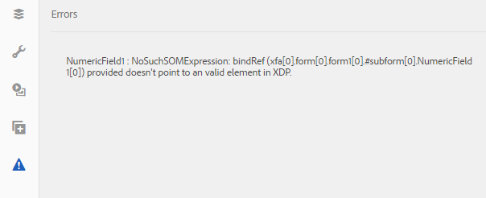

# Adaptieve Forms synchroniseren met XFA-formuliersjablonen{#synchronizing-adaptive-forms-with-xfa-form-templates}

## Inleiding {#introduction}

U kunt een adaptief formulier maken op basis van een XFA-formuliersjabloon ( `*.XDP` bestand). Dankzij dit hergebruik kunt u uw investering in bestaande XFA-formulieren behouden. Voor informatie over het gebruik van een XFA-formuliersjabloon voor het maken van een adaptief formulier, [Een adaptief formulier maken op basis van een sjabloon](creating-adaptive-form.md).

U kunt velden uit het XDP-bestand in het adaptieve formulier opnieuw gebruiken. Deze velden worden gebonden velden genoemd. De eigenschappen van de gebonden velden (zoals scripts, labels en weergave-indeling) worden uit het XDP-bestand gekopieerd. U kunt er ook voor kiezen de waarde van sommige van deze eigenschappen te overschrijven.

[!DNL AEM Forms] biedt een manier om u te helpen de velden van de Adaptive Forms gesynchroniseerd te houden met alle wijzigingen die later worden aangebracht in de corresponderende velden in het XDP-bestand. In dit artikel wordt uitgelegd hoe u deze synchronisatie kunt inschakelen.

In de [!DNL AEM Forms] ontwerpomgeving, kunt u velden van een XFA-formulier (links) naar een adaptief formulier slepen (rechts)

## Vereisten {#prerequisites}

Om de informatie in dit artikel te gebruiken, wordt een vertrouwdheid met de volgende gebieden geadviseerd:

* [Een adaptief formulier maken](creating-adaptive-form.md)

* XFA (XML Forms Architecture)

Als u de elementen in het voorbeeld in het artikel wilt gebruiken, downloadt u het voorbeeldpakket, zoals uitgelegd in de volgende sectie. [Voorbeeldpakket](synchronizing-adaptive-forms-xfa.md#p-sample-package-p).

## Voorbeeldpakket {#sample-package}

In het artikel wordt een voorbeeld gebruikt om te tonen hoe u het adaptieve formulier synchroniseert met een bijgewerkte XFA-formuliersjabloon. De elementen die in het voorbeeld worden gebruikt, zijn beschikbaar in een pakket dat u kunt downloaden van het [Downloads](synchronizing-adaptive-forms-xfa.md#p-downloads-p) in dit artikel.

Nadat u het pakket hebt geüpload, kunt u deze elementen weergeven in het dialoogvenster [!DNL AEM Forms] UI.

Installeer het pakket met behulp van pakketbeheer: `https://<server>:<port>/crx/packmgr/index.jsp`

Het pakket bevat de volgende elementen:

1. `sample-form.xdp`: De XFA-formuliersjabloon die als voorbeeld wordt gebruikt

1. `sample-xfa-af`: Het adaptieve formulier op basis van het bestand sample-form.xdp. Dit adaptieve formulier bevat echter geen velden. In de volgende stap voegen we inhoud toe aan dit adaptieve formulier.

### Inhoud toevoegen aan adaptief formulier {#add-content-to-adaptive-form-br}

1. Ga naar https://&lt;server>:&lt;port>/aem/forms.html. Voer uw referenties in als hierom wordt gevraagd.
1. Open de sample-af-xfa voor bewerking in de auteursmodus.
1. Kies Gegevensmodelobjecten op het tabblad Inhoud in de inhoudbrowser op de zijbalk. Sleep NumeriekVeld1 en TextField1 naar het adaptieve formulier.
1. De titel van het NumericField1 wijzigen van **Numeriek veld** tot **AF numeriek veld.**

>[!NOTE]
>
>In de voorgaande stappen is een eigenschap van een veld in het XDP-bestand overschreven. Deze eigenschap wordt daarom niet gesynchroniseerd als de overeenkomende eigenschap in het XDP-bestand later wordt gewijzigd.

## Wijzigingen detecteren in XDP-bestand {#detecting-changes-in-xdp-file}

Wanneer een XDP-bestand of een fragment wordt gewijzigd, wordt [!DNL AEM Forms] UI markeert alle Adaptive Forms die op het XDP- dossier of het fragment gebaseerd zijn.

Nadat u een XDP-bestand hebt bijgewerkt, moet u het opnieuw uploaden in het dialoogvenster [!DNL AEM Forms] UI voor de wijzigingen die moeten worden gemarkeerd.

Als voorbeeld, laten wij bijwerken `sample-form.xdp` bestand met de volgende stappen:

1. Navigeren naar `https://<server>:<port>/projects.html.` Voer desgevraagd uw referenties in.
1. Klik op het tabblad Forms aan de linkerkant.
1. Download de `sample-form.xdp` op uw lokale computer. Het XDP-bestand wordt gedownload als een `.zip` bestand, dat kan worden uitgepakt met elk hulpprogramma voor het decomprimeren van bestanden.

1. Open de `sample-form.xdp` bestand en wijzig de titel van het veld TextField1 van **Tekstveld** tot **Mijn tekstveld**.

1. Upload de `sample-form.xdp` bestand terug in de [!DNL AEM Forms] UI.

Als een XDP-bestand wordt bijgewerkt, wordt in de editor een pictogram weergegeven wanneer u de Adaptieve Forms bewerkt op basis van het XDP-bestand. Dit pictogram geeft aan dat het adaptieve formulier niet meer synchroon is met het XDP-bestand. Zie het pictogram naast in het zijpaneel in de volgende afbeelding.

## Adaptieve Forms synchroniseren met het nieuwste XDP-bestand {#synchronizing-adaptive-forms-with-the-latest-xdp-file}

Wanneer een adaptief formulier dat niet meer synchroon is met het XDP-bestand de volgende keer wordt geopend voor ontwerpen, wordt het volgende bericht weergegeven: **Schema/formuliersjabloon voor het adaptieve formulier is bijgewerkt. `Click Here` om het met de nieuwe versie opnieuw te baseren.**

Wanneer u op het bericht klikt, worden de velden in het adaptieve formulier gesynchroniseerd met de bijbehorende velden in het XDP-bestand.

Voor het voorbeeld dat in dit artikel wordt gebruikt, opent u `sample-xfa-af` in de ontwerpmodus. Het bericht wordt onder aan het adaptieve formulier weergegeven.

### De eigenschappen bijwerken {#updating-the-properties}

Alle eigenschappen die van het XDP-bestand naar het adaptieve formulier zijn gekopieerd, worden bijgewerkt, behalve de eigenschappen die expliciet door de auteur in het adaptieve formulier (vanuit het dialoogvenster Component) zijn overschreven. De lijst met eigenschappen die zijn bijgewerkt, is beschikbaar in de serverlogboeken.

Als u de eigenschappen in het voorbeeld Adaptief formulier wilt bijwerken, klikt u op de koppeling (gelabeld `"Click Here"`) in het bericht. De titel van TextField1 verandert van **Tekstveld** tot **Mijn tekstveld**.

>[!NOTE]
>
>Het label AF Numeriek veld is niet gewijzigd omdat u deze eigenschap hebt overschreven in het dialoogvenster Eigenschappen van component, zoals wordt beschreven in [Inhoud toevoegen aan Adaptieve Forms](synchronizing-adaptive-forms-xfa.md#p-add-content-to-adaptive-form-br-p).

### Nieuwe velden van XDP-bestand toevoegen aan adaptief formulier   {#adding-new-fields-from-xdp-file-to-adaptive-form-nbsp}

Alle velden die later aan het oorspronkelijke XDP-bestand worden toegevoegd, worden weergegeven op het tabblad Formulierhiërarchie en u kunt deze nieuwe velden naar het adaptieve formulier slepen.

U hoeft niet op de koppeling in het foutbericht te klikken om de velden op het tabblad Formulierhiërarchie bij te werken.

### Verwijderde velden in XDP-bestand {#deleted-fields-in-xdp-file}

Als een veld dat eerder naar een adaptief formulier is gekopieerd, uit een XDP-bestand wordt verwijderd, wordt in de ontwerpmodus een foutbericht weergegeven met de mededeling dat het veld niet bestaat in het XDP-bestand. In dergelijke gevallen verwijdert u het veld handmatig uit adaptief formulier of wist u het `bindRef` in het dialoogvenster Component.

De volgende stappen illustreren deze gebruiksstroom voor de elementen in het voorbeeld dat in dit artikel wordt gebruikt:

1. Werk de `sample-form.xdp` bestand en verwijder NumericField1.
1. Upload de `sample-form.xdp` in het [!DNL AEM Forms] UI
1. Open de `sample-xfa-af` Aangepast formulier voor ontwerpen. Het volgende foutbericht wordt weergegeven: Schema/formuliersjabloon voor het adaptieve formulier is bijgewerkt. `Click Here` om het met de nieuwe versie opnieuw te baseren.

1. Klik op de koppeling (met het label &quot; `Click Here`&quot;) in het bericht. Er wordt een foutbericht weergegeven met de mededeling dat het veld niet meer bestaat in het XDP-bestand.

Het veld dat is verwijderd, wordt ook gemarkeerd met een pictogram om een fout in het veld aan te geven.

>[!NOTE]
>
>De velden in het adaptieve formulier met een onjuiste binding (een ongeldige `bindRef` (in het dialoogvenster Bewerken) worden ook als verwijderde velden beschouwd. Als de auteur deze fouten niet corrigeert en het adaptieve formulier niet publiceert, wordt het veld behandeld als een normaal niet-gebonden adaptief formulierveld en wordt het veld opgenomen in de niet-gebonden sectie van het XML-uitvoerbestand.

## Downloads {#downloads}

Inhoudspakket voor het voorbeeld in dit artikel

[Bestand ophalen](assets/sample-xfa-af-sync-1.0.zip)
