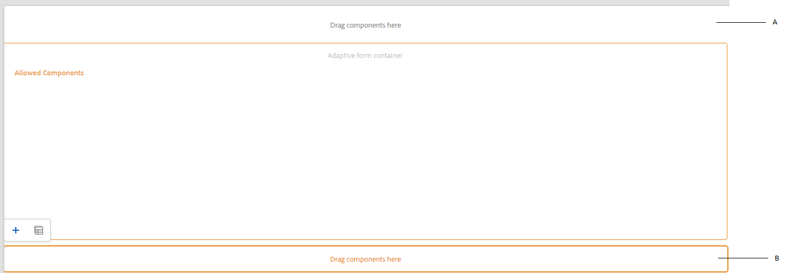

# Een adaptieve formuliersjabloon maken {#adaptive-form-templates}

 Adobe beveelt aan moderne en uitbreidbare gegevensvastlegging te gebruiken [Kernonderdelen](https://experienceleague.adobe.com/docs/experience-manager-core-components/using/adaptive-forms/introduction.html) for [nieuwe Adaptieve Forms maken](/help/forms/creating-adaptive-form-core-components.md) of [Aangepaste Forms toevoegen aan AEM Sites-pagina&#39;s](/help/forms/create-or-add-an-adaptive-form-to-aem-sites-page.md). Deze componenten betekenen een aanzienlijke vooruitgang in de aanmaak van Adaptive Forms en zorgen voor indrukwekkende gebruikerservaring. In dit artikel wordt een oudere aanpak beschreven voor de auteur Adaptive Forms die gebruikmaakt van stichtingscomponenten. 

| Versie | Artikelkoppeling |
| -------- | ---------------------------- |
| AEM 6,5 | [Klik hier](https://experienceleague.adobe.com/docs/experience-manager-65/forms/adaptive-forms-advanced-authoring/template-editor.html) |
| AEM as a Cloud Service | Dit artikel |

Wanneer u een formulier ontwerpt, voegt u velden en componenten toe om de formulierstructuur, inhoud en handelingen in de editor te definiëren. U voegt velden en componenten toe in het dialoogvenster `guideRootPanel` van de formuliercontainer. Met de Sjablooneditor kunt u een sjabloon maken met een basisstructuur en eerste inhoud die auteurs kunnen gebruiken om formulieren te maken.

U wilt bijvoorbeeld dat alle formulierauteurs bepaalde tekstvakken, navigatieknoppen en een verzendknop in een inschrijvingsformulier hebben. U kunt een sjabloon maken met de componenten die auteurs kunnen gebruiken om een formulier te maken dat consistent is met andere inschrijvingsformulieren. Wanneer auteurs de sjabloon gebruiken om een adaptief formulier te maken, neemt het nieuwe formulier de structuur en componenten over die u in de sjabloon hebt opgegeven. Met de Sjablooneditor kunt u:

* Voeg kop- en voettekstcomponenten van een formulier toe aan de structuurlaag.
* Geef de initiële inhoud voor het formulier op.
* Geef een thema op, namelijk Handelingen verzenden.

U kunt downloaden en installeren [!DNL AEM Forms] referentie-inhoudspakket van [Softwaredistributie](https://experience.adobe.com/#/downloads/content/software-distribution/en/aemcloud.html) portal voor het importeren van referentiethema&#39;s en sjablonen naar uw omgeving.

## Werken met sjablonen {#working-with-templates}

U kunt tot malplaatjeredacteur van het menu van Hulpmiddelen toegang hebben door aan te navigeren **[!UICONTROL Adobe Experience Manager]** > **[!UICONTROL Tools]** > **[!UICONTROL General]** > **[!UICONTROL Templates]**. Hier worden de sjablonen ingedeeld in mappen die zijn ingeschakeld voor bewerkbare sjablonen.

Experience Manager biedt een algemene map voor het organiseren van sjablonen. Deze optie is echter niet standaard ingeschakeld. U kunt de beheerder vragen de algemene map in te schakelen of een map voor sjablonen te maken. Ga voor meer informatie over het maken van mappen naar [Sjabloonmappen](https://experienceleague.adobe.com/docs/experience-manager-cloud-service/sites/authoring/features/templates.html#editing-templates-template-authors).

### Een sjabloon maken {#create-template}

Nadat u een map hebt gemaakt, opent u de map en voert u de volgende stappen uit om een sjabloon te maken:

1. Selecteren **[!UICONTROL Create]** in de map die u hebt gemaakt.
1. Selecteer in de sectie Sjabloontype kiezen de optie **[!UICONTROL Adaptive Form template]** en selecteert u **[!UICONTROL Next]**.

1. Geef in de sectie Sjabloondetails een sjabloontitel op en selecteer **[!UICONTROL Create]**.
U kunt ook een beschrijving opgeven.

1. Selecteren **[!UICONTROL Done]** om naar de console terug te keren, of selecteer **[!UICONTROL Open]** om de sjabloon in de editor te openen.

### UI voor sjablooneditor {#template-editor-ui}

Wanneer u een sjabloon opent voor bewerking, kunt u de volgende AEM Editor-componenten zien:

* **Pagina, werkbalk**
Bevat de volgende opties:

   * **Zijpaneel in-/uitschakelen**: Hiermee kunt u het zijpaneel weergeven of verbergen.
   * **Pagina-informatie**: Hier kunt u informatie opgeven zoals de publicatie-/publicatietijd, miniaturen, bibliotheken aan de clientzijde, het paginabeleid en de clientbibliotheek van het paginaontwerp.
     <!-- * **Emulator**: Lets you simulate and customize the look for different devices.-->
   * **Modus selecteren:** Hiermee kunt u de modus wijzigen. U kunt **[!UICONTROL Structure]** modus, **[!UICONTROL Initial Content]**, **[!UICONTROL Layout Control]** -modus. In de structuurmodus kunt u de kop- en voettekst toevoegen en aanpassen. In de modus Initiële inhoud kunt u de inhoud van het formulier aanpassen.
   * **Voorvertoning:** Hiermee kunt u een voorvertoning weergeven van het uiterlijk van de sjabloon wanneer u de sjabloon publiceert. U kunt Laagkiezer en Voorvertoning gebruiken om de bewerkings- en voorvertoningsmodi in en uit te schakelen.
* **Zijbalk:** Verstrekt de Inhoud, Eigenschappen, Assets, en de browsers van Componenten.
* **Component, werkbalk:** Wanneer u een component selecteert, ziet u een werkbalk waarin u de component kunt aanpassen.
* **Pagina**: Het gebied waar u inhoud toevoegt om de sjabloon te maken.

<!-- See [Introduction to authoring Adaptive Forms](introduction-forms-authoring.md) to understand the Touch UI editor. -->

### Een sjabloon bewerken {#editing-a-template}

Er wordt een adaptieve formuliersjabloon gemaakt op basis van twee lagen:

* Structuur
* Oorspronkelijke inhoud

De laagkiezer is beschikbaar naast de optie Voorvertoning in de rechterbovenhoek van het scherm.

### Structuur {#structure}

Wanneer u de structuurlaag selecteert in de Sjablooneditor, ziet u de lay-outcontainers boven en onder de container voor adaptieve formulieren. Auteurs kunnen deze lay-outcontainers voor kopbal en footer gebruiken. U kunt de kop- en voettekst toevoegen, bewerken of aanpassen. Sleep de component Adaptief koptekst van formulier naar de lay-outcontainer boven de container voor adaptieve formulieren om de sjabloonkoptekst aan te passen. Sleep de component Aangepaste formuliervoettekst naar de lay-outcontainer onder de container voor adaptieve formulieren om de sjabloonvoettekst aan te passen.

Lay-outcontainers in de structuurlaag

**A.** Indelingscontainer voor koptekstcomponent **B.** Lay-outcontainer voor voettekstcomponent

Sleep de component Adaptief koptekst van formulier naar de lay-outcontainer boven de container voor adaptieve formulieren. Nadat u de component hebt toegevoegd, kunt u de eigenschappen ervan opgeven waarmee u een logo kunt toevoegen en de titel kunt opgeven.

Op dezelfde manier kunt u de copyrightinformatie en bedrijfsgegevens opgeven wanneer u de voettekstcomponent in de lay-outcontainer onder de container voor adaptieve formulieren sleept.

Koptekst en voettekst toegevoegd aan de laag Structuur

#### Componenten in de structuurlaag vergrendelen/ontgrendelen {#locking-unlocking-components-in-the-structure-layer}

Wanneer u de sjabloon bewerkt terwijl de structuurlaag is geselecteerd, kunt u de kop- en voettekst van de sjabloon ontgrendelen. Als een component ontgrendeld is in de sjabloon, kunnen formulierauteurs de component bewerken in het adaptieve formulier waarin de sjabloon wordt gebruikt. Door een component te vergrendelen voorkomt u dat auteurs van formulieren deze bewerken in het adaptieve formulier. De optie Vergrendelen is beschikbaar op de werkbalk van de component.

U voegt bijvoorbeeld de koptekstcomponent in de sjabloon toe. Wanneer u de component selecteert, ziet u een vergrendelingsoptie op de werkbalk van de component. Koptekst bevat doorgaans een bedrijfsnaam en een logo en u wilt niet dat auteurs van formulieren het logo en de koptekst in een sjabloon wijzigen. In een adaptief formulier dat is gemaakt met de sjabloon met de koptekstcomponent vergrendeld, kunnen auteurs van formulieren het logo en de bedrijfsnaam niet wijzigen.

>[!NOTE]
>
>Het wordt niet aanbevolen de afbeelding of het logo in de koptekstcomponent afzonderlijk te vergrendelen of te ontgrendelen. U kunt de koptekstcomponent ontgrendelen.

### Oorspronkelijke inhoud {#initial-content}

Als de optie Begininhoud is geselecteerd, wordt de container van het adaptieve formulier van de sjabloon geopend als een adaptief formulier voor bewerking. Net als bij het ontwerpen van een adaptief formulier kunt u initiële instellingen opgeven, zoals een thema selecteren en Handelingen verzenden.

Formulierauteurs gebruiken het als basis om een formulier te maken. De structuur van de inhoudsstroom wordt opgegeven in de laag Begininhoud van de sjabloon. Als u wilt overschakelen naar het bewerken van de eerste inhoud van de formuliersjabloon, selecteert u voordat u een voorbeeld weergeeft op de pagina-werkbalk  **>** **[!UICONTROL Initial Content]**.

In de Eerste laag van de Inhoud, creeert u het Adaptieve malplaatje van de Vorm dat uw auteurs als basis gebruiken. Het ontwerpen van een sjabloon lijkt op het ontwerpen van een formulier. U gebruikt de opties in de zijbalk. Sidebar verstrekt inhoud, eigenschappen, activa, en componentenbrowsers.

<!-- See [Sidebar](introduction-forms-authoring.md#sidebar). -->

>[!NOTE]
>
>Wanneer u Inhoud opslaan of PDF opslaan selecteert als Verzendhandeling, kunt u het opslagpad opgeven. Als u een pad opgeeft in een sjabloon, hebben alle formulieren die ermee worden gemaakt hetzelfde pad. U kunt het juiste opslagpad opgeven of formulierauteurs de opslaglocatie laten bijwerken om te voorkomen dat gegevens in elk formulier op dezelfde locatie worden opgeslagen.

#### Een adaptieve formuliersjabloon maken met tabbladen en deelvensters {#creating-an-adaptive-form-template-with-tabs-and-panels-nbsp}

U wilt bijvoorbeeld een sjabloon maken met de volgende tabbladen:

* Algemene informatie
* Professionele informatie

U hebt een logo toegevoegd, een titel opgegeven en een voettekst toegevoegd aan de structuurlaag. Vergrendel de kop- en voettekst om te voorkomen dat auteurs van formulieren deze bewerken wanneer ze de sjabloon gebruiken om formulieren te maken.

Wijzig de laag van Structuur in Begininhoud en voeg inhoud toe aan het formulier. Als u een structuur met tabbladen wilt maken, voegt u een onderliggend deelvenster toe in het guideRootPanel van de container van het adaptieve formulier. Een deelvenster toevoegen:

* U kunt een deelvenster toevoegen door te tikken op de knop **[!UICONTROL +]** wanneer u de optie **[!UICONTROL Drag components here]** -optie.

* U kunt de deelvenstercomponent slepen en neerzetten vanuit de deelvensterbrowser in de zijbalk.
* U kunt een onderliggend deelvenster van het dialoogvenster `guideRootPanel` op de werkbalk van de component.

Als u de tabbladen Algemene informatie en Professionele informatie wilt maken, voegt u twee deelvensters toe in het deelvenster met onderliggende items van het dialoogvenster `guideRootPanel`. Selecteer de deelvensters en selecteer  om de eigenschappen in de zijbalk te openen. De elementnamen wijzigen als `general-info` en `professional-info`en titels als algemene informatie en beroepsinformatie. Selecteer in het zijpaneel de inhoud die u wilt openen in de inhoudbrowser. Selecteer op het tabblad Formulierobjecten de optie `guideRootPanel`. In de redacteur, wordt guideRootPanel geselecteerd. Selecteren  in de componentwerkbalk om de eigenschappen te openen. Selecteer in het veld Indeling van deelvenster de optie **[!UICONTROL Tabs on Top]** en selecteert u **[!UICONTROL Done]**. De sjabloonstructuur met tabs wordt toegepast.

#### Inhoud toevoegen op tabbladen {#adding-content-in-tabs}

Nadat u deelvensters hebt toegevoegd en deze hebt gestructureerd als tabbladen, kunt u velden toevoegen binnen de tabbladen. Wanneer u een tabblad selecteert in de editor, kunt u de opties **[!UICONTROL Drag components here]** -optie. U kunt componenten zoals tekstvakken, lijstitems en knoppen slepen en neerzetten. U kunt componenten slepen-dalingscomponenten van componentenbrowser in sidebar.

Elke component bevat eigenschappen die het vastleggen en bewerken van gegevens verbeteren. U kunt bijvoorbeeld de opdracht **[!UICONTROL Required field]** eigenschap van een component. Uw auteurs kunnen een bericht specificeren dat uw klanten zien wanneer zij het vullen van een vereist gebied overslaan. Geef het bericht op in **[!UICONTROL Required Field Message]** eigenschap.

In de voorbeeldsjabloon worden de velden Naam, Telefoonnummer en Geboortedatum toegevoegd op het tabblad Algemene informatie. Op het tabblad Professionele informatie, momenteel gebruikt, worden het werkgelegenheidstype en de kwalificatievelden voor het onderwijs toegevoegd.

Nadat u velden hebt toegevoegd, kunt u knoppen toevoegen, zoals Verzenden en Herstellen.

### De sjabloon inschakelen {#enabling-the-template}

Wanneer u een sjabloon maakt, wordt deze toegevoegd als concept. Schakel de sjabloon in om deze te gebruiken voor het maken van Adaptive Forms. Een sjabloon inschakelen:

1. Navigeren naar **[!UICONTROL Adobe Experience Manager]** > **[!UICONTROL Tools]** > **[!UICONTROL Templates]** en opent u de map waarin u de sjabloon hebt gemaakt.

1. De sjabloon die u hebt gemaakt, is gemarkeerd als Concept.
1. Selecteer de sjabloon en selecteer **[!UICONTROL Enable]** in de werkbalk.
Wanneer u een adaptief formulier maakt, wordt de sjabloon weergegeven wanneer u wordt gevraagd een sjabloon te kiezen.

## Een sjabloon importeren of exporteren {#importing-or-exporting-a-template}

Een formulier werkt met de sjabloon. Wanneer u een adaptief formulier downloadt dat is gemaakt met een aangepaste sjabloon, wordt de sjabloon niet gedownload. Wanneer u het formulier importeert op een ander formulier [!DNL AEM Forms] wordt geïmporteerd zonder de sjabloon. Als een formulier wordt geïmporteerd maar de sjabloon ervan niet beschikbaar is, wordt het formulier niet gegenereerd. U kunt de aangepaste sjabloon verpakken vanuit `/conf` node in `https://<server>:<port>/crx/packmgr`en deze in de [!DNL AEM Forms] -instantie waarin u het formulier wilt uploaden. U kunt [Creeer een malplaatje gebruikend AEM Archeype en stel het aan uw instantie van Cloud Servicen op](https://experienceleague.adobe.com/docs/experience-manager-learn/getting-started-wknd-tutorial-develop/pages-templates.html#prerequisites).

>[!NOTE]
>
> * U kunt ook de [!UICONTROL Document of Record] rechtstreeks vanuit de editor voor adaptieve formulieren of de sjablooneditor voor adaptieve formulieren. Zie voor meer informatie [Document met record genereren voor adaptieve Forms](/help/forms/generate-document-of-record-for-non-xfa-based-adaptive-forms.md#document-of-record-support-in-adaptive-form-editor-dor-support-in-adaptiveform).

## Een formuliergegevensmodelschema koppelen aan een sjabloon {#associating-form-data-model-schema-in-template}

Auteurs kunnen een [!UICONTROL Form Data Model Schema] naar een sjabloon voor een adaptief formulier in de sjablooneditor. Auteurs kunnen een schema in de sjablooneditor selecteren. Wanneer u een schema aan een sjabloon koppelt en een auteur van een formulier een formulier maakt op basis van de sjabloon, wordt het schema vooraf geselecteerd voor het formulier. Hiermee kunnen auteurs van formulieren het gebruik van schema&#39;s reguleren en besparen ze ook tijd voor de auteur van formulieren. Een formuliergegevensmodelschema selecteren in een sjablooneditor:

1. Selecteren **[!UICONTROL Content Browser]** aan de linkerkant.
1. Ga naar de formuliercontainer **[!UICONTROL Setting]**.
1. Selecteren **[!UICONTROL Data Model]**.
1. Kies het formuliergegevensmodel via **[!UICONTROL Select Form Data Model]** en sla de configuratie op.

## Een adaptief formulier maken met de sjabloon {#creating-an-adaptive-form-using-the-template}

Nadat u een sjabloon hebt gemaakt en ingeschakeld, is deze beschikbaar in Formulierbeheer wanneer u een adaptief formulier maakt. Als u een sjabloon wilt gebruiken en een adaptief formulier wilt maken, raadpleegt u [Een adaptief formulier maken](creating-adaptive-form.md).

<!--
## Change display option of out of the box templates  {#change-display-option-of-out-of-the-box-templates}

You can create custom templates for Adaptive Forms to define basic structure and initial content. [!DNL AEM Forms] also provides a set of out of the box template for Adaptive Forms. You can choose to show or hide the templates.

Perform the following steps to show and hide templates:

1. Log in to [!DNL AEM Forms] author instance and navigate to **[!UICONTROL Tools]** &gt; **[!UICONTROL Operations]** &gt; **[!UICONTROL Web Console]**.

   >[!NOTE]
   >
   >The URL of AEM web console is https://'[server]:[port]'/system/console/configMgr

1. Locate and open the **FormsManager Configuration** settings:

    * To show or hide out of the box Adaptive Forms template, check or uncheck the **Include Out of the box AF and AD Templates** option.
    * To show or hide out of the box Adaptive Form templates that were added in AEM 6.0 Forms or AEM 6.1 Forms releases but are now deprecated, check or uncheck the **Include AEM 6.0 AF Templates** option. If this option is checked, and you want it to take effect, it requires the **Include Out of the box AF and AD Templates** configuration to be enabled.

1. Click **Save**. The display options for the out of the box templates are changed. -->

## Een adaptief formulier opslaan als sjabloon {#saving-adaptive-form-as-template}

U kunt een adaptief formulier ook opslaan als een sjabloon voor toekomstig gebruik. Een adaptief formulier opslaan als een sjabloon:

1. Selecteer een adaptief formulier om het als sjabloon op te slaan.
1. Klik op **[!UICONTROL Save as Template]**. Er wordt een dialoogvenster weergegeven.
1. Opgeven **[!UICONTROL Title]** (verplicht veld), **[!UICONTROL Location]** (verplicht veld) en **[!UICONTROL Description]** (optioneel veld) voor de sjabloon.
1. Klik op **[!UICONTROL Create]**.

   

>[!NOTE]
>
>Als u hetzelfde containerbeleid wilt gebruiken als bij het adaptieve bronformulier, wordt u aangeraden de sjabloon op te slaan in dezelfde map als bij het adaptieve bronformulier. Als de sjabloon in een andere map wordt opgeslagen, gebruikt de gemaakte sjabloon een standaardcontainerbeleid.

## Recommendations {#recommendations}

* Wanneer u eigenschappen van het formulier in de sjablooneditor wijzigt, gebruikt u de eigenschap BindReference niet.
* Als u een onderbrekingspunt wilt toevoegen, creeer het wanneer u een Adaptief malplaatje van de Vorm ontwerpt.
Voor meer informatie over breekpunten raadpleegt u [Responsieve lay-out](https://experienceleague.adobe.com/docs/experience-manager-cloud-service/sites/authoring/features/responsive-layout.html#authoring).

## Zie ook {#see-also}

{{see-also}}