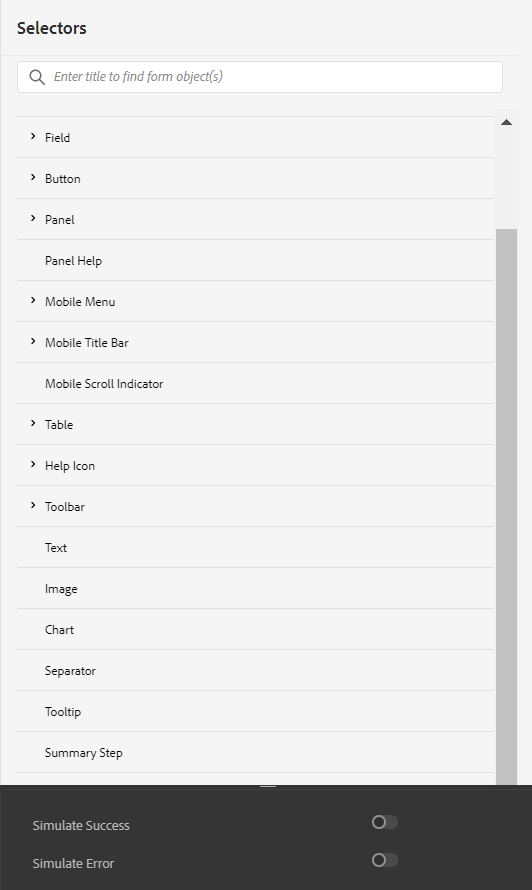

# Thema&#39;s maken en gebruiken {#creating-and-using-themes}

>[!NOTE]
>
> De Adobe adviseert het gebruiken van de moderne en verlengbare gegevens vangt [ Componenten van de Kern ](https://experienceleague.adobe.com/docs/experience-manager-core-components/using/adaptive-forms/introduction.html) voor [ het creëren van nieuwe Aangepaste Forms ](/help/forms/creating-adaptive-form-core-components.md) of [ het toevoegen van Aangepaste Forms aan de pagina&#39;s van AEM Sites ](/help/forms/create-or-add-an-adaptive-form-to-aem-sites-page.md). Deze componenten betekenen een aanzienlijke vooruitgang in de aanmaak van Adaptive Forms en zorgen voor indrukwekkende gebruikerservaring. In dit artikel wordt een oudere aanpak beschreven voor de auteur Adaptive Forms die gebruikmaakt van stichtingscomponenten.

| Versie | Artikelkoppeling |
| -------- | ---------------------------- |
| AEM 6,5 | [ klik hier ](https://experienceleague.adobe.com/docs/experience-manager-65/forms/adaptive-forms-advanced-authoring/themes.html) |
| AEM as a Cloud Service | Dit artikel |

U kunt thema&#39;s tot stand brengen en toepassen om een Aangepast Vorm <!-- or an interactive communication--> te stileren. Een thema bevat opmaakgegevens voor de componenten en deelvensters. Stijlen omvatten eigenschappen zoals achtergrondkleuren, statuskleuren, transparantie, uitlijning en grootte. Wanneer u een thema toepast, weerspiegelt de opgegeven stijl de corresponderende componenten. Het thema wordt beheerd onafhankelijk zonder een verwijzing naar een Aanpassings Vorm <!-- or interactive communication -->.

U kunt [!DNL AEM Forms] pakket van de verwijzingsinhoud van [ het portaal van de Distributie van de Software downloaden en installeren ](https://experience.adobe.com/#/downloads/content/software-distribution/en/aemcloud.html) om verwijzingsthema&#39;s en malplaatjes in uw milieu in te voeren.

## Een thema maken, downloaden of uploaden {#creating-downloading-or-uploading-a-theme}

Een thema wordt gemaakt en opgeslagen als een afzonderlijke entiteit, compleet met meta-eigenschappen zoals Adaptive Forms. Het staat het hergebruiken van een thema in veelvoudige Aanpassings Forms <!-- or  and interactive communications--> toe. U kunt een thema ook naar een andere instantie verplaatsen en opnieuw gebruiken.

### Een thema maken {#creating-a-theme}

Een thema maken:

1. Klik **[!UICONTROL Adobe Experience Manager]**, klik **[!UICONTROL Forms]**, en klik **[!UICONTROL Themes]**.

1. Klik op de pagina Thema&#39;s op **[!UICONTROL Create]** > **[!UICONTROL Theme]** .
Er wordt een wizard gestart om een thema te maken.

1. Geef **[!UICONTROL Name]** van het thema op.

1. Geef een formulier op voor een voorbeeld van het thema in het veld **[!UICONTROL Default Preview for this Theme]** . Klik op **[!UICONTROL Use Default]** om een voorbeeld van het thema weer te geven in het standaardformulier.

1. Geef een **[!UICONTROL Configuration Container]** op. U kunt een **[!UICONTROL Configuration Container]** kiezen die configuratiedetails van Adobe Font voor uw account bevat. U kunt de optie voor nu ook leeg verlaten en de details later van [ themaeigenschappen ](#metadata-of-a-theme) specificeren.

1. Klik op **[!UICONTROL Create]** en vervolgens op **[!UICONTROL Edit]** om het thema te openen in de Thema-editor of klik op **[!UICONTROL Done]** om terug te keren naar de themapagina.

### Verschil van thema&#39;s in Experience Manager 6.5 Forms en eerdere versies {#difference-in-themes}

Thema&#39;s die op een instantie Cloud Service worden gemaakt:

* Heeft versienummer 2.

* Wordt opgeslagen bij `/content/dam/formsanddocuments-themes/<theme-name>/`

* Geen clientbibliotheekoptie opgeven. U kunt geen categorie en pad voor de clientbibliotheek opgeven.

* U hebt geen schrijf- en updatemachtigingen voor de locatie van /apps (Forms-gebruikersgroep heeft geen schrijf- en updatemachtiging voor de locatie van /apps).

* Voordat u een thema uit [!DNL Experience Manager Forms] 6.5 of eerdere versies uploadt naar een Cloud Service-instantie, moet u controleren of de locatie van de clientbibliotheek is ingesteld op `etc/clientlibs/fd/themes` . Als de clientbibliotheek niet in de map `etc` staat, werkt u de locatie handmatig bij naar `etc/clientlibs/fd/themes` .  U kunt de wijziging doorvoeren in de instantie van uw [!DNL Experience Manager Forms] 6.5- of vorige versie. Na het plaatsen van de plaats van de cliëntbibliotheek, kan een beheerder thema&#39;s aan de instantie van de Cloud Service uploaden of het Hulpmiddel van de Overdracht van de Inhoud gebruiken om de thema&#39;s van 6.5 of vorige versieinstanties aan de instantie van de Cloud Service te migreren.

  Wijzig ook de naam van de categorie. Als de naam niet wordt gewijzigd, kan een fout `theme with same category name exists` optreden. Wanneer u de categorienaam wijzigt, heeft dit geen invloed op de Adaptive Forms die het thema gebruikt.

### Een thema downloaden {#downloading-a-theme}

U kunt thema&#39;s exporteren als ZIP-bestand en deze thema&#39;s gebruiken in andere projecten of instanties van Experience Managers. Een thema downloaden:

1. Klik op **[!UICONTROL Adobe Experience Manager]** , klik op **[!UICONTROL Forms]** en klik vervolgens op **[!UICONTROL Themes]** .

1. **[!UICONTROL Select]** Een thema op de pagina Thema&#39;s en klik op **[!UICONTROL Download]** . Er wordt een dialoogvenster weergegeven met de details van het thema.

1. Klik op **[!UICONTROL Download]**. Het thema wordt gedownload als een ZIP-bestand.

>[!NOTE]
>
>Als u een thema downloadt waaraan een adaptief formulier is gekoppeld en het bijbehorende adaptieve formulier is gebaseerd op een aangepaste sjabloon, downloadt u ook de aangepaste sjabloon. Wanneer u het gedownloade thema en het adaptieve formulier uploadt, uploadt u ook de gerelateerde aangepaste sjabloon.

### Een thema uploaden {#uploading-a-theme}

Een gebruiker met beheerdersrechten kan een thema uploaden dat is gemaakt in [!DNL Experience Manager Forms] 6.5 of eerdere versies.

Een thema uploaden:

1. Klik op **[!UICONTROL Adobe Experience Manager]** , klik op **[!UICONTROL Forms]** en klik vervolgens op **[!UICONTROL Themes]** .

1. Klik op de pagina Thema&#39;s op **[!UICONTROL Create]** > **[!UICONTROL File Upload]** .
1. Blader in de vraag Bestand uploaden naar en selecteer een themapakket op uw computer en klik op **[!UICONTROL Upload]** .
Het geüploade thema is beschikbaar op de themapagina.

## Metagegevens van een thema {#metadata-of-a-theme}

Lijst met meta-eigenschappen van een thema (bevindt zich op de pagina met eigenschappen van een thema).

<table>
 <tbody>
  <tr>
   <th>
<strong>ID</strong>
 
 
 </th>
   <th><strong>Naam</strong></th>
   <th><strong>Kan worden bewerkt</strong></th>
   <th><strong>Beschrijving van eigenschap</strong></th>
  </tr>
  <tr>
   <td>1.</td>
   <td>Titel</td>
   <td>Ja</td>
   <td>Naam van thema weergeven.</td>
  </tr>
  <tr>
   <td>2.</td>
   <td>Beschrijving</td>
   <td>Ja</td>
   <td>Beschrijving van het thema.</td>
  </tr>
  <tr>
   <td>3.</td>
   <td>Type</td>
   <td>Nee</td>
   <td>
    <ul>
     <li>Type element.</li>
     <li>Waarde is altijd thema.</li>
    </ul> </td>
  </tr>
  <tr>
   <td>4.</td>
   <td>Gemaakt</td>
   <td>Nee</td>
   <td>Aanmaakdatum thema</td>
  </tr>
  <tr>
   <td>5.</td>
   <td>Naam auteur</td>
   <td>Ja</td>
   <td>Auteur van het thema. Berekend op het moment dat het thema werd gemaakt.</td>
  </tr>
  <tr>
   <td>6.</td>
   <td>Laatste wijzigingsdatum</td>
   <td>Nee</td>
   <td>Datum waarop het thema voor het laatst is gewijzigd.</td>
  </tr>
  <tr>
   <td>7.</td>
   <td>Status</td>
   <td>Nee</td>
   <td>Status van het thema (Gewijzigd/gepubliceerd).</td>
  </tr>
  <tr>
   <td>8.</td>
   <td>Publish On Time</td>
   <td>Ja</td>
   <td>Tijd om het thema automatisch te publiceren.</td>
  </tr>
  <tr>
   <td>9.</td>
   <td>Publish Off Time</td>
   <td>Ja</td>
   <td>Tijd om de publicatie van het thema automatisch ongedaan te maken.</td>
  </tr>
  <tr>
   <td>10.</td>
   <td>Tags</td>
   <td>Ja</td>
   <td>Een label dat aan het thema is gekoppeld om het zoeken te verbeteren.</td>
  </tr>
  <!-- <tr>
   <td>11.</td>
   <td>References</td>
   <td>Links</td>
   <td>
    <ul>
     <li>Contains 'Referred by' section. Lists forms that use the theme.</li>
     <li>Since the theme does not refer to any other asset, there is no 'Refers' section.</li>
    </ul> </td>
  </tr>
   <tr>
   <td>12.</td>
   <td>Clientlib Location</td>
   <td>Yes</td>
   <td>
    <ul>
     <li>The user-defined repository path within '/etc' where the clientlibs corresponding to this theme are stored.</li>
     <li>Default value - '/etc/clientlibs/fd/themes' + relative path of theme asset.</li>
     <li>If the location does not exist, the folder hierarchy is auto-generated.</li>
     <li>When this value is changed, the clientlib node structure is moved to the new location entered.  <em><strong>Note:</strong> If you change default clientlib location, in the CRXDE repository assign <code>crx:replicate, rep:write, rep:glob:*, rep:itemNames:: js.txt, jcr:read </code>to <code>forms-users</code> and <code>crx:replicate</code>, <code>jcr:read </code>to <code>fd-service</code> in the new location. Also attach another ACL by adding <code>deny jcr:addChildNodes</code> for <code>forms-user</code></em></li>
    </ul> </td>
  </tr> 
  <tr>
   <td>13.</td>
   <td>Clientlib Category Name</td>
   <td>Yes</td>
   <td>
    <ul>
     <li>The user-defined clientlib category name for this theme.</li>
     <li>An error is displayed if the name is already in use by some other existing theme.</li>
     <li>Default value - computed using theme location.</li>
     <li>When this value is changed, the category name is updated on the corresponding clientlib node. Updating Clientlib Category Name in the jsp files is not required because clientlib category name is used by reference.</li>
    </ul> </td>
  </tr> -->
 </tbody>
</table>

## Over de Thema-editor {#about-the-theme-editor}

Thema-editor is een bedrijfsvriendelijke en webontwerper/ontwikkelaarsvriendelijke interface die functies biedt die vereist zijn om de opmaak van verschillende adaptieve formulierelementen gemakkelijk op te geven <!-- and interactive communication --> . Wanneer u een thema maakt, wordt het opgeslagen als een afzonderlijke entiteit, zoals formulieren <!--  , interactive communications, letters, document fragments, and data dictionaries--> .

In de Thema-editor kunt u stijlen van de componenten die in een thema zijn opgemaakt, aanpassen. U kunt aanpassen hoe een formulier <!-- or interactive communication --> eruitziet op een apparaat.

De Thema-editor bestaat uit twee deelvensters:

* **Canvas** - verschijnt op de rechterkant. Er wordt een voorbeeld van een adaptief formulier <!--  or interactive communication --> weergegeven waarin alle wijzigingen in de opmaak direct worden weerspiegeld. U kunt ook rechtstreeks objecten op het canvas selecteren om de bijbehorende stijlen op te zoeken en deze stijlen te bewerken. Een liniaal voor apparaatresolutie bovenaan bestuurt het canvas. Als u een onderbrekingspunt van de resolutie in de liniaal selecteert, wordt het voorbeeldformulier <!--  or interactive communication --> weergegeven voor de desbetreffende resolutie. Canvas wordt besproken in detail [ hieronder ](themes.md#using-canvas).

* **Sidebar** - verschijnt op de linkerkant. Het heeft de volgende punten:

   * **Selecteur:** toont de component die voor het stileren wordt geselecteerd, en zijn eigenschappen die u kunt stileren. De kiezer vertegenwoordigt alle componenten van een type. Als u een tekstvakcomponent in een thema voor het stileren selecteert, erven alle tekstvakjes in uw vorm <!-- or interactive communication --> de stijl. Met kiezers kunt u een algemene component of een specifieke component voor opmaak selecteren. Een veldcomponent is bijvoorbeeld een algemeen onderdeel en een tekstvak is een specifiek onderdeel.

     **het Stijlen generische component:**
Een veld kan een numeriek veld zijn, zoals leeftijd, of een veld in een tekstvak, zoals een adres.
Wanneer u een veld opmaakt, worden alle velden opgemaakt, zoals pagina, naam en adres.

     **het stileren van specifieke component**:
Een specifieke component is van invloed op objecten van de specifieke categorie. Wanneer u de stijl van de numerieke vakcomponent in het thema toepast, overerft alleen het object van het numerieke vak de stijl.

     Een tekstvakveld, zoals een adres, is bijvoorbeeld langer en een numeriek vakveld, zoals de leeftijd, is korter. U kunt een numeriek veld selecteren, de lengte ervan verkleinen en op het formulier toepassen. De breedte van alle velden van numerieke vakken wordt verkleind in het formulier.

     Wanneer u alle veldcomponenten met een specifieke achtergrondkleur aanpast, nemen alle velden, zoals leeftijd, naam en adres, de achtergrondkleur over. Wanneer u een numeriek vak selecteert, zoals de leeftijd, en de breedte en breedte van alle numerieke vakken zoals de leeftijd verkleint, wordt het aantal personen in een familie verminderd. De breedte van tekstvakken wordt niet gewijzigd.

   * **Staat:** laat u stijlen van een voorwerp in een specifieke staat aanpassen. U kunt bijvoorbeeld de vormgeving van een object opgeven wanneer dit zich in de standaard-, focus-, uitgeschakelde, aanwijs- of foutstatus bevindt.
   * **de Categorieën van het Bezit:** het stileren eigenschappen zijn verdeeld in diverse categorieën. Bijvoorbeeld Dimension en positie, tekst, achtergrond, rand en effecten. Onder elke categorie geeft u opmaakgegevens op. Onder Achtergrond kunt u bijvoorbeeld Achtergrondkleur en Afbeelding en Verloop opgeven.

   * **Geavanceerd:** laat u douane CSS aan een voorwerp toevoegen, dat de eigenschappen met voeten treedt visuele controles bepalen als er een overlapping is.

   * **CSS van de Mening**: Laat u CSS van de geselecteerde component bekijken.

  In de Sidebar is onder aan de zijbalk ook een pijl aanwezig. Wanneer u de pijl klikt, krijgt u twee meer opties: **Simuleer Succes** en **Simuleer Fout.** Deze opties, samen met de hierboven beschreven opties worden besproken in detail [ hieronder ](themes.md#using-rail).

 **A.** Sidebar **B.** Canvas

### Stijlcomponenten {#styling-components}

U kunt een thema in veelvoudige Aanpassings Forms <!-- and interactive communications --> gebruiken, die component het formatteren invoert die u in het thema hebt gespecificeerd. U kunt diverse componenten opmaken, zoals titels, beschrijving, deelvensters, velden, pictogrammen en tekstvakken. Gebruik widgets om componenteigenschappen in een thema te configureren. Eerdere kennis van CSS of LESS is niet vereist maar gewenst, hoewel u met de sectie CSS-overschrijvingen CSS-code kunt schrijven of aangepaste kiezers kunt opgeven. De sectie CSS overschrijven wordt weergegeven wanneer u een component in de zijbalk selecteert.

Opties in het zijpaneel waarmee u verschillende componenten kunt selecteren en opmaken.

Als u op de knop Bewerken klikt op een component in het zijpaneel, wordt de component in Canvas geselecteerd en kunt u de component opmaken met de opties in het zijpaneel.

Bepaalde componenten, zoals tekstvak, numeriek vak, keuzerondje en selectievakje, zijn gecategoriseerd onder algemene componenten, zoals Veld. U wilt bijvoorbeeld de opmaak van keuzerondjes aanpassen. Selecteer **[!UICONTROL Field]** > **[!UICONTROL Widget]** > **[!UICONTROL Radio Button]** om keuzerondjes voor opmaak te selecteren.

### Lay-outs van het deelvenster Stijlen {#styling-panel-layouts-br}

De thema&#39;s in [!DNL AEM Forms] steunen het stileren van elementen in de lay-out van panelen in uw vormen <!-- and  interactive communications -->. Het opmaken van elementen in lay-outs buiten de box en aangepaste lay-outs wordt ondersteund.

Voorbeelden van deelvensters buiten het vak zijn:

* Tabs links
* Bovenaan tabs
* Accordeon
* Responsief
* Wizard
* Mobiele lay-out

   * Titels van deelvensters in koptekst
   * Zonder deelvenstertitels in koptekst

De kiezers variëren voor elke lay-out.
Aangepaste lay-outs opmaken in de Thema-editor is:

* De componenten definiëren voor een lay-out die kan worden vormgegeven, en CSS-kiezers voor unieke identificatie van deze componenten.
* De CSS-eigenschappen definiëren die op deze componenten kunnen worden toegepast.
* Definieer interactief de opmaak voor deze componenten vanuit de gebruikersinterface.

### Verschillende stijlen voor verschillende schermgrootten {#different-styles-for-different-screen-sizes-br}

Bureaublad- en mobiele lay-outs kunnen enigszins of geheel verschillende stijlen hebben. Voor mobiele apparaten hebben tablets en telefoons dezelfde lay-outs, behalve voor componentformaten.

Onderbrekingspunten van de Thema-editor gebruiken om alternatieve opmaak voor verschillende schermgrootten te definiëren. U kunt een basisapparaat of een basisresolutie selecteren waarop u het thema begint te maken en de variaties in stijlen voor andere resoluties worden automatisch gegenereerd. U kunt de opmaak van alle resoluties expliciet wijzigen.

>[!NOTE]
>
>Het thema wordt eerst gecreeerd gebruikend een vorm <!-- or interactive communication-->, en dan toegepast op verschillende vormen <!-- or interactive communications-->. De breekpunten die worden gebruikt bij het maken van thema&#39;s, kunnen afwijken van het formulier <!-- or interactive communication --> waarop het thema wordt toegepast. De CSS-mediaquery&#39;s zijn gebaseerd op het formulier <!-- or interactive communication --> dat wordt gebruikt bij het maken van thema&#39;s, en niet op het formulier <!-- or interactive communication --> waarop het thema wordt toegepast.

### Contextwijzigingen in opmaakeigenschappen in zijbalk bij het selecteren van objecten {#styling-properties-context-changes-in-sidebar-on-selecting-objects}

Wanneer u een component op het canvas selecteert, worden de opmaakeigenschappen van de component weergegeven in het zijpaneel. Selecteer het objecttype en de objectstatus en geef de objectstijl op.

### Onlangs gebruikte stijlen in de Thema-editor {#recently-used-styles-in-theme-editor}

In de themaeditor worden maximaal tien stijlen opgeslagen die op een component zijn toegepast. U kunt de stijlen in de cache gebruiken met een andere component van een thema. Onlangs gebruikte stijlen zijn direct onder de geselecteerde component in het zijpaneel beschikbaar als een keuzelijst. De lijst met onlangs gebruikte stijlen is aanvankelijk leeg.

Terwijl u een component opmaakt, worden de stijlen in de cache opgeslagen en in het lijstvak weergegeven. In dit voorbeeld wordt het label van het tekstvak opgemaakt om de tekengrootte en -kleur te wijzigen. U kunt vergelijkbare stappen volgen voor het kiezen van een afbeelding of het wijzigen van kleuren om een component op te maken. U kunt zien hoe de stijl in de cache wordt geplaatst en in het lijstvak wordt weergegeven wanneer de opmaak van het veldlabel wordt gewijzigd.

In dit voorbeeld wordt de stijl voor het veldlabel gewijzigd. Wanneer de optie Beschrijving van responsief deelvenster is geselecteerd als stijl, wordt een lijstitem toegevoegd aan de elementenbibliotheek. Het item in de elementenbibliotheek kan worden gebruikt om de stijl voor de beschrijving van het deelvenster Responsief te wijzigen.

Wanneer een stijl in de activabibliotheek wordt toegevoegd, is het beschikbaar voor andere thema&#39;s en op de [ stijlwijze ](inline-style-adaptive-forms.md) van de vormredacteur UI. Als u de stijlmodus van de gebruikersinterface van de formuliereditor <!-- or interactive communication editor --> gebruikt om een component op te maken, wordt de stijl in de cache geplaatst en is deze beschikbaar in thema&#39;s.

Met de plusknop in de elementenbibliotheek kunt u de stijl permanent opslaan met een naam die u opgeeft. Met de plusknop slaat u de stijl op, zelfs als u niet op de knop Opslaan in het zijpaneel klikt om de stijl toe te passen op een component. De plus knoop om een stijl voor later gebruik te bewaren is niet beschikbaar op de stijlwijze.

Wanneer u een aangepaste naam voor een stijl opgeeft, is de stijl gekoppeld aan een thema en is deze niet meer beschikbaar voor andere thema&#39;s. Een opgeslagen stijl verwijderen:

1. Voor de toolbar CANVAS, klik **[!UICONTROL Theme Options]**  > **[!UICONTROL Manage Styles]**.
1. Selecteer een opgeslagen stijl in het dialoogvenster Stijlen beheren en klik op **[!UICONTROL Delete]** .

   

### Wijzigingen live voorvertonen, opslaan en negeren {#live-preview-save-and-discard-changes}

Wijzigingen in de opmaak worden direct weerspiegeld in het formulier <!-- or interactive communication --> dat wordt geladen in het canvas. Met Live voorvertoning kunt u interactief de invloed van de opmaak definiëren en bekijken. Wanneer u de opmaak van een component wijzigt, wordt de knop **[!UICONTROL Done]** ingeschakeld in het zijpaneel. Als u de wijzigingen wilt behouden, gebruikt u de knop **[!UICONTROL Done]** .

>[!NOTE]
>
>Wanneer een ongeldig teken in een veld wordt ingevoerd, verandert de kleur van de veldgrens in rood en wordt een foutbericht weergegeven in de linkerbovenhoek van het scherm. Als u bijvoorbeeld alfabeten invoert in een tekstvak waarin numerieke tekens worden geaccepteerd als invoer, is de kleur van de grens van het invoervak veranderd in rood. U kunt een dergelijk thema niet opslaan zonder de fout op te lossen die onder aan het scherm wordt weergegeven.

### Thema met een ander adaptief formulier {#theme-with-another-adaptive-form}

Wanneer u een thema maakt, wordt dit gemaakt met een formulier dat wordt geleverd bij de Thema-editor. U biedt stijlen voor componenten in dit formulier. In plaats van het formulier dat bij de Thema-editor wordt geleverd, kunt u naar keuze een formulier <!-- or interactive communication --> selecteren om de opmaak te bepalen en een voorbeeld van de resultaten te bekijken.

Het huidige formulier of <!-- interactive communication --> in het canvas van de Thema-editor vervangen:

1. In het paneel van de EDITOR van het THEMA, klik **[!UICONTROL Theme Options]**  > **[!UICONTROL Configure]**.

1. Blader op het tabblad Algemeen door een formulier <!-- or interactive communication --> voor het veld **[!UICONTROL Adaptive Form]** en selecteer dit.

### Opnieuw/Ongedaan maken {#redo-undo}

U kunt de ongewenste wijzigingen die per ongeluk optreden, ongedaan maken of opnieuw uitvoeren. Gebruik de knoppen Opnieuw uitvoeren/Ongedaan maken op het canvas.

 ongedaan

De knoppen voor Opnieuw/Ongedaan maken verschijnen wanneer u een component opmaakt in de Thema-editor.

## De Thema-editor gebruiken {#using-the-theme-editor}

Met de Thema-editor kunt u een thema bewerken dat u hebt gemaakt of geüpload. Navigeer naar **[!UICONTROL Forms & Documents]** > **[!UICONTROL Themes]** en selecteer een thema en open het. Het thema wordt geopend in de Thema-editor.

Zoals hierboven is beschreven, heeft de Thema-editor twee deelvensters: Sidebar en Canvas.

De successtatusopmaak van de widgetcomponent Tekstvak aanpassen in de Thema-editor. Component wordt geselecteerd in Canvas, en zijn staat wordt geselecteerd in sidebar. De opmaakopties in de zijbalk worden gebruikt om de vormgeving van een component aan te passen.

### Canvas gebruiken {#using-canvas}

Het thema wordt gemaakt met het formulier dat buiten de keuzelijst valt of met een formulier <!-- or interactive communication --> van uw keuze. Op het canvas ziet u een voorbeeld van het formulier of <!-- interactive communication --> dat wordt gebruikt voor het maken van het thema met aanpassingen die in het thema zijn opgegeven. De liniaal boven het formulier wordt gebruikt om de indeling te bepalen op basis van de grootte van de weergave van het apparaat.

In de werkbalk Canvas ziet u:

* **[!UICONTROL Toggle Side Panel]** : Laat u sidebar tonen of verbergen.
* **[!UICONTROL Theme Options]** : Verstrekt drie opties

   * Configureren: biedt opties voor het selecteren van het voorbeeldformulier <!-- or interactive communication , base clientlib, --> en de Adobe Fonts-configuratie.
   * Thema CSS weergeven: genereert CSS voor het geselecteerde thema.
   * Stijlen beheren: biedt opties voor het beheer van tekst- en afbeeldingsstijlen
   * Help: hiermee wordt een rondleiding door de Thema-editor uitgevoerd voor afbeeldingen.

* **[!UICONTROL Emulator]** : Emuleert de blik van uw thema voor verschillende vertoningsgrootte. Een weergavegrootte wordt beschouwd als een onderbrekingspunt in de emulator. U kunt een onderbrekingspunt selecteren en een stijl voor het specificeren. Desktop en Tablet zijn bijvoorbeeld twee breekpunten. U kunt verschillende stijlen opgeven voor elk onderbrekingspunt.

Wanneer u een component selecteert in het canvas, ziet u de componentwerkbalk er bovenop. Met de componentwerkbalk kunt u componenten selecteren of overschakelen op algemene componenten. U selecteert bijvoorbeeld een numeriek tekstvak in een deelvenster. De werkbalk van de component bevat de volgende opties:

* **[!UICONTROL Numeric Box Widget]**: hiermee kunt u de component selecteren om het uiterlijk in het zijpaneel aan te passen.
* **[!UICONTROL Field Widget]**: hiermee kunt u de algemene component voor opmaak selecteren. In dit voorbeeld worden alle tekstinvoercomponenten (tekstvak/numeriek vak/numerieke stepper/datum-invoer) geselecteerd voor opmaak.

* : Laat u de oudercomponent voor het stileren selecteren. Als u een numeriek vak selecteert en dit pictogram selecteert, wordt de veldcomponent geselecteerd. Als u een veldcomponent selecteert en dit pictogram selecteert, wordt het deelvenster geselecteerd. Als u op dit pictogram blijft tikken om het te selecteren, selecteert u uiteindelijk de lay-out voor opmaak.

>[!NOTE]
>
>Welke opties beschikbaar zijn op de werkbalk van de component, is afhankelijk van de component die u selecteert.

### Zijbalk gebruiken {#using-rail}

Het zijpaneel in de themaeditor bevat opties waarmee u stijlen voor componenten in een thema kunt aanpassen en kiezers kunt gebruiken. Met kiezers kunt u een groep componenten of afzonderlijke componenten selecteren en u kunt zoeken naar kiezers in het zijpaneel. U kunt kiezers schrijven voor aangepaste componenten.

Wanneer u een component selecteert op het canvas of op de zijbalk van de kiezer, worden in het zijpaneel alle opties weergegeven waarmee u stijlen kunt aanpassen.
Hieronder ziet u de opties die in het zijpaneel worden weergegeven wanneer u een component selecteert:

* Staat
* Eigenschappenblad
* Fout/succes simuleren

#### Staat {#state}

Een status is een indicator van gebruikersinteractie met een component. Wanneer een gebruiker bijvoorbeeld onjuiste gegevens invoert in een tekstvak, verandert de status van het tekstvak in een foutstatus. Met de Thema-editor kunt u stijlen voor een bepaalde status opgeven.

De opties voor het aanpassen van statusstijlen variëren voor verschillende componenten.

#### Eigenschappenblad {#property-sheet}

<table>
 <tbody>
  <tr>
   <td><strong>Eigenschap</strong></td>
   <td><strong>Gebruiken</strong></td>
  </tr>
  <tr>
   <td>
Dimensionen en positie
 </td>
   <td>
Hiermee kunt u de uitlijning, grootte, positionering en plaatsing van componenten in het thema opmaken. 
 
U kunt kiezen uit opties voor weergave, opvulling, marge, breedte, hoogte en Z-index.
 
U kunt de modus Lay-out ook gebruiken om de breedte van componenten te definiëren met behulp van een eenvoudige interface voor slepen en neerzetten. Voor meer informatie, zie {de wijze van de Lay-out van het 0} Gebruik om componenten </a> te resize.<a href="resize-using-layout-mode.md">
 </td>
  </tr>
  <tr>
   <td>
Tekst
 </td>
   <td>
Hiermee kunt u de tekststijlen in de component van het thema aanpassen.
 
U wilt bijvoorbeeld instellen hoe de tekst die u in het tekstvak invoert, eruitziet.
 
U kunt lettertypefamilie, dikte, kleur, grootte, regelhoogte, tekstuitlijning, letterspatiëring, tekstinspringing, onderstrepen, cursief, teksttransformatie, verticaal uitlijnen, basislijn en richting kiezen. 
 </td>
  </tr>
  <tr>
   <td>
Achtergrond 
 </td>
   <td>
Hiermee kunt u de achtergrond van de component vullen met een afbeelding of kleur. 
 </td>
  </tr>
  <tr>
   <td>
Rand
 </td>
   <td>
Hiermee kunt u kiezen hoe de rand van de component eruitziet. U wilt bijvoorbeeld dat het tekstvak een diepe, rode, dikke rand heeft met een stippellijn. 
 
De opties zijn breedte, stijl, straal en kleur van de rand.
 </td>
  </tr>
  <tr>
   <td>
Effecten
 </td>
   <td>
Hiermee kunt u speciale effecten aan de componenten toevoegen, zoals dekking, overvloeimodus en schaduwen. 
 </td>
  </tr>
  <tr>
   <td>
Geavanceerd
 </td>
   <td>
Hiermee kunt u het volgende toevoegen:

    <ul>
     <li>Eigenschappen voor <code>::before</code> - en <code>::after</code> pseudo-elementen om inhoud toe te voegen na of vóór de standaardinhoud in de kiezer en de inhoud op te maken.  zie <a href="https://www.w3schools.com/css/css_pseudo_elements.asp" target="_blank"> CSS pseudo-elementen </a>.</li>
     <li>Aangepaste CSS-code inline naar een component.</li>
    </ul> 
Wanneer u een aangepaste CSS-code toevoegt, wordt hiermee de aanpassing genegeerd die u hebt toegevoegd met de opties in de zijbalk. 
 </td>
  </tr>
 </tbody>
</table>

#### Fout/succes simuleren {#simulate-error-success}

De opties Fout simuleren en Succes zijn beschikbaar onder aan het zijpaneel. U kunt ze zien met een tonen/verbergen-pijl die onder aan het zijpaneel zichtbaar is. Met de Thema-editor kunt u verschillende toestanden van een component opmaken.

U voegt bijvoorbeeld een numeriek veld aan het formulier toe en u geeft de opmaak op in de themaeditor. Wanneer een gebruiker een alfanumerieke waarde in het veld typt, moet u de achtergrondkleur van het tekstvak wijzigen. U selecteert het numerieke veld in het thema en gebruikt de statusoptie in het zijpaneel. U selecteert de staat van de Fout in sidebar, en verander de achtergrondkleur in rood. Als u een voorvertoning van het gedrag wilt weergeven, kunt u de optie Fout simuleren gebruiken die beschikbaar is in de zijbalk. De opties Simulatiefout en Succes worden hieronder gedetailleerd beschreven:

* **Simuleer Succes**:
Hiermee kunt u zien hoe een component eruitziet als u de stijl voor de successtatus opgeeft. In een formulier stellen klanten bijvoorbeeld een wachtwoord in. Gebruikers kunnen een wachtwoord instellen op basis van de richtlijnen die u opgeeft. Wanneer een gebruiker een wachtwoord typt dat voldoet aan alle richtlijnen die u opgeeft, wordt het tekstvak groen. Als het tekstvak groen wordt, is de status geslaagd. U kunt stijlen voor een component in successtaat specificeren, en zijn verschijning simuleren gebruikend de Simulate optie van het Succes.

* **Simuleer Fout**:
Hiermee kunt u zien hoe een component eruitziet als u de opmaak voor de foutstatus opgeeft. In een formulier stellen klanten bijvoorbeeld een wachtwoord in. Gebruikers kunnen een wachtwoord instellen op basis van de richtlijnen die u opgeeft. Wanneer een gebruiker een wachtwoord typt dat niet aan alle richtlijnen voldoet, wordt het tekstvak rood. Als het tekstvak rood wordt, treedt er een fout op. U kunt stijlen voor een component in foutenstaat specificeren, en zijn verschijning simuleren gebruikend de Simulate optie van de Fout.

### Een component opmaken {#styling-a-component}

In uw formulier hebt u bijvoorbeeld twee typen tekstvakken: een tekstvak waarin alleen numerieke waarden kunnen worden ingevoerd en een tekstvak waarin alfanumerieke waarden kunnen worden ingevuld. U kunt de opmaak aanpassen voor het tekstvak waarin alleen numerieke waarden kunnen worden ingevoerd (een numeriek vak).

Voer de volgende stappen uit om de opmaak voor een bepaalde component (een numeriek vak in dit voorbeeld) aan te passen:

1. Selecteer in de Thema-editor het numerieke vak op het canvas.
1. Wanneer u het numerieke vak selecteert, ziet u de werkbalk met de componenten met drie opties:

   * **[!UICONTROL Numeric Box Widget]**
   * **[!UICONTROL Field Widget]**

1. Selecteer **[!UICONTROL Numeric Box Widget]** .
1. De titel van het zijpaneel verandert in de widget Numerieke vak en bevat opties waarmee u de vormgeving kunt aanpassen.
Gebruik de optie **[!UICONTROL Dimension & Position]** in het zijpaneel om de grootte van de component aan te passen. Controleer of de status **[!UICONTROL Default]** is.

Selecteer **[!UICONTROL Field Widget]** in de werkbalk van de component en voer de bovenstaande stappen uit in plaats van **[!UICONTROL Numeric Box Widget]** te selecteren. Wanneer u afmetingen selecteert voor de optie **[!UICONTROL Field Widget]** , hebben alle tekstvakken behalve het numerieke vak dezelfde grootte.

### Velden voor een bepaalde status opmaken {#styling-fields-given-state}

Met de componentwerkbalk kunt u ook de opmaak van componenten voor de verschillende werkstaten opgeven. Als een component bijvoorbeeld is uitgeschakeld, is deze uitgeschakeld. Veelgebruikte staten van een component die u in themaredacteur kunt opmaken zijn: Gebrek, Nadruk, Gehandicapten, Fout, Succes, en Hover. U kunt een component in het canvas selecteren en de optie Staat in het zijpaneel gebruiken om het uiterlijk aan te passen.

Voer de volgende stappen uit om de opmaak van een component in een specifieke status aan te passen:

1. Selecteer een component in het canvas en selecteer de gewenste optie op de werkbalk van de component.
In de zijbalk ziet u opties waarmee u de opmaak van de component kunt aanpassen.
1. Selecteer een staat in de zijbalk. Bijvoorbeeld de status Fout.
1. Gebruik opties zoals **[!UICONTROL Border, Background]** in het zijpaneel om het uiterlijk van de component aan te passen.
1. Gebruik de optie **[!UICONTROL Simulate Error]** onder aan het zijpaneel om te zien hoe de opmaak er uitziet tijdens het bewerken.

Wanneer u de opmaak van een component aanpast nadat u de status ervan hebt opgegeven, wordt de aanpassing alleen voor de component weergegeven voor de opgegeven status. Als u bijvoorbeeld de opmaak voor de component aanpast wanneer de aanwijsstatus is geselecteerd. De aanpassing wordt weergegeven voor de component wanneer u de aanwijzer over de component in het gegenereerde formulier <!-- or interactive communication --> verplaatst waarop u het thema toepast.

Gebruik de modus Voorbeeld om gedrag van andere staten dan fout en succes te simuleren. Als u de modus Voorbeeld wilt gebruiken, klikt u op **[!UICONTROL Preview]** op de pagina-werkbalk.

### Lay-outs voor kleinere schermen opmaken {#styling-layouts-for-smaller-displays}

Gebruik de liniaal in Canvas om onderbrekingspunten te selecteren voor apparaten met kleinere beeldschermen. Klik mededinger  in Canvas aan meningsheerser en breekpunten. Met de onderbrekingspunten kunt u een voorbeeld van een formulier <!-- or interactive communication --> weergeven voor weergavegrootten die betrekking hebben op verschillende apparaten, zoals telefoons en tablets. Meerdere weergavegrootten worden ondersteund in de Thema-editor.

U kunt als volgt componenten voor verschillende onderbrekingspunten opmaken:

1. Selecteer op het canvas een onderbrekingspunt boven de liniaal.
Een onderbrekingspunt vertegenwoordigt een mobiel apparaat en zijn vertoningsgrootte.
1. Gebruik zijbalk om de opmaak van formuliercomponenten <!-- or interactive communication --> in het thema voor de geselecteerde weergavegrootte aan te passen.
1. Zorg ervoor dat de aanpassing wordt opgeslagen.

U kunt formuliercomponenten <!-- or interactive communication --> opmaken voor meerdere apparaten. Formuliercomponenten <!-- and interactive communication --> voor desktops en mobiele apparaten kunnen geheel verschillende stijlen hebben.

### Webben Fonts gebruiken in een thema {#using-web-fonts-in-a-theme}

U kunt nu lettertypen gebruiken die beschikbaar zijn in een webservice in een adaptief formulier <!-- or interactive communication --> . Uit-van-de-doos, [ Adobe Fonts ](https://fonts.adobe.com/), de dienst van de het Webdoopvont van de Adobe, is beschikbaar als configuratie. Om Adobe Fonts te gebruiken, creeer een uitrusting, voeg doopvonten in het toe, en verkrijg identiteitskaart van het Kit van [ Adobe Fonts ](https://fonts.adobe.com/).

Voer de volgende stappen uit om Adobe Fonts in Experience Manager te configureren:

1. In de auteursinstantie, klik **[!UICONTROL Adobe Experience Manager]**>**[!UICONTROL Tools]** >**[!UICONTROL Deployment]**>**[!UICONTROL Cloud Services]**.
1. Navigeer op de pagina **[!UICONTROL Cloud Services]** naar de optie **[!UICONTROL Adobe Fonts]** en open deze. Open de configuratiemap en klik op **[!UICONTROL Create]** .
1. Geef in het dialoogvenster **[!UICONTROL Create Configuration]** een titel op voor de configuratie en klik op **[!UICONTROL Create]** .

   U wordt opnieuw gericht aan de configuratiepagina.

1. Geef in het dialoogvenster Component bewerken dat wordt weergegeven uw kit-id op en klik op **[!UICONTROL OK]** .

Voer de volgende stappen uit om een thema te configureren voor gebruik van de Adobe Fonts-configuratie:

1. Open een thema in de themaeditor voor de auteurinstantie.
1. In de themaredacteur, navigeer aan **[!UICONTROL Theme Options]**  > **[!UICONTROL Configure]**.
1. Selecteer een kit in het veld **[!UICONTROL Adobe Fonts Configuration]** en klik op **[!UICONTROL Save]** .

   U ziet nu dat de lettertypen zijn toegevoegd aan de eigenschap font-family van het thema.

<!-- >
### Listing and selecting fonts in theme editor {#listing-and-selecting-fonts-in-theme-editor}

You can use the theme configuration service to add more fonts to the theme editor. Perform the following steps to add fonts:

1. Log in to Experience Manager Web Console with administrative privileges. URL for the Experience Manager Web Console is `https://'[server]:[port]'/system/console/configMgr`.
1. Open **[!UICONTROL Adaptive Form Theme Configuration Service]**.

   

1. Click +, specify the name of the font, and click **Save**. The font is added and available in theme editor. -->

#### Lettertypen selecteren in themaeditor {#selecting-fonts-in-theme-editor}

U kunt de knop + gebruiken om een lettertype toe te voegen. Wanneer u een lettertype toevoegt, wordt dit weergegeven in het zijpaneel.

 wordt vermeld

Naast de optie voor themaconfiguratie kunt u ook uw lettertype uit de themaeditor zelf toevoegen. Typ het lettertype dat u wilt gebruiken in het veld Lettertypefamilie onder het zijpaneel en druk op de toets Enter op het toetsenbord.

Wanneer u een lettertype selecteert, wordt dit toegevoegd onder de lijst van lettertypefamilies. Met de optie Masker in de themaeditor kunt u de weergegeven lettertypen in- of uitschakelen.

U ziet de wijziging in het lettertype van de component.

Het veld Lettertypefamilie ondersteunt meerdere lettertypen. Wanneer u een lettertype typt, zoekt de browser ernaar en past deze toe op de geselecteerde component. Als de browser geen lettertype kan vinden, zoekt het naar een lettertype dat er naast ligt in de familie. U kunt beginnen met het typen van het specifieke lettertype dat u zoekt. Als u niet het lettertype vindt dat u wilt gebruiken, kunt u een algemeen lettertype in de familie typen en dit gebruiken.

#### Maskerstijlen die zijn toegepast in de themaeditor {#mask-styles-applied-in-theme-editor}

U kunt stijlen maskeren die in een thema zijn toegepast. In de sidebar van de themaredacteur, kunt u  pictogram om een toegepaste stijl onbruikbaar te maken. Als u bijvoorbeeld de afmetingen van een component in een formulier <!-- or interactive communication --> wijzigt, kunt u deze uitschakelen met de maskerknop links van een eigenschap. Wanneer u een thema opslaat, blijven de geselecteerde maskeringsopties behouden.

In het onderstaande voorbeeld ziet u gemaskeerde en niet-gemaskerde stijlen in een thema.

## Een thema toepassen op een formulier {#applying-a-theme-to-a-form-or-interactive-communication-br}

Een thema toepassen op een adaptief formulier:

1. Open het formulier in de bewerkingsmodus. Als u een formulier wilt openen in de bewerkingsmodus, selecteert u een formulier en klikt u op **[!UICONTROL Open]** .
1. Op geef wijze uit, selecteer een component, dan klik  > **[!UICONTROL Adaptive Form Container]**, en klik dan .

   U kunt eigenschappen van het formulier bewerken in de zijbalk.

1. Klik op **[!UICONTROL Styling]** in het zijpaneel.
1. Selecteer uw thema van **[!UICONTROL Adaptive Form Theme]** drop-down en klik **[!UICONTROL Done]** .

U kunt ook een thema voor een adaptief formulier definiëren wanneer u het maakt.

<!-- To apply a theme to an interactive communication:

1. Open your interactive communication in edit mode. To open a interactive communication in edit mode, select a form and click **Open**.
1. In the edit mode, select a component, then click  &gt;**Document Container**, and then click .

   You can edit properties of your form in the sidebar.

1. In the sidebar, under **Basic**, select your theme from the **Theme** drop-down and click **Done**  -->

### Het thema van een formulier tijdens runtime wijzigen {#change-theme-of-a-form-at-runtime}

Met een thema kunt u verschillende onderdelen van een formulier opmaken. Met de eigenschap `themeOverride` kunt u het thema van een formulier dynamisch wijzigen. Een typische URL van een formulier is:

`https://<server>:<port>/content/forms/af/test.html`

U kunt de parameter themeOverride gebruiken om een thema op runtime toe te passen.

`https://<server>:<port>/content/forms/af/test.html?themeOverride=/content/dam/formsanddocuments-themes/simpleEnrollmentTheme`

Met de optie `themeOverride` kunt u een pad naar een thema opgeven. Het wijzigt het thema van het formulier en vernieuwt het formulier met bijgewerkte stijlen.

## Specifieke weergave ophalen met thema&#39;s {#specific-af-appearance}

Met [!DNL AEM Forms] zijn er, samen met het standaard canvasthema buiten de doos, veel andere thema&#39;s. Als u het formulier <!-- or interactive communication --> met andere thema&#39;s wilt ontwerpen, alsmede meer wijzigingen, kopieert u het thema uit de map Themabibliotheek. Plak de gekopieerde thema&#39;s buiten de map Themabibliotheek en bewerk het gekopieerde thema op basis van de gewenste wijzigingen.

Voer de volgende stappen uit om een thema te kopiëren:

1. Navigeer in de ontwerpinstantie naar **[!UICONTROL Adobe Experience Manager]** > **[!UICONTROL Forms]** > **[!UICONTROL Themes]** .
1. Open de map Themabibliotheek.
1. Houd de aanwijzer in de map Themabibliotheek boven het overeenkomende thema dat buiten de keuzelijst valt en selecteer **[!UICONTROL Copy]** .
1. Plak het gekopieerde thema buiten de map Themabibliotheek.
1. Pas het gekopieerde thema aan.

Nadat u het thema hebt aangepast, past u dit toe op het formulier <!-- or interactive communication --> .

>[!NOTE]
>
>Wijzig de thema&#39;s in de map Themabibliotheek niet. Deze map bevat systeemthema&#39;s. Wijzigingen die u in deze thema&#39;s hebt aangebracht, worden overschreven wanneer u een nieuwere versie of hotfix van [!DNL AEM Forms] installeert.

## Gevolgen voor andere gebruiksgevallen van adaptieve formulieren {#impact-on-other-adaptive-form-use-cases}

* **Publish/unpublish een vorm:** Bij het publiceren van een vorm, wordt het thema toegepast op ook gepubliceerd (als het niet reeds wordt gepubliceerd)
* **de Invoer/de Uitvoer een vorm:** bij het invoeren of het uitvoeren van een vorm, wordt zijn bijbehorend thema ook automatisch ingevoerd of uitgevoerd.
* **Verwijzingen van een vorm:** Verwijst sectie in vormverwijzingen bevat een extra ingang voor het thema.
* **Laatste wijzigingstijd van een vorm:** Bijgewerkt wanneer het bijbehorende thema wordt veranderd.
<!-- * **A/B Testing:** You can apply a different theme to two versions of the form in A/B testing. The information of the two themes is individually stored on the two guide containers. -->

## CSS-generatiereeks {#css-generation-sequence}

Wanneer u weergave-CSS selecteert, verzamelt de Thema-editor alle opmaakgegevens en wordt een CSS gemaakt. Het verzamelt informatie in de volgende orde:

<!-- 1. Styling defined in the theme's base client library. -->
1. Door gebruiker gedefinieerde stijl, opgegeven met gebruik van de eigenschappen in het zijpaneel.
1. CSS-stijl opgegeven met de optie CSS overschrijven.

Bijvoorbeeld, is de achtergrondkleur van een textbox blauw <!-- in the base client library-->. U wijzigt de afbeelding in roze met de eigenschappen in de zijbalk. Wanneer u CSS genereert, ziet u de achtergrondkleur van het tekstvak roze. Nadat de achtergrondkleur is gewijzigd met de eigenschappen, gebruikt een andere auteur de CSS-overschrijvingsoptie om het tekstvak voor de achtergrondkleur als wit te wijzigen. Wanneer u CSS genereert, ziet u achtergrondkleur als wit in de gegenereerde CSS.

## Foutopsporingsstijlen {#debugging-styles}

Wanneer u stijlen voor componenten opgeeft in de Thema-editor, wordt een CSS gegenereerd. Wanneer u een generische component opmaakt, worden ook meerdere componenten in de component opgemaakt. Wanneer u bijvoorbeeld een veld opmaakt, worden het tekstvak en het label ook opgemaakt. Wanneer u het tekstvak binnen het veld opmaakt, krijgt het een eigen CSS. Als u fouten wilt opsporen in de CSS die voor het veld en de component is gegenereerd, biedt de Thema-editor opties waarmee u CSS kunt weergeven.

De gegenereerde CSS kunt u met de volgende opties zien:

* **CSS van de Mening** optie in sidebar: Wanneer u een component in het Thema selecteert, kunt u de WEERGAVE CSS optie in sidebar zien. De gegenereerde CSS wordt weergegeven, inclusief CSS voor `::before` - en `::after` pseudo-elementen.
* **de optie van het Thema CSS van de Mening** in de canvastoolbar: In de Toolbar van het Canvas, klik  > **[!UICONTROL View Theme CSS]**. U kunt het volledige thema CSS zien die van de eigenschappen wordt geproduceerd u in de Redacteur van het Thema bepaalt.

## Problemen oplossen, aanbevelingen en aanbevolen procedures {#troubleshooting-recommendations-and-best-practices}

* **vermijdend activa van een ander Thema**

  Wanneer u een thema bewerkt, kunt u door elementen (zoals afbeeldingen) bladeren en elementen uit andere thema&#39;s toevoegen. U bewerkt bijvoorbeeld de achtergrond van een pagina. Bijvoorbeeld, wanneer u **[!UICONTROL Page]**  > **[!UICONTROL Background]** > **[!UICONTROL Add]** > **[!UICONTROL Image]** selecteert, ziet u een dialoog die u laat doorbladeren en beelden in ander thema toevoegen.

* U kunt problemen met uw huidige thema oplossen als een element wordt toegevoegd uit een ander thema en het andere thema wordt verplaatst of verwijderd. U wordt aangeraden te voorkomen dat u bladeren en elementen uit andere thema&#39;s toevoegt.

<!-- * **Using base clientlib, theme editor, and inline styling**

    * **Base clientlib**:

      Base client library contains styling information. To use styling information in client-side libraries in themes.

        1. Navigate to **[!UICONTROL Experience Manager]** &gt; **[!UICONTROL Forms]** &gt; **[!UICONTROL Themes]**.
        1. In the Themes page, select a theme and click **[!UICONTROL Properties]**.
        1. In the Properties page that opens, click **[!UICONTROL Advanced]**.
        1. In the Advanced tab, in the Clientlib Location field, browse, and select the client-library you want to use.
        1. Click **[!UICONTROL Save]**.

      The styling you specify in client library is imported in the theme that uses it. For example, you specify styling for text box, numeric box, and switch in the client library. When you import your client library in the theme, styling for text box, numeric box, and switch is imported. You can then style other components using theme editor. -->
     u kunt een thema ook tot stand brengen, exemplaren van het tot stand brengen, en dan het stileren wijzigen dat in de gekopieerde thema&#39;s voor gelijkaardige gebruik-gevallen wordt verstrekt.
     zie [Worden specifieke verschijning gebruikend Thema&#39;s] (#specific-af-verschijning) 
    
     * **de Redacteur van het Thema:** 
    
     de Redacteur van het Thema laat u thema&#39;s tot stand brengen om uw vorm &lt;! te stileren— of interactieve communicatie —>. U kunt de stijl van componenten in een thema opgeven, zodat u de vormgeving in verschillende formulieren die u ontwikkelt consistent kunt houden. Het wordt aanbevolen om opmaakgegevens op te geven in een thema en het thema vervolgens toe te passen op een formulier.
    
    * **Inline het stileren:** 
    
     u kunt componenten het gebruiken van de wijze van de Stijl in vorm &lt;!— of interactieve communicatie —> Multikanaaleditor wanneer u met een formulier werkt. Als u de stijl van een formuliercomponent wijzigt, overschrijft u de stijl die in het thema is opgegeven. Zie [Inline styling of components] (inline-style-adaptive-forms.md) als u de opmaak wilt wijzigen voor bepaalde componenten van een bepaald formulier.

<!-- * **Using client-side libraries**

  If you want to create client libraries to import styling information, see [Using Client-Side Libraries](https://experienceleague.adobe.com/docs/experience-manager-cloud-service/implementing/developing/clientlibs.html). After you create a client library, you can import it in your theme using the steps mentioned above. -->

* **Veranderend de lay-outbreedte van het containerpaneel**

  Het wordt niet aanbevolen de lay-outbreedte van het containervenster te wijzigen. Wanneer u de breedte van een containerdeelvenster opgeeft, wordt het statisch en wordt het niet aangepast aan verschillende weergaven.

* **wanneer om vormredacteur of themaredacteur voor het werken met kopbal en footer te gebruiken**

  Gebruik de themaeditor als u koptekst en voettekst wilt opmaken met opmaakopties zoals lettertypestijl, achtergrond en transparantie.
Gebruik de opties voor de formuliereditor als u informatie wilt opgeven, zoals een logoafbeelding, een bedrijfsnaam in de koptekst en copyrightinformatie in de voettekst.

## Zie ook {#see-also}

{{see-also}}