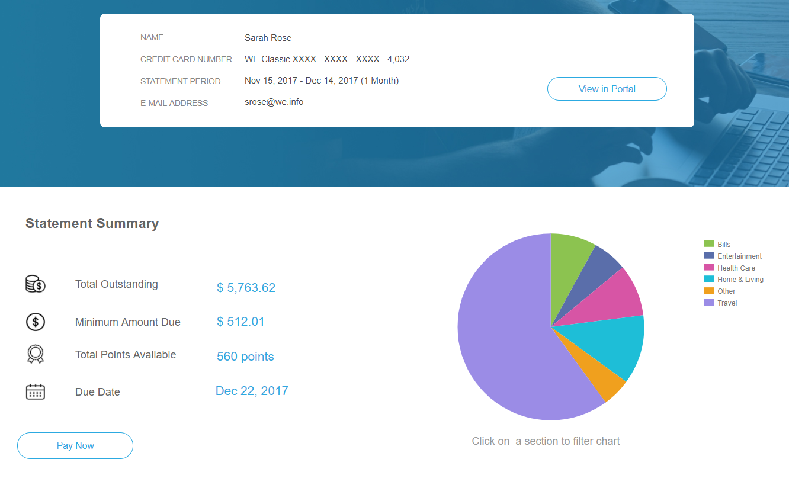

# Formuliergegevensmodel (FDM) gebruiken {#use-form-data-model}

| Versie | Artikelkoppeling |
| -------- | ---------------------------- |
| AEM 6.5 | [ klik hier ](https://experienceleague.adobe.com/docs/experience-manager-65/forms/form-data-model/using-form-data-model.html) |
| AEM as a Cloud Service | Dit artikel |

Met gegevensintegratie van [!DNL Experience Manager Forms] kunt u verschillende backendgegevensbronnen gebruiken om een Form Data Model (FDM) te maken dat u als schema kunt gebruiken in verschillende Adaptive Forms <!--and interactive communications--> -workflows. Het vereist het vormen van gegevensbronnen en het creëren van het Model van de Gegevens van de Vorm (FDM) dat op de voorwerpen en de diensten van het gegevensmodel beschikbaar in gegevensbronnen wordt gebaseerd. Raadpleeg de volgende secties voor meer informatie:

* [[!DNL Experience Manager Forms] Gegevensintegratie](data-integration.md)
* [Gegevensbronnen configureren](configure-data-sources.md)
* [Formuliergegevensmodel maken (FDM)](create-form-data-models.md)
* [Werken met het formuliergegevensmodel (FDM)](work-with-form-data-model.md)

Een formuliergegevensmodel (FDM) is een uitbreiding van het JSON-schema waarmee u:

* [ creeer Aangepaste Forms en fragmenten ](#create-af)
  <!--* [Create interactive communications and building blocks like text, list, and condition fragments](#create-ic)-->
* [Voorvertonen met voorbeeldgegevens](#preview-ic)
* [De service Formuliergegevensmodel gebruiken](#prefill)
* [Verzonden adaptieve formuliergegevens terugschrijven naar gegevensbronnen](#write-af)
* [Services aanroepen met behulp van adaptieve formulierregels](#invoke-services)

## Toepassings- en gebruiksgevallen

### Verzekeringen

## Kan AEM Forms integreren met kernsystemen voor verzekeringen?

Ja. AEM Forms ondersteunt integratie met behulp van REST- en SOAP API&#39;s, zodat deze verbinding kan maken met beleidsbeheersystemen, claimbeheersystemen en CRM&#39;s.

## Kan AEM Forms formuliergegevens terugschrijven naar verzekeringssystemen?

Ja. AEM Forms biedt ondersteuning voor het terugschrijven van gegevens naar back-endsystemen als onderdeel van het verzenden van formulieren en het uitvoeren van workflows.

## Kunnen klanten claimdocumenten veilig uploaden met AEM Forms?

Ja. AEM Forms biedt ondersteuning voor het veilig uploaden van documenten als onderdeel van formulierverzendingen, met toegangsbeheer en veilige gegevensverwerking die zijn afgestemd op de beveiligingsvereisten van de onderneming.

## Adaptieve Forms en fragmenten maken {#create-af}

U kunt [ AanpassingsForms ](creating-adaptive-form.md) en Aangepaste Fragmenten van de Vorm tot stand brengen <!-- [Adaptive Form Fragments](adaptive-form-fragments.md) --> die op een model van vormgegevens (FDM) worden gebaseerd. Ga als volgt te werk om een FDM (Form Data Model) te gebruiken bij het maken van een adaptief formulier of een adaptief formulierfragment:

1. Selecteer op het tabblad Formuliermodel in het scherm Eigenschappen toevoegen de optie **[!UICONTROL Form Data Model]** in de vervolgkeuzelijst **[!UICONTROL Select From]** .

   

2. Selecteer deze optie om **[!UICONTROL Select Form Data Model]** uit te vouwen. Alle beschikbare modellen met formuliergegevens (FDM) worden weergegeven.

   Selecteer een gegevensmodel.

   

3. (**de Aanpassings slechts Fragmenten van de Vorm**) u een Aangepast Fragment van de Vorm tot stand brengen dat op slechts één voorwerp van het gegevensmodel in een model van vormgegevens (FDM) wordt gebaseerd. Vouw de vervolgkeuzelijst **[!UICONTROL Form Data Model Definitions]** uit. Hiermee worden alle gegevensmodelobjecten in het opgegeven formuliergegevensmodel (FDM) weergegeven. Selecteer een gegevensmodelobject in de lijst.

   

   Zodra het adaptieve formulierfragment of het adaptieve formulierfragment dat is gebaseerd op een formuliergegevensmodel (FDM) is gemaakt, worden formuliergegevensmodelobjecten weergegeven op het tabblad **[!UICONTROL Data Sources]** van de inhoudbrowser in de Adaptief formulierbuilder.

   >[!NOTE]
   >
   >Bij een adaptief formulierfragment worden alleen het gegevensmodelobject dat is geselecteerd op het moment van ontwerpen en de bijbehorende gegevensmodelobjecten weergegeven op het tabblad Gegevensbronnen.

   

   U kunt gegevensmodelobjecten naar het adaptieve formulier of fragment slepen om formuliervelden toe te voegen. De toegevoegde formuliervelden behouden de eigenschappen van de metagegevens en de binding met de eigenschappen van gegevensmodelobjecten. De binding zorgt ervoor dat de veldwaarden bij het verzenden van het formulier worden bijgewerkt in de bijbehorende gegevensbronnen en dat deze worden voorgevuld wanneer het formulier wordt gegenereerd.

<!-- ## Create interactive communications {#create-ic}

You can create an interactive communication based on a Form Data Model that you can use to prefill interactive communication with data from configured data sources. In addition, the building blocks of an interactive communication, such as text, list, and condition document fragments can be based on a form data model.

You can choose a Form Data Model when creating an interactive communication or a document fragment. The following image shows the General tab of the Create Interactive Communication dialog.

General tab of Create Interactive Communication dialog

For more information, see:

[Create an interactive communication](create-interactive-communication.md)

[Text in Interactive Communications](texts-interactive-communications.md)

[Conditions in Interactive Communications](conditions-interactive-communications.md)

[List fragments](lists.md) -->

## Voorvertonen met voorbeeldgegevens {#preview-ic}

Met de formuliergegevensmodeleditor kunt u voorbeeldgegevens voor gegevensmodelobjecten genereren en bewerken in het formuliergegevensmodel (FDM). U kunt deze gegevens gebruiken om een voorvertoning weer te geven van <!--interactive communications and--> Adaptieve Forms. U moet de steekproefgegevens produceren alvorens te previewing zoals die in [ wordt beschreven Werk met model van vormgegevens ](work-with-form-data-model.md#sample).

<!--To preview an interactive communication with sample Form Data Model data:

1. On [!DNL  Experience Manager] author instance, navigate to **[!UICONTROL Forms > Forms & Documents]**.
1. Select an interactive communication and select **[!UICONTROL Preview]** in the toolbar to select **[!UICONTROL Web Channel]**, **[!UICONTROL Print Channel]**, or **[!UICONTROL Both Channels]** to preview the interactive communication.
1. In the Preview [*channel*] dialog, ensure that **[!UICONTROL Test Data of Form Data Model]** is selected and select **[!UICONTROL Preview]**.

The interactive communication opens with prefilled sample data.

-->

Als u een voorbeeld van een adaptief formulier met voorbeeldgegevens wilt bekijken, opent u het adaptieve formulier in de modus Ontwerpen en selecteert u **[!UICONTROL Preview]** .

## Vooraf invullen met service Formuliergegevensmodel {#prefill}

[!DNL Experience Manager Forms] biedt een vooraf ingevulde service voor het out-of-the-box Form Data Model die u kunt inschakelen voor Adaptive Forms <!--and interactive communications--> op basis van een formuliergegevensmodel (FDM). De Prefill-service vraagt naar gegevensbronnen voor gegevensmodelobjecten in het adaptieve formulier <!--and interactive communication--> en vult de gegevens dienovereenkomstig aan tijdens het weergeven van het formulier of de communicatie.

Als u de voorkeursservice Formuliergegevensmodel wilt inschakelen voor een adaptief formulier, opent u de eigenschappen van de container van het adaptieve formulier en selecteert u **[!UICONTROL Form Data Model Prefill service]** in de vervolgkeuzelijst **[!UICONTROL Prefill Service]** in de basisaccordeon. Sla vervolgens de eigenschappen op.

<!--To configure Form Data Model prefill service in an interactive communication, you can select Form Data Model Prefill Service in the Prefill Service drop-down while creating it or later by modifying the properties.

Edit Properties dialog for an interactive communication-->

## Verzonden adaptieve formuliergegevens naar gegevensbronnen schrijven {#write-af}

Wanneer een gebruiker een formulier verzendt dat is gebaseerd op een formuliergegevensmodel (FDM), kunt u het formulier zo configureren dat verzonden gegevens voor een gegevensmodelobject naar de gegevensbronnen worden geschreven. Om dit gebruiksgeval te bereiken, [!DNL Experience Manager Forms] verstrekt [ Model van de Gegevens van de Vorm Voorlegt Actie ](configuring-submit-actions.md), beschikbaar uit-van-de-doos slechts voor Aanpassings Forms die op een model van vormgegevens (FDM) wordt gebaseerd. Het schrijft voorgelegde gegevens voor een voorwerp van het gegevensmodel in zijn gegevensbron.

De handeling Verzenden van het formuliergegevensmodel configureren:

1. Open de browser Inhoud en selecteer de component **[!UICONTROL Guide Container]** van het adaptieve formulier.
1. Klik de eigenschappen van de Container van de Gids  pictogram. Het dialoogvenster Aangepaste formuliercontainer wordt geopend.
1. Klik op de tab **[!UICONTROL Submission]** .
1. Selecteer in de vervolgkeuzelijst **[!UICONTROL Submit Action]** de optie **[!UICONTROL Submit using Form Data Model]**.

   

1. Geef de waarde **[!UICONTROL Data model to submit]** op.
1. Klikken **[!UICONTROL Done]**

Bij het verzenden van formulieren worden gegevens voor het geconfigureerde gegevensmodelobject naar de desbetreffende gegevensbron geschreven. Daarnaast kunt u een formulierbijlage verzenden met een formuliergegevensmodel (FDM) en een Document of Record (DoR) naar de gegevensbron. Voor informatie over het model van vormgegevens (FDM), zie [[!DNL AEM Forms]  Integratie van Gegevens ](data-integration.md).

<!---->

>[!NOTE]
>
> AEM as a Cloud Service biedt verschillende mogelijkheden in het vak Acties verzenden voor het verwerken van verzonden formulieren. U kunt meer over deze opties leren in het [ AanpassingsVorm voorlegt Artikel van de Actie ](/help/forms/configure-submit-actions-core-components.md).

U kunt ook formulierbijlagen verzenden naar een gegevensbron met binaire objecteigenschappen van gegevensmodellen. Ga als volgt te werk om bijlagen naar een JDBC-gegevensbron te verzenden:

1. Voeg een gegevensmodelvoorwerp toe dat een binaire bezit aan het model van vormgegevens (FDM) omvat.
1. Sleep in het adaptieve formulier de component **[!UICONTROL File Attachment]** van de browser Components naar het adaptieve formulier.
1. Selecteer om de toegevoegde component te selecteren en  te selecteren om browser van Eigenschappen voor de component te openen.
1. Op het Bind gebied van de Verwijzing, uitgezochte  en navigeer om het binaire bezit te selecteren u in het model van vormgegevens (FDM) toevoegde. Configureer desgewenst andere eigenschappen.

   Selecteer  om de eigenschappen te bewaren. Het gehechtheidsgebied is nu verbindend aan het binaire bezit van het model van vormgegevens (FDM).

1. Schakel **[!UICONTROL Submit Form Attachments]** in het gedeelte Verzending van de eigenschappen van de container van adaptieve formulieren in. De bijlage in het binaire-eigenschapveld wordt naar de gegevensbron verzonden bij het verzenden van het formulier.

## Services aanroepen in Adaptive Forms met behulp van regels {#invoke-services}

In een Aanpassings Vorm die op een model van vormgegevens (FDM) wordt gebaseerd, kunt u [ regels ](rule-editor.md) tot stand brengen om de diensten aan te halen die in het model van vormgegevens (FDM) worden gevormd. De **[!UICONTROL Invoke Services]** -bewerking in een regel bevat een lijst met alle beschikbare services in het Form Data Model (FDM) en u kunt invoer- en uitvoervelden voor de service selecteren. U kunt ook het **[!UICONTROL Set Value]** -regeltype gebruiken om een service Form Data Model aan te roepen en de waarde van een veld in te stellen op de uitvoer die door de service wordt geretourneerd.

Bijvoorbeeld, haalt de volgende regel de dienst aan die Werknemeridentiteitskaart als input neemt en de teruggekeerde waarden in overeenkomstige Afhankelijke identiteitskaart, Familienaam, Voornaam, en Gendergebieden in de vorm worden bevolkt.

Bovendien kunt u de `guidelib.dataIntegrationUtils.executeOperation` API gebruiken om een JavaScript in de coderedacteur voor de regelredacteur te schrijven. <!-- For API details, see [API to invoke Form Data Model service](invoke-form-data-model-services.md).-->

### Een formuliergegevensmodel (FDM) aanroepen met behulp van aangepaste functies {#invoke-form-data-model-using-custom-functions}

U kunt [ een model van vormgegevens van regelredacteur aanhalen gebruikend douanefuncties ](/help/forms/rule-editor.md#custom-functions-in-rule-editor-custom-functions). Om het model van vormgegevens (FDM) aan te halen voeg een model van vormgegevens aan de lijst van gewenste personen toe. Een formuliergegevensmodel toevoegen aan een toegestane lijst:

1. Ga naar Experience Manager-webconsole op `https://server:host/system/console/configMgr` .
1. Zoek **[!UICONTROL Adaptive Form-Level Whitelisting of Form Data Model for Service Invocation - Configuration Factory]** .
1. Klik  pictogram om de configuratie toe te voegen.
1. Voeg **[!UICONTROL Content path pattern]** toe om de locatie van uw Adaptieve Forms op te geven.  Standaard is de waarde `/content/forms/af/(.*)` , die alle adaptieve Forms bevat. U kunt ook het pad opgeven voor een specifiek adaptief formulier.
1. Voeg **[!UICONTROL Form Data Model path pattern]** toe om de locatie van het formuliergegevensmodel (FDM) op te geven. Standaard is de waarde `/content/dams/formsanddocuments-fdm/(.*)` , die alle FDM (Form Data Model) bevat. U kunt ook het pad opgeven voor een specifiek formuliergegevensmodel (FDM).
1. Sla de instellingen op.

De toegevoegde configuratie wordt opgeslagen onder de optie **[!UICONTROL Adaptive Form-Level Whitelisting of Form Data Model for Service Invocation - Configuration Factory]** .

>[!VIDEO](https://video.tv.adobe.com/v/3423977/adaptive-forms-custom-function-rule-editor)

>[!NOTE]
>
> Om een model van vormgegevens (FDM) van de regelredacteur aan te halen gebruikend douanefuncties door een AEM archetype project:
>
>1. [ creeer een configuratiedossier ](https://github.com/adobe/aem-core-forms-components/blob/master/it/config/src/main/content/jcr_root/apps/system/config/com.adobe.aemds.guide.factory.impl.AdaptiveFormFDMConfigurationFactoryImpl~core-components-it.cfg.json).
>1. Stel eigenschappen van getContentPathPattern en getFormDataModelPathPattern in.
>1. Implementeer het project.

## Verwante artikelen

{{af-submit-action}}

