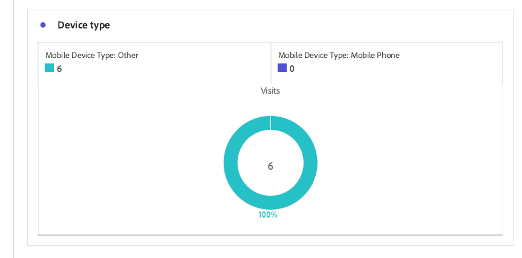

# Adaptieve Forms-analyserapporten weergeven en begrijpen {#viewing-and-understanding-aem-forms-analytics-reports}

| Versie | Artikelkoppeling |
| -------- | ---------------------------- |
| AEM as a Cloud Service | Dit artikel |
| AEM 6,5 | [Klik hier](https://experienceleague.adobe.com/docs/experience-manager-65/forms/integrate-aem-forms-with-experience-cloud-solutions/view-understand-aem-forms-analytics-reports.html) |

In het zich snel ontwikkelende landschap van digitale analysemogelijkheden is het absoluut noodzakelijk om de aandacht te houden aan mondiale trends om geïnformeerde beslissingen te nemen en de digitale ervaringen te optimaliseren. Om dit te verhelpen, integreert Adaptive Forms naadloos met Adobe Analytics om prestatiesmetriek voor uw gepubliceerde formulieren en documenten te vangen en te volgen. Het doel van de analyse van deze meetgegevens is gegevensgestuurde beslissingen te nemen, waarbij gebruik wordt gemaakt van meetgegevens en analyses om de bruikbaarheid en doeltreffendheid van de formulieren te verbeteren.

Door belangrijke prestatie-indicatoren vast te leggen en te volgen, kunnen bedrijven gebieden van verbetering identificeren, gebruikerservaring optimaliseren en uiteindelijk betere resultaten aansturen om uitzonderlijke klantervaringen te creëren.

## Adobe Analytics instellen op Adaptive Forms {#setup-adobe-analytics-to-aem-forms}

Voor het rapport AEM Forms Analytics integreert u eerst Adobe Analytics met AEM Forms via de Automatisering van de Opstelling van het Experience Cloud. Voor Experience Cloud Setup Automation in Adaptive Forms is een Adobe Analytics-licentie, Data Collection (voorheen Adobe Launch) vereist voor het beheer van trackingscripts en integratie met de Experience Platform Launch-API voor gestroomlijnde gegevensaggregatie en het genereren van inzichten. Bezoek [Adobe Analytics inschakelen voor een adaptief formulier met behulp van Experience Cloud Setup Automation](/help/forms/enable-adobe-analytics-adaptive-form-using-experience-cloud-setup-automation.md) voor een volledige opstellingsinformatie.

## Adaptief Forms Adobe Analytics-rapport weergeven {#view-adobe-analytics-report}

1. Ga op uw AEM naar **[!UICONTROL Forms]** >> **[!UICONTROL Forms and Document]**.
1. Selecteer uw formulier. Adobe Analytics wordt geïntegreerd zoals links in het scherm wordt weergegeven, terwijl de Forms wordt geactiveerd voor Adobe Analytics.

   {width="100%"}

1. Klikken **Adobe Analytics** om uw rapport te bekijken en prestatiesgegevens te analyseren.

## Het rapport Adaptive Forms Analytics {#understanding-aem-forms-analytics-reports}

Adobe Analytics biedt een uitgebreide reeks maatstaven voor Adaptive Forms-prestaties die zijn ontworpen om waardevolle inzichten in formuliergebruik te bieden. Deze cijfers zijn:

### **Hoe presteert Adaptive Forms?** {#how-your-adaptive-form-is-performing}

Het heeft de metrieke Uitvoeringen van de Vorm, de Voor verzending bestemde Vorm, de Fouten van de Bevestiging, en de Unieke bezoekers, die u toestaan om het gebruik en de doeltreffendheid van uw vormen te beoordelen:

* **Formulieruitvoeringen**: Formulieruitvoeringen tonen aan hoe vaak het formulier is gegenereerd of geopend.

* **Formulierverzendingen**: Formulierverzendingen geven aan hoe vaak adaptieve formulieren zijn ingevuld en verzonden door gebruikers.

* **Validatiefouten**: Met een validatiefout wordt het totale aantal validatiefouten weergegeven dat is opgetreden in de velden van de formulieren.

* **Unieke bezoekers**: Unieke bezoekers geven het aantal keren weer dat het formulier door een bezoeker wordt gegenereerd. Voor meer informatie over unieke bezoekers raadpleegt u [Unieke bezoekers, bezoeken en klantengedrag](https://experienceleague.adobe.com/docs/analytics/components/metrics/visits.html).

  {width="100%"}

### **Bezoekers van uw formulieren** {#visitors-to-your-forms}

Zo krijgt u waardevolle inzichten in bezoekersactiviteiten op uw formulieren:

* **Bezoeken en opmerkingen**: Hierin worden de frequentie van bezoeken aan uw formulieren in een datumbereik en het bijbehorende aantal verzonden formulieren beschreven. Meer informatie over deze klik vindt u op [Bezoeken](https://experienceleague.adobe.com/docs/analytics/components/metrics/visits.html).
* **Unieke bezoekers en hun totale bezoeken**: Er wordt een onderscheid gemaakt tussen de nieuwe en de terugkerende gebruikers. Een bezoeker kan bijvoorbeeld elke dag een maand naar uw site komen, maar hij telt nog steeds als één unieke bezoeker. Bezoek [Unieke bezoekers](https://experienceleague.adobe.com/docs/analytics/components/metrics/unique-visitors.html) voor nadere informatie.

  {width="100%"}

### **Apparaattype** {#device-type}

Met apparaattype kunt u bepalen welk type apparaat wordt gebruikt voor toegang tot uw formulieren. Het apparaattype wordt gecategoriseerd als Mobiel apparaattype. In dit geval is het bijvoorbeeld Mobiel apparaattype: Overige en Mobiel apparaattype: Mobiele telefoon. De verschillende typen mobiele apparaten zijn onder andere mobiele telefoons, tablets, mediaspelers, gameconsole en nog veel meer.

{width="100%"}

### **Geografische indeling** {#geographical-breakdown}

U ziet hier de locatie waar de Forms is geopend. Deze pagina bevat regiospecifieke informatie over formuliergebruikers. U ziet bijvoorbeeld dat specifieke informatie over een formuliergebruiker India is, zoals wordt weergegeven in de afbeelding.

{width="100%"}

### **Bovenste bronnen van verkeer en populaire formulieren** {#top-sources-of-traffic-and-popular-forms}

Zo kunt u de primaire bron of de koppeling identificeren waarnaar uw formulieren verwijzen. In de onderstaande afbeelding ziet u bijvoorbeeld zoekinstanties naar uw adaptieve formulieren met een percentage van 18,9% **Getypte/bladwijzer**, 70,49% gebaseerd op **Zoekmachines**, en 24% komt van **Andere websites**. U kunt dimensie-items definiëren op basis van uw vereisten. U kunt ook uitzoeken welke formulieren het meest worden bezocht of populair zijn.

{width="100%"}

### **Gebruikersactiviteiten op de belangrijkste formulieren** {#user-activity-on-top-forms}

Een uitgebreide weergave van de betrokkenheid van gebruikers bij veldbezoeken, formulieruitvoeringen, validatiefouten, verlaten formulieren en het verzenden van formulieren bieden inzicht in de meest actieve formulieren. In de onderstaande afbeelding ziet u dat het toepassingsformulier het actiefst is op basis van de cijfers voor formuliergebeurtenissen.

{width="100%"}

### **Tijdlijn voor aan formulieren bestede tijd** {#timeline-for-time-spent-on-forms}

Het is de tijd die gebruikers in de loop der tijd aan uw formulieren besteden, die u helpen om betrokkenheidspatronen te identificeren.

{width="100%"}

### **Gebieden waar bezoekers hulp nodig hebben bij het invullen van het formulier** {#areas-requiring-assistance}

Metrische gegevens zoals Help-weergaven, validatiefouten en veldbezoeken laten zien waar gebruikers hulp nodig hebben of hoe we fouten in velden kunnen opsporen. In de onderstaande afbeelding ziet u bijvoorbeeld die in een formulier met velden zoals **Volledige naam**, **Telefoonnummer**, **DoB**. De **Volledige naam** in het veld zijn 12 bezoeken , van de 12 bezoeken 8 hebben een validatiefout en 1 op het Help-pictogram voor de Help-weergave in dit veld geklikt . U kunt de metrische gegevens voor andere formuliervelden zien.

{width="100%"}

### **Het laatste formulierveld dat bezoekers hebben weergegeven voordat ze het formulier hebben verlaten** {#last-form-field-that-visitors-viewed}

Hiermee kunt u de formuliervelden analyseren waarin de gebruikers tijd hebben doorgebracht voordat ze het formulier verlaten. In de onderstaande afbeelding staan bijvoorbeeld van de vijf verlaten formulieren 2 links in het veld **Volledige naam**, 2 links in het veld **Telefoonnummer** en 1 links op het veld **Tekstinvoer**.

{width="100%"}

## Zie ook {#see-also}

* [Adobe Analytics inschakelen voor een adaptief formulier met behulp van Experience Cloud Setup Automation](/help/forms/enable-adobe-analytics-adaptive-form-using-experience-cloud-setup-automation.md)
* [Een adaptief formulier toevoegen aan een AEM Sites-pagina of Ervaar fragment](/help/forms/create-or-add-an-adaptive-form-to-aem-sites-page.md)
* [AEM Forms integreren met Adobe Analytics](/help/forms/integrate-aem-forms-with-adobe-analytics.md)
