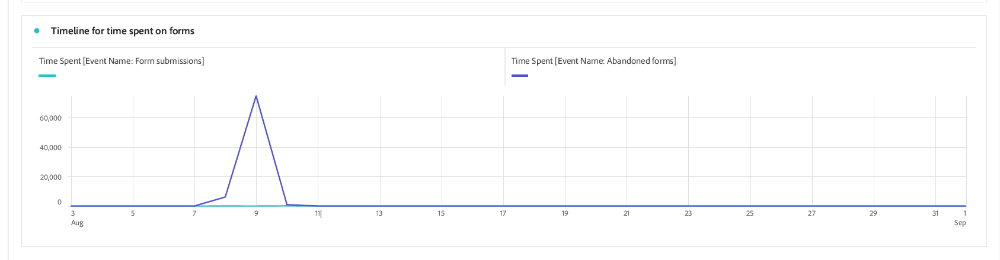

# Adaptieve Forms-analyserapporten weergeven en begrijpen {#viewing-and-understanding-aem-forms-analytics-reports}

| Versie | Artikelkoppeling |
| -------- | ---------------------------- |
| AEM as a Cloud Service | Dit artikel |
| AEM 6.5 | [ klik hier ](https://experienceleague.adobe.com/docs/experience-manager-65/forms/integrate-aem-forms-with-experience-cloud-solutions/view-understand-aem-forms-analytics-reports.html?lang=nl-NL) |

In het zich snel ontwikkelende landschap van digitale analysemogelijkheden is het absoluut noodzakelijk om de aandacht te houden aan mondiale trends om geïnformeerde beslissingen te nemen en de digitale ervaringen te optimaliseren. Om dit te verhelpen, integreert Adaptive Forms naadloos met Adobe Analytics om prestatiesmetriek voor uw gepubliceerde formulieren en documenten te vangen en te volgen. Het doel van de analyse van deze meetgegevens is gegevensgestuurde beslissingen te nemen, waarbij gebruik wordt gemaakt van meetgegevens en analyses om de bruikbaarheid en doeltreffendheid van de formulieren te verbeteren.

Door belangrijke prestatie-indicatoren vast te leggen en te volgen, kunnen bedrijven gebieden van verbetering identificeren, gebruikerservaring optimaliseren en uiteindelijk betere resultaten aansturen om uitzonderlijke klantervaringen te creëren.

## Adobe Analytics instellen op Adaptive Forms {#setup-adobe-analytics-to-aem-forms}

Voor het AEM Forms Analytics-rapport integreert u eerst Adobe Analytics naar AEM Forms via Experience Cloud Setup Automation. Experience Cloud Setup Automation in Adaptive Forms vereist een Adobe Analytics-licentie, gegevensverzameling (voorheen Adobe Launch) voor het beheer van trackingscripts en integratie met de Experience Platform Launch-API voor gestroomlijnde gegevensaggregatie en het genereren van inzichten. Bezoek [ laat Adobe Analytics voor een AanpassingsVorm toe gebruikend de Automatisering van de Opstelling van Experience Cloud ](/help/forms/enable-adobe-analytics-adaptive-form-using-experience-cloud-setup-automation.md) voor een volledige opstellingsinformatie.

## Adaptief Forms Adobe Analytics-rapport weergeven {#view-adobe-analytics-report}

1. Ga in uw AEM-instantie naar **[!UICONTROL Forms]** >> **[!UICONTROL Forms and Document]** .
1. Selecteer uw formulier. Adobe Analytics wordt geïntegreerd zoals links in het scherm wordt weergegeven, terwijl de Forms wordt geactiveerd voor Adobe Analytics.

   {width="100%"}

1. Klik **Adobe Analytics** om uw rapport te bekijken en prestatiesgegevens te analyseren.

## Het rapport Adaptive Forms Analytics {#understanding-aem-forms-analytics-reports}

Adobe Analytics biedt een uitgebreide reeks maatstaven voor Adaptive Forms-prestaties die zijn ontworpen om waardevolle inzichten in formuliergebruik te bieden. Deze cijfers zijn:

### **hoe voert Aangepaste Forms?** {#how-your-adaptive-form-is-performing}

Het heeft de metrieke Uitvoeringen van de Vorm, de Voor verzending bestemde Vorm, de Fouten van de Bevestiging, en de Unieke bezoekers, die u toestaan om het gebruik en de doeltreffendheid van uw vormen te beoordelen:

* **de vertoningen van de Vorm**: De vertoningen van de vorm tonen het aantal tijden de vorm is teruggegeven of geopend.

* **de voorlegging van de Vorm**: De voorlegging van de vorm wijst op het aantal tijden de adaptieve vormen met succes worden voltooid en door gebruikers voorgelegd.

* **de fouten van de Bevestiging**: De fout van de Bevestiging toont het totale aantal op bevestiging betrekking hebbende fouten die op de gebieden van de vormen voorkwamen.

* **Unieke bezoekers**: De unieke bezoekers vertegenwoordigen het aantal tijden de vorm door een bezoeker wordt teruggegeven. Voor meer informatie over unieke bezoekers, zie [ Unieke Bezoekers, Bezoeken, en het gedrag van de Klant ](https://experienceleague.adobe.com/docs/analytics/components/metrics/visits.html?lang=nl-NL).

  {width="100%"}

### **Bezoekers aan uw vormen** {#visitors-to-your-forms}

Zo krijgt u waardevolle inzichten in bezoekersactiviteiten op uw formulieren:

* **bezoeken &amp; voorlegging**: Het beschrijft de frequentie van bezoeken aan uw vormen in een datumwaaier en het overeenkomstige aantal vormvoorlegging, voor meer informatie over dit klik [ Bezoeken ](https://experienceleague.adobe.com/docs/analytics/components/metrics/visits.html?lang=nl-NL).
* **Unieke bezoekers &amp; hun totale bezoeken**: Het maakt onderscheid tussen de nieuwe en terugkerende gebruikers. Een bezoeker kan bijvoorbeeld elke dag een maand naar uw site komen, maar hij telt nog steeds als één unieke bezoeker. Bezoek [ Unieke bezoekers ](https://experienceleague.adobe.com/docs/analytics/components/metrics/unique-visitors.html?lang=nl-NL) voor een gedetailleerde informatie.

  {width="100%"}

### **Type van Apparaat** {#device-type}

Met apparaattype kunt u bepalen welk type apparaat wordt gebruikt voor toegang tot uw formulieren. Het apparaattype wordt gecategoriseerd als Mobiel apparaattype. In dit geval is het bijvoorbeeld Mobiel apparaattype: Overige en Mobiel apparaattype: Mobiele telefoon. De verschillende typen mobiele apparaten zijn onder andere mobiele telefoons, tablets, mediaspelers, gameconsole en nog veel meer.

{width="100%"}

### **Geografische verdeling** {#geographical-breakdown}

U ziet hier de locatie waar de Forms is geopend. Deze pagina bevat regiospecifieke informatie over formuliergebruikers. U ziet bijvoorbeeld dat specifieke informatie over een formuliergebruiker India is, zoals wordt weergegeven in de afbeelding.

{width="100%"}

### **Hoogste bronnen van verkeer en populaire vormen** {#top-sources-of-traffic-and-popular-forms}

Zo kunt u de primaire bron of de koppeling identificeren waarnaar uw formulieren verwijzen. Bijvoorbeeld, in het bepaalde beeld hieronder ziet u onderzoeksinstanties voor uw adaptieve vormen waar 18.9% **getypt/Bookmarked** is, 70.49% gebaseerd op **de Motoren van het Onderzoek**, en 24% zijn van **Andere Plaatsen van het Web**. U kunt dimensie-items definiëren op basis van uw vereisten. U kunt ook uitzoeken welke formulieren het meest worden bezocht of populair zijn.

{width="100%"}

### **activiteit van de Gebruiker op hoogste vormen** {#user-activity-on-top-forms}

Een uitgebreide weergave van de betrokkenheid van gebruikers bij veldbezoeken, formulieruitvoeringen, validatiefouten, verlaten formulieren en het verzenden van formulieren bieden inzicht in de meest actieve formulieren. In de onderstaande afbeelding ziet u dat het toepassingsformulier het actiefst is op basis van de cijfers voor formuliergebeurtenissen.

{width="100%"}

### **Chronologie voor tijd besteed aan vormen** {#timeline-for-time-spent-on-forms}

Het is de tijd die gebruikers in de loop der tijd aan uw formulieren besteden, die u helpen om betrokkenheidspatronen te identificeren.

{width="100%"}

### **Gebieden waar de bezoekers hulp met het invullen van de vorm** vereisen {#areas-requiring-assistance}

Metrische gegevens zoals Help-weergaven, validatiefouten en veldbezoeken laten zien waar gebruikers hulp nodig hebben of hoe we fouten in velden kunnen opsporen. Bijvoorbeeld, in het beeld hieronder ziet u dat in een vorm met gebieden zoals **Volledige Naam**, **Aantal van de Telefoon**, **DoB**. Het **Volledige gebied van de Naam** heeft 12 bezoeken, van 12 bezoeken 8 bezoeken hebben bevestigingsfout en 1 klikte hulppictogram voor hulpmening op dit gebied. U kunt de metrische gegevens voor andere formuliervelden zien.

{width="100%"}

### **het laatste vormgebied dat de bezoekers bekeken alvorens zij de vorm** verlieten {#last-form-field-that-visitors-viewed}

Hiermee kunt u de formuliervelden analyseren waarin de gebruikers tijd hebben doorgebracht voordat ze het formulier verlaten. Bijvoorbeeld, in het hieronder gegeven beeld, van 5 verlaten vormen, 2 verlaten op het gebied **Volledige Naam**, 2 verlaten op het gebied **Aantal van de Telefoon**, en 1 verlaten op de Invoer van de Tekst van het Gebied **&#x200B;**.

{width="100%"}

## Zie ook {#see-also}

* [Adobe Analytics inschakelen voor een adaptief formulier met Experience Cloud Setup Automation](/help/forms/enable-adobe-analytics-adaptive-form-using-experience-cloud-setup-automation.md)
* [Een adaptief formulier toevoegen aan een AEM Sites-pagina of Ervaar fragment](/help/forms/create-or-add-an-adaptive-form-to-aem-sites-page.md)
* [AEM Forms integreren met Adobe Analytics](/help/forms/integrate-aem-forms-with-adobe-analytics.md)
