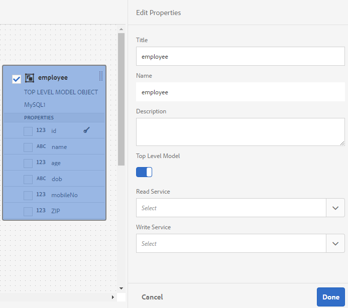

# Werken met FDM (Form Data Model) {#work-with-form-data-model}

| Versie | Artikelkoppeling |
| -------- | ---------------------------- |
| AEM 6,5 | [ klik hier ](https://experienceleague.adobe.com/docs/experience-manager-65/forms/form-data-model/work-with-form-data-model.html) |
| AEM as a Cloud Service | Dit artikel |


De redacteur van het Model van de Gegevens van de vorm (FDM) verstrekt een intuïtieve gebruikersinterface en hulpmiddelen om een model van vormgegevens (FDM) uit te geven en te vormen. Met behulp van de editor kunt u gegevensmodelobjecten, eigenschappen en services toevoegen en configureren vanuit gekoppelde gegevensbronnen in het formuliergegevensmodel (FDM). Daarnaast kunt u gegevensmodelobjecten en -eigenschappen maken zonder gegevensbronnen en deze later binden met de respectievelijke gegevensmodelobjecten en -eigenschappen. U kunt ook voorbeeldgegevens genereren en bewerken voor eigenschappen van gegevensmodelobjecten die u kunt gebruiken om adaptieve Forms <!--and interactive communications--> vooraf in te vullen tijdens het weergeven van een voorbeeld. U kunt gegevensmodelvoorwerpen en de diensten testen die in een Model van de Gegevens van de Vorm (FDM) worden gevormd om ervoor te zorgen het behoorlijk met gegevensbronnen wordt geïntegreerd.

Als u voor de gegevensintegratie van Forms nieuw bent en geen gegevensbron hebt gevormd of een model van vormgegevens (FDM) gecreeerd, zie de volgende onderwerpen:

* [[!DNL Experience Manager Forms] Gegevensintegratie](data-integration.md)
* [Gegevensbronnen configureren](configure-data-sources.md)
* [Formuliergegevensmodel maken (FDM)](create-form-data-models.md)

Lees verder voor meer informatie over verschillende taken en configuraties die u kunt uitvoeren met de formuliergegevensmodeleditor.

>[!NOTE]
>
>U moet een lid van zowel **fdm-auteur** en **vormen-gebruiker** groepen zijn om met het model van vormgegevens (FDM) te kunnen tot stand brengen en werken. Neem contact op met de [!DNL Experience Manager] -beheerder om lid te worden van de groepen.

## Objecten en services voor gegevensmodellen toevoegen {#add-data-model-objects-and-services}

Als u een Model van de Gegevens van de Vorm (FDM) met gegevensbronnen creeerde, kunt u de Modelredacteur van de Gegevens van de Vorm gebruiken om gegevensmodelvoorwerpen en de diensten toe te voegen, hun eigenschappen te vormen, verenigingen tussen de voorwerpen van het gegevensmodel te bouwen, en het Model van de Gegevens van de Vorm (FDM) en de diensten te testen.

U kunt gegevensmodelvoorwerpen en de diensten van beschikbare gegevensbronnen in het model van vormgegevens (FDM) toevoegen. Terwijl de toegevoegde voorwerpen van het gegevensmodel op het Modellusje verschijnen, verschijnen de toegevoegde diensten op het lusje van de Diensten.

Objecten en services voor gegevensmodellen toevoegen:

1. Meld u aan bij de auteur van [!DNL Experience Manager] , navigeer naar **[!UICONTROL Forms > Data Integrations]** en open het formuliergegevensmodel (FDM) waarin u gegevensmodelobjecten wilt toevoegen.
1. In de ruit van Gegevensbronnen, breid gegevensbronnen uit om beschikbare voorwerpen en de diensten van het gegevensmodel te bekijken.
1. Selecteer gegevensmodelobjecten en -services die u wilt toevoegen aan het formuliergegevensmodel (FDM) en selecteer **[!UICONTROL Add Selected]** .

   

   Geselecteerde gegevensmodelobjecten en services

   Op het tabblad **[!UICONTROL Model]** wordt een grafische weergave weergegeven van alle gegevensmodelobjecten en de bijbehorende eigenschappen die aan het formuliergegevensmodel (FDM) zijn toegevoegd. Elk gegevensmodelobject wordt vertegenwoordigd door een vak in het formuliergegevensmodel (FDM).

   

   **[!UICONTROL Model]** geeft toegevoegde gegevensmodelobjecten weer

   >[!NOTE]
   >
   >U kunt gegevensmodelobjectvakken vastzetten en slepen om ze in het inhoudsgebied te ordenen. Alle gegevensmodelvoorwerpen die in het Model van de Gegevens van de Vorm (FDM) worden toegevoegd worden grijs uit in de ruit van Gegevensbronnen.

   De tab **[!UICONTROL Services]** bevat services die zijn toegevoegd.

   

   **[!UICONTROL Services]** tabblad geeft services voor gegevensmodellen weer

   >[!NOTE]
   >
   >Naast gegevensmodelvoorwerpen en de diensten, omvat het document van de de dienstmeta-gegevens OData navigatie eigenschappen die vereniging tussen twee voorwerpen van het gegevensmodel bepalen. Voor meer informatie, zie [ Werkend met navigatie eigenschappen van de diensten OData ](#work-with-navigation-properties-of-odata-services).

1. Selecteer **[!UICONTROL Save]** om het formuliermodelobject op te slaan.

   >[!NOTE]
   >
   >U kunt de diensten aanhalen die u op het lusje van de Diensten van een Model van de Gegevens van de Vorm (FDM) gebruikend de Aangepaste regels van de Vorm vormde. De gevormde diensten zijn beschikbaar in de Invoke de dienstenactie van de regelredacteur voor meer informatie over het gebruiken van deze diensten in de Aanpassende regels van de Vorm, zie de Diensten van de Invoke en Vastgestelde Waarde van regels in [ regelredacteur ](rule-editor.md).

## Gegevensmodelobjecten en onderliggende eigenschappen maken {#create-data-model-objects-and-child-properties}

### Gegevensmodelobjecten maken {#create-data-model-objects}

Terwijl u gegevensmodelvoorwerpen van gevormde gegevensbronnen kunt toevoegen, kunt u voorwerpen of entiteiten van het gegevensmodel zonder gegevensbronnen ook tot stand brengen. Het is vooral nuttig als u geen gegevensbronnen in het model van vormgegevens (FDM) hebt gevormd.

Een gegevensmodelobject maken zonder gegevensbronnen:

1. Meld u aan bij de auteur van [!DNL Experience Manager] , navigeer naar **[!UICONTROL Forms > Data Integrations]** en open het formuliergegevensmodel (FDM) waarin u een gegevensmodelobject of -entiteit wilt maken.
1. Selecteer **[!UICONTROL Create Entity]** .
1. Geef in het dialoogvenster [!UICONTROL Create data Model] een naam op voor het gegevensmodelobject en selecteer **[!UICONTROL Add]** . Een gegevensmodelobject wordt toegevoegd aan het formuliergegevensmodel (FDM). Het nieuwe gegevensmodelobject is niet gebonden aan een gegevensbron en heeft geen eigenschappen zoals in de volgende afbeelding wordt getoond.

   

Vervolgens kunt u onderliggende eigenschappen toevoegen aan niet-gebonden gegevensmodelobjecten.

### Onderliggende eigenschappen toevoegen {#child-properties}

Met de formuliergegevensmodeleditor kunt u onderliggende eigenschappen in een gegevensmodelobject maken. De eigenschap bij het maken is niet gebonden aan een eigenschap in een gegevensbron. U kunt de eigenschap child later binden met een andere eigenschap in het omvattende gegevensmodelobject.

Een onderliggende eigenschap maken:

1. Selecteer in een formuliergegevensmodel een gegevensmodelobject en selecteer **[!UICONTROL Create Child Property]** .
1. Geef in het dialoogvenster **[!UICONTROL Create Child Property]** een naam en gegevenstype op voor de eigenschap in respectievelijk de velden **[!UICONTROL Name]** en **[!UICONTROL Type]** . U kunt desgewenst een titel en beschrijving voor de eigenschap opgeven.
1. Schakel Berekend in als de eigenschap een berekende eigenschap is. De waarde van een berekende eigenschap wordt berekend op basis van een regel of expressie. Voor meer informatie, zie [ eigenschappen ](#properties) uitgeven.
1. Als het gegevensmodelobject aan een gegevensbron is gebonden, wordt de toegevoegde onderliggende eigenschap automatisch gebonden aan de eigenschap van het bovenliggende gegevensmodelobject met dezelfde naam en hetzelfde gegevenstype.

   Als u een onderliggende eigenschap handmatig wilt binden met een objecteigenschap van het gegevensmodel, selecteert u het bladerpictogram naast het veld **[!UICONTROL Bind Reference]** . In het dialoogvenster **[!UICONTROL Select Object]** worden alle eigenschappen van het bovenliggende gegevensmodelobject weergegeven. Selecteer een eigenschap waarmee u wilt binden en selecteer het verdeelstreeppictogram. U kunt alleen een eigenschap van hetzelfde gegevenstype selecteren als de eigenschap child.

1. Selecteer **[!UICONTROL Done]** om de onderliggende eigenschap op te slaan en selecteer **[!UICONTROL Save]** om het formuliergegevensmodel (FDM) op te slaan. De eigenschap child wordt nu toegevoegd aan het gegevensmodelobject.

Nadat u gegevensmodelobjecten en -eigenschappen hebt gemaakt, kunt u blijven werken aan het maken van adaptieve Forms <!--and interactive communications--> op basis van het formuliergegevensmodel (FDM). Later, wanneer u gegevensbronnen beschikbaar en gevormd hebt, kunt u het Model van de Gegevens van de Vorm (FDM) met gegevensbronnen binden. De binding wordt automatisch bijgewerkt in gekoppelde Adaptive Forms <!--and interactive communications--> . Voor meer informatie over het creëren van Adaptieve Forms <!--and interactive communications--> gebruikend het model van vormgegevens (FDM), zie [ het model van vormgegevens van het Gebruik ](using-form-data-model.md).

### Objecten en eigenschappen van gegevensmodellen binden {#bind-data-model-objects-and-properties}

Wanneer de gegevensbronnen u met het Model van de Gegevens van de Vorm (FDM) wilt integreren beschikbaar zijn, kunt u hen aan het Model van de Gegevens van de Vorm (FDM) toevoegen zoals die in [ worden beschreven de gegevensbronnen van de Update ](create-form-data-models.md#update). Voer vervolgens de volgende handelingen uit om de niet-gebonden gegevensmodelobjecten en -eigenschappen te binden:

1. Selecteer in het formuliergegevensmodel de niet-gebonden gegevensbron die u met een gegevensbron wilt binden.
1. Selecteer **[!UICONTROL Edit Properties]** .
1. Selecteer in het deelvenster **[!UICONTROL Edit Properties]** het bladerpictogram naast het veld **[!UICONTROL Binding]** . Hiermee wordt het dialoogvenster **[!UICONTROL Select Object]** geopend met gegevensbronnen die zijn toegevoegd aan het formuliergegevensmodel (FDM).

   

1. Vouw de gegevensbronstructuur uit en selecteer een gegevensmodelobject om mee te binden en selecteer het verdeelstreeppictogram.
1. Selecteer **[!UICONTROL Done]** om de eigenschappen op te slaan en selecteer vervolgens **[!UICONTROL Save]** om het gegevensmodel van het formulier op te slaan. Het gegevensmodelobject is nu gebonden aan een gegevensbron. Het gegevensmodelobject is niet meer gemarkeerd als Niet geconsolideerd.

   

## Services configureren {#configure-services}

Om gegevens voor een voorwerp van het gegevensmodel te lezen en te schrijven, doe het volgende om gelezen te vormen en de diensten te schrijven:

1. Schakel het selectievakje boven aan een gegevensmodelobject in om het te selecteren en selecteer **[!UICONTROL Edit Properties]** .

   

   Eigenschappen bewerken om lees- en schrijfservices voor een gegevensmodelobject te configureren

   Het dialoogvenster [!UICONTROL Edit Properties] wordt geopend.

   

   Eigenschappen bewerken, dialoogvenster

   >[!NOTE]
   >
   >Naast gegevensmodelvoorwerpen en de diensten, omvat het document van de de dienstmeta-gegevens OData navigatie eigenschappen die vereniging tussen twee voorwerpen van het gegevensmodel bepalen. Wanneer u een bron van de de dienstgegevens OData aan een Model van de Gegevens van de Vorm (FDM) toevoegt, is er de dienst beschikbaar in het Model van de Gegevens van de Vorm (FDM) voor alle navigatie eigenschappen in een voorwerp van het gegevensmodel. U kunt deze service gebruiken om de navigatie-eigenschappen van het overeenkomende gegevensmodelobject te lezen.
   >
   >
   >Voor meer informatie die de dienst gebruikt, zie [ Werkend met navigatieeigenschappen van de diensten OData ](#work-with-navigation-properties-of-odata-services).

1. Schakel **[!UICONTROL Top Level Object]** in om op te geven of het gegevensmodelobject een modelobject op het hoogste niveau is.

   De modelvoorwerpen van gegevens die in een Model van de Gegevens van de Vorm (FDM) worden gevormd zijn beschikbaar voor gebruik op het lusje van Objecten van het Gegevensmodel in tevreden browser van een Adaptief die Vorm op het model van vormgegevens (FDM) wordt gebaseerd. Wanneer u een koppeling toevoegt tussen twee gegevensmodelobjecten, wordt het gegevensmodelobject dat u koppelt, genest onder het gegevensmodelobject dat u koppelt op het tabblad **[!UICONTROL Data Model Objects]** . Als het geneste gegevensmodel een object op hoofdniveau is, wordt het ook afzonderlijk weergegeven op het tabblad **[!UICONTROL Data Model Objects]** . Daarom ziet u twee items ervan, een binnen en een buiten de geneste hiërarchie, die verwarring kunnen veroorzaken bij auteurs van formulieren. Als u het gekoppelde gegevensmodelobject alleen in de geneste hiërarchie wilt weergeven, schakelt u de eigenschap Object op hoogste niveau uit.

1. Selecteer de Lezen en schrijven diensten voor de geselecteerde voorwerpen van het gegevensmodel. De argumenten voor de services worden weergegeven.

   

   Lees en schrijf de diensten die voor werknemersgegevensbron worden gevormd

1. Selecteer  voor het gelezen de dienstargument [ het argument aan een Attribuut van het Profiel van de Gebruiker, een Attribuut van het Verzoek, of Letterlijke waarde ](#bindargument) binden en de bindende waarde specificeren.
1. Selecteer **[!UICONTROL Done]** om het argument op te slaan, **[!UICONTROL Done]** om de eigenschappen op te slaan en **[!UICONTROL Save]** om het formuliergegevensmodel (FDM) op te slaan.

### Bind Read de dienstargumenten {#bindargument}

Bind Gelezen de dienstargument aan een Attribuut van het Profiel van de Gebruiker, een Attribuut van het Verzoek, of Letterlijke waarde die op een bindende waarde wordt gebaseerd. De waarde wordt overgegaan tot de dienst als argument om details te halen verbonden aan de gespecificeerde waarde uit de gegevensbron.

#### Letterlijke waarde {#literal-value}

Selecteer **[!UICONTROL Literal]** in de vervolgkeuzelijst **[!UICONTROL Binding To]** en voer een waarde in het veld **[!UICONTROL Binding Value]** in. De details die aan de waarde zijn gekoppeld, worden opgehaald uit de gegevensbron. Gebruik deze optie om details terug te winnen verbonden aan een statische waarde.

In dit voorbeeld, worden de details verbonden aan **4367655678**, als waarde voor het `mobilenum` argument, teruggewonnen uit de gegevensbron. De bijbehorende details als u de waarde voor een mobiel aantalargument overgaat kunnen eigenschappen zoals klantennaam, klantenadres, en stad omvatten.


#### Kenmerk gebruikersprofiel {#user-profile-attribute}

Selecteer **[!UICONTROL User Profile Attribute]** in de vervolgkeuzelijst **[!UICONTROL Binding To]** en voer in het veld **[!UICONTROL Binding Value]** de naam van het kenmerk in. De details van de gebruiker die bij de [!DNL Experience Manager] instantie is aangemeld, worden opgehaald uit de gegevensbron op basis van de kenmerknaam.

De kenmerknaam die in het veld **[!UICONTROL Binding Value]** wordt opgegeven, moet het volledige bindpad bevatten tot de kenmerknaam voor de gebruiker. Open de volgende URL om tot de gebruikersdetails op CRXDE toegang te hebben:

`https://[server-name]:[port]/crx/de/index.jsp#/home/users/`


In dit voorbeeld geeft u `profile.empid` op in het veld **[!UICONTROL Binding Value]** voor de gebruiker `grios` .

 uit

Het argument `id` neemt de waarde van het kenmerk `empid` van het gebruikersprofiel en geeft dit als een argument door aan de service Read. Het leest en keert waarden van bijbehorende eigenschappen van het voorwerp van het werknemersgegevensmodel voor `empid` verbonden aan de het programma geopende gebruiker terug.

#### Aanvraagkenmerk {#request-attribute}

Gebruik het verzoekattribuut om de bijbehorende eigenschappen van de gegevensbron terug te winnen.

1. Selecteer **[!UICONTROL Request Attribute]** in de vervolgkeuzelijst **[!UICONTROL Binding To]** en voer in het veld **[!UICONTROL Binding Value]** de naam van het kenmerk in.

1. Creeer een [ bekleding ](https://experienceleague.adobe.com/docs/experience-manager-cloud-service/implementing/developing/full-stack/overlays.html?lang=en#developing) voor head.jsp. Als u de overlay wilt maken, opent u CRX DE en kopieert u het bestand `https://<server-name>:<port number>/crx/de/index.jsp#/libs/fd/af/components/page2/afStaticTemplatePage/head.jsp` naar `https://<server-name>:<port number>/crx/de/index.jsp#/apps/fd/af/components/page2/afStaticTemplatePage/head.jsp`

   >[!NOTE]
   >
   > * Als u een statische sjabloon gebruikt, bedekt u head.jsp bij:
   >   `/libs/fd/af/components/page2/afStaticTemplatePage/head.jsp`
   > * Als u een bewerkbare sjabloon gebruikt, bedekt u de aftemplatedpage.jsp op:
   >   `/libs/fd/af/components/page2/aftemplatedpage/aftemplatedpage.jsp`

1. Stel [!DNL paramMap] in voor het aanvraagkenmerk. Neem bijvoorbeeld de volgende code op in het .jsp-bestand in de map apps:

   ```javascript
   <%Map paraMap = new HashMap();
    paraMap.put("<request_attribute>",request.getParameter("<request_attribute>"));
    request.setAttribute("paramMap",paraMap);
   ```

   Gebruik bijvoorbeeld de onderstaande code om de waarde van petid op te halen uit de gegevensbron:


   ```javascript
   <%Map paraMap = new HashMap();
   paraMap.put("petId",request.getParameter("petId"));
   request.setAttribute("paramMap",paraMap);%>
   ```

De details worden teruggewonnen uit de gegevensbron die op de attributennaam wordt gebaseerd in het verzoek wordt gespecificeerd.

Als u bijvoorbeeld kenmerk opgeeft als `petid=100` in de aanvraag, worden eigenschappen die aan de kenmerkwaarde zijn gekoppeld, opgehaald uit de gegevensbron.

## Koppelingen toevoegen {#add-associations}

Er zijn doorgaans koppelingen tussen gegevensmodelobjecten in een gegevensbron. De koppeling kan een-op-een of een-op-een zijn. Bijvoorbeeld, kunnen er veelvoudige gebiedsdelen verbonden aan een werknemer zijn. Deze wordt een-op-een-koppeling genoemd en wordt door `1:n` weergegeven op de regel die gekoppelde gegevensmodelobjecten verbindt. Nochtans, als een vereniging een unieke werknemersnaam voor een bepaalde werknemersidentiteitskaart terugkeert, wordt het bedoeld als één-op-één vereniging.

Wanneer u gekoppelde gegevensmodelobjecten in een gegevensbron toevoegt aan een formuliergegevensmodel (FDM), blijven de koppelingen behouden en worden ze weergegeven als verbonden door pijllijnen. U kunt koppelingen tussen gegevensmodelobjecten op verschillende gegevensbronnen toevoegen in een formuliergegevensmodel (FDM).

>[!NOTE]
>
>Vooraf gedefinieerde koppelingen in een JDBC-gegevensbron blijven niet behouden in het formuliergegevensmodel (FDM). U moet ze handmatig maken.

Een koppeling toevoegen:

1. Schakel het selectievakje boven aan een gegevensmodelobject in om het te selecteren en selecteer **[!UICONTROL Add Association]** . Het dialoogvenster Koppeling toevoegen wordt geopend.

   

   >[!NOTE]
   >
   >Naast gegevensmodelvoorwerpen en de diensten, omvat het document van de de dienstmeta-gegevens OData navigatie eigenschappen die vereniging tussen twee voorwerpen van het gegevensmodel bepalen. U kunt deze navigatie-eigenschappen gebruiken wanneer u koppelingen toevoegt aan het formuliergegevensmodel (FDM). Voor meer informatie, zie [ Werkend met navigatie eigenschappen van de diensten OData ](#work-with-navigation-properties-of-odata-services).

   Het dialoogvenster [!UICONTROL Add Association] wordt geopend.

   

   Dialoogvenster Koppeling toevoegen

1. In de Add ruit van de Vereniging:

   * Geef een titel op voor de koppeling.
   * Selecteer het associatietype — **[!UICONTROL One to One]** of **[!UICONTROL One to Many]**.
   * Selecteer het gegevensmodelobject dat u wilt koppelen.
   * Selecteer de leesservice om gegevens van het geselecteerde modelobject te lezen. Het argument van de leesservice wordt weergegeven. Bewerk het argument om het indien nodig te wijzigen en koppel het aan de eigenschap van het gegevensmodelobject dat u wilt koppelen.

   In het volgende voorbeeld is `dependentid` het standaardargument voor de leesservice van het gegevensmodelobject Afhankelijke elementen.

   

   Het standaardargument voor de dienst van het lezen van Afhankelijkheden is afhankelijk

   Het argument moet echter een algemene eigenschap zijn tussen het gekoppelde gegevensmodelobject, in dit voorbeeld `Employeeid` . Daarom moet het argument `Employeeid` aan het `id` bezit van het de gegevensmodelvoorwerp van de Werknemer worden gebonden om de bijbehorende gebiedsdeeldetails van het het gegevensmodelvoorwerp van Afhankelijkheden te halen.

   

   Bijgewerkt argument en binding

   Selecteer **[!UICONTROL Done]** om het argument op te slaan.

1. Selecteer **[!UICONTROL Done]** om de koppeling op te slaan en **[!UICONTROL Save]** om het formuliergegevensmodel (FDM) op te slaan.
1. Herhaal de stappen om desgewenst meer koppelingen te maken.

>[!NOTE]
>
>De toegevoegde koppeling wordt in het vak met gegevensmodelobjecten weergegeven met de opgegeven titel en een regel die de bijbehorende gegevensmodelobjecten verbindt.
>
>U kunt een koppeling bewerken door het desbetreffende selectievakje in te schakelen en **[!UICONTROL Edit Association]** te selecteren.


## Eigenschappen bewerken {#properties}

U kunt eigenschappen van gegevensmodelvoorwerpen, hun eigenschappen, en de diensten uitgeven die in het model van vormgegevens (FDM) worden toegevoegd.

Eigenschappen bewerken:

1. Schakel het selectievakje in naast een gegevensmodelobject, een eigenschap of een service in het formuliergegevensmodel (FDM).
1. Selecteer **[!UICONTROL Edit Properties]**. Het deelvenster **[!UICONTROL Edit Properties]** voor het geselecteerde modelobject, de geselecteerde eigenschap of service wordt geopend.

   * **[!UICONTROL Data model object]**: geef de lees- en schrijfservices op en bewerk argumenten.
   * **[!UICONTROL Property]**: geef het type, het subtype en de indeling voor de eigenschap op. U kunt ook opgeven of de geselecteerde eigenschap de primaire sleutel voor het gegevensmodelobject is.
   * **[!UICONTROL Service]**: geef het invoermodelobject, het uitvoertype en de argumenten voor de service op. Voor de Get dienst, kunt u specificeren als het wordt verwacht om een serie terug te keren.

     

   Dialoogvenster Eigenschappen bewerken voor een get-service

1. Selecteer **[!UICONTROL Done]** om eigenschappen op te slaan en **[!UICONTROL Save]** om het model met formuliergegevens (FDM) op te slaan.

### Berekende eigenschappen maken {#computed}

Een berekende eigenschap is de eigenschap waarvan de waarde wordt berekend op basis van een regel of expressie. Met behulp van een regel kunt u de waarde van een berekende eigenschap instellen op een letterlijke tekenreeks, een getal, het resultaat van een wiskundige expressie of de waarde van een andere eigenschap in het formuliergegevensmodel (FDM).

Bijvoorbeeld, kunt u een gegevens verwerkt bezit **FullName** tot stand brengen de waarvan waarde een resultaat van aaneenschakeling is de bestaande **FirstName** en **LastName** eigenschappen. Daartoe:

1. Maak een nieuwe eigenschap met de naam `FullName` waarvan het gegevenstype String is.
1. Schakel **[!UICONTROL Computed]** in en selecteer **[!UICONTROL Done]** om de eigenschap te maken.

   

   De berekende eigenschap FullName wordt gemaakt. Let op het pictogram naast de eigenschap om een berekende eigenschap weer te geven.

   

1. Selecteer de eigenschap FullName en selecteer **[!UICONTROL Edit Rule]** . Er wordt een regeleditorvenster geopend.
1. Selecteer **[!UICONTROL Create]** in het venster van de regeleditor. Er wordt een **[!UICONTROL Set Value]** -regelvenster geopend.

   Selecteer **[!UICONTROL Mathematical Expression]** in de vervolgkeuzelijst Optie selecteren. Andere beschikbare opties zijn **[!UICONTROL Form Data Model Object]** en **[!UICONTROL String]** .

1. Selecteer in de wiskundige expressie respectievelijk **[!UICONTROL FirstName]** en **[!UICONTROL LastName]** in het eerste en tweede object. Selecteer **[!UICONTROL plus]** als de operator.

   Selecteer **[!UICONTROL Done]** en selecteer vervolgens **[!UICONTROL Close]** om het venster voor de regeleditor te sluiten. De regel ziet er ongeveer als volgt uit.

   

1. Selecteer **[!UICONTROL Save]** in het formuliergegevensmodel (FDM). Het gegevens verwerkte bezit wordt gevormd.

## Werken met navigatie-eigenschappen van OData-diensten {#work-with-navigation-properties-of-odata-services}

In de diensten van OData, navigatie worden de eigenschappen gebruikt om verenigingen tussen twee voorwerpen van het gegevensmodel te bepalen. Deze eigenschappen worden gedefinieerd op een entiteitstype of een complex type. Bijvoorbeeld, in het volgende uittreksel van het meta-gegevensdossier van de steekproef [ TripPin ](https://www.odata.org/blog/trippin-new-odata-v4-sample-service/) OData steekproefdiensten, bevat de persoonentiteit drie navigatie-eigenschappen - Vrienden, BestFriend, en Reizen.

Voor meer informatie over navigatie eigenschappen, zie {documentatie 0} OData ](https://docs.oasis-open.org/odata/odata/v4.0/errata03/os/complete/part3-csdl/odata-v4.0-errata03-os-part3-csdl-complete.html#_Toc453752536).[

```xml
<edmx:Edmx xmlns:edmx="https://docs.oasis-open.org/odata/ns/edmx" Version="4.0">
<script/>
<edmx:DataServices>
<Schema xmlns="https://docs.oasis-open.org/odata/ns/edm" Namespace="Microsoft.OData.Service.Sample.TrippinInMemory.Models">
<EntityType Name="Person">
<Key>
<PropertyRef Name="UserName"/>
</Key>
<Property Name="UserName" Type="Edm.String" Nullable="false"/>
<Property Name="FirstName" Type="Edm.String" Nullable="false"/>
<Property Name="LastName" Type="Edm.String"/>
<Property Name="MiddleName" Type="Edm.String"/>
<Property Name="Gender" Type="Microsoft.OData.Service.Sample.TrippinInMemory.Models.PersonGender" Nullable="false"/>
<Property Name="Age" Type="Edm.Int64"/>
<Property Name="Emails" Type="Collection(Edm.String)"/>
<Property Name="AddressInfo" Type="Collection(Microsoft.OData.Service.Sample.TrippinInMemory.Models.Location)"/>
<Property Name="HomeAddress" Type="Microsoft.OData.Service.Sample.TrippinInMemory.Models.Location"/>
<Property Name="FavoriteFeature" Type="Microsoft.OData.Service.Sample.TrippinInMemory.Models.Feature" Nullable="false"/>
<Property Name="Features" Type="Collection(Microsoft.OData.Service.Sample.TrippinInMemory.Models.Feature)" Nullable="false"/>
<NavigationProperty Name="Friends" Type="Collection(Microsoft.OData.Service.Sample.TrippinInMemory.Models.Person)"/>
<NavigationProperty Name="BestFriend" Type="Microsoft.OData.Service.Sample.TrippinInMemory.Models.Person"/>
<NavigationProperty Name="Trips" Type="Collection(Microsoft.OData.Service.Sample.TrippinInMemory.Models.Trip)"/>
</EntityType>
```

Wanneer u een dienst OData in een Model van de Gegevens van de Vorm (FDM) vormt, worden alle navigatie eigenschappen in een entiteitcontainer beschikbaar door de dienst in het Model van de Gegevens van de Vorm (FDM). In dit voorbeeld van de TripPin OData-service kunnen de drie navigatie-eigenschappen in de `Person` -entiteitcontainer worden gelezen met behulp van één `GET LINK` -service in het Form Data Model (FDM).

In het volgende voorbeeld wordt de service `GET LINK of Person /People` in het Form Data Model (FDM) gemarkeerd. Dit is een gecombineerde service voor de drie navigatie-eigenschappen in de `Person` -entiteit van de TripPin OData-service.


Nadat u de service `GET LINK` hebt toegevoegd aan het tabblad Services in het Form Data Model (FDM), kunt u de eigenschappen bewerken en het uitvoermodelobject en de navigatie-eigenschap kiezen die u in de service wilt gebruiken. De volgende `GET LINK of Person /People` -service in het volgende voorbeeld gebruikt bijvoorbeeld Trip als het uitvoermodelobject en de navigatie-eigenschap als Trips.


>[!NOTE]
>
>De waarden beschikbaar op het **[!UICONTROL Default Value]** gebied van het **NavigationPropertyName** argument hangen van de staat van de **[!UICONTROL Return array?]** knevelknoop af. Als deze optie is ingeschakeld, worden navigatie-eigenschappen van het type Verzameling weergegeven.

In dit voorbeeld kunt u het uitvoermodelobject ook kiezen als argument voor personen- en navigatie-eigenschappen als Vrienden of BestFriend (afhankelijk van of **[!UICONTROL Return array?]** is in- of uitgeschakeld).


Op dezelfde manier kunt u een `GET LINK` -service kiezen en de navigatie-eigenschappen configureren wanneer u koppelingen toevoegt aan het FDM (Form Data Model). Als u echter een navigatie-eigenschap wilt selecteren, moet u ervoor zorgen dat de waarde **[!UICONTROL Binding To field]** is ingesteld op **[!UICONTROL Literal]** .


## Voorbeeldgegevens genereren en bewerken {#sample}

Met de FDM-editor (Form Data Model) kunt u voorbeeldgegevens genereren voor alle eigenschappen van gegevensmodelobjecten, inclusief berekende eigenschappen, in een formuliergegevensmodel (FDM). Het is een reeks willekeurige waarden die met het gegevenstype voldoen dat voor elk bezit wordt gevormd. U kunt ook gegevens bewerken en opslaan. Deze blijven behouden, zelfs als u de voorbeeldgegevens opnieuw genereert.

Ga als volgt te werk om voorbeeldgegevens te genereren en te bewerken:

1. Open een Form Data Model (FDM) en selecteer **[!UICONTROL Edit Sample Data]** . De voorbeeldgegevens worden gegenereerd en weergegeven in het venster Voorbeeldgegevens bewerken.

   

1. Bewerk in het **[!UICONTROL Edit Sample Data]** -venster de vereiste gegevens en selecteer **[!UICONTROL Save]** .

<!--Next, you can use the sample data to prefill and test interactive communications based on the form data model. For more information, see [Use form data model](using-form-data-model.md).-->

## Objecten en services van gegevensmodellen testen {#test-data-model-objects-and-services}

Uw Model van de Gegevens van de Vorm (FDM) wordt gevormd maar alvorens het in gebruik te zetten, kunt u willen testen als de gevormde voorwerpen en de diensten van het gegevensmodel zoals verwacht werken. Objecten en services van gegevensmodellen testen:

1. Selecteer een gegevensmodelobject of een service in het formuliergegevensmodel (FDM) en selecteer respectievelijk **[!UICONTROL Test Model Object]** of **[!UICONTROL Test Service]** .

   Het venster Formuliergegevensmodel testen wordt geopend.

   

1. Selecteer in het venster [!UICONTROL Test Form Data Model] het gegevensmodelobject of de gegevensservice die u wilt testen in het deelvenster Invoer.

1. Geef een argumentwaarde op in de testcode en selecteer **[!UICONTROL Test]** . Een geslaagde test retourneert de uitvoer in het deelvenster Uitvoer.

   

Op dezelfde manier kunt u andere gegevensmodelvoorwerpen en de diensten in het model van vormgegevens (FDM) testen.

## Geautomatiseerde validatie van invoergegevens {#automated-validation-of-input-data}

Het formuliergegevensmodel (FDM) valideert ontvangen gegevens als invoer terwijl de DermisBridge-API wordt aangeroepen (op basis van validatiecriteria die beschikbaar zijn in het formuliergegevensmodel). De validatie is gebaseerd op de markering `ValidationOptions` die is ingesteld in het queryobject dat wordt gebruikt om de API aan te roepen.

De markering kan op om het even welke volgende waarden worden geplaatst:

* **ONGELDIG**: FDM voert de bevestiging uit die op alle beperkingen wordt gebaseerd
* **VAN**: Geen bevestiging
* **BASIC**: FDM voert de bevestiging uit die op &quot;vereist&quot;en &quot;nullable&quot;beperkingen wordt gebaseerd

Als geen waarde voor de `ValidationOptions` vlag wordt geplaatst, **BASIC** bevestiging wordt uitgevoerd op de inputgegevens.

Het volgende is een voorbeeld om de bevestigingsvlag aan **VOLLEDIG** te plaatsen:

```java
operationOptions.setValidationOptions(ValidationOptions.FULL);
```

>[!NOTE]
>
>De waarde die u opgeeft voor een kenmerk in de invoergegevens, moet overeenkomen met het gegevenstype dat is gedefinieerd voor het kenmerk in het metagegevensdocument.\
>Als de waarde niet overeenkomt met het gegevenstype dat voor het kenmerk is gedefinieerd, wordt in de DermisBridge-API een uitzondering weergegeven, ongeacht de waarde van de markering `ValidationOptions` . Als het logboekniveau wordt geplaatst om te zuiveren, wordt een fout geregistreerd aan het {**dossier 0} error.log.**

Het model van de Gegevens van de Vorm (FDM) bevestigt inputgegevens die op een lijst van gegevenstypebeperkingen worden gebaseerd. De lijst met beperkingen voor invoergegevens kan variëren op basis van de gegevensbron.

In de volgende tabel worden de beperkingen voor invoergegevens weergegeven die zijn gebaseerd op de gegevensbron:

<table>
 <tbody> 
  <tr> 
   <td>Restricties</td> 
   <td>Beschrijving</td> 
   <td>Invoergegevensbron</td> 
  </tr> 
  <tr> 
   <td>vereist</td> 
   <td>Indien waar (true), moet de parameter in de invoergegevens worden opgenomen.</td> 
   <td>Swagger, WSDL en database</td> 
  </tr> 
  <tr> 
   <td>nullable</td> 
   <td>Indien true, kan de waarde voor de parameter op Null worden ingesteld in de invoergegevens.</td> 
   <td>WSDL, Odata en database</td> 
  </tr> 
  <tr> 
   <td>maximum</td> 
   <td>Geeft de bovengrens voor numerieke waarden aan. De maximumwaarde die als bovengrens wordt opgegeven, kan ook worden toegewezen aan de parameter in de invoergegevens.</td> 
   <td>Tagger en WSDL</td> 
  </tr> 
  <tr> 
   <td>minimum</td> 
   <td>Hiermee geeft u de ondergrens voor numerieke waarden op. De minimumwaarde die als ondergrens wordt opgegeven, kan ook worden toegewezen aan de parameter in de invoergegevens.</td> 
   <td>Tagger en WSDL</td> 
  </tr> 
  <tr> 
   <td>ExclusiveMaximum</td> 
   <td>Geeft de bovengrens voor numerieke waarden aan. De maximumwaarde die als bovengrens wordt opgegeven, mag niet worden toegewezen aan de parameter in de invoergegevens.</td> 
   <td>Tagger en WSDL</td> 
  </tr> 
  <tr> 
   <td>alleenstaandeMinimum</td> 
   <td>Hiermee geeft u de ondergrens voor numerieke waarden op. De minimumwaarde die als ondergrens wordt opgegeven, mag niet worden toegewezen aan de parameter in de invoergegevens.</td> 
   <td>Tagger en WSDL</td> 
  </tr> 
  <tr> 
   <td>minLength</td> 
   <td>Geeft de ondergrens op voor het aantal tekens dat in een tekenreeks wordt opgenomen. De minimumwaarde die als ondergrens wordt opgegeven, kan ook worden toegewezen aan de parameter in de invoergegevens.</td> 
   <td>Tagger en WSDL</td> 
  </tr> 
  <tr> 
   <td>maxLength</td> 
   <td>Geeft de bovengrens op voor het aantal tekens dat in een tekenreeks wordt opgenomen. De maximumwaarde die als bovengrens wordt opgegeven, kan ook worden toegewezen aan de parameter in de invoergegevens.</td> 
   <td>Swagger, WSDL, Odata en database</td> 
  </tr> 
  <tr> 
   <td>patroon</td> 
   <td>Geeft een vaste reeks tekens aan. De invoertekenreeks wordt alleen gevalideerd als de tekens voldoen aan het opgegeven patroon.</td> 
   <td>Swagger</td> 
  </tr> 
  <tr> 
   <td>minItems</td> 
   <td>Geeft het minimale aantal items in een array op. De minimumwaarde die als ondergrens wordt opgegeven, kan ook worden toegewezen aan de parameter in de invoergegevens.</td> 
   <td>Tagger en WSDL</td> 
  </tr> 
  <tr> 
   <td>maxItems</td> 
   <td>Geeft het maximale aantal items in een array op. De maximumwaarde die als bovengrens wordt opgegeven, kan ook worden toegewezen aan de parameter in de invoergegevens.</td> 
   <td>Tagger en WSDL</td> 
  </tr> 
  <tr> 
   <td>uniqueItems</td> 
   <td>Indien waar (true), moeten alle elementen van de array uniek zijn in de invoergegevens.</td> 
   <td>Swagger</td> 
  </tr> 
  <tr> 
   <td>enum (tekenreeks) <br /> <br /> </td> 
   <td>Beperkt de waarde van een parameter in de invoergegevens tot een vaste set tekenreekswaarden. Het moet een array zijn met ten minste één element, waarbij elk element uniek is.</td> 
   <td>WSDL en Odata</td> 
  </tr> 
  <tr> 
   <td>enum (getal) <br /> <br /> </td> 
   <td>Hiermee wordt de waarde van een parameter in de invoergegevens beperkt tot een vaste set numerieke waarden. Het moet een array zijn met ten minste één element, waarbij elk element uniek is.</td> 
   <td>WSDL</td> 
  </tr> 
 </tbody> 
</table>

In dit voorbeeld worden de invoergegevens gevalideerd op basis van maximum-, minimum- en vereiste beperkingen die zijn gedefinieerd in het Swagger-bestand. De invoergegevens voldoen alleen aan de validatiecriteria als Order-id aanwezig is en de waarde 1-10 is.

```json
   parameters: [
   {
   name: "orderId",
   in: "path",
   description: "ID of pet that must be fetched",
   required: true,
   type: "integer",
   maximum: 10,
   minimum: 1,
   format: "int64"
   }
   ]
```

Er wordt een uitzondering weergegeven als de invoergegevens niet voldoen aan de validatiecriteria. Als het logboekniveau aan **wordt geplaatst zuiveren**, wordt een fout geregistreerd aan het {**dossier 2} error.log.** Bijvoorbeeld:

```verilog
21.01.2019 17:26:37.411 *ERROR* com.adobe.aem.dermis.core.validation.JsonSchemaValidator {"errorCode":"AEM-FDM-001-044","errorMessage":"Input validations failed during operation execution.","violations":{"/orderId":["numeric instance is greater than the required maximum (maximum: 10, found: 16)"]}}
```

## Volgende stappen {#next-steps}

U hebt een tijdelijk formuliergegevensmodel (FDM) dat nu klaar is voor gebruik in Adaptive Forms <!--and interactive communications--> -workflows. Voor meer informatie, zie [ het model van vormgegevens van het Gebruik (FDM) ](using-form-data-model.md).
