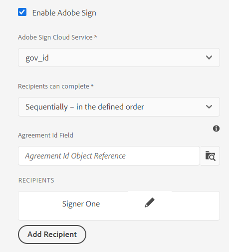

# [!DNL Adobe Sign] gebruiken in een adaptief formulier {#using-adobe-sign-in-an-adaptive-form}

>[!NOTE]
>
> De Adobe adviseert het gebruiken van de moderne en verlengbare gegevens vangt [ Componenten van de Kern ](https://experienceleague.adobe.com/docs/experience-manager-core-components/using/adaptive-forms/introduction.html?lang=nl-NL) voor [ het creëren van nieuwe Aangepaste Forms ](/help/forms/creating-adaptive-form-core-components.md) of [ het toevoegen van Aangepaste Forms aan de pagina&#39;s van AEM Sites ](/help/forms/create-or-add-an-adaptive-form-to-aem-sites-page.md). Deze componenten betekenen een aanzienlijke vooruitgang in de aanmaak van Adaptive Forms en zorgen voor indrukwekkende gebruikerservaring. In dit artikel wordt een oudere aanpak beschreven voor de auteur Adaptive Forms die gebruikmaakt van stichtingscomponenten.


| Versie | Artikelkoppeling |
| -------- | ---------------------------- |
| AEM 6,5 | [ klik hier ](https://experienceleague.adobe.com/docs/experience-manager-65/forms/adaptive-forms-advanced-authoring/working-with-adobe-sign.html?lang=nl-NL) |
| AEM as a Cloud Service | Dit artikel |


[!DNL Adobe Sign] maakt workflows voor e-handtekeningen mogelijk voor Adaptive Forms. E-handtekeningen verbeteren werkstromen om documenten voor wettig, verkoop, loonlijst, personeelsbeheer, en meer gebieden te verwerken.

In een standaard [!DNL Adobe Sign] - en Adaptief Forms-scenario vult een gebruiker een adaptief formulier om een aanvraag in te dienen voor een service waarvoor handtekeningen van een of meer partijen vereist zijn. Een hypotheek- en creditcardaanvraag vereist bijvoorbeeld wettelijke handtekeningen van alle kredietnemers en medekredietnemers. Als u workflows voor elektronische handtekeningen wilt inschakelen voor vergelijkbare scenario&#39;s, kunt u [!DNL Adobe Sign] integreren met een adaptief formulier. U kunt [!DNL Adobe Sign] nog enkele voorbeelden gebruiken om:

* Sluit overeenkomsten van om het even welk apparaat met volledig geautomatiseerde voorstel, citaat, en contractprocessen.
* Voltooi processen voor menselijke hulpbronnen sneller en geef uw werknemers de digitale ervaring.
* Verkort de duur van de contractcyclus en neem sneller aan boord van uw leveranciers.
* Maak digitale workflows die algemene processen automatiseren.

[!DNL Adobe Sign] integratie met [!DNL AEM Forms] ondersteunt:

* Workflows voor ondertekening van enkelvoudige en meervoudige gebruikers
* Workflows voor opeenvolgende en gelijktijdige ondertekening
* Formulieren ondertekenen als anonieme of aangemelde gebruiker
* Dynamische ondertekeningsprocessen (integratie met [!DNL AEM Forms] Workflow)
* Verificatie via een kennisbasis, telefoon, sociale profielen en de staatsidentiteitskaart
* Rollen toewijzen aan elke ontvanger van de overeenkomst. Adobe Sign voor zaken en ondernemingsde dienstniveaus hebben de optie om de [ rollen voor overeenkomstontvangers ](#addsignerstoanadaptiveform) uit te breiden.

<!-- * In-form and out-of-form signing experiences -->

## Vereisten {#prerequisites}

Voordat u [!DNL Adobe Sign] in een adaptieve vorm gebruikt:

* Zorg ervoor dat [!DNL AEM Forms] as a Cloud Service is geconfigureerd voor gebruik van Adobe Sign. Voor details, zie [ Adobe Sign met  [!DNL AEM Forms]](adobe-sign-integration-adaptive-forms.md) integreren.
* De lijst met ontvangers gereed houden. U hebt ten minste een e-mailadres voor elke ontvanger nodig.

## [!DNL Adobe Sign] configureren voor een adaptief formulier {#configure-adobe-sign-for-an-adaptive-form}

U configureert als volgt [!DNL Adobe Sign] voor een adaptief formulier:

1. [Laat  [!DNL Adobe Sign]  voor een AanpassingsVorm toe](#enableadobsignforanadaptiveform)
1. [Voeg  [!DNL Adobe Sign]  gebieden aan een AanpassingsVorm toe](#addadobesignfieldstoanadaptiveform)
1. [Selecteer  [!DNL Adobe Sign]  Cloud Service voor een Aangepast Vorm](#select-adobe-sign-cloud-service-and-signing-order)

1. [Voeg  [!DNL Adobe Sign]  ontvanger aan een AanpassingsVorm toe](#addsignerstoanadaptiveform)
1. [Selecteer Handeling verzenden voor een adaptief formulier](#selectsubmitactionforanadaptiveform)



### [!DNL Adobe Sign] inschakelen voor een adaptief formulier  {#enableadobesign}

U kunt [!DNL Adobe Sign] inschakelen voor een bestaand adaptief formulier of een [!DNL Adobe Sign] -compatibel adaptief formulier maken. Kies een van de volgende opties:

* [Creeer een  [!DNL Adobe Sign]  toegelaten Aangepaste Vorm](#create-an-adaptive-form-for-adobe-sign)
* [ laat  [!DNL Adobe Sign]  voor een bestaande Aangepaste Vorm ](#editafsign) toe.

#### Een adaptief formulier maken voor Adobe Sign {#create-an-adaptive-form-for-adobe-sign}

Een adaptief formulier maken dat geschikt is voor ondertekenen:

1. Navigeer naar **[!UICONTROL Adobe Experience Manager]** > **[!UICONTROL Forms]** > **[!UICONTROL Forms & Documents]** .
1. Selecteer **[!UICONTROL Create]** en selecteer **[!UICONTROL Adaptive Form]** . Er wordt een lijst met sjablonen weergegeven. Selecteer een sjabloon en selecteer **[!UICONTROL Next]** .
1. Op het tabblad **[!UICONTROL Basic]** :

   1. Geef de waarden **[!UICONTROL Name]** en **[!UICONTROL Title]** op voor het adaptieve formulier.

   1. Selecteer de [ gemaakte configuratiecontainer ](adobe-sign-integration-adaptive-forms.md#configure-adobe-sign-with-aem-forms) terwijl [ integreren  [!DNL Adobe Sign]  met  [!DNL AEM Forms]](adobe-sign-integration-adaptive-forms.md).

   De configuratiecontainer bevat de [!DNL Adobe Sign] Cloud Servicen die voor uw milieu worden gevormd. Deze services zijn beschikbaar voor selectie in de Adaptieve formuliereditor.

1. Selecteer op het tabblad **[!UICONTROL Form Model]** een van de volgende opties:

   * Als u een aangepaste formuliersjabloon hebt en een Document of Record vereist op basis van de formuliersjabloon, selecteert u de optie **[!UICONTROL Associate form template as the Document of Record template]** en selecteert u een Document of Record-sjabloon. Als u deze optie gebruikt, worden alleen de velden weergegeven die zijn gebaseerd op de bijbehorende formuliersjabloon die zijn verzonden voor ondertekening. Niet alle velden van het adaptieve formulier worden weergegeven.

   * Als u geen aangepaste formuliersjabloon hebt, selecteert u de optie **[!UICONTROL Generate Document of Record]** . Als u deze optie gebruikt, worden in het document dat voor ondertekening is verzonden alle velden van het adaptieve formulier weergegeven.

1. Selecteer **[!UICONTROL Create]**. Er wordt een adaptief formulier gemaakt dat geschikt is voor ondertekening. U kunt uw [!DNL Adobe Sign] -velden toevoegen aan het formulier en het verzenden voor ondertekening.

#### [!DNL Adobe Sign] inschakelen voor een adaptief formulier {#editafsign}

[!DNL Adobe Sign] gebruiken in een bestaand adaptief formulier:

1. Navigeer naar **[!UICONTROL Adobe Experience Manager]** > **[!UICONTROL Forms]** > **[!UICONTROL Forms & Documents]** .
1. Selecteer het adaptieve formulier en selecteer **[!UICONTROL Properties]** .
1. In het **[!UICONTROL Basic]** lusje, selecteer de [ gemaakte configuratiecontainer ](adobe-sign-integration-adaptive-forms.md#configure-adobe-sign-with-aem-forms) terwijl het integreren [!DNL Adobe Sign] met [!DNL AEM Forms].
1. Selecteer op het tabblad **[!UICONTROL Form Mode]** een van de volgende opties:

   * Als u een aangepaste formuliersjabloon hebt en een Document of Record vereist op basis van de formuliersjabloon, selecteert u de optie **[!UICONTROL Associate form template as the Document of Record template]** en selecteert u een Document of Record-sjabloon. Als u deze optie gebruikt, worden alleen de velden weergegeven die zijn gebaseerd op de bijbehorende formuliersjabloon die zijn verzonden voor ondertekening. Niet alle velden van het adaptieve formulier worden weergegeven.

   * Als u geen aangepaste formuliersjabloon hebt, selecteert u de optie **[!UICONTROL Generate Document of Record]** . Als u deze optie gebruikt, worden in het document dat voor ondertekening is verzonden alle velden van het adaptieve formulier weergegeven.

1. Selecteer **[!UICONTROL Save & Close]**. Het adaptieve formulier is ingeschakeld voor [!DNL Adobe Sign] . Nu kunt u uw [!DNL Adobe Sign] -velden toevoegen aan het formulier en het verzenden voor ondertekening.

### [!DNL Adobe Sign] velden toevoegen aan een adaptief formulier {#addadobesignfieldstoanadaptiveform}

[!DNL Adobe Sign] heeft verschillende velden die op een adaptief formulier kunnen worden geplaatst. Deze velden accepteren verschillende gegevenstypen, zoals handtekeningen, initialen, bedrijf of titel, en helpen bij het verzamelen van extra informatie tijdens het ondertekenen, samen met de handtekeningen. Met de component [!DNL Adobe Sign] Blok kunt u [!DNL Adobe Sign] -velden op verschillende locaties in een adaptief formulier plaatsen.

U voegt als volgt velden toe aan een adaptief formulier en past verschillende opties aan die betrekking hebben op deze velden:

1. Sleep de component **[!UICONTROL Adobe Sign Block]** van de componentbrowser naar het adaptieve formulier. De [!DNL Adobe Sign] Block-component heeft alle ondersteunde [!DNL Adobe Sign] -velden. Standaard wordt een **[!UICONTROL Signature]** -veld toegevoegd aan het adaptieve formulier.

   

   Standaard is het blok [!DNL Adobe Sign] niet zichtbaar in het gepubliceerde adaptieve formulier. Deze is alleen zichtbaar in de ondertekenende documenten. U kunt de zichtbaarheid van [!DNL Adobe Sign] Block wijzigen in de eigenschappen van de [!DNL Adobe Sign] Block-component.

   >[!NOTE]
   >
   >  * Het gebruik van [!DNL Adobe Sign] -blok is niet verplicht om [!DNL Adobe Sign] in een adaptief formulier te gebruiken. Als u [!DNL Adobe Sign] -blok niet gebruikt en geen velden toevoegt voor de ontvangers, wordt het standaardhandtekeningveld onder aan de ondertekenende documenten weergegeven.
   >  * Gebruik [!DNL Adobe Sign] alleen voor Adaptive Forms die automatisch Document of Record genereren. Als u een aangepaste XDP gebruikt voor het genereren van Document of een op een formuliersjabloon gebaseerd Adaptief formulier, wordt [!DNL Adobe Sign] -blok niet ondersteund.


1. Selecteer de **[!UICONTROL Adobe Sign Block]** component en selecteer **[!UICONTROL Edit]**  pictogram. Er worden opties weergegeven voor het toevoegen van velden en het opmaken van de weergave van een veld.

   

   **A.** selecteer en voeg [!DNL Adobe Sign] gebieden toe. **B.** breid het [!DNL Adobe Sign] blok aan volledige het schermmening uit

1. Selecteer het **[!UICONTROL Adobe Sign]** pictogram van het Gebied . Er worden opties weergegeven voor het selecteren en toevoegen van [!DNL Adobe Sign] -velden.

   Vouw het **[!UICONTROL Type]** drop-down gebied uit om een [!DNL Adobe Sign] gebied te selecteren en Gedaan  pictogram om het geselecteerde gebied aan [!DNL Adobe Sign] blok toe te voegen. Het vervolgkeuzeveld **[!UICONTROL Type]** bevat de typen Handtekening, Ontvangerinfo en Gegevensveld. [!DNL Adobe Sign] integratie met AEM [!DNL Forms] -ondersteuningsvelden die alleen in de vervolgkeuzelijst [!UICONTROL Type] worden weergegeven. Voor gedetailleerde informatie over [!DNL Adobe Sign] gebieden, zie [ documentatie van Adobe Sign ](https://helpx.adobe.com/nl/sign/help/field-types.html).

   

   U moet een unieke naam opgeven voor een veld. U kunt ook de vereiste optie selecteren om een verplicht veld te markeren. Naast de opties **[!UICONTROL Name]** en **[!UICONTROL Required]** , hebben sommige [!DNL Adobe Sign] velden meer opties. Bijvoorbeeld masker en meerdere regels. Geef bovendien een unieke naam voor elk [!DNL Adobe Sign] -veld op, ongeacht of de velden zich in dezelfde of in andere [!DNL Adobe Sign] -blokken bevinden.

   Als u **[!UICONTROL Digital Signature]** selecteert in de vervolgkeuzelijst, kunt u digitale handtekeningen toepassen op het adaptieve formulier:

   * Online gebruikend wolkenhandtekeningen om met a [ digitale identiteitskaart ](https://helpx.adobe.com/nl/sign/kb/digital-certificate-providers.html) te ondertekenen die door een vertrouwde dienstverlener wordt ontvangen.
   * Lokaal door het document te downloaden met Adobe Acrobat of Reader met een smartcard, USB-token of een op een bestand gebaseerde digitale id.

### [!DNL Adobe Sign] inschakelen voor een adaptief formulier {#enableadobsignforanadaptiveform}

Uit het vak is [!DNL Adobe Sign] niet ingeschakeld voor een adaptief formulier. U schakelt dit als volgt in:

1. In browser van de Inhoud, selecteer **[!UICONTROL Form Container]**, en selecteer **[!UICONTROL Configure]**  pictogram. De eigenschappenbrowser wordt geopend en de eigenschappen van de container Adaptief formulier worden weergegeven.
1. Vouw in de eigenschappenbrowser de accordeon **[!UICONTROL Electronic Signature]** uit en selecteer de optie **[!UICONTROL Enable Adobe Sign]** . Het schakelt [!DNL Adobe Sign] in voor een adaptief formulier.

### Cloud Service en handtekeningvolgorde selecteren [!DNL Adobe Sign] {#select-adobe-sign-cloud-service-and-signing-order}

U kunt meerdere [!DNL Adobe Sign] -services configureren voor een instantie van AEM [!DNL Forms] . Het is raadzaam voor elke functie een aparte reeks diensten te hebben (Human Resource, Finance, enzovoort). Hierdoor kunt u ondertekende documenten gemakkelijker bijhouden en rapporteren. Een bank heeft bijvoorbeeld meerdere afdelingen. U kunt een afzonderlijke configuratie voor elke afdeling hebben voor het beter volgen van de documenten.

Een document kan ook meerdere ontvangers hebben. Een creditcardtoepassing kan bijvoorbeeld meerdere aanvragers hebben. Een bank vereist handtekeningen van alle aanvragers voordat de aanvraag wordt verwerkt. Bij scenario&#39;s met meerdere ontvangers kunt u ervoor kiezen het document in volgorde van opeenvolgende of gelijktijdige bewerkingen te ondertekenen.

Een Cloud Service en volgorde voor ondertekening selecteren:


1. In browser van de Inhoud, selecteer **[!UICONTROL Form Container]**, en selecteer **[!UICONTROL Configure]**  pictogram. De eigenschappenbrowser wordt geopend en de eigenschappen van de container Adaptief formulier worden weergegeven.
1. Vouw in de eigenschappenbrowser de accordeon **[!UICONTROL Electronic Signature]** uit en selecteer de optie **[!UICONTROL Enable Adobe Sign]** . Het schakelt [!DNL Adobe Sign] in voor een adaptief formulier.
1. Selecteer een Cloud Service in de lijst met [!DNL Adobe Sign] Clouden Services die al is geconfigureerd.

   Als de **[!UICONTROL Adobe Sign Cloud Service]** lijst leeg is, volg [  [!DNL Adobe Sign]  met  [!DNL AEM Forms]](adobe-sign-integration-adaptive-forms.md) artikel vormen om de dienst te vormen.

   De vervolgkeuzelijst bevat de Cloud Servicen die in de map `global` staan in Opties > **[!UICONTROL Cloud Services]** > **[!UICONTROL Adobe Sign]** . Bovendien worden in de vervolgkeuzelijst ook de Cloud Servicen weergegeven die aanwezig zijn in de map die u in het veld **[!UICONTROL Configuration Container]** selecteert wanneer u een adaptief formulier maakt.

1. Selecteer de optie om de verzendactie te configureren met **[!UICONTROL Submit the form]** . U kunt een van de volgende twee opties selecteren:
   * **leg de vorm voor (en verzend de overeenkomst voor het ondertekenen)**: Deze optie verzendt de vorm onmiddellijk en verzendt dan de vorm voor ondertekening naar de ontvangers.
   * **legt de vorm voor (nadat elke ontvanger de ondertekeningsceremonie voltooit)**: Deze optie verzendt Adaptieve Forms slechts nadat alle ondertekenaars het ondertekeningsproces voltooien. U kunt het interval vormen om de het ondertekenen status voor alle ondertekenaars te controleren. Voor details, zie [  [!DNL Adobe Acrobat Sign]  planner ](/help/forms/adobe-sign-integration-adaptive-forms.md#configure-dnl-adobe-acrobat-sign-scheduler-to-sync-the-signing-status) vormen.

1. Selecteer de handtekeningvolgorde in het dialoogvenster **[!UICONTROL Recipients can complete]** . De ontvangers kunnen een adaptief formulier **[!UICONTROL Sequentially]** - een na een andere ontvanger of **[!UICONTROL Simultaneously]** - in willekeurige volgorde ondertekenen.

   Op volgorde ontvangt één ontvanger de Adobe Sign-overeenkomst tegelijk. Nadat de ontvanger de toegewezen actie voltooit, wordt de overeenkomst verzonden naar de volgende ontvanger, etc.

   Tegelijkertijd ontvangen alle ontvangers de Adobe Sign-overeenkomst en kunnen zij parallel met elkaar handelen.

1. Gebruik het veld Overeenkomst-id om een bindref aan overeenkomst-id (agreementId) te koppelen. Het voegt Overeenkomst ID aan de sectie afBoundData van voorlegt gegevens voor op schema-gebaseerde vormen toe. De overeenkomst-id wordt ook toegevoegd aan het gedeelte afSubmissionInfo in de verzonden gegevens voor alle formulieren die geschikt zijn voor Adobe Sign. U kunt de overeenkomst-id gebruiken voor het bijhouden van de status van de overeenkomst met behulp van aangepaste code (aangepaste implementatie is vereist).

   >[!NOTE]
   >
   > Als een adaptief formulier wordt gemaakt met een formuliergegevensmodel (FDM), wordt het veld Overeenkomst-id weergegeven in het dialoogvenster.

1. [ voegt ontvangers aan een Aangepaste Vorm ](working-with-adobe-sign.md#addsignerstoanadaptiveform) toe en selecteert Gedaan  pictogram om de veranderingen te bewaren.

### Ontvangers toevoegen aan een adaptief formulier {#addsignerstoanadaptiveform}

U kunt een of meerdere ontvangers voor een Adobe Sign-overeenkomst hebben. Wanneer u een ontvanger toevoegt, kunt u ook verificatiedetails voor de ontvanger configureren en bepalen of de invuller en de ontvanger van het formulier dezelfde persoon zijn. Voer de volgende stappen uit om diverse details over een ontvanger toe te voegen en te verstrekken:

1. In browser van de Inhoud, selecteer **[!UICONTROL Form Container]**, en selecteer **[!UICONTROL Configure]**  pictogram. De eigenschappenbrowser wordt geopend met de eigenschappen van de container Adaptief formulier.
1. Vouw in de eigenschappenbrowser de accordeon **[!UICONTROL Electronic Signature]** uit en selecteer de optie **[!UICONTROL Enable Adobe Sign]** . Het schakelt [!DNL Adobe Sign] in voor een adaptief formulier.
1. Selecteer **[!UICONTROL Add Recipient]**. Hiermee voegt u een ontvanger toe aan het adaptieve formulier. U kunt meerdere ontvangers toevoegen aan een adaptief formulier. Alle ontvangers ontvangen een Adobe Sign-overeenkomst over de indiening van het adaptieve formulier.
   

1. Klik **[!UICONTROL Edit]**  pictogram om de volgende informatie over de ontvanger te specificeren:

   * **[!UICONTROL Title]:** specificeer een titel om een ontvanger uniek te identificeren.

   * **[!UICONTROL Is the recipient and the person filling the form same?]:** Selecteer **[!UICONTROL Yes]** als de invuller van het formulier en de eerste ontvanger dezelfde persoon zijn. <!-- If the option is set to **No,** then do not use the signature step component in the Adaptive Form. If the form contains a Signature Step component, then the field is automatically set to Yes. -->

   * **[!UICONTROL Recipient Role]:** selecteer de rol van een ontvanger. Adobe Sign voor zaken en ondernemingsde dienstniveaus hebben de optie om de [ rollen voor overeenkomstontvangers ](https://helpx.adobe.com/nl/sign/using/set-up-signer-approver-roles.html), voorbij enkel de **Ondertekenaar** uit te breiden, om hun werkschemavereisten beter aan te passen.

   * **[!UICONTROL Recipient Email Address]:** Geef het e-mailadres van de ontvanger op. De ontvanger ontvangt de Adobe Sign-overeenkomst over het opgegeven e-mailadres. U kunt ervoor kiezen een e-mailadres te gebruiken dat wordt opgegeven in een formulierveld, in het gebruikersprofiel voor Experience Managers van de aangemelde gebruiker of handmatig een e-mailadres in te voeren. Het is een verplichte stap.

     >[!NOTE]
     >
     >Zorg ervoor dat het e-mailadres van de eerste ontvanger of de enige ontvanger (als er één ontvanger is) niet gelijk is aan [!DNL Adobe Sign] -account dat wordt gebruikt om AEM Cloud Servicen te configureren.

   * **[!UICONTROL Recipient Authentication Method]:** geef de methode op om een ontvanger te verifiëren voordat u de Adobe Sign-overeenkomst opent. U kunt tussen telefoon, kennisbasis, sociale op identiteit-gebaseerde authentificatie, en [ identiteitskaart van de Regering ](https://helpx.adobe.com/nl/sign/using/adobesign-authentication-government-id.html) voor [!DNL Adobe Acrobat Sign] kiezen. Voor [!DNL Adobe Acrobat Sign for Government] kunt u kiezen tussen verificatie via telefoon en verificatie op basis van kennis.

   >[!NOTE]
   >
   >    * Standaard biedt verificatie op basis van sociale identiteit een optie voor verificatie met behulp van Facebook, Google en LinkedIn. U kunt contact opnemen met de ondersteuning van [!DNL Adobe Sign] om andere providers van sociale verificatie in te schakelen.
   >

   * **[!DNL Adobe Sign]velden die moeten worden ingevuld of ondertekend:** Selecteer [!DNL Adobe Sign] velden voor de ontvanger. Een adaptief formulier kan meerdere [!DNL Adobe Sign] velden hebben. U kunt specifieke velden inschakelen voor een ontvanger. In het veld worden alle beschikbare [!DNL Adobe Sign] blokken weergegeven. Wanneer u een blok selecteert, worden alle velden van het blok geselecteerd. U kunt het X-pictogram gebruiken om een veld te deselecteren.

   

   De bovenstaande afbeelding heeft twee voorbeelden [!DNL Adobe Sign] Blokken: Persoonlijke informatie en Office-details

   Selecteer  pictogram. De ontvanger wordt toegevoegd.

### Selecteer Handeling verzenden voor een adaptief formulier {#selectsubmitactionforanadaptiveform}

Nadat u [!DNL Adobe Sign] -velden hebt toegevoegd aan een adaptief formulier, [!DNL Adobe Sign] hebt ingeschakeld vanuit een formuliercontainer, [!DNL Adobe Sign] Cloud Service hebt geselecteerd en Adobe Sign-ontvangers hebt toegevoegd, selecteert u een geschikte verzendactie voor het adaptieve formulier. Voor gedetailleerde informatie over AanpassingsForms legt Acties voor, zie [ Vormend de Submit Actie ](configuring-submit-actions.md).

Het ondertekenen en verzenden van een formulier is onafhankelijk van elkaar. Het verzenden van een adaptief formulier vindt plaats zodra een Adobe Sign-overeenkomst is gemaakt nadat een gebruiker een formulier heeft verzonden. [!DNL AEM Forms] De as a Cloud Service wacht niet tot de ontvangers andere acties ondertekenen of voltooien om een adaptief formulier te verzenden. Een formulier wordt verzonden zodra een gebruiker op de knop Verzenden klikt of wanneer een stap Overzicht de samenvatting van het formulier weergeeft.

Bovendien sluit een [!DNL Adobe Sign] -compatibel adaptief formulier de Adobe Sign-overeenkomst-id in voor het verzenden van gegevens. U kunt de overeenkomst-id gebruiken voor het bijhouden van de status van de overeenkomst met behulp van aangepaste code (aangepaste implementatie is vereist).

Adobe Sign Agreement ID (agreementId) is opgenomen in de verzendgegevens van het adaptieve formulier. Standaard is de overeenkomst-id aanwezig in het knooppunt `afSubmissionInfo` van de verzonden gegevens.

```xml
   <?xml version="1.0" encoding="UTF-8"?>
   <afData>
      <afUnboundData>
         <data>
            <textbox1613455050902>ff</textbox1613455050902>
         </data>
      </afUnboundData>
      <afBoundData>
         <data xmlns:xfa="http://www.xfa.org/schema/xfa-data/1.0/" />
      </afBoundData>
      <afSubmissionInfo>
         <lastFocusItem>guide[0].guide1[0].guideRootPanel[0].textbox1613455050902[0]</lastFocusItem>
         <stateOverrides />
         <signers>
            <signer0>
               <email />
            </signer0>
         </signers>
         <afPath>/content/dam/formsanddocuments/testsign</afPath>
         <afSubmissionTime>20210311031009</afSubmissionTime>
         <agreementId>xxxxxxxxxxxxxxxxxxxxxxxxxxxxxxxxxxxxxxxxxxxxx</agreementId>
      </afSubmissionInfo>
   </afData>
```

U kunt desgewenst ook een bindref aan overeenkomst-id (agreementId) koppelen. Er wordt een Overeenkomst-id toegevoegd aan de sectie afBoundData van de verzonden gegevens. In de volgende verzonden gegevens is de Overeenkomst-id bijvoorbeeld gebonden aan het knooppunt `<userName>` :

```xml
      <?xml version="1.0" encoding="UTF-8"?>
      <afData>
         <afUnboundData>
            <data />
         </afUnboundData>
         <afBoundData>
            <config xmlns:xfa="http://www.xfa.org/schema/xfa-data/1.0/" xmlns:xsi="http://www.w3.org/2001/XMLSchema-instance">
               <userName>3AAABLblqZhC2MWu7GFauKh45j_t2ih8mAtmbdIcNSl1HgQubhMJfDaDfylyN7NQiYRam_44ISKm45enIOafHqWZrdaxShf9r</userName>
               <dateOfBirth>0001-01-01</dateOfBirth>
            </config>
         </afBoundData>
         <afSubmissionInfo>
            <lastFocusItem>guide[0].guide1[0].guideRootPanel[0].projectDetails[0]</lastFocusItem>
            <stateOverrides />
            <signers>
               <signer0>
                  <email />
               </signer0>
            </signers>
            <afPath>/content/dam/formsanddocuments/testathon2021-1/gaurav/xsd-based</afPath>
            <afSubmissionTime>20210311095211</afSubmissionTime>
            <agreementId>xxxxxxxxxxxxxxxxxxxxxxxxxxxxxxxxxxxxxxxxxxxx</agreementId>
         </afSubmissionInfo>
      </afData>
```

<!-- Remove when forms portal goes live
>[!NOTE]
>
>Data of the Adaptive Form is stored temporarily on Forms Portal. Adobe recommends using [custom storage for Forms Portal](/help/forms/using/configuring-draft-submission-storage.md). It ensures that the PII (personally identifiable information) data is not stored on AEM servers. 
-->

Uw ervaring voor het ondertekenen van formulieren is gereed. U kunt een voorbeeld van het formulier bekijken om de ondertekeningservaring te verifiëren. In het gepubliceerde formulier worden [!DNL Adobe Sign] blokvelden weergegeven wanneer een ontvanger het formulier ontvangt voor ondertekening via een e-mail. Wanneer de optie **[!UICONTROL When Is the recipient and the person filling the form same?]** is gemarkeerd als ja en aan de voorwaarde is voldaan, wordt de gebruiker na verzending omgeleid naar de Adobe Sign-overeenkomst en kan de gebruiker het document direct ondertekenen in plaats van te wachten tot de overeenkomst per e-mail wordt weergegeven.

## Cloud-handtekeningen configureren voor een adaptief formulier {#configure-cloud-signatures-for-an-adaptive-form}

Digitale handtekeningen op basis van cloud of externe handtekeningen zijn een nieuwe generatie digitale handtekeningen die op verschillende computers, mobiele apparaten en het web werken en voldoen aan de hoogste standaarden en waarborgen voor verificatie van ontvangers. U kunt een adaptief formulier ondertekenen met digitale handtekeningen op basis van de cloud.

Na [ het uitgeven de Adaptieve eigenschappen van de Vorm voor Adobe Sign ](working-with-adobe-sign.md#enableadobesign), voer de volgende stappen uit om het gebied van de wolkenhandtekening aan een Aangepaste Vorm toe te voegen:

1. Sleep de component **[!UICONTROL Adobe Sign Block]** van de componentbrowser naar het adaptieve formulier. De component [!UICONTROL Adobe Sign Block] heeft alle ondersteunde [!DNL Adobe Sign] -velden. Standaard wordt een **[!UICONTROL Signature]** -veld toegevoegd aan het adaptieve formulier.

   

1. Selecteer de **[!UICONTROL Adobe Sign Block]** component en selecteer **[!UICONTROL Edit]**  pictogram. Er worden opties weergegeven voor het toevoegen van velden en het opmaken van de weergave van een veld.

   

   **A.** selecteer en voeg [!DNL Adobe Sign] gebieden toe. **B.** breid het [!DNL Adobe Sign] blok aan volledige het schermmening uit

1. Selecteer het **[!UICONTROL Adobe Sign Field]**  pictogram. Er worden opties weergegeven voor het selecteren en toevoegen van [!DNL Adobe Sign] -velden.

   Vouw het vervolgkeuzeveld **[!UICONTROL Type]** uit om **[!UICONTROL Digital Signature]** te selecteren en selecteer het pictogram **[!UICONTROL Done]** om het geselecteerde veld toe te voegen aan het [!DNL Adobe Sign] -blok.

   

   U moet een unieke naam opgeven voor een veld.

   Digitale handtekeningen toepassen op het adaptieve formulier met:

   * De handtekeningen van de wolk: Teken met a [ digitale identiteitskaart ](https://helpx.adobe.com/nl/sign/kb/digital-certificate-providers.html) die door een vertrouwde dienstverlener wordt ontvangen.
   * Adobe Acrobat of Reader: Download en open het document met Adobe Acrobat of Reader om het te ondertekenen met een smartcard, USB-token of digitale id op basis van een bestand.

     >[!NOTE]
     >
     > Digitale handtekening is ook van toepassing op [!DNL Adobe Acrobat Sign for Government] , maar u kunt deze niet toepassen met gebruik van Cloud-handtekeningen.

   Nadat u het handtekeningveld voor de cloud aan het adaptieve formulier hebt toegevoegd, voert u de volgende stappen uit om het configuratieproces te voltooien:

   * [Adobe Sign inschakelen voor een adaptief formulier](#enableadobsignforanadaptiveform)
   * [Adobe Sign Cloud Service selecteren voor een adaptief formulier](#selectadobesigncloudserviceforanadaptiveform)
   * [Ontvangers toevoegen aan een adaptief formulier](#addsignerstoanadaptiveform)
   * [Selecteer Handeling verzenden voor een adaptief formulier](#selectsubmitactionforanadaptiveform)

### De component voor de prullenbak of overzichtsstap configureren {#configure-the-thank-you-page-or-summary-step-component}

De component **[!UICONTROL Summary Step]** verzendt automatisch het formulier, vult de informatie in de aangepaste overzichtspagina in en geeft de samenvatting van het verzonden formulier weer. De component SummaryStep gebruikt de volledige breedte die beschikbaar is voor het formulier. Men adviseert om geen andere component op de sectie te hebben die de Summiere component van de Stap bevat.

## Veelgestelde vragen {#frequently-asked-questions}

**Q:** u kunt een AanpassingsVorm in een andere AanpassingsVorm inbedden. Kan het ingesloten adaptieve formulier worden [!DNL Adobe Sign] ingeschakeld?
**Ans:** Nr, steunt Experience Manager Forms niet het gebruiken van een Aangepast Vorm dat een [!DNL Adobe Sign] toegelaten Aangepast Vorm voor het ondertekenen inbedt

**Q:** wanneer ik een AanpassingsVorm gebruikend het geavanceerde malplaatje creeer en het voor het uitgeven open, wordt een foutenmelding &quot;Elektronische Handtekening of de ontvangers niet correct gevormd.&quot; wordt weergegeven. Hoe kan ik het foutbericht oplossen?
**Ans:** het Aangepaste die Vorm wordt gecreeerd gebruikend het geavanceerde malplaatje wordt gevormd om [!DNL Adobe Sign] te gebruiken. Als u de fout wilt verhelpen, maakt en selecteert u een [!DNL Adobe Sign] -cloudconfiguratie en configureert u een [!DNL Adobe Sign] -ontvanger voor het adaptieve formulier.

**Q:** Kan ik [!DNL Adobe Sign] tekstmarkeringen in een statische tekstcomponent van een Aangepast Vorm gebruiken?
**Ans:** ja, kunt u tekstmarkeringen in een tekstcomponent gebruiken om [!DNL Adobe Sign] gebieden aan een Document van Verslag toe te voegen (Auto-generated Document van de optie van het Verslag slechts) toegelaten Aangepaste Vorm. Om over de procedure en de regels te leren om een tekstmarkering tot stand te brengen, zie [ Documentatie van Adobe Sign ](https://helpx.adobe.com/nl/sign/using/text-tag.html). Let ook op: Adaptive Forms biedt beperkte ondersteuning voor tekstcodes. U kunt de tekstmarkeringen gebruiken om slechts die gebieden tot stand te brengen die [ het Blok van Adobe Sign ](working-with-adobe-sign.md#configure-cloud-signatures-for-an-adaptive-form) steunt.

## Problemen oplossen {#troubleshoot}

### [!DNL Adobe Sign] mislukte overeenkomsten {#adobe-sign-agreement-failures}

**Uitgave**
Wanneer de service [!DNL Adobe Sign] is geconfigureerd voor een adaptief formulier, kan de service geen [!DNL Adobe Sign] -overeenkomst maken voor het onderliggende adaptieve formulier.

**Resolutie**

* Controleer de [ configuratie van Adobe Sign Cloud Service ](adobe-sign-integration-adaptive-forms.md) die in de Aangepaste Vorm wordt gebruikt.
* Controleer of de API-toepassing op de [!DNL Adobe Sign] -server die wordt gebruikt om de [!DNL Adobe Sign] -Cloud Service te configureren, de vereiste machtigingen heeft.
* Als u meerdere [!DNL Adobe Sign] Cloud Servicen gebruikt, wijst u de **[!UICONTROL oAuth URL]** van alle services naar hetzelfde **[!UICONTROL Adobe Sign Shard]** .

* Gebruik afzonderlijke e-mailadressen om [!DNL Adobe Sign] -account en voor de eerste of enige ontvanger te configureren. Het e-mailadres van de eerste ontvanger of de enige ontvanger (als er één ontvanger is) kan niet gelijk zijn aan de account van [!DNL Adobe Sign] die wordt gebruikt om AEM Cloud Servicen te configureren.

>[!MORELIKETHIS]
>
>* [ integreer  [!DNL Adobe Sign]  met  [!DNL AEM Forms]](adobe-sign-integration-adaptive-forms.md)
>* [ Beste praktijken voor het gebruiken van  [!DNL Adobe Sign]  met Aanpassings Forms ](https://medium.com/adobetech/using-adobe-sign-to-e-sign-an-adaptive-form-heres-the-best-way-to-do-it-dc3e15f9b684)


## Zie ook {#see-also}

{{see-also}}