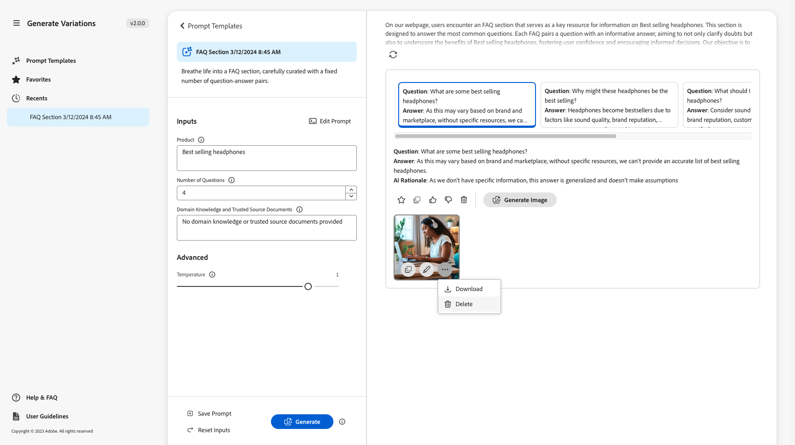
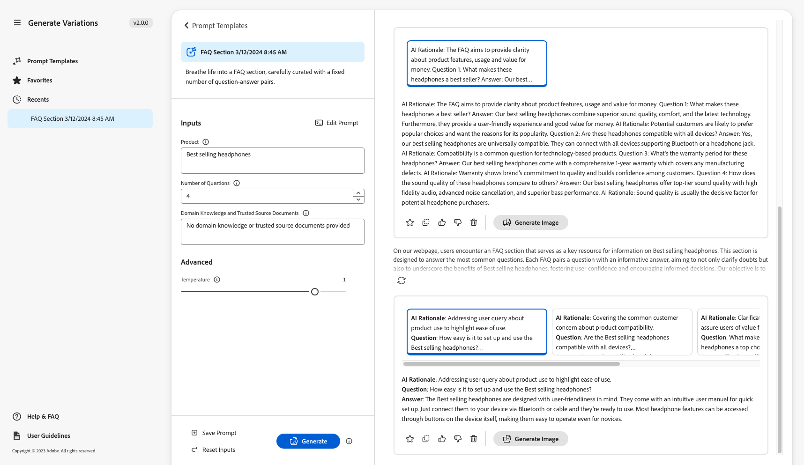
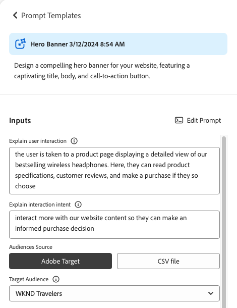

# Variaties genereren {#generate-variations}

Als u op zoek bent naar een manier om uw digitale kanalen te optimaliseren en het maken van inhoud te versnellen, kunt u Variaties genereren gebruiken. Produceer Variaties het gebruik generatieve Intelligentie van de Kunst (AI) om inhoudvariaties tot stand te brengen die op herinneringen worden gebaseerd; deze herinneringen worden of verstrekt door Adobe of gecreeerd, en geleid, door gebruikers. Na het creëren van variaties, kunt u de inhoud op uw website gebruiken, en ook hun succes meten gebruikend de [ 1} functionaliteit van de Experimentatie {van [ Edge Delivery Services ](/help/edge/overview.md).](https://www.aem.live/docs/experimentation)

U kunt [ toegang tot produceren Variaties ](#access-generate-variations) van:

* [binnen Adobe Experience Manager (AEM) as a Cloud Service](#access-aemaacs)
* [de Sidekick van AEM Edge Delivery Services](#access-aem-sidekick)
* [in de Inhoudsfragmenteditor](/help/sites-cloud/administering/content-fragments/authoring.md#generate-variations-ai)

>[!NOTE]
>
>In alle gevallen, om te gebruiken produceert Variaties u moet ervoor zorgen dat de [ toegangseerste vereisten ](#access-prerequisites) worden vervuld.

U kunt dan:

* [ krijg begonnen ](#get-started) gebruikend een snel malplaatje dat de Adobe voor een specifiek gebruiksgeval heeft gecreeerd.
* U kunt [ een bestaande herinnering ](#edit-the-prompt) uitgeven
* Of [ creeer en gebruik uw eigen herinneringen ](#create-prompt):
   * [ sparen uw herinneringen ](#save-prompt) voor toekomstig gebruik
   * [ Toegang en gebruik gedeelde herinneringen ](#select-prompt) van over uw organisatie
* Bepaal de [ publiek ](#audiences) segmenten om in de herinnering te gebruiken wanneer [ het produceren gepersonaliseerde publiek-specifieke inhoud ](#generate-copy).
* Geef een voorvertoning van de uitvoer weer naast de prompt, voordat u wijzigingen aanbrengt en verfijnen, indien nodig.
* Gebruik [ Adobe Express om beelden ](#generate-image) te produceren die op de exemplaarvariaties worden gebaseerd; dit gebruikt de Generatieve mogelijkheden AI van Firefly.
* Selecteer de inhoud die u op uw website of in een experiment wilt gebruiken.

## Opmerking bij wet en gebruik {#legal-usage-note}

Generatieve AI en produceer Variaties voor AEM zijn krachtige hulpmiddelen - maar **u** bent verantwoordelijk voor gebruik van de output.

Uw invoer voor de service moet aan een context zijn gekoppeld. Deze context kan uw brandingmaterialen, website inhoud, gegevens, schema&#39;s voor dergelijke gegevens, malplaatjes, of andere vertrouwde op documenten zijn.

U moet de nauwkeurigheid van om het even welke output zoals aangewezen voor uw gebruiksgeval evalueren.

Alvorens te gebruiken produceer Variaties u moet met de [ Generatieve AI Richtlijnen van de Gebruiker van de Adobe instemmen ](https://www.adobe.com/legal/licenses-terms/adobe-dx-gen-ai-user-guidelines.html).

[ Gebruik van produceerde Variaties ](#generative-action-usage) is gebonden aan de consumptie van generatieve acties.

## Overzicht {#overview}

Als u Variaties genereren opent (en het linkerdeelvenster uitvouwt), ziet u:


* Rechterdeelvenster
   * Dit is afhankelijk van de selectie die u maakt in de linkernavigatie.
   * Door gebrek, **worden de Malplaatjes van de Vragen** getoond.
* Linkernavigatie
   * Links van **produceer Variaties**, is er de optie (broodjesmenu) om, het linkernavigatievenster uit te breiden of te verbergen.
   * **Snelle Malplaatjes**:
      * Toont verbindingen aan de diverse Herinneringen; deze kunnen herinneringen omvatten:
         * Wordt geleverd door een Adobe die u helpt inhoud te genereren. Wordt gemarkeerd met het pictogram Adobe.
         * Gemaakt door uzelf.
         * Gemaakt binnen uw IMS-organisatie; gemarkeerd met een pictogram met meerdere koppen.
      * Omvat de [ Nieuwe herinnering ](#create-prompt) verbinding voor het creëren van uw eigen herinnering.
      * U kunt **herinneringen schrappen** die door zich, of binnen uw organisatie IMS worden gecreeerd. Dit wordt gedaan gebruikend het menu dat met de ellips op de aangewezen kaart wordt betreden.
   * [ Favorieten ](#favorites): Toont resultaten van vorige generaties die u als Favorieten hebt gemarkeerd.
   * [ Recenten ](#recents): Verzekert verbindingen met herinneringen, en hun input, die u onlangs hebt gebruikt.
   * **Hulp &amp; FAQ**: Verbindingen aan documentatie, met inbegrip van FAQs.
   * **Richtlijnen van de Gebruiker**: Verbindingen met de wettelijke richtlijnen.

## Aan de slag {#get-started}

De interface begeleidt u door het proces om inhoud te produceren. Na het openen van de interface, is de eerste stap de herinnering te selecteren u wilt gebruiken.

### Vragen selecteren {#select-prompt}

In het hoofdvenster kunt u het volgende selecteren:

* een door de Adobe aangeleverde promptsjabloon om te beginnen met het genereren van inhoud;
* de [ Nieuwe herinnering ](#create-prompt) om uw eigen herinnering tot stand te brengen,
* een sjabloon die u alleen voor uw gebruik hebt gemaakt,
* een sjabloon die u of iemand in uw organisatie heeft gemaakt.

U kunt als volgt onderscheiden:

* De door de Adobe opgegeven vragen worden gemarkeerd met het pictogram Adobe
* De herinneringen beschikbaar door uw organisatie IMS worden gemarkeerd met een veelvoudige hoofdpictogram.
* Uw persoonlijke herinneringen worden niet specifiek gemarkeerd.


### Invoer opgeven {#provide-inputs}

Elke vraag moet u bepaalde informatie verstrekken zodat het aangewezen inhoud van generatieve AI kan terugkrijgen.

In de invoervelden wordt uitgelegd welke informatie nodig is. Om u te helpen, hebben bepaalde velden standaardwaarden die u kunt gebruiken, of indien nodig kunt wijzigen, en beschrijvingen die de vereisten verklaren.

Er zijn verschillende belangrijke invoervelden die worden gebruikt bij meerdere vragen (bepaalde velden zijn niet altijd beschikbaar):

* **Telling van**/**Aantal van**
   * U kunt selecteren hoeveel inhoudvariaties u in één generatie wilt worden gecreeerd.
   * Afhankelijk van de vraag, zou dit één van diverse etiketten kunnen hebben; bijvoorbeeld Telling, Aantal Variaties, Aantal Ideeën, en anderen.
* **/** het Doelpubliek van Source van het 0} publiek ****
   * Hiermee kunt u persoonlijke inhoud genereren voor een bepaald publiek.
   * Adobe verstrekt standaardpubliek; of u kunt extra publiek specificeren; zie [ Soorten van publiek ](#audiences).
* **Extra Context**
   * Voeg relevante inhoud in om Generative AI-vaartuigen een betere respons te bieden op basis van de invoer. Als u bijvoorbeeld een webbanner maakt voor een bepaalde pagina of een bepaald product, wilt u mogelijk informatie over de pagina of het product opnemen.
* **Temperatuur**
Gebruik om de temperatuur van generatieve AI van de Adobe te wijzigen:
   * Een hogere temperatuur leidt van de herinnering en tot meer variatie, willekeur, en creativiteit.
   * Een lagere temperatuur is deterministischer en blijft dichter bij wat in de herinnering is.
   * De temperatuur wordt standaard ingesteld op 1. U kunt experimenteren met verschillende temperaturen als de gegenereerde resultaten u niet aanspreken.
* **geef Herinnering** uit
   * De onderliggende [ herinnering kan ](#edit-the-prompt) worden uitgegeven om de geproduceerde resultaten te raffineren.

### Kopie genereren {#generate-copy}

Nadat u de invoervelden hebt ingevuld en/of de vraag hebt gewijzigd, kunt u inhoud genereren en de reacties bekijken.

Selecteer **produceer** om reacties te zien die door generatieve AI worden geproduceerd. De gegenereerde inhoudsvariaties worden weergegeven onder de vraag die ze heeft gegenereerd.


>[!NOTE]
>
>De meeste vlotte malplaatjes van de Adobe omvatten een **AI Rationale** in de variatiereactie. Dit zorgt voor transparantie ten aanzien van de reden waarom generatieve AI die specifieke variatie heeft gegenereerd.

Wanneer u één variatie selecteert, zijn de volgende acties beschikbaar:

* **Favoriet**
   * De vlag als a **Favoriet** voor toekomstig gebruik (zal in [ Favorieten ](#favorites) tonen).
* Duimbs omhoog/omlaag
   * Gebruik de duim omhoog/omlaag indicatoren om Adobe van de kwaliteit van reacties op de hoogte te brengen.
* **Exemplaar**
   * Kopieer aan het klembord voor gebruik wanneer het ontwerpen van inhoud op uw website, of in een [ Experiment ](https://www.aem.live/docs/experimentation).
* **verwijder**

Als u de input of de herinnering moet verfijnen, kunt u aanpassingen maken en **selecteren produceert** opnieuw om een reeks nieuwe reacties te krijgen. De nieuwe vraag en de reactie worden getoond onder de aanvankelijke herinnering en de reactie; u kunt omhoog en neer scrollen om de diverse reeksen inhoud te bekijken.

Boven elke reeks variaties is de herinnering die hen, samen met a **creeerde hergebruik** optie. Als u ooit een herinnering met zijn input moet opnieuw in werking stellen, uitgezocht **hergebruik** om hen in **Inputs** opnieuw te laden.

### Afbeelding genereren {#generate-image}

Nadat u tekstvariaties hebt gegenereerd, kunt u afbeeldingen in Adobe Express genereren met de algemene AI-mogelijkheden van Firefly.

>[!NOTE]
>
>**produceer Beeld** is slechts beschikbaar als u een betiteling van de Adobe Express als deel van uw organisatie IMS, en toegang hebt die aan u in de Admin Console wordt verleend.

Selecteer een variatie, die door **wordt gevolgd produceert Beeld**, **Tekst aan Beeld** in [ Adobe Express ](https://www.adobe.com/express/) direct te openen. De vraag wordt vooraf ingevuld gebaseerd op uw variantselectie, en de beelden worden automatisch geproduceerd volgens die herinnering.

 uit

U kunt verdere wijzigingen aanbrengen:

* [ schrijft uw eigen herinnering in Adobe Express ](https://helpx.adobe.com/firefly/using/tips-and-tricks.html) door te beschrijven wat u zou willen zien,
* Pas de **Tekst aan beeld** opties aan,
* dan **verfrist zich** de geproduceerde beelden.

U kunt **ook gebruiken ontdekken meer** voor verdere mogelijkheden.

Wanneer volledig, selecteer het gewenste beeld en **sparen** om Adobe Express te sluiten. De afbeelding wordt geretourneerd en met de variatie opgeslagen.



Hier kunt u de muis boven de afbeelding houden om actiepunten weer te geven voor:

* **Exemplaar**: [ kopieer het beeld aan het klembord voor gebruik elders ](#use-content)
* **geeft** uit: open Adobe Express zodat u veranderingen in het beeld kunt aanbrengen
* **Download**: download het beeld aan uw lokale machine
* **Schrapping**: verwijder het beeld uit de variatie

>[!NOTE]
>
>[ Content credentials ](https://helpx.adobe.com/creative-cloud/help/content-credentials.html) worden niet voortgeduurd wanneer gebruikt in op document-gebaseerd schrijven.

### Inhoud gebruiken {#use-content}

Als u de inhoud wilt gebruiken die met generatieve AI is gegenereerd, moet u de inhoud naar het klembord kopiëren voor gebruik elders.

Dit gebeurt met de kopieerpictogrammen:

* Voor tekst: gebruik het kopieerpictogram dat zichtbaar is in het deelvenster Variaties
* Voor de afbeelding: muis over de afbeelding om het kopieerpictogram weer te geven

Nadat u de gegevens naar het klembord hebt gekopieerd, kunt u deze plakken en gebruiken wanneer u inhoud voor uw website ontwerpt. U kunt ook een [ experiment ](https://www.aem.live/docs/experimentation) in werking stellen.

## Favorieten {#favorites}

Nadat u de inhoud hebt bekeken, kunt u geselecteerde variaties opslaan als favorieten.

Zodra bewaard worden zij getoond onder **Favorieten** in de linkernavigatie. De favorieten worden voortgeduurd (tot u **schrapt** hen, of ontruim het browser geheime voorgeheugen).

* Favorieten en variaties kunnen naar het klembord worden gekopieerd of geplakt voor gebruik in uw website-inhoud.
* Favorieten kunnen **Verwijderd** zijn.

## Recenten {#recents}

Deze sectie bevat koppelingen naar uw recente activiteiten. A **Recente** ingang wordt toegevoegd nadat u **** selecteert. De naam van de vraag en een tijdstempel. Als u een koppeling selecteert, wordt de vraag geladen, worden de invoervelden ingevuld en worden de gegenereerde variaties weergegeven.

## De vraag bewerken {#edit-the-prompt}

De onderliggende prompt kan worden bewerkt. U kunt dit doen:

* Als de gegenereerde resultaten die u krijgt, verder moeten worden verfijnd
* U wilt wijzigen en [ sparen de herinnering ](#save-prompt) voor toekomstig gebruik

Selecteer **uitgeven Herinnering**:

 uit

Hiermee opent u de prompt-editor waarin u uw wijzigingen kunt aanbrengen:


### Prompte invoer toevoegen {#add-prompt-inputs}

Wanneer u een vraag maakt of bewerkt, kunt u invoervelden toevoegen. Invoervelden fungeren als variabelen in de vraag en bieden de flexibiliteit om dezelfde prompt in verschillende scenario&#39;s te gebruiken. Zij staan gebruikers toe om specifieke elementen van de herinnering te bepalen, zonder het moeten de volledige herinnering schrijven.

* Een veld wordt gedefinieerd met dubbele accolades `{{ }}` die de naam van een plaatsaanduiding omsluiten.
Bijvoorbeeld `{{tone_of_voice}}` .

  >[!NOTE]
  >
  >Spaties zijn niet toegestaan tussen de dubbele accolades.

* Deze wordt ook gedefinieerd onder `METADATA` , met de volgende parameters:
   * `label`
   * `description`
   * `default`
   * `type`

#### Voorbeeld: Nieuw tekstveld toevoegen - Tint van stem {#example-add-new-text-field-tone-of-voice}

Om een nieuw tekstgebied toe te voegen genoemd **Toon van Stem**, gebruik de volgende syntaxis in uw herinnering:

```prompt
{{@tone_of_voice, 
  label="Tone of voice",
  description="Indicate the desired tone of voice",
  default="optimistic, smart, engaging, human, and creative",
  type=text
}}
```


<!--
#### Example: Add new dropdown field - Page Type {#example-add-new-dropdown-field-page-type}

To create an input field Page Type providing a dropdown selection:

1. Create a spreadsheet named `pagetype.xls` in the top-level directory of your folder structure.
1. Edit the spreadsheet:

   1. Create two columns: **Key** and **Value**.
   1. In the **Key** column, enter labels that will appear in the dropdown.
   1. In the **Value** column, describe the key value so the generative AI has context.

1. In your prompt, refer to the title of the spreadsheet along with the appropriate type. 

   ```prompt
   {{@page_type, 
     label="Page Type",
     description="Describes the type of page",
     spreadsheet=pagetype
   }}
   ```
-->

## Een prompt maken {#create-prompt}

Wanneer u **Nieuwe herinnering** van **Snelle Malplaatjes** selecteert, zal een nieuw paneel u toestaan om een nieuwe herinnering in te voeren. U kunt deze, samen met de **Temperatuur** dan specificeren, **** inhoud produceren.

Zie [ Bevel Herinnering ](#save-prompt) voor details om de herinnering voor toekomst te bewaren.

Zie [ snelle input ](#add-prompt-inputs) voor details toevoegen over het toevoegen van uw eigen snelle input.

Als u opmaak wilt behouden in de gebruikersinterface en bij het kopiëren en plakken in de op documenten gebaseerde ontwerpstroom, neemt u het volgende op in de vraag:

<!-- CHECK - are the double-quotes needed? -->

* `"Format the response as an array of valid, iterable RFC8259 compliant JSON"`

In de volgende afbeelding ziet u de voordelen hiervan:

* in het eerste voorbeeld worden de `Title` en `Description` gecombineerd
* in het tweede voorbeeld worden ze afzonderlijk opgemaakt: dit is gebeurd door het JSON-verzoek op te nemen in de vraag.



## Vragen opslaan {#save-prompt}

Nadat u de vragen hebt bewerkt of gemaakt, wilt u deze mogelijk opslaan voor toekomstig gebruik. Dit geldt zowel voor uw IMS-organisatie als alleen voor uzelf. De bewaarde herinnering zal als a **kaart verschijnen van het Malplaatje van de Vragen**.

Wanneer u de herinnering hebt uitgegeven, **sparen** optie is beschikbaar bij de bodem van de sectie van Ingangen, links van **produceert**.

Wanneer geselecteerd, **sparen Herinnering** dialoog opent:


1. Voeg een unieke **Naam van de Vragen** toe; gebruikt om de herinnering binnen **Snelle Malplaatjes** te identificeren.
   1. Een nieuwe, en unieke naam leidt tot een nieuw herinnering malplaatje.
   1. Een bestaande naam beschrijft die herinnering; een bericht wordt getoond.
1. Voeg desgewenst een beschrijving toe.
1. Activeer, of deactiveer, de optie **over organisatie** wordt gedeeld, afhankelijk van of de herinnering aan u privé zou moeten zijn, of beschikbaar over uw organisatie IMS. Deze status wordt getoond in de [ resulterende kaart die in de Snelle Malplaatjes ](#select-prompt) wordt getoond.
1. **sparen** de herinnering; of **annuleert** de actie.

>[!NOTE]
>
>U wordt geïnformeerd (gewaarschuwd) als u een bestaand bericht overschrijft/bijwerkt.

>[!NOTE]
>
>Van **Snelle Malplaatjes** kunt u herinneringen (gebruikend het menu dat met de ellips wordt betreden) schrappen die door zich, of binnen uw organisatie IMS worden gecreeerd.

## Soorten publiek {#audiences}

Om gepersonaliseerde inhoud te produceren moet generatieve AI een begrip van het publiek hebben. Adobe biedt een aantal standaardsoorten publiek of u kunt uw eigen publiek toevoegen.

Wanneer u een publiek toevoegt, moet u het publiek in de natuurlijke taal beschrijven. Bijvoorbeeld:

* om een publiek te maken:
   * `Student`
* u zou kunnen zeggen :
   * `The audience consists of students, typically individuals who are pursuing education at various academic levels, such as primary, secondary, or tertiary education. They are engaged in learning and acquiring knowledge in diverse subjects, seeking academic growth, and preparing for future careers or personal development.`

Twee bronnen van het publiek worden gesteund:

* [Adobe Target](#audience-adobe-target)
* [CSV-bestand](#audience-csv-file)


### Publiek - Adobe Target {#audience-adobe-target}

Het selecteren van een **Adobe Target** publiek in de herinnering staat voor de generatie van inhoud toe om aan dat publiek worden gepersonaliseerd.

>[!NOTE]
>
>Als u deze optie wilt gebruiken, moet uw IMS-organisatie toegang hebben tot Adobe Target.

1. Selecteer **Adobe Target**.
1. Dan selecteer het vereiste **publiek van het Doel**, van de verstrekte lijst.

   >[!NOTE]
   >
   >Om een **Adobe Target** publiek te gebruiken moet het beschrijvingsgebied worden ingevuld. Als dat niet het geval is, wordt in de vervolgkeuzelijst aangegeven dat het publiek niet beschikbaar is. Om een beschrijving toe te voegen, ga naar Doel en [ voeg een publieksbeschrijving ](https://experienceleague.adobe.com/en/docs/target-learn/tutorials/audiences/create-audiences) toe.

   

#### Adobe Target-publiek toevoegen {#add-adobe-target-audience}

Zie [ publiek ](https://experienceleague.adobe.com/en/docs/target-learn/tutorials/audiences/create-audiences) creëren om een publiek in Adobe Target tot stand te brengen.

### Publiek - CSV-bestand {#audience-csv-file}

Het selecteren van het a **CSV- dossier** publiek in de herinnering staat voor de generatie van inhoud toe om aan het geselecteerde **publiek van het Doel** worden gepersonaliseerd.

Adobe biedt een aantal soorten publiek dat kan worden gebruikt.

1. Selecteer **CSV dossier**.
1. Dan selecteer het vereiste **publiek van het Doel**, van de verstrekte lijst.

   

#### CSV-bestand voor publiek toevoegen {#add-audience-csv-file}

U kunt een CSV-bestand toevoegen vanaf verschillende platforms (bijvoorbeeld Google Drive, Dropbox, Sharepoint) die een URL naar het bestand kunnen verzenden nadat het openbaar is gemaakt.

>[!NOTE]
>
>In de aandeelplatforms moet u ** de capaciteit hebben om het dossier openbaar toegankelijk te maken.

Als u bijvoorbeeld een publiek wilt toevoegen vanuit een bestand op Google Drive:

1. Maak in Google Drive een spreadsheetbestand met twee kolommen:
   1. De eerste kolom wordt weergegeven in de vervolgkeuzelijst.
   1. De tweede kolom is de beschrijving van het publiek.
1. Publish het bestand:
   1. Bestand -> Delen -> Publiceren naar web -> CSV
1. Kopieer de URL naar het gepubliceerde bestand.
1. Ga naar Variaties genereren.
1. Open de Snelle editor.
1. Vind **Adobe Target** publiek in de meta-gegevens en vervang URL.

   >[!NOTE]
   >
   >Zorg ervoor dat de dubbele aanhalingstekens (&quot;) aan beide uiteinden van de URL blijven staan.

   Bijvoorbeeld:

    toe

## Generatief actieverbruik {#generative-action-usage}

Gebruiksbeheer is afhankelijk van de actie die wordt uitgevoerd:

* Variaties genereren

  Eén generatie van een kopieervariant is gelijk aan één generatieve actie. Als klant hebt u een aantal generatieve acties die bij uw AEM licentie worden geleverd. Zodra de basisrechten zijn verbruikt, kunt u extra handelingen aanschaffen.

  >[!NOTE]
  >
  >Zie [ Adobe Experience Manager: Cloud Service | Productbeschrijving ](https://helpx.adobe.com/legal/product-descriptions/aem-cloud-service.html) voor meer informatie over basisrechten en neem contact op met uw accountteam als u meer generatieve acties wilt aanschaffen.

* Adobe Express

  Het gebruik van de de generatie van het beeld wordt behandeld door de aanspraken van de Adobe Express en [ generatieve kredieten ](https://helpx.adobe.com/firefly/using/generative-credits-faq.html).

## Toegang genereert variaties {#access-generate-variations}

Nadat u aan de voorwaarden hebt voldaan, hebt u toegang tot het dialoogvenster Variaties genereren vanuit AEM as a Cloud Service of de Sidekick van de Edge Delivery Services.

### Toegangsvoorwaarden {#access-prerequisites}

Als u Variaties genereren wilt gebruiken, moet u ervoor zorgen dat aan de voorwaarden is voldaan:

* [Toegang tot Experience Manager as a Cloud Service met Edge Delivery Services](#access-to-aemaacs-with-edge-delivery-services)

#### Toegang tot Experience Manager as a Cloud Service met Edge Delivery Services{#access-to-aemaacs-with-edge-delivery-services}

Gebruikers die toegang nodig hebben om variaties te genereren, moeten recht hebben op een as a Cloud Service omgeving van de Experience Manager met Edge Delivery Services.

>[!NOTE]
>
>Als uw contract voor AEM Sites as a Cloud Service geen Edge Delivery Services bevat, moet u een nieuw contract ondertekenen om toegang te krijgen.
>
>Neem contact op met uw accountteam om te bespreken hoe u met Edge Delivery Services naar AEM Sites as a Cloud Service kunt gaan.

Als u toegang wilt verlenen aan specifieke gebruikers, wijst u hun gebruikersaccount toe aan het desbetreffende productprofiel. Zie [ Toewijzend AEM Profielen van het Product voor verdere details ](/help/journey-onboarding/assign-profiles-cloud-manager.md).

### Toegang tot AEM as a Cloud Service {#access-aemaacs}

Produceer Variaties kan van het [ Comité van de Navigatie ](/help/sites-cloud/authoring/basic-handling.md#navigation-panel) van AEM as a Cloud Service worden betreden:


### Toegang van de AEM Sidekick {#access-aem-sidekick}

Één of andere configuratie is nodig alvorens u tot Generate Variaties van de Sidekick (van Edge Delivery Services) kunt toegang hebben.

1. Zie het document [ Installerend de AEM Sidekick ](https://www.aem.live/docs/sidekick-extension) voor hoe te om de Sidekick te installeren en te vormen.

1. Om te gebruiken produceer Variaties in de Sidekick (van Edge Delivery Services), omvat de volgende configuratie in uw projecten van Edge Delivery Services onder:

   * `tools/sidekick/config.json`

   Dit moet in uw bestaande configuratie worden samengevoegd en dan opgesteld.

   Bijvoorbeeld:

   ```prompt
   {
     // ...
     "plugins": [
       // ...
       {
         "id": "generate-variations",
         "title": "Generate Variations",
         "url": "https://experience.adobe.com/aem/generate-variations",
         "passConfig": true,
         "environments": ["preview","live", "edit"],
         "includePaths": ["**.docx**"]
       }
       // ...
     ]
   }
   ```

1. U kunt dan moeten ervoor zorgen dat de gebruikers [ Toegang tot Experience Manager as a Cloud Service met Edge Delivery Services ](#access-to-aemaacs-with-edge-delivery-services) hebben.

1. U kunt tot de eigenschap dan toegang hebben, door **te selecteren produceert Variaties** van de toolbar van de Sidekick:

   

## Aanvullende informatie {#further-information}

Voor meer informatie kunt u ook lezen:

* [ GenAI produceert Variaties op GitHub ](https://github.com/adobe/aem-genai-assistant#setting-up-aem-genai-assistant)
* [ de Experimentatie van Edge Delivery Services ](https://www.aem.live/docs/experimentation)

## Veelgestelde vragen {#faqs}

### Opgemaakte uitvoer {#formatted-outpu}

**de geproduceerde reactie geeft me niet de geformatteerde output die ik nodig heb. Hoe kan ik de opmaak wijzigen? ex: Ik heb een titel en een ondertitel nodig, maar de reactie is gewoon titel**

1. Open de daadwerkelijke herinnering in geef wijze uit.
1. Ga naar vereisten.
1. U zult vereisten vinden die over de output spreken.
   1. Voorbeeld: &quot;De tekst moet uit drie delen bestaan, een titel, een hoofdtekst en een knoplabel.&quot; of &quot;Maak de reactie op als een geldige JSON-array van objecten met de kenmerken &quot;Title&quot;, &quot;Body&quot; en &quot;ButtonLabel&quot;.
1. Pas de vereisten aan uw behoeften aan.

   >[!NOTE]
   >
   >Als u voor de ingevoerde nieuwe uitvoer beperkingen op het aantal woorden/tekens hebt, maakt u een vereiste.

   Voorbeeld: &quot;De titeltekst mag niet langer zijn dan 10 woorden of 50 tekens, inclusief spaties.&quot;
1. Sla de vraag op voor toekomstig gebruik.

### Lengte van reactie {#length-of-response}

**de geproduceerde reactie is te lang of te kort. Hoe verander ik de lengte?**

1. Open de daadwerkelijke herinnering in geef wijze uit.
1. Ga naar vereisten.
1. Voor elke uitvoer wordt een overeenkomstige limiet voor woord of teken gevonden.
   1. Voorbeeld: &quot;De titeltekst mag niet langer zijn dan 10 woorden of 50 tekens, inclusief spaties.&quot;
1. Pas de vereisten aan uw behoeften aan.
1. Sla de vraag op voor toekomstig gebruik.

### Antwoorden verbeteren {#improve-responses}

**de reacties die ik krijg zijn niet precies wat ik zoek. Wat kan ik doen om hen te verbeteren?**

1. Wijzig de temperatuur onder Geavanceerde instellingen.
   1. Een hogere temperatuur leidt van de herinnering en tot meer variatie, willekeur, en creativiteit.
   1. Een lagere temperatuur is deterministischer en houdt vast aan wat er nu gebeurt.
1. Open de daadwerkelijke herinnering in geef wijze uit en herzie herinnering. Let vooral op de sectie requirements die de toon van stem en andere belangrijke criteria beschrijft.

### Opmerkingen in een prompt {#comments-in-prompt}

**Hoe kan ik commentaren in een herinnering gebruiken?**

Opmerkingen in een vraag worden gebruikt om notities, uitleg of instructies op te nemen die geen deel uitmaken van de werkelijke uitvoer. Deze opmerkingen worden ingekapseld in een specifieke syntaxis: ze beginnen en eindigen met dubbele accolades en beginnen met een hash (bijvoorbeeld `{{# Comment Here }}` ). Met opmerkingen kunt u de structuur of intentie van de vraag verduidelijken zonder dat dit van invloed is op de gegenereerde reactie.

### Een gedeelde prompt zoeken {#find-a-shared-prompt}

**wat kan ik doen als ik geen snel malplaatje kan vinden dat iemand heeft gedeeld?**

In deze situatie zijn er verschillende details om te controleren:

1. Gebruik de URL voor uw omgeving.
Bijvoorbeeld https://experience.adobe.com/#/aem/generate-variations
1. Controleer of de geselecteerde IMS-organisatie correct is.
1. Bevestig dat de vraag is opgeslagen als Gedeeld.

### Aangepaste aanwijzingen in v2.0.0 {#custom-prompts-v200}

**in v.2.0.0 mijn douaneherinneringen zijn verdwenen - wat kan ik doen?**

Als u naar de versie 2.0.0 gaat, worden aangepaste sjablonen met aanwijzingen afgebroken, zodat deze niet beschikbaar zijn.

Deze ophalen:

1. Ga naar de herinnering-malplaatje omslag in SharePoint.
1. Kopieer de vraag.
1. Open de toepassing Variaties genereren.
1. Selecteer de Nieuwe Vraag kaart.
1. Plak de vraag.
1. Controleer of de vraag werkt.
1. Sla de vraag op.

## Releasegeschiedenis {#release-history}

Voor details van huidige, en vorige, versies zien de [ Nota&#39;s van de Versie voor produceer Variaties ](/help/generative-ai/release-notes-generate-variations.md)
