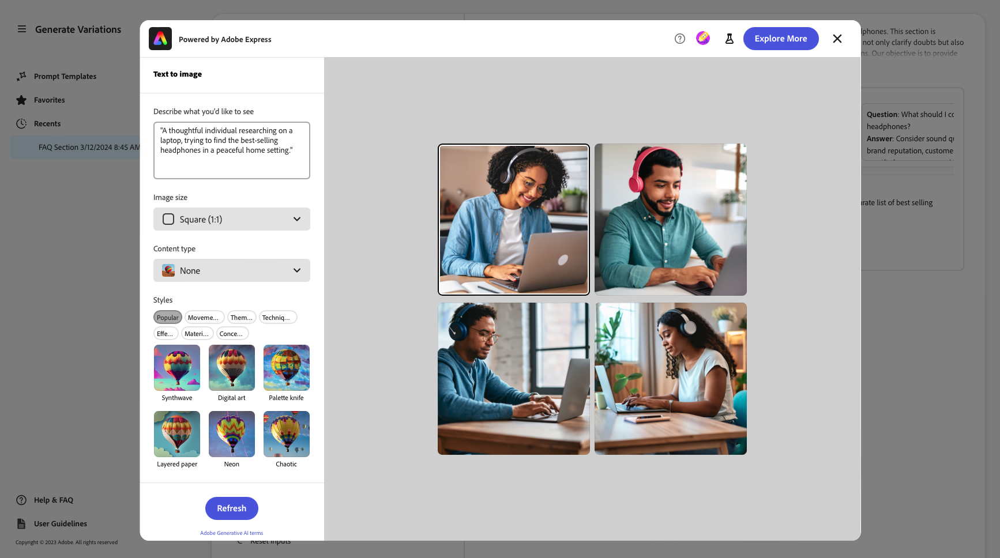
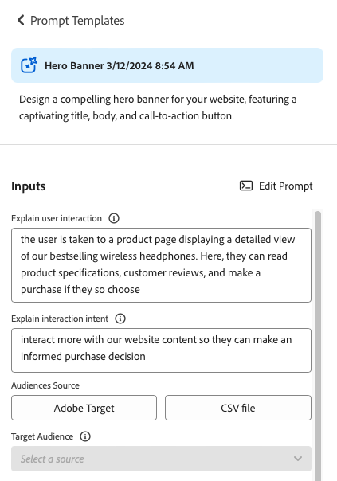

# Variaties genereren {#generate-variations}

Als u op zoek bent naar een manier om uw digitale kanalen te optimaliseren en het maken van inhoud te versnellen, kunt u Variaties genereren gebruiken. Produceer Variaties het gebruik generatieve Intelligentie van de Kunst (AI) om inhoudvariaties tot stand te brengen die op herinneringen worden gebaseerd; deze herinneringen worden of verstrekt door Adobe of gecreeerd, en geleid, door gebruikers. Nadat u variaties hebt gemaakt, kunt u de inhoud van uw website gebruiken en ook het succes ervan meten met de [Experimentatie](https://www.aem.live/docs/experimentation) functionaliteit van [Edge Delivery Services](/help/edge/overview.md).

U kunt [toegang Variaties genereren](#access-generate-variations) van:

* [binnen Adobe Experience Manager (AEM) as a Cloud Service](#access-aemaacs)
* [de Sidekick van AEM Edge Delivery Services](#access-aem-sidekick)
* [in de Inhoudsfragmenteditor](#https://experienceleague.corp.adobe.com/docs/experience-manager-cloud-service/content/sites/administering/content-fragments/authoring.html#generate-variations-ai)

>[!NOTE]
>
>Als u in alle gevallen Variaties genereren wilt gebruiken, moet u ervoor zorgen dat de optie [toegangsvoorwaarden](#access-prerequisites) is voldaan.

U kunt dan:

* [Aan de slag](#get-started) het gebruiken van een snel malplaatje dat de Adobe voor een specifiek gebruiksgeval heeft gecreeerd.
* U kunt [een bestaande prompt bewerken](#edit-the-prompt)
* of [uw eigen aanwijzingen maken en gebruiken](#create-prompt):
   * [Uw vragen opslaan](#save-prompt) voor toekomstig gebruik
   * [Toegang tot en gebruik gedeelde herinneringen](#select-prompt) van over uw organisatie
* Definieer de [publiek](#audiences) segmenten in herinnering te gebruiken wanneer [persoonlijke publieksspecifieke inhoud genereren](#generate-copy).
* Geef een voorvertoning van de uitvoer weer naast de prompt, voordat u wijzigingen aanbrengt en verfijnen, indien nodig.
* Gebruiken [Adobe Express voor het genereren van afbeeldingen](#generate-image) op basis van de variaties van de kopie; hierbij wordt gebruikgemaakt van de generatieve AI-mogelijkheden van Firefly.
* Selecteer de inhoud die u op uw website of in een experiment wilt gebruiken.

## Opmerking bij wet en gebruik {#legal-usage-note}

Generation AI en Generate Variations for AEM zijn krachtige gereedschappen - maar **u** verantwoordelijk zijn voor het gebruik van de uitvoer.

Uw invoer voor de service moet aan een context zijn gekoppeld. Deze context kan uw brandingmaterialen, website inhoud, gegevens, schema&#39;s voor dergelijke gegevens, malplaatjes, of andere vertrouwde op documenten zijn.

U moet de nauwkeurigheid van om het even welke output zoals aangewezen voor uw gebruiksgeval evalueren.

Voordat u Variaties genereren gebruikt, moet u akkoord gaan met de [Adobe Generation AI-gebruikersrichtlijnen](https://www.adobe.com/legal/licenses-terms/adobe-dx-gen-ai-user-guidelines.html).

[Gebruik van variaties genereren](#generative-action-usage) is gekoppeld aan het gebruik van generatieve handelingen.

## Overzicht {#overview}

Als u Variaties genereren opent (en het linkerdeelvenster uitvouwt), ziet u:


* Rechterdeelvenster
   * Dit is afhankelijk van de selectie die u maakt in de linkernavigatie.
   * Standaard, **Sjablonen vragen** worden weergegeven.
* Linkernavigatie
   * Links van **Variaties genereren**, is er de optie (sandwichmenu) om het linkernavigatievenster uit te vouwen of te verbergen.
   * **Sjablonen vragen**:
      * Toont verbindingen aan de diverse Herinneringen; deze kunnen herinneringen omvatten:
         * Wordt geleverd door een Adobe die u helpt inhoud te genereren. Wordt gemarkeerd met het pictogram Adobe.
         * Gemaakt door uzelf.
         * Gemaakt binnen uw IMS-organisatie; gemarkeerd met een pictogram met meerdere koppen.
      * Met de [Nieuwe prompt](#create-prompt) koppeling voor het maken van uw eigen vraag.
      * U kunt **Verwijderen** aanwijzingen die door uzelf of binnen uw IMS-organisatie zijn gemaakt. Dit wordt gedaan gebruikend het menu dat met de ellips op de aangewezen kaart wordt betreden.
   * [Favorieten](#favorites): geeft resultaten van vorige generaties weer die u als Favorieten hebt gemarkeerd.
   * [Recenten](#recents): Verzekert verbindingen met herinneringen, en hun input, die u onlangs hebt gebruikt.
   * **Help en veelgestelde vragen**: Koppelingen naar documentatie, inclusief veelgestelde vragen.
   * **Richtlijnen voor gebruikers**: Koppelingen naar de juridische richtsnoeren.

## Aan de slag {#get-started}

De interface begeleidt u door het proces om inhoud te produceren. Na het openen van de interface, is de eerste stap de herinnering te selecteren u wilt gebruiken.

### Vragen selecteren {#select-prompt}

In het hoofdvenster kunt u het volgende selecteren:

* een door de Adobe aangeleverde promptsjabloon om te beginnen met het genereren van inhoud;
* de [Nieuwe prompt](#create-prompt) om uw eigen herinnering te creëren,
* een sjabloon die u alleen voor uw gebruik hebt gemaakt,
* een sjabloon die u of iemand in uw organisatie heeft gemaakt.

U kunt als volgt onderscheiden:

* De door de Adobe opgegeven vragen worden gemarkeerd met het pictogram Adobe
* De herinneringen beschikbaar door uw organisatie IMS worden gemarkeerd met een veelvoudige hoofdpictogram.
* Uw persoonlijke herinneringen worden niet specifiek gemarkeerd.


### Invoer opgeven {#provide-inputs}

Elke vraag moet u bepaalde informatie verstrekken zodat het aangewezen inhoud van generatieve AI kan terugkrijgen.

In de invoervelden wordt uitgelegd welke informatie nodig is. Om u te helpen, hebben bepaalde velden standaardwaarden die u kunt gebruiken, of indien nodig kunt wijzigen, en beschrijvingen die de vereisten verklaren.

Er zijn verschillende belangrijke invoervelden die worden gebruikt bij meerdere vragen (bepaalde velden zijn niet altijd beschikbaar):

* **Aantal**/**Aantal**
   * U kunt selecteren hoeveel inhoudvariaties u in één generatie wilt worden gecreeerd.
   * Afhankelijk van de vraag, zou dit één van diverse etiketten kunnen hebben; bijvoorbeeld Telling, Aantal Variaties, Aantal Ideeën, en anderen.
* **Audiobron**/**Doelpubliek**
   * Hiermee kunt u persoonlijke inhoud genereren voor een bepaald publiek.
   * Adobe biedt een standaardpubliek, of u kunt meer soorten publiek opgeven; zie [Soorten publiek](#audiences).
* **Aanvullende context**
   * Voeg relevante inhoud in om Generative AI-vaartuigen een betere respons te bieden op basis van de invoer. Als u bijvoorbeeld een webbanner maakt voor een bepaalde pagina of een bepaald product, wilt u mogelijk informatie over de pagina of het product opnemen.
* **Temperatuur**
Gebruik om de temperatuur van generatieve AI van de Adobe te wijzigen:
   * Een hogere temperatuur leidt van de herinnering en tot meer variatie, willekeur, en creativiteit.
   * Een lagere temperatuur is deterministischer en blijft dichter bij wat in de herinnering is.
   * De temperatuur wordt standaard ingesteld op 1. U kunt experimenteren met verschillende temperaturen als de gegenereerde resultaten u niet aanspreken.
* **Vragen bewerken**
   * De onderliggende waarde [prompt kan worden bewerkt](#edit-the-prompt) om de gegenereerde resultaten te verfijnen.

### Kopie genereren {#generate-copy}

Nadat u de invoervelden hebt ingevuld en/of de vraag hebt gewijzigd, kunt u inhoud genereren en de reacties bekijken.

Selecteren **Genereren** om reacties te zien die zijn gegenereerd door generatieve AI. De gegenereerde inhoudsvariaties worden weergegeven onder de vraag die ze heeft gegenereerd.


>[!NOTE]
>
>De meeste sjablonen voor verzoeken om Adobe bevatten een **AI-motivering** in de variatierespons. Dit zorgt voor transparantie ten aanzien van de reden waarom generatieve AI die specifieke variatie heeft gegenereerd.

Wanneer u één variatie selecteert, zijn de volgende acties beschikbaar:

* **Favoriet**
   * Vlag als een **Favoriet** voor toekomstig gebruik (weergegeven in [Favorieten](#favorites)).
* Duimbs omhoog/omlaag
   * Gebruik de duim omhoog/omlaag indicatoren om Adobe van de kwaliteit van reacties op de hoogte te brengen.
* **Kopiëren**
   * Kopiëren naar het klembord voor gebruik bij het ontwerpen van inhoud op uw website of in een [Experimenteer](https://www.aem.live/docs/experimentation).
* **Verwijderen**

Als u de invoer of vraag moet verfijnen, kunt u aanpassingen aanbrengen en **Genereren** nogmaals voor een aantal nieuwe reacties. De nieuwe vraag en de reactie worden getoond onder de aanvankelijke herinnering en de reactie; u kunt omhoog en neer scrollen om de diverse reeksen inhoud te bekijken.

Boven elke set variaties bevindt zich de vraag die deze heeft gemaakt, samen met een **Hergebruik** -optie. Als u ooit een herinnering met zijn input moet opnieuw in werking stellen, selecteer **Hergebruik** om ze opnieuw te laden in **Invoer**.

### Afbeelding genereren {#generate-image}

Nadat u tekstvariaties hebt gegenereerd, kunt u afbeeldingen in Adobe Express genereren met de algemene AI-mogelijkheden van Firefly.

>[!NOTE]
>
>**Afbeelding genereren** is alleen beschikbaar als u een machtiging voor Adoben Express hebt als onderdeel van uw IMS-organisatie en als u toegang hebt in de Admin Console.

Selecteer een variatie, gevolgd door **Afbeelding genereren**, om rechtstreeks te openen **Tekst naar afbeelding** in [Adobe Express](https://www.adobe.com/express/). De vraag wordt vooraf ingevuld gebaseerd op uw variantselectie, en de beelden worden automatisch geproduceerd volgens die herinnering.



U kunt verdere wijzigingen aanbrengen:

* [schrijven uw eigen herinnering in Adobe Express](https://helpx.adobe.com/firefly/using/tips-and-tricks.html) door te beschrijven wat u wilt zien,
* aanpassen **Tekst naar afbeelding** opties,
* dan **Vernieuwen** de gegenereerde afbeeldingen.

U kunt ook **Meer informatie** voor verdere mogelijkheden.

Selecteer na afloop de gewenste afbeelding en **Opslaan** om de Adobe Express te sluiten. De afbeelding wordt geretourneerd en met de variatie opgeslagen.


Hier kunt u de muis boven de afbeelding houden om actiepunten weer te geven voor:

* **Kopiëren**: [De afbeelding naar het klembord kopiëren voor gebruik elders](#use-content)
* **Bewerken**: open de Adobe Express zodat u de afbeelding kunt wijzigen
* **Downloaden**: download de afbeelding naar uw lokale computer
* **Verwijderen**: verwijder de afbeelding uit de variatie

>[!NOTE]
>
>[Content credentials](https://helpx.adobe.com/creative-cloud/help/content-credentials.html) blijven niet behouden wanneer deze worden gebruikt in op documenten gebaseerde ontwerpen.

### Inhoud gebruiken {#use-content}

Als u de inhoud wilt gebruiken die met generatieve AI is gegenereerd, moet u de inhoud naar het klembord kopiëren voor gebruik elders.

Dit gebeurt met de kopieerpictogrammen:

* Voor tekst: gebruik het kopieerpictogram dat zichtbaar is in het deelvenster Variaties
* Voor de afbeelding: muis over de afbeelding om het kopieerpictogram weer te geven

Nadat u de gegevens naar het klembord hebt gekopieerd, kunt u deze plakken en gebruiken wanneer u inhoud voor uw website ontwerpt. U kunt ook een [experiment](https://www.aem.live/docs/experimentation).

## Favorieten {#favorites}

Nadat u de inhoud hebt bekeken, kunt u geselecteerde variaties opslaan als favorieten.

Als ze eenmaal zijn opgeslagen, worden ze onder weergegeven **Favorieten** in de linkernavigatie. Favorieten blijven bestaan (totdat u **Verwijderen** (of de browsercache wissen).

* Favorieten en variaties kunnen naar het klembord worden gekopieerd of geplakt voor gebruik in uw website-inhoud.
* Favorieten kunnen **Verwijderd**.

## Recenten {#recents}

Deze sectie bevat koppelingen naar uw recente activiteiten. A **Recent** item wordt toegevoegd nadat u **Genereren**. De naam van de vraag en een tijdstempel. Als u een koppeling selecteert, wordt de vraag geladen, worden de invoervelden ingevuld en worden de gegenereerde variaties weergegeven.

## De vraag bewerken {#edit-the-prompt}

De onderliggende prompt kan worden bewerkt. U kunt dit doen:

* Als de gegenereerde resultaten die u krijgt, verder moeten worden verfijnd
* U wilt wijzigen en [de vraag opslaan](#save-prompt) voor toekomstig gebruik

Selecteren **Vragen bewerken**:


Hiermee opent u de prompt-editor waarin u uw wijzigingen kunt aanbrengen:


### Prompte invoer toevoegen {#add-prompt-inputs}

Wanneer u een vraag maakt of bewerkt, kunt u invoervelden toevoegen. Invoervelden fungeren als variabelen in de vraag en bieden de flexibiliteit om dezelfde prompt in verschillende scenario&#39;s te gebruiken. Zij staan gebruikers toe om specifieke elementen van de herinnering te bepalen, zonder het moeten de volledige herinnering schrijven.

* Een veld wordt gedefinieerd met dubbele accolades `{{ }}` het insluiten van een placeholder naam.
Bijvoorbeeld: `{{tone_of_voice}}`.

  >[!NOTE]
  >
  >Spaties zijn niet toegestaan tussen de dubbele accolades.

* Het wordt ook gedefinieerd onder `METADATA`, met de volgende parameters:
   * `label`
   * `description`
   * `default`
   * `type`

#### Voorbeeld: Nieuw tekstveld toevoegen - Tint van stem {#example-add-new-text-field-tone-of-voice}

Een nieuw tekstveld met de naam toevoegen **Tint van stem** gebruikt u de volgende syntaxis in uw vraag:

```prompt
{{@tone_of_voice, 
  label="Tone of voice",
  description="Indicate the desired tone of voice",
  default="optimistic, smart, engaging, human, and creative",
  type=text
}}
```


<!--
#### Example: Add new dropdown field - Page Type {#example-add-new-dropdown-field-page-type}

To create an input field Page Type providing a dropdown selection:

1. Create a spreadsheet named `pagetype.xls` in the top-level directory of your folder structure.
1. Edit the spreadsheet:

   1. Create two columns: **Key** and **Value**.
   1. In the **Key** column, enter labels that will appear in the dropdown.
   1. In the **Value** column, describe the key value so the generative AI has context.

1. In your prompt, refer to the title of the spreadsheet along with the appropriate type. 

   ```prompt
   {{@page_type, 
     label="Page Type",
     description="Describes the type of page",
     spreadsheet=pagetype
   }}
   ```
-->

## Een prompt maken {#create-prompt}

Wanneer u **Nieuwe prompt** van **Sjablonen vragen**, kunt u een nieuw deelvenster gebruiken om een nieuwe vraag in te voeren. U kunt deze vervolgens opgeven, samen met de **Temperatuur**, naar **Genereren** inhoud.

Zie [Vragen opslaan](#save-prompt) voor meer informatie over het opslaan van de prompt voor de toekomst.

Zie [Vrachtinvoer toevoegen](#add-prompt-inputs) voor meer informatie over het toevoegen van uw eigen snelle invoer.

Als u opmaak wilt behouden in de gebruikersinterface en bij het kopiëren en plakken in de op documenten gebaseerde ontwerpstroom, neemt u het volgende op in de vraag:

<!-- CHECK - are the double-quotes needed? -->

* `"Format the response as an array of valid, iterable RFC8259 compliant JSON"`

In de volgende afbeelding ziet u de voordelen hiervan:

* in het eerste voorbeeld `Title` en `Description` zijn gecombineerd
* in het tweede voorbeeld worden ze afzonderlijk opgemaakt: dit is gebeurd door het JSON-verzoek op te nemen in de vraag.


## Vragen opslaan {#save-prompt}

Nadat u de vragen hebt bewerkt of gemaakt, wilt u deze mogelijk opslaan voor toekomstig gebruik. Dit geldt zowel voor uw IMS-organisatie als alleen voor uzelf. De opgeslagen vraag wordt weergegeven als een **Sjabloon vragen** kaart.

Als u de vraag hebt bewerkt, **Opslaan** is beschikbaar onder aan de sectie Invoer, links van **Genereren**.

Als deze optie is geselecteerd, wordt **Vragen opslaan** wordt geopend:


1. Een uniek item toevoegen **Naam aanwijzing**; gebruikt om de vraag binnen te identificeren **Sjablonen vragen**.
   1. Een nieuwe, en unieke naam leidt tot een nieuw herinnering malplaatje.
   1. Een bestaande naam beschrijft die herinnering; een bericht wordt getoond.
1. Voeg desgewenst een beschrijving toe.
1. De optie activeren of deactiveren **Gedeeld over organisatie**, afhankelijk van of de vraag privé aan u, of beschikbaar over uw organisatie zou moeten zijn IMS. Deze status wordt weergegeven in het dialoogvenster [resulterende kaart weergegeven in de sneltoetsen](#select-prompt).
1. **Opslaan** de prompt, of **Annuleren** de handeling.

>[!NOTE]
>
>U wordt geïnformeerd (gewaarschuwd) als u een bestaand bericht overschrijft/bijwerkt.

>[!NOTE]
>
>Van **Sjablonen vragen** u kunt herinneringen (die het menu gebruiken met de ellips wordt betreden) schrappen door zich, of binnen uw organisatie IMS wordt gecreeerd die.

## Soorten publiek {#audiences}

Om gepersonaliseerde inhoud te produceren moet generatieve AI een begrip van het publiek hebben. Adobe biedt een aantal standaardsoorten publiek of u kunt uw eigen publiek toevoegen.

Wanneer u een publiek toevoegt, moet u het publiek in de natuurlijke taal beschrijven. Bijvoorbeeld:

* om een publiek te maken:
   * `Student`
* u zou kunnen zeggen :
   * `The audience consists of students, typically individuals who are pursuing education at various academic levels, such as primary, secondary, or tertiary education. They are engaged in learning and acquiring knowledge in diverse subjects, seeking academic growth, and preparing for future careers or personal development.`

Twee bronnen van het publiek worden gesteund:

* [Adobe Target](#audience-adobe-target)
* [CSV-bestand](#audience-csv-file)



### Publiek - Adobe Target {#audience-adobe-target}

Een **Adobe Target** het publiek in de herinnering staat voor de generatie van inhoud toe om aan dat publiek worden gepersonaliseerd.

>[!NOTE]
>
>Als u deze optie wilt gebruiken, moet uw IMS-organisatie toegang hebben tot Adobe Target.

1. Selecteren **Adobe Target**.
1. Selecteer vervolgens de vereiste **Doelpubliek** uit de verstrekte lijst.

   >[!NOTE]
   >
   >Als u een **Adobe Target** voor het publiek moet het beschrijvingsveld worden ingevuld. Als dat niet het geval is, wordt in de vervolgkeuzelijst aangegeven dat het publiek niet beschikbaar is. Ga naar Doel en [een beschrijving voor het publiek toevoegen](https://experienceleague.adobe.com/en/docs/target-learn/tutorials/audiences/create-audiences).

   

#### Adobe Target-publiek toevoegen {#add-adobe-target-audience}

Zie [Soorten publiek maken](https://experienceleague.adobe.com/en/docs/target-learn/tutorials/audiences/create-audiences) om een publiek te maken in Adobe Target.

### Publiek - CSV-bestand {#audience-csv-file}

Een **CSV-bestand** het publiek in de herinnering staat voor de generatie van inhoud toe om aan het geselecteerde worden gepersonaliseerd **Doelpubliek**.

Adobe biedt een aantal soorten publiek dat kan worden gebruikt.

1. Selecteren **CSV-bestand**.
1. Selecteer vervolgens de vereiste **Doelpubliek** uit de verstrekte lijst.

   

#### CSV-bestand voor publiek toevoegen {#add-audience-csv-file}

U kunt een CSV-bestand toevoegen vanaf verschillende platforms (bijvoorbeeld Google Drive, Dropbox, Sharepoint) die een URL naar het bestand kunnen verzenden nadat het openbaar is gemaakt.

>[!NOTE]
>
>Op gedeelde platforms kunt u *moet* in staat zijn het bestand openbaar toegankelijk te maken.

Als u bijvoorbeeld een publiek wilt toevoegen vanuit een bestand op Google Drive:

1. Maak in Google Drive een spreadsheetbestand met twee kolommen:
   1. De eerste kolom wordt weergegeven in de vervolgkeuzelijst.
   1. De tweede kolom is de beschrijving van het publiek.
1. Bestand publiceren:
   1. Bestand -> Delen -> Publiceren naar web -> CSV
1. Kopieer de URL naar het gepubliceerde bestand.
1. Ga naar Variaties genereren.
1. Open de Snelle editor.
1. Zoeken **Adobe Target** in de metagegevens en vervangt u de URL.

   >[!NOTE]
   >
   >Zorg ervoor dat de dubbele aanhalingstekens (&quot;) aan beide uiteinden van de URL blijven staan.

   Bijvoorbeeld:

   

## Generatief actieverbruik {#generative-action-usage}

Gebruiksbeheer is afhankelijk van de actie die wordt uitgevoerd:

* Variaties genereren

  Eén generatie van een kopieervariant is gelijk aan één generatieve actie. Als klant hebt u een aantal generatieve acties die bij uw AEM licentie worden geleverd. Zodra de basisrechten zijn verbruikt, kunt u extra handelingen aanschaffen.

  >[!NOTE]
  >
  >Zie [Adobe Experience Manager: Cloud Service | Productbeschrijving](https://helpx.adobe.com/legal/product-descriptions/aem-cloud-service.html) voor meer informatie over de basisrechten en neem contact op met uw accountteam als u meer generatieve acties wilt aanschaffen.

* Adobe Express

  Het gebruik van het genereren van afbeeldingen wordt afgehandeld via rechten voor Adobe Express en [generatieve kredieten](https://helpx.adobe.com/firefly/using/generative-credits-faq.html).

## Toegang genereert variaties {#access-generate-variations}

Na het vervullen van de eerste vereisten kunt u tot Generate Variaties van AEM as a Cloud Service of de Sidekick van de Edge Delivery Services toegang hebben.

### Toegangsvoorwaarden {#access-prerequisites}

Als u Variaties genereren wilt gebruiken, moet u ervoor zorgen dat aan de voorwaarden is voldaan:

* [Toegang tot Experience Manager as a Cloud Service met Edge Delivery Services](#access-to-aemaacs-with-edge-delivery-services)

#### Toegang tot Experience Manager as a Cloud Service met Edge Delivery Services{#access-to-aemaacs-with-edge-delivery-services}

Gebruikers die toegang nodig hebben om variaties te genereren, moeten recht hebben op een as a Cloud Service omgeving met Edge Delivery Services voor Experience Managers.

>[!NOTE]
>
>Als uw as a Cloud Service AEM Sites-contract geen Edge Delivery Services bevat, moet u een nieuw contract ondertekenen om toegang te krijgen.
>
>Neem contact op met uw accountteam om te bespreken hoe u met Edge Delivery Services naar AEM Sites kunt gaan as a Cloud Service.

Als u toegang wilt verlenen aan specifieke gebruikers, wijst u hun gebruikersaccount toe aan het desbetreffende productprofiel. Zie [AEM productprofielen toewijzen voor meer informatie](/help/journey-onboarding/assign-profiles-cloud-manager.md).

### Toegang tot AEM as a Cloud Service {#access-aemaacs}

U kunt variaties genereren via het dialoogvenster [Deelvenster Navigatie](/help/sites-cloud/authoring/basic-handling.md#navigation-panel) van AEM as a Cloud Service:


### Toegang van de AEM Sidekick {#access-aem-sidekick}

Één of andere configuratie is nodig alvorens u tot Generate Variaties van de Sidekick (van Edge Delivery Services) kunt toegang hebben.

1. Zie het document [De AEM Sidekick installeren](https://www.aem.live/docs/sidekick-extension) voor hoe te om de Sidekick te installeren en te vormen.

1. Om te gebruiken produceer Variaties in de Sidekick (van Edge Delivery Services), omvat de volgende configuratie in uw projecten van Edge Delivery Services onder:

   * `tools/sidekick/config.json`

   Dit moet in uw bestaande configuratie worden samengevoegd en dan opgesteld.

   Bijvoorbeeld:

   ```prompt
   {
     // ...
     "plugins": [
       // ...
       {
         "id": "generate-variations",
         "title": "Generate Variations",
         "url": "https://experience.adobe.com/aem/generate-variations",
         "passConfig": true,
         "environments": ["preview","live", "edit"],
         "includePaths": ["**.docx**"]
       }
       // ...
     ]
   }
   ```

1. Mogelijk moet u er dan voor zorgen dat gebruikers [Toegang tot Experience Manager as a Cloud Service met Edge Delivery Services](#access-to-aemaacs-with-edge-delivery-services).

1. U kunt de functie vervolgens openen door **Variaties genereren** op de werkbalk van de Sidekick:

   

## Aanvullende informatie {#further-information}

Voor meer informatie kunt u ook lezen:

* [GenAI Genereer variaties op GitHub](https://github.com/adobe/aem-genai-assistant#setting-up-aem-genai-assistant)
* [Edge Delivery Services experimenteren](https://www.aem.live/docs/experimentation)

## Veelgestelde vragen {#faqs}

### Opgemaakte uitvoer {#formatted-outpu}

**De gegenereerde reactie geeft me niet de opgemaakte uitvoer die ik nodig heb. Hoe kan ik de opmaak wijzigen? ex: Ik heb een titel en een ondertitel nodig, maar het antwoord is slechts een titel**

1. Open de daadwerkelijke herinnering in geef wijze uit.
1. Ga naar vereisten.
1. U zult vereisten vinden die over de output spreken.
   1. Voorbeeld: &quot;De tekst moet uit drie delen bestaan, een titel, een hoofdtekst en een knoplabel.&quot; of &quot;Maak de reactie op als een geldige JSON-array van objecten met de kenmerken &quot;Title&quot;, &quot;Body&quot; en &quot;ButtonLabel&quot;.
1. Pas de vereisten aan uw behoeften aan.

   >[!NOTE]
   >
   >Als u voor de ingevoerde nieuwe uitvoer beperkingen op het aantal woorden/tekens hebt, maakt u een vereiste.

   Voorbeeld: &quot;De titeltekst mag niet langer zijn dan 10 woorden of 50 tekens, inclusief spaties.&quot;
1. Sla de vraag op voor toekomstig gebruik.

### Lengte van reactie {#length-of-response}

**De gegenereerde reactie is te lang of te kort. Hoe kan ik de lengte wijzigen?**

1. Open de daadwerkelijke herinnering in geef wijze uit.
1. Ga naar vereisten.
1. Voor elke uitvoer wordt een overeenkomstige limiet voor woord of teken gevonden.
   1. Voorbeeld: &quot;De titeltekst mag niet langer zijn dan 10 woorden of 50 tekens, inclusief spaties.&quot;
1. Pas de vereisten aan uw behoeften aan.
1. Sla de vraag op voor toekomstig gebruik.

### Antwoorden verbeteren {#improve-responses}

**De reacties die ik krijg, zijn niet precies wat ik zoek. Wat kan ik doen om ze te verbeteren?**

1. Wijzig de temperatuur onder Geavanceerde instellingen.
   1. Een hogere temperatuur leidt van de herinnering en tot meer variatie, willekeur, en creativiteit.
   1. Een lagere temperatuur is deterministischer en houdt vast aan wat er nu gebeurt.
1. Open de daadwerkelijke herinnering in geef wijze uit en herzie herinnering. Let vooral op de sectie requirements die de toon van stem en andere belangrijke criteria beschrijft.

### Opmerkingen in een prompt {#comments-in-prompt}

**Hoe kan ik snel opmerkingen gebruiken?**

Opmerkingen in een vraag worden gebruikt om notities, uitleg of instructies op te nemen die geen deel uitmaken van de werkelijke uitvoer. Deze opmerkingen zijn ingekapseld in een specifieke syntaxis: ze beginnen en eindigen met dubbele accolades en beginnen met een hash (bijvoorbeeld `{{# Comment Here }}`). Met opmerkingen kunt u de structuur of intentie van de vraag verduidelijken zonder dat dit van invloed is op de gegenereerde reactie.

### Een gedeelde prompt zoeken {#find-a-shared-prompt}

**Wat kan ik doen als ik geen snel malplaatje kan vinden dat iemand heeft gedeeld?**

In deze situatie zijn er verschillende details om te controleren:

1. Gebruik de URL voor uw omgeving.
Bijvoorbeeld https://experience.adobe.com/#/aem/generate-variations
1. Controleer of de geselecteerde IMS-organisatie correct is.
1. Bevestig dat de vraag is opgeslagen als Gedeeld.

### Aangepaste aanwijzingen in v2.0.0 {#custom-prompts-v200}

**In versie 2.0.0 zijn mijn aangepaste herinneringen verdwenen - wat kan ik doen?**

Als u naar de versie 2.0.0 gaat, worden aangepaste sjablonen met aanwijzingen afgebroken, zodat deze niet beschikbaar zijn.

Deze ophalen:

1. Ga naar de herinnering-malplaatje omslag in SharePoint.
1. Kopieer de vraag.
1. Open de toepassing Variaties genereren.
1. Selecteer de Nieuwe Vraag kaart.
1. Plak de vraag.
1. Controleer of de vraag werkt.
1. Sla de vraag op.

## Releasegeschiedenis {#release-history}

Voor meer informatie over de huidige en vorige versie raadpleegt u de [Opmerkingen bij de release voor het genereren van variaties](/help/generative-ai/release-notes-generate-variations.md)
