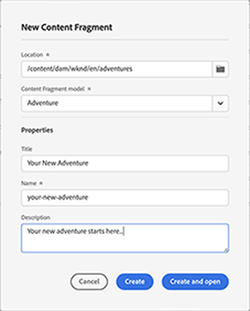

# Console voor inhoudsfragmenten  {#content-fragment-console}

Leer hoe de console van de Fragmenten van de Inhoud toegang tot uw Fragments van de Inhoud optimaliseert, die u, hen helpen tot stand brengen zoeken en leiden door admin acties zoals te nemen publiceren, unpublish, exemplaar.

>[!NOTE]
>
>De console van de Fragmenten van de Inhoud wordt gewijd aan het beheren van, het zoeken naar, en het creëren van de Fragmenten van de Inhoud. Deze functie is geoptimaliseerd voor gebruik in een headless-context.
>
>Op deze console worden alleen inhoudsfragmenten weergegeven. Andere elementtypen, zoals afbeeldingen en video&#39;s, worden niet weergegeven.

>[!NOTE]
>
>Toegang tot uw inhoudsfragmenten is momenteel mogelijk via:
>
>* this Content Fragments console
>* de middelenconsole - zie [Inhoudsfragmenten beheren](/help/assets/content-fragments/content-fragments-managing.md)

De console van de Fragmenten van de Inhoud kan direct van het hoogste niveau van de Globale Navigatie worden betreden:

Selecteren **Inhoudsfragmenten** opent de console in een nieuw lusje.

Hier kunt u zien dat er drie hoofdgebieden zijn:

* De bovenste werkbalk
   * Biedt standaard AEM
   * Ook uw IMS-organisatie tonen
* Het linkerdeelvenster
   * Hier kunt u de mappenstructuur verbergen of weergeven
   * U kunt een specifieke vertakking van de boomstructuur selecteren
* Het hoofd-/rechterdeelvenster - vanaf hier kunt u:
   * Zie de lijst met alle inhoudsfragmenten in de geselecteerde vertakking van de structuur
      * De plaats wordt aangegeven door de broodkruimels; deze kunnen ook worden gebruikt om de locatie te wijzigen
      * Inhoudsfragmenten uit de geselecteerde map en alle onderliggende mappen worden weergegeven
         * Verschillende velden met informatie over een inhoudsfragment bevatten koppelingen. hiermee kunt u het juiste fragment openen in de editor
      * U kunt een kolomkop selecteren om de tabel te sorteren op basis van die kolom. opnieuw selecteren om te schakelen tussen oplopend en aflopend
   * **[Maken](#creating-new-content-fragment)** een nieuw inhoudsfragment
   * [Filter](#filtering-fragments) de Inhoudsfragmenten op basis van een selectie van voorspelling en sla het filter op voor toekomstig gebruik
   * [Zoeken](#searching-fragments) de inhoudsfragmenten
   * De tabelweergave aanpassen om geselecteerde kolommen met informatie weer te geven
   * Gebruiken **Openen in elementen** om de huidige locatie rechtstreeks te openen in het dialoogvenster **Activa** console.

      >[!NOTE]
      >
      >De **Activa** wordt gebruikt om toegang te krijgen tot elementen, zoals afbeeldingen, video&#39;s, enz.  Deze console is toegankelijk:
      >
      >* met de **Openen in elementen** koppeling (in de console Inhoudsfragmenten)
      >* rechtstreeks vanuit het globale navigatievenster

Als u een specifiek fragment selecteert, wordt een werkbalk geopend die is toegespitst op de acties die beschikbaar zijn voor dat fragment. U kunt ook meerdere fragmenten selecteren. De selectie van acties wordt dienovereenkomstig aangepast.

## Een nieuw inhoudsfragment maken {#creating-new-content-fragment}

Selecteren **Maken** opent de compacte **Nieuw inhoudsfragment** dialoogvenster:

## Fragmenten filteren {#filtering-fragments}

Het deelvenster Filter biedt de volgende opties:

* een selectie van voorspelling die kan worden geselecteerd en gecombineerd
* de mogelijkheid **Opslaan** uw configuratie
* de optie om een opgeslagen zoekfilter op te halen voor hergebruik

## Fragmenten zoeken {#searching-fragments}

Het zoekvak ondersteunt zoeken in volledige tekst. Voer de zoektermen in het zoekvak in:

De geselecteerde resultaten worden weergegeven:

Het zoekvak biedt ook snelle toegang tot **Recente inhoudsfragmenten** en **Opgeslagen zoekopdrachten**:

