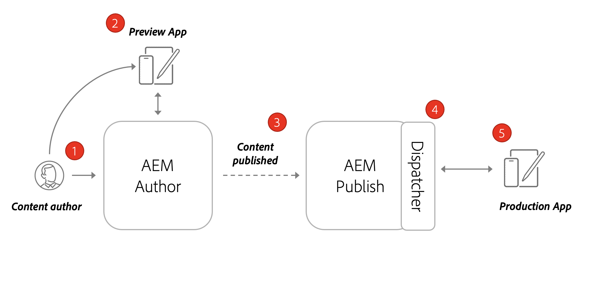
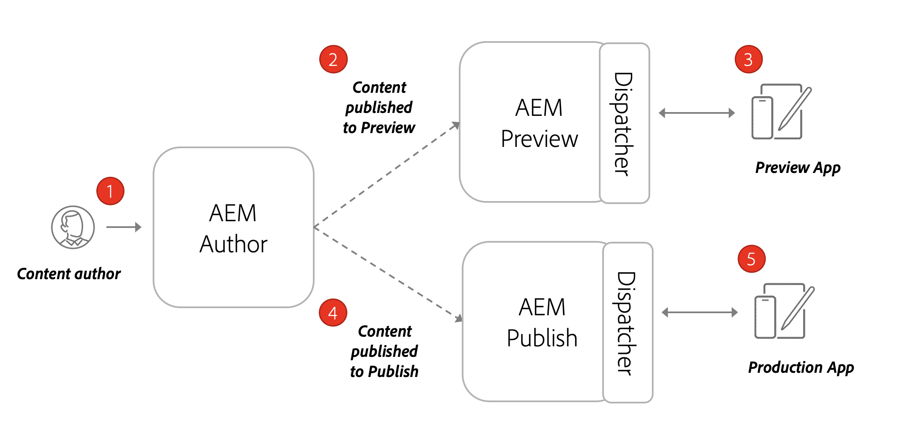

# Architectuur van AEM headless

Een typische AEM omgeving bestaat uit een Auteur Service, Publish Service en een optionele Voorvertoningsservice.

* **de dienst van de Auteur** is waar de interne gebruikers, inhoud creëren leiden en voorproef.

* **de dienst van Publish** wordt beschouwd als het &quot;Levende&quot;milieu en is typisch wat eind - gebruikers met in wisselwerking staan. Inhoud wordt na bewerking en goedkeuring op de service Auteur gedistribueerd naar de Publish-service. Het meest gangbare implementatiepatroon met AEM toepassingen zonder kop is dat de productieversie van de toepassing verbinding maakt met een AEM Publish-service.

* **de dienst van de Voorproef** is functioneel het zelfde als de **Dienst van Publish**. Het wordt echter alleen ter beschikking gesteld van interne gebruikers. Hierdoor is het een ideaal systeem voor fiatteurs om aanstaande wijzigingen in de inhoud te controleren voordat deze live voor eindgebruikers worden gemaakt.

* **Dispatcher** is een statische Webserver die met de AEM verzender module wordt uitgebreid. Het verstrekt caching mogelijkheden en een andere laag van veiligheid. De **Dispatcher** zit vóór de **Publish** en **Voorproef** diensten.

Binnen een AEM as a Cloud Service-programma kunt u meerdere omgevingen hebben: Dev, Stage en Prod. Elk milieu zou zijn eigen unieke **Auteur**, **Publish**, en **Voorproef** diensten hebben. U kunt meer leren over het beheren van [ milieu&#39;s hier ](/help/implementing/cloud-manager/manage-environments.md)

## Publish-model auteur

Het meest gangbare implementatiepatroon met AEM toepassingen zonder kop is dat de productieversie van de toepassing verbinding maakt met een AEM Publish-service.

Het diagram hierboven toont dit gemeenschappelijke plaatsingspatroon.

1. A **de auteur van de Inhoud** gebruikt de AEM dienst van de Auteur om, inhoud tot stand te brengen uit te geven en te beheren.
1. De **auteur van de Inhoud** en andere interne gebruikers kunnen de inhoud op de dienst van de Auteur direct voorproef. Er kan een voorvertoningsversie van de toepassing worden ingesteld die verbinding maakt met de service Auteur.
1. Nadat de inhoud is goedgekeurd, kan deze worden gepubliceerd naar de AEM Publish-service.
1. **Dispatcher** is een laag voor de **Publish** dienst die bepaalde verzoeken in het voorgeheugen onderbrengen en een laag van veiligheid verstrekt.
1. Eindgebruikers hebben interactie met de productieversie van de toepassing. De productietoepassing maakt verbinding met de Publish-service via de Dispatcher en gebruikt de GraphQL API&#39;s om inhoud aan te vragen en te gebruiken.

## Publish-implementatie voor voorvertoning van auteur

Een andere optie voor hoofdloze plaatsingen is een **AEM de dienst van de Voorproef** op te nemen. Met deze benadering kan de inhoud eerst aan de **dienst van de Voorproef** worden gepubliceerd en een voorproefversie van de hoofdloze toepassing kan met het verbinden. Het voordeel met deze benadering is dat de **dienst van de Voorproef** opstelling met de zelfde authentificatievereisten en toestemmingen zoals de **Publish** dienst kan zijn, makend het gemakkelijker om de productieervaring te simuleren.

1. A **de auteur van de Inhoud** gebruikt de AEM dienst van de Auteur om, inhoud tot stand te brengen uit te geven en te beheren.
1. Inhoud wordt eerst gepubliceerd naar de service AEM.
1. Er kan een voorvertoningsversie van de toepassing worden ingesteld die verbinding maakt met de service Voorvertoning.
1. Nadat de inhoud is gecontroleerd en goedgekeurd, kan deze worden gepubliceerd naar de service AEM Publish.
1. Eindgebruikers hebben interactie met de productieversie van de toepassing. De productietoepassing maakt verbinding met de Publish-service via de Dispatcher en gebruikt de GraphQL API&#39;s om inhoud aan te vragen en te gebruiken.
