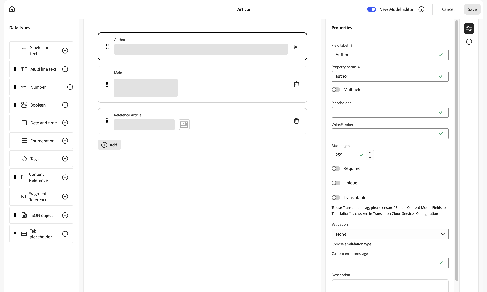
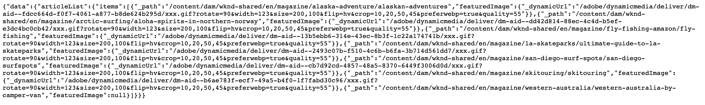

# GraphQL API AEM voor gebruik met inhoudsfragmenten {#graphql-api-for-use-with-content-fragments}

>[!IMPORTANT]
>
>Verschillende functies van de GraphQL API voor gebruik met inhoudsfragmenten zijn beschikbaar via het programma Vroege adopter.
>
>Om de status te zien, en hoe te om toe te passen als u geinteresseerd bent, controleer de [ Nota&#39;s van de Versie ](/help/release-notes/release-notes-cloud/release-notes-current.md).

Leer hoe u inhoudsfragmenten in Adobe Experience Manager (AEM) as a Cloud Service kunt gebruiken met de AEM GraphQL API voor het leveren van inhoud zonder kop.

AEM as a Cloud Service GraphQL API die wordt gebruikt met Content Fragments is sterk gebaseerd op de standaard, open-source GraphQL API.

Door de GraphQL API in AEM te gebruiken, kunt u inhoudsfragmenten efficiënt aan JavaScript-clients leveren in CMS-implementaties zonder kop:

* Herhalende API-aanvragen voorkomen, zoals REST,
* ervoor zorgen dat de levering beperkt blijft tot de specifieke eisen;
* Het toestaan voor bulklevering van precies wat voor het teruggeven als antwoord op één enkele API vraag nodig is.

>[!NOTE]
>
>GraphQL wordt momenteel gebruikt in twee (afzonderlijke) scenario&#39;s in Adobe Experience Manager (AEM) as a Cloud Service:
>
>* [ AEM Commerce verbruikt gegevens van een platform van Commerce via GraphQL ](/help/commerce-cloud/integrating/magento.md).
>* AEM Content Fragments werken samen met de AEM GraphQL API (een aangepaste implementatie op basis van standaard GraphQL) voor gestructureerde inhoud voor gebruik in uw toepassingen.

>[!NOTE]
>
>Zie [ AEM APIs voor Gestructureerde Inhoudslevering en Beheer ](/help/headless/apis-headless-and-content-fragments.md) voor een overzicht van diverse beschikbare APIs en vergelijking van sommige betrokken concepten.

>[!NOTE]
>
>Voor de recentste informatie over Experience Manager APIs, gelieve ook [ Adobe Experience Manager as a Cloud Service APIs ](https://developer.adobe.com/experience-cloud/experience-manager-apis/) te bezoeken.

## De GraphQL API {#graphql-api}

GraphQL is:

* &quot;*...een vraagtaal voor APIs en runtime voor het vervullen van die vragen met uw bestaande gegevens. GraphQL verstrekt een volledige en begrijpelijke beschrijving van de gegevens in uw API, geeft cliënten de macht om precies te vragen wat zij en niets meer nodig hebben, maakt het gemakkelijker om APIs in tijd te evolueren, en laat krachtige ontwikkelaarshulpmiddelen toe.*&quot;.

  Zie [ GraphQL.org ](https://graphql.org)

* &quot;*...een open specificatie voor een flexibele API laag. Plaats GraphQL over uw bestaande achtergronden om producten sneller dan ooit te bouwen...*&quot;.

  Zie [ GraphQL ](https://www.graphql.com) ontdekken.

* *&quot;...een taal en specificatie voor gegevensquery die in 2012 intern door Facebook zijn ontwikkeld, voordat deze in 2015 openbaar werd uitbesteed. Het biedt een alternatief voor op REST gebaseerde architecturen met als doel de productiviteit van ontwikkelaars te verhogen en de hoeveelheden overgedragen gegevens te minimaliseren. GraphQL wordt gebruikt in productie door honderden organisaties van alle grootte...&quot;*

  Zie [ Stichting van GraphQL ](https://foundation.graphql.org/).

<!--
"*Explore GraphQL is maintained by the Apollo team. Our goal is to give developers and technical leaders around the world the tools they need to understand and adopt GraphQL.*". 
-->

Raadpleeg de volgende secties (onder andere over veel andere bronnen) voor informatie over de GraphQL API:

* Bij [ graphql.org ](https://graphql.org):

   * [ Inleiding aan GraphQL ](https://graphql.org/learn)

   * [ de Specificatie van GraphQL ](https://spec.graphql.org/)

* Bij [ graphql.com ](https://graphql.com):

   * [ Gidsen ](https://www.graphql.com/guides/)

   * [ Tutorials ](https://www.graphql.com/tutorials/)

   * [ Gevallenanalyses ](https://www.graphql.com/case-studies/)

De GraphQL for AEM-implementatie is gebaseerd op de standaard GraphQL Java Library. Zie:

* [ graphQL.org - Java ](https://graphql.org/code/#java)

* [ GraphQL Java bij GitHub ](https://github.com/graphql-java)

### GraphQL Terminologie {#graphql-terminology}

GraphQL gebruikt het volgende:

* **[Vragen ](https://graphql.org/learn/queries/)**

* **[Schema&#39;s en Types ](https://graphql.org/learn/schema/)**:

   * Schema&#39;s worden gegenereerd door AEM op basis van de modellen van inhoudsfragmenten.
   * Met behulp van uw schema&#39;s geeft GraphQL de typen en bewerkingen weer die zijn toegestaan voor de GraphQL voor AEM implementatie.

* **[Gebieden ](https://graphql.org/learn/queries/#fields)**

* **[Eindpunt van GraphQL](graphql-endpoint.md)**
   * Het pad in AEM dat reageert op GraphQL-query&#39;s en toegang biedt tot de GraphQL-schema&#39;s.

   * Zie [ toelatend uw Eindpunt van GraphQL ](graphql-endpoint.md) voor verdere details.

Zie [ (GraphQL.org) Inleiding aan GraphQL ](https://graphql.org/learn/) voor uitvoerige details, met inbegrip van [ Beste praktijken ](https://graphql.org/learn/best-practices/).

### GraphQL-querytypen {#graphql-query-types}

Met GraphQL kunt u query&#39;s uitvoeren die worden geretourneerd:

* A **enige ingang**

* A **[lijst van ingangen ](https://graphql.org/learn/schema/#lists-and-non-null)**

AEM verstrekt mogelijkheden om vragen (beide types) in [ Verlengde Vragen om te zetten, die ](/help/headless/graphql-api/persisted-queries.md) door Dispatcher en CDN kunnen worden in het voorgeheugen ondergebracht.

### Aanbevolen werkwijzen voor GraphQL-query (Dispatcher en CDN) {#graphql-query-best-practices}

De [ Verlengde Vragen ](/help/headless/graphql-api/persisted-queries.md) zijn de geadviseerde methode om bij te gebruiken publiceer instanties als:

* ze zijn in cache geplaatst
* zij worden centraal beheerd door AEM as a Cloud Service

>[!NOTE]
>
>Gewoonlijk is er geen verzender/CDN op auteur, zodat is er geen aanwinst in het gebruiken van persisted query&#39;s daar; behalve het testen van hen.

GraphQL-query&#39;s die gebruikmaken van POST-aanvragen worden niet aanbevolen omdat ze niet in de cache zijn opgeslagen, zodat Dispatcher standaard is geconfigureerd om dergelijke query&#39;s te blokkeren.

Hoewel GraphQL ook GET-aanvragen ondersteunt, kunnen deze limieten bereiken (bijvoorbeeld de lengte van de URL) die kunnen worden vermeden door middel van permanente query&#39;s.

Zie [ toelaten caching van persisted query ](/help/headless/deployment/dispatcher-caching.md) voor verdere details.

>[!NOTE]
>
>Om directe, en/of POST toe te staan, kunt u vragen in Dispatcher uw Beheerder van het Systeem vragen:
>
>* Creeer a [ het omgevingsvariabele van Cloud Manager ](/help/implementing/cloud-manager/environment-variables.md) geroepen `ENABLE_GRAPHQL_ENDPOINT`
>* met de waarde `true`

>[!NOTE]
>
>De capaciteit om directe vragen uit te voeren kan op een bepaald punt in de toekomst worden verouderd.

### GraphiQL IDE {#graphiql-ide}

U kunt de vragen van GraphQL testen en zuiveren gebruikend [ IDE GraphiQL ](/help/headless/graphql-api/graphiql-ide.md).

## Kwesties gebruiken voor auteur, voorvertoning en Publish {#use-cases-author-preview-publish}

De gebruiksgevallen kunnen afhankelijk zijn van het type AEM as a Cloud Service-omgeving:

* Publish-omgeving; wordt gebruikt voor:
   * Query-gegevens voor JS-toepassing (standaardgebruikscenario)

* Voorvertoningsomgeving; wordt gebruikt voor:
   * Vragen voorvertonen vóór implementatie in de Publish-omgeving
      * Query-gegevens voor JS-toepassing (standaardgebruikscenario)

* Auteursomgeving; gebruikt voor:
   * Query-gegevens voor &quot;inhoudsbeheerdoeleinden&quot;:
      * GraphQL in AEM as a Cloud Service is momenteel een alleen-lezen API.
      * De REST-API kan worden gebruikt voor CR(u)D-bewerkingen.

## Machtigingen {#permission}

De machtigingen zijn vereist voor toegang tot Assets.

GraphQL query&#39;s worden uitgevoerd met toestemming van de AEM gebruiker van het onderliggende verzoek. Als de gebruiker geen leestoegang heeft tot bepaalde fragmenten (opgeslagen als Assets), worden deze geen deel van de resultatenset.

Ook, moet de gebruiker toegang tot een eindpunt van GraphQL hebben om de vragen van GraphQL kunnen uitvoeren.

## Schema genereren {#schema-generation}

GraphQL is een sterk getypeerde API, wat betekent dat de gegevens duidelijk gestructureerd en ingedeeld moeten zijn per type.

De GraphQL-specificatie biedt een aantal richtlijnen voor het maken van een robuuste API voor het ondervragen van gegevens over een bepaalde instantie. Om dit te doen, moet een cliënt het [ Schema ](#schema-generation) halen, dat alle types noodzakelijk voor een vraag bevat.

Voor Inhoudsfragmenten, zijn de schema&#39;s van GraphQL (structuur en types) gebaseerd op **Toegelaten** [ Modellen van het Fragment van de Inhoud ](/help/sites-cloud/administering/content-fragments/content-fragment-models.md) en hun gegevenstypes.

>[!CAUTION]
>
>Alle schema&#39;s van GraphQL (die uit de Modellen van het Fragment van de Inhoud worden afgeleid die ****) zijn toegelaten zijn leesbaar door het eindpunt van GraphQL.
>
>Dit betekent dat u ervoor moet zorgen dat er geen gevoelige gegevens beschikbaar zijn, omdat deze op deze manier kunnen worden uitgelekt; dit omvat bijvoorbeeld informatie die als veldnamen in de modeldefinitie aanwezig kan zijn.

Als een gebruiker bijvoorbeeld een Content Fragment Model met de naam `Article` heeft gemaakt, genereert AEM een GraphQL-type `ArticleModel` . De velden in dit type komen overeen met de velden en gegevenstypen die in het model zijn gedefinieerd. Bovendien worden er enkele ingangspunten gemaakt voor de query&#39;s die op dit type werken, zoals `articleByPath` of `articleList` .

1. A Content Fragment Model:

   

1. Het corresponderende GraphQL-schema (uitvoer van de automatische documentatie GraphiQL):
    wordt gebaseerd

   Dit toont aan dat het geproduceerde type `ArticleModel` verscheidene [ gebieden ](#fields) bevat.

   * Drie ervan zijn door de gebruiker beheerd: `author`, `main` en `referencearticle` .

   * De andere gebieden werden automatisch toegevoegd door AEM, en vertegenwoordigen nuttige methodes om informatie over een bepaald Fragment van de Inhoud te verstrekken; in dit voorbeeld, (de [ helpergebieden ](#helper-fields)) `_path`, `_metadata`, `_variations`.

1. Nadat een gebruiker een inhoudsfragment heeft gemaakt op basis van het artikelmodel, kan het vervolgens worden ondervraagd via GraphQL. Voor voorbeelden, zie de [ Vragen van de Steekproef ](/help/headless/graphql-api/sample-queries.md#graphql-sample-queries) (die op de structuur van het Fragment van de a [ steekproefInhoud voor gebruik met GraphQL ](/help/headless/graphql-api/sample-queries.md#content-fragment-structure-graphql) worden gebaseerd).

In GraphQL for AEM is het schema flexibel. Dit betekent dat deze telkens automatisch wordt gegenereerd wanneer een inhoudsfragmentmodel wordt gemaakt, bijgewerkt of verwijderd. De caches voor het gegevensschema worden ook vernieuwd wanneer u een model van het inhoudsfragment bijwerkt.

<!-- move the following to a separate "in depth" page -->

De caches voor het gegevensschema worden ook vernieuwd wanneer u een model van het inhoudsfragment bijwerkt.

De service Sites GraphQL luistert (op de achtergrond) naar eventuele wijzigingen die zijn aangebracht in een inhoudsfragmentmodel. Wanneer updates worden ontdekt, slechts wordt dat deel van het schema opnieuw geproduceerd. Deze optimalisatie bespaart tijd en zorgt voor stabiliteit.

Als u bijvoorbeeld:

1. Installeer een pakket met `Content-Fragment-Model-1` en `Content-Fragment-Model-2` :

   1. Er worden GraphQL-typen voor `Model-1` en `Model-2` gegenereerd.

1. Wijzig vervolgens `Content-Fragment-Model-2` :

   1. Alleen het GraphQL-type `Model-2` wordt bijgewerkt.

   1. Terwijl `Model-1` hetzelfde blijft.

>[!NOTE]
>
>Dit is belangrijk om op te merken voor het geval u bulkupdates op de Modellen van het Fragment van de Inhoud door REST api, of anders wilt doen.

Het schema wordt gediend door het zelfde eindpunt zoals de vragen van GraphQL, met de cliënt die het feit behandelt dat het schema met de uitbreiding `GQLschema` wordt geroepen. Als u bijvoorbeeld een eenvoudige `GET` aanvraag uitvoert op `/content/cq:graphql/global/endpoint.GQLschema` , wordt het schema uitgevoerd met het inhoudstype: `text/x-graphql-schema;charset=iso-8859-1` .

<!-- move through to here to a separate "in depth" page -->

### Schema genereren - Niet-gepubliceerde modellen {#schema-generation-unpublished-models}

Wanneer Inhoudsfragmenten zijn genest, kan een bovenliggend inhoudsfragmentmodel worden gepubliceerd, maar een model waarnaar wordt verwezen, niet.

>[!NOTE]
>
>De AEM UI verhindert dit gebeurt, maar als het publiceren programmatically, of met inhoudspakketten wordt gemaakt, kan het voorkomen.

Wanneer dit gebeurt, AEM produceert een *onvolledig* Schema voor het Model van het Fragment van de ouderInhoud. Dit betekent dat de fragmentverwijzing, die afhankelijk is van het niet-gepubliceerde model, uit het schema wordt verwijderd.

## Velden {#fields}

Binnen het schema zijn er afzonderlijke velden, van twee basiscategorieën:

* Velden die u genereert.

  Een selectie van [ Types van Gegevens ](#Data-types) wordt gebruikt om gebieden tot stand te brengen die op worden gebaseerd hoe u uw Model van het Fragment van de Inhoud vormt. De gebiedsnamen worden genomen van het **gebied van de Naam van het Bezit** van het **Type van Gegevens** tabel.

   * Er is ook **teruggeeft als** plaatsen om in overweging te nemen, aangezien de gebruikers bepaalde gegevenstypes kunnen vormen. Een tekstveld met één regel kan bijvoorbeeld worden geconfigureerd voor meerdere tekstregels door `multifield` te kiezen in de vervolgkeuzelijst.

* GraphQL voor AEM produceert ook verscheidene [ helpergebieden ](#helper-fields).

### Gegevenstypen {#data-types}

GraphQL for AEM ondersteunt een lijst met typen. Alle ondersteunde gegevenstypen van het inhoudsfragmentmodel en de bijbehorende GraphQL-typen worden weergegeven:

<!-- CQDOC-21487 - check additions to table -->

| Inhoudsfragmentmodel - Gegevenstype | GraphQL-type | Beschrijving |
|--- |--- |--- |
| Tekst met één regel | `String`, `[String]` | Wordt gebruikt voor eenvoudige tekenreeksen, zoals namen van auteurs, namen van locaties, enzovoort. |
| Tekst met meerdere regels | `String`, `[String]` | Wordt gebruikt voor het uitvoeren van tekst, zoals de hoofdtekst van een artikel |
| Getal | `Float`, `[Float]` | Wordt gebruikt om het zwevende-kommanummer en de reguliere getallen weer te geven |
| Boolean | `Boolean` | Gebruikt om selectievakjes weer te geven → eenvoudige true/false-instructies |
| Datum en tijd | `Calendar` | Wordt gebruikt om datum en tijd weer te geven in de indeling ISO 8601. Afhankelijk van het geselecteerde type zijn er drie kleuren beschikbaar voor gebruik in AEM GraphQL: `onlyDate`, `onlyTime`, `dateTime` |
| Opsomming | `String` | Wordt gebruikt om een optie weer te geven uit een lijst met opties die bij het maken van het model zijn gedefinieerd |
| Tags | `[String]` | Wordt gebruikt om een lijst weer te geven met tekenreeksen die tags vertegenwoordigen die in AEM worden gebruikt |
| Content Reference | `String`, `[String]` | Wordt gebruikt om het pad naar een ander element in AEM weer te geven |
| Content Reference (UUID) | `String`, `[String]` | Wordt gebruikt om het pad weer te geven, weergegeven door een UUID naar een ander element in AEM |
| Fragmentverwijzing |  *ModelType van A* <br><br> Enig gebied: `Model` - Model type, direct van verwijzingen voorzien <br><br> Multifield, met één referenced type: `[Model]` - Serie van type `Model`, die direct van serie <br><br> Multifield, met veelvoudige referenced types wordt voorzien: `[AllFragmentModels]` - Serie van alle modeltypes, van serie met verenigingstype van verwijzingen voorzien type |  Gebruikt om één, of meer, de Fragmenten van de Inhoud van bepaalde ModelTypes van Verwijzing te voorzien, die toen het model werd gecreeerd |
| Fragmentverwijzing (UUID) |  *ModelType van A* <br><br> Enig gebied: `Model` - Model type, direct van verwijzingen voorzien <br><br> Multifield, met één referenced type: `[Model]` - Serie van type `Model`, die direct van serie <br><br> Multifield, met veelvoudige referenced types wordt voorzien: `[AllFragmentModels]` - Serie van alle modeltypes, van serie met verenigingstype van verwijzingen voorzien type |  Gebruikt om één, of meer, de Fragmenten van de Inhoud van bepaalde ModelTypes van Verwijzing te voorzien, die toen het model werd gecreeerd |

{style="table-layout:auto"}

### Helpervelden {#helper-fields}

Naast de gegevenstypes voor gebruiker geproduceerde gebieden, produceert GraphQL voor AEM ook verscheidene *helper* gebieden helpen een Fragment van de Inhoud identificeren, of om extra informatie over een Fragment van de Inhoud te verstrekken.

Deze [ helpergebieden ](#helper-fields) zijn duidelijk met een voorafgaande `_` om tussen te onderscheiden wat door de gebruiker is bepaald en wat auto-geproduceerd is.

#### Pad {#path}

Het padveld wordt gebruikt als een identifier in AEM GraphQL. Het vertegenwoordigt het pad van het Content Fragment-element in de AEM opslagplaats. Dit is de id van een inhoudsfragment, omdat dit:

* uniek is binnen AEM,
* kan gemakkelijk worden opgehaald.

In de volgende code worden de paden weergegeven van alle inhoudsfragmenten die zijn gemaakt op basis van het inhoudsfragmentmodel `Author` , zoals wordt verschaft door de WKND-zelfstudie.

```graphql
{
  authorList {
    items {
      _path
    }
  }
}
```

Als u één inhoudsfragment van een bepaald type wilt ophalen, moet u ook eerst het pad bepalen. Bijvoorbeeld:

```graphql
{
  authorByPath(_path: "/content/dam/wknd-shared/en/contributors/sofia-sj-berg") {
    item {
      _path
      firstName
      lastName
    }
  }
}
```

Zie [ Vraag van de Steekproef - Één enkel Specifiek Fragment van de Stad ](/help/headless/graphql-api/sample-queries.md#sample-single-specific-city-fragment).

#### ID (UUID) {#id-uuid}

Het veld Id wordt ook gebruikt als id in AEM GraphQL. Het vertegenwoordigt het pad van het Content Fragment-element in de AEM opslagplaats, maar in plaats van het feitelijke pad te houden, bevat het een UUID die de bron vertegenwoordigt. Dit is de id van een inhoudsfragment, omdat dit:

* uniek is binnen AEM,
* gemakkelijk kan worden opgehaald,
* verandert niet wanneer de bron wordt verplaatst.

De UUID voor een inhoudsfragment en voor een inhoudsfragment waarnaar wordt verwezen, of element, kan worden geretourneerd via de JSON-eigenschap `_id` .

```graphql
{
  articleList {
    items {
        _id
        _path
    }
  }
}
```

#### Metagegevens {#metadata}

Via GraphQL worden AEM ook de metagegevens van een inhoudsfragment beschikbaar gemaakt. Metagegevens zijn de informatie die een inhoudsfragment beschrijft, zoals de titel van een inhoudsfragment, het miniatuurpad, de beschrijving van een inhoudsfragment en de datum waarop het is gemaakt.

Omdat metagegevens worden gegenereerd via de Schema-editor en als zodanig geen specifieke structuur hebben, is het GraphQL-type van `TypedMetaData` geïmplementeerd om de metagegevens van een inhoudsfragment beschikbaar te maken. `TypedMetaData` stelt de informatie bloot die door de volgende scalaire types wordt gegroepeerd:

| Veld |
|--- |
| `stringMetadata:[StringMetadata]!` |
| `stringArrayMetadata:[StringArrayMetadata]!` |
| `intMetadata:[IntMetadata]!` |
| `intArrayMetadata:[IntArrayMetadata]!` |
| `floatMetadata:[FloatMetadata]!` |
| `floatArrayMetadata:[FloatArrayMetadata]!` |
| `booleanMetadata:[BooleanMetadata]!` |
| `booleanArrayMetadata:[booleanArrayMetadata]!` |
| `calendarMetadata:[CalendarMetadata]!` |
| `calendarArrayMetadata:[CalendarArrayMetadata]!` |

Elk scalair type vertegenwoordigt of één enkel naam-waarde paar of een serie van naam-waarde paren, waar de waarde van dat paar van het type is het werd gegroepeerd.

Als u bijvoorbeeld de titel van een inhoudsfragment wilt ophalen, weten we dat deze eigenschap een String-eigenschap is, zodat we een query voor alle String-metagegevens uitvoeren:

Ga als volgt te werk om te zoeken naar metagegevens:

```graphql
{
  authorByPath(_path: "/content/dam/wknd-shared/en/contributors/sofia-sj-berg") {
    item {
      _metadata {
        stringMetadata {
          name
          value
        }
      }
    }
  }
}
```

U kunt alle GraphQL-typen voor metagegevens weergeven als u het schema Gegenereerde GraphQL weergeeft. Alle modeltypen hebben dezelfde `TypedMetaData` .

>[!NOTE]
>
>**Verschil tussen normale en seriemeta-gegevens**
>Houd er rekening mee dat `StringMetadata` en `StringArrayMetadata` beide verwijzen naar wat in de opslagplaats is opgeslagen, en niet naar de manier waarop u ze ophaalt.
>
>Als u bijvoorbeeld het veld `stringMetadata` aanroept, ontvangt u een array van alle metagegevens die als `String` in de opslagplaats zijn opgeslagen. Als u `stringArrayMetadata` aanroept, ontvangt u een array van alle metagegevens die als `String[]` in de opslagplaats zijn opgeslagen.

Zie [ Vraag van de Steekproef voor Meta-gegevens - maak een lijst van de Meta-gegevens voor Uitreiking genoemd GB ](/help/headless/graphql-api/sample-queries.md#sample-metadata-awards-gb).

#### Variaties {#variations}

Het veld `_variations` is geïmplementeerd om het opvragen van variaties in een inhoudsfragment te vereenvoudigen. Bijvoorbeeld:

```graphql
{
  authorByPath(_path: "/content/dam/wknd-shared/en/contributors/ian-provo") {
    item {
      _variations
    }
  }
}
```

>[!NOTE]
>
>Het `_variations` gebied bevat geen a `master` variatie, aangezien technisch de originele gegevens (die als *Hoofd* in UI worden van verwijzingen voorzien) niet als expliciete variatie wordt beschouwd.

Zie [ Vraag van de Steekproef - Alle Plaatsen met een Benoemde Variatie ](/help/headless/graphql-api/sample-queries.md#sample-cities-named-variation).

>[!NOTE]
>
>Als de opgegeven variatie niet bestaat voor een inhoudsfragment, worden de oorspronkelijke gegevens (ook wel de hoofdvariatie genoemd) geretourneerd als een standaardinstelling (fallback).

<!--
## Security Considerations {#security-considerations}
-->

## GraphQL-variabelen {#graphql-variables}

GraphQL staat toe dat variabelen in de query worden geplaatst. Voor meer informatie, zie [ documentatie van GraphQL voor Variabelen ](https://graphql.org/learn/queries/#variables).

Als u bijvoorbeeld alle inhoudsfragmenten van het type `Author` in een specifieke variatie wilt ophalen (indien beschikbaar), kunt u het argument `variation` in GraphiQL opgeven.


**Vraag**:

```graphql
query($variation: String!) {
  authorList(variation: $variation) {
    items {
      _variation
      lastName
      firstName
    }
  }
}
```

**de Variabelen van de Vraag**:

```json
{
  "variation": "another"
}
```

Deze query retourneert de volledige lijst met auteurs. Auteurs zonder de `another` variatie worden teruggeplaatst naar de oorspronkelijke gegevens (`_variation` rapporteert `master` in dit geval).

Pas a [ filter ](#filtering) toe, als u de lijst tot auteurs wilt beperken die de gespecificeerde variatie (en overslaan auteurs verstrekken die terug naar de originele gegevens zouden vallen):

```graphql
query($variation: String!) {
  authorList(variation: $variation, filter: {
    _variation: {
      _expressions: {
        value: $variation
      }
    }
  }) {
    items {
      _variation
      lastName
      firstName
    }
  }
}
```

## GraphQL-richtlijnen {#graphql-directives}

In GraphQL bestaat de mogelijkheid om de query te wijzigen op basis van variabelen, de zogenaamde GraphQL-richtlijnen.

Hier kunt u bijvoorbeeld het veld `adventurePrice` opnemen in een query voor alle `AdventureModels` , op basis van een variabele `includePrice` .


**Vraag**:

```graphql
query GetAdventureByType($includePrice: Boolean!) {
  adventureList {
    items {
      title
      price @include(if: $includePrice)
    }
  }
}
```

**de Variabelen van de Vraag**:

```json
{
    "includePrice": true
}
```

## Filteren {#filtering}

U kunt filteren ook gebruiken in uw GraphQL-query&#39;s om specifieke gegevens te retourneren.

Bij het filteren wordt een syntaxis gebruikt die is gebaseerd op logische operatoren en expressies.

Het meest atomische deel bestaat uit één expressie die kan worden toegepast op de inhoud van een bepaald veld. De inhoud van het veld wordt vergeleken met een bepaalde constante waarde.

De expressie

```graphql
{
  value: "some text"
  _op: EQUALS
}
```

Vergelijk de inhoud van het veld met de waarde `some text` en slaagt als de inhoud gelijk is aan de waarde. Anders zal de expressie mislukken.

De volgende operatoren kunnen worden gebruikt om velden met een bepaalde waarde te vergelijken:

| Operator | Type(n) | De expressie slaagt als ... |
|--- |--- |--- |
| `EQUALS` | `String`, `ID`, `Boolean` | ... de waarde is exact dezelfde als de inhoud van het veld |
| `EQUALS_NOT` | `String`, `ID` | ... de waarde is *niet* het zelfde als de inhoud van het gebied |
| `CONTAINS` | `String` | ... de inhoud van het veld bevat de waarde (`{ value: "mas", _op: CONTAINS }` komt overeen met `Christmas` , `Xmas` , `master` , ...) |
| `CONTAINS_NOT` | `String` | ... bevat de inhoud van het gebied *niet* de waarde |
| `STARTS_WITH` | `ID` | ... de id begint met een bepaalde waarde (`{ value: "/content/dam/", _op: STARTS_WITH` komt overeen met `/content/dam/path/to/fragment` , maar niet met `/namespace/content/dam/something` ) |
| `EQUAL` | `Int`, `Float` | ... de waarde is exact dezelfde als de inhoud van het veld |
| `UNEQUAL` | `Int`, `Float` | ... de waarde is *niet* het zelfde als de inhoud van het gebied |
| `GREATER` | `Int`, `Float` | ... de inhoud van het veld is groter dan de waarde |
| `GREATER_EQUAL` | `Int`, `Float` | ... de inhoud van het veld is groter dan of gelijk aan de waarde |
| `LOWER` | `Int`, `Float` | ... de inhoud van het veld is lager dan de waarde |
| `LOWER_EQUAL` | `Int`, `Float` | ... de inhoud van het veld is lager dan of gelijk aan de waarde |
| `AT` | `Calendar`, `Date`, `Time` | ... de inhoud van het veld is exact dezelfde als de waarde (inclusief tijdzone-instelling) |
| `NOT_AT` | `Calendar`, `Date`, `Time` | ... de inhoud van het gebied is *niet* het zelfde als de waarde |
| `BEFORE` | `Calendar`, `Date`, `Time` | ... het tijdpunt dat door de waarde wordt aangegeven, ligt vóór het tijdpunt dat door de inhoud van het veld wordt aangegeven |
| `AT_OR_BEFORE` | `Calendar`, `Date`, `Time` | ... het tijdpunt dat door de waarde wordt aangegeven, zich vóór of op hetzelfde tijdpunt bevindt dat door de inhoud van het veld wordt aangegeven |
| `AFTER` | `Calendar`, `Date`, `Time` | ... het punt in de tijd dat door de waarde wordt aangegeven, is na het punt in de tijd dat door de inhoud van het veld wordt aangegeven |
| `AT_OR_AFTER` | `Calendar`, `Date`, `Time` | ... het tijdpunt dat door de waarde wordt aangegeven, is na of op hetzelfde tijdpunt dat door de inhoud van het veld wordt aangegeven |

Bij sommige typen kunt u ook aanvullende opties opgeven die wijzigen hoe een expressie wordt geëvalueerd:

| Optie | Type(n) | Beschrijving |
|--- |--- |--- |
| `_ignoreCase` | `String` | Negeert het hoofdlettergebruik van een tekenreeks, bijvoorbeeld een waarde `time` overeenkomsten `TIME` , `time` , `tImE` , ... |
| `_sensitiveness` | `Float` | Hiermee kan een bepaalde marge voor `float` -waarden als hetzelfde worden beschouwd (om technische beperkingen te omzeilen vanwege de interne representatie van `float` -waarden; dit moet worden vermeden, omdat deze optie een negatief effect kan hebben op de prestaties |

De uitdrukkingen kunnen aan een reeks met behulp van een logische exploitant (`_logOp`) worden gecombineerd:

* `OR` - de reeks expressies zal slagen als ten minste één expressie slaagt
* `AND` - de reeks expressies slaagt als alle expressies slagen (standaardwaarde)

Elk veld kan met een eigen set expressies worden gefilterd. De expressiesets van alle velden die in het filterargument worden vermeld, worden uiteindelijk gecombineerd door de eigen logische operator.

Een filterdefinitie (doorgegeven als het argument `filter` aan een query) bevat:

* Een subdefinitie voor elk veld (het veld is toegankelijk via de naam ervan, er is bijvoorbeeld een veld `lastName` in het filter voor het veld `lastName` in het gegevenstype Data (veld))
* Elke subdefinitie bevat de array `_expressions` , met daarin de set expressies en het veld `_logOp` waarin de logische operator wordt gedefinieerd waarmee de expressies moeten worden gecombineerd
* Elke expressie wordt gedefinieerd door de waarde (`value` veld) en de operator (`_operator` veld) waarmee de inhoud van een veld moet worden vergeleken

U kunt `_logOp` weglaten als u items met `AND` en `_operator` wilt combineren als u op gelijkheid wilt controleren, aangezien dit de standaardwaarden zijn.

In het volgende voorbeeld wordt een volledige query getoond die alle personen filtert die een `lastName` van `Provo` hebben of `sjö` bevatten, onafhankelijk van het hoofdlettergebruik:

```graphql
{
  authorList(filter: {
    lastname: {
      _logOp: OR
      _expressions: [
        {
          value: "sjö",
          _operator: CONTAINS,
          _ignoreCase: true
        },
        {
          value: "Provo"
        }
      ]
    }
  }) {
    items {
      lastName
      firstName
    }
  }
}
```

U kunt ook filteren op geneste velden, maar dit wordt afgeraden omdat dit tot prestatieproblemen kan leiden.

Zie voor meer voorbeelden:

* details van [ GraphQL voor AEM uitbreidingen ](#graphql-extensions)

* [Voorbeeldquery&#39;s met deze voorbeeldinhoud en -structuur](/help/headless/graphql-api/sample-queries.md#graphql-sample-queries-sample-content-fragment-structure)

   * En de [ Inhoud en de Structuur van de Steekproef ](/help/headless/graphql-api/sample-queries.md#content-fragment-structure-graphql) voorbereid voor gebruik in steekproefvragen

* [Voorbeeldquery&#39;s op basis van het WKND-project](/help/headless/graphql-api/sample-queries.md#sample-queries-using-wknd-project)

## Sorteren {#sorting}

>[!NOTE]
>
>Voor beste prestaties overweeg [ Bijwerkend uw Fragmenten van de Inhoud voor het pagineren en het Sorteren in het Filtreren van GraphQL ](/help/headless/graphql-api/graphql-optimized-filtering-content-update.md).

Met deze functie kunt u de zoekresultaten sorteren op basis van een opgegeven veld.

De sorteercriteria:

* is een door komma&#39;s gescheiden lijst met waarden die het veldpad aangeven
   * het eerste veld in de lijst definieert de primaire sorteervolgorde, het tweede veld wordt gebruikt als twee waarden van het primaire sorteercriterium gelijk zijn, het derde als de eerste twee criteria gelijk zijn, enzovoort.
   * puntnotatie, dat wil zeggen veld1.subfield.subfield enzovoort..
* met een optionele bestelrichting
   * ASC (oplopend) of DESC (aflopend); als standaard ASC wordt toegepast
   * De richting kan per veld worden opgegeven. Dit betekent dat u één veld in oplopende volgorde kunt sorteren, een ander veld in aflopende volgorde (naam, voornaam DESC)

Bijvoorbeeld:

```graphql
query {
  authorList(sort: "lastName, firstName") {
    items {
      firstName
      lastName
    }
  }
}
```

En ook:

```graphql
{
  authorList(sort: "lastName DESC, firstName DESC") {
    items {
        lastName
        firstName
    }
  }
}
```

U kunt ook sorteren op een veld in een genest fragment met de indeling `nestedFragmentname.fieldname` .

>[!NOTE]
>
>Dit kan negatieve gevolgen hebben voor de prestaties.

Bijvoorbeeld:

```graphql
query {
  articleList(sort: "authorFragment.lastName")  {
    items {
      title
      authorFragment {
        firstName
        lastName
        birthDay
      }
      slug
    }
  }
}
```

## Paginering {#paging}

>[!NOTE]
>
>Voor beste prestaties overweeg [ Bijwerkend uw Fragmenten van de Inhoud voor het pagineren en het Sorteren in het Filtreren van GraphQL ](/help/headless/graphql-api/graphql-optimized-filtering-content-update.md).

Met deze functie kunt u pagineren uitvoeren op querytypen die een lijst retourneren. Er zijn twee methoden:

* `offset` en `limit` in een query `List`
* `first` en `after` in een query `Paginated`

### Lijstquery - Verschuiven en beperken {#list-offset-limit}

In a `...List` vraag kunt u `offset` en `limit` gebruiken om een specifieke ondergroep van resultaten terug te keren:

* `offset`: geeft de eerste gegevensset op die moet worden geretourneerd
* `limit`: geeft het maximumaantal gegevenssets op dat moet worden geretourneerd

Bijvoorbeeld, om de pagina van resultaten uit te voeren die tot vijf artikelen bevatten, die van het vijfde artikel van de *volledige* resultatenlijst beginnen:

```graphql
query {
   articleList(offset: 5, limit: 5) {
    items {
      authorFragment {
        lastName
        firstName
      }
    }
  }
}
```

<!-- When available link to BP and replace "JCR query level" with a more neutral term. -->

<!-- When available link to BP and replace "JCR query result set" with a more neutral term. -->

>[!NOTE]
>
>* De paginering vereist een stabiele soortorde om correct over veelvoudige vragen te werken die verschillende pagina&#39;s van de zelfde resultaatreeks vragen. Standaard wordt het pad naar de opslagplaats van elk item van de resultaatset gebruikt om ervoor te zorgen dat de volgorde altijd gelijk is. Als een verschillende sorteervolgorde wordt gebruikt en als die sortering niet kan worden uitgevoerd op JCR-queryniveau, heeft dit een negatief effect op de prestaties omdat de volledige resultaatset in het geheugen moet worden geladen voordat de pagina&#39;s kunnen worden bepaald.
>
>* Hoe hoger de verschuiving, des te meer tijd neemt het om de items van de volledige set JCR-queryresultaten over te slaan. Een alternatieve oplossing voor grote resultaatsets is de gepagineerde query met `first` en `after` te gebruiken.

### Gepagineerde query - eerste en volgende {#paginated-first-after}

Het `...Paginated` vraagtype gebruikt de meeste `...List` vraagtype eigenschappen (het filtreren, het sorteren) opnieuw, maar in plaats van het gebruiken van `offset`/ `limit` argumenten, gebruikt het `first`/ `after` argumenten zoals die door [ worden bepaald de Specificatie van de Verbindingen van de Curseur van GraphQL ](https://relay.dev/graphql/connections.htm). U kunt een minder formele inleiding in de [ inleiding van GraphQL ](https://graphql.org/learn/pagination/#pagination-and-edges) vinden.

* `first`: De `n` eerste items die moeten worden geretourneerd.
De standaardwaarde is `50` .
Het maximum is `100` .
* `after`: De cursor die het begin van de opgevraagde pagina bepaalt. Het item dat de cursor vertegenwoordigt, wordt niet opgenomen in de resultatenset. De cursor van een item wordt bepaald door het `cursor` veld van de `edges` structuur.

Bijvoorbeeld, output de pagina van resultaten die tot vijf avonturen bevatten, die van het bepaalde curseurpunt in de *volledige* resultatenlijst beginnen:

```graphql
query {
    adventurePaginated(first: 5, after: "ODg1MmMyMmEtZTAzMy00MTNjLThiMzMtZGQyMzY5ZTNjN2M1") {
        edges {
          cursor
          node {
            title
          }
        }
        pageInfo {
          endCursor
          hasNextPage
        }
    }
}
```

<!-- When available link to BP -->
<!-- Due to internal technical constraints, performance will degrade if sorting and filtering is applied on nested fields. Therefore it is recommended to use filter/sort fields stored at root level. For more information, see the [Best Practices document](link). -->

>[!NOTE]
>
>* Standaard wordt bij paginering de UUID gebruikt van het opslagplaats-knooppunt dat het fragment vertegenwoordigt voor de volgorde van de resultaten, zodat altijd dezelfde volgorde wordt gebruikt. Wanneer `sort` wordt gebruikt, wordt UUID impliciet gebruikt om een unieke soort te verzekeren; zelfs voor twee punten met identieke soortsleutels.
>
>* Vanwege interne technische beperkingen zullen de prestaties afnemen als sorteren en filteren wordt toegepast op geneste velden. Daarom wordt aangeraden filter-/sorteervelden te gebruiken die op hoofdniveau zijn opgeslagen. Dit is ook de geadviseerde manier als u grote gepagineerde resultaatreeksen wilt vragen.

## Webgeoptimaliseerde afbeeldingslevering in GraphQL-query&#39;s {#web-optimized-image-delivery-in-graphql-queries}

Met webgeoptimaliseerde afbeeldingslevering kunt u een grafische query gebruiken:

* Vraag een URL aan een element DAM beeld (die door de Verwijzing van de Inhoud van a **** wordt van verwijzingen voorzien)

* Geef parameters door met de query, zodat er automatisch een specifieke uitvoering van de afbeelding wordt gegenereerd en geretourneerd

  >[!NOTE]
  >
  >De opgegeven vertoning wordt niet opgeslagen in AEM Assets. De vertoning wordt geproduceerd en in geheim voorgeheugen voor een korte periode gehouden.

* De URL retourneren als onderdeel van de JSON-levering

U kunt AEM gebruiken om:

* Geef [ Web-Geoptimaliseerde Levering van het Beeld ](https://experienceleague.adobe.com/docs/experience-manager-core-components/using/developing/web-optimized-image-delivery.html) in de vragen van GraphQL door.

Dit betekent dat de opdrachten worden toegepast tijdens de uitvoering van de query, op dezelfde manier als URL-parameters bij GET-aanvragen voor die afbeeldingen.

Hierdoor kunt u dynamisch afbeeldingsuitvoeringen maken voor JSON-levering, zodat u deze uitvoeringen niet handmatig hoeft te maken en op te slaan in de opslagplaats.

Met de oplossing in GraphQL kunt u:

* Een URL aanvragen: gebruik `_dynamicUrl` op de `ImageRef` -verwijzing

* Parameters doorgeven: voeg `_assetTransform` toe aan de lijstkop waar de filters zijn gedefinieerd

>[!NOTE]
>
>A **de Verwijzing van de Inhoud** kan voor zowel activa DAM als activa van Dynamic Media worden gebruikt. Voor het ophalen van de juiste URL worden verschillende parameters gebruikt:
>* `_dynamicUrl` : een DAM-element
>* `_dmS7Url` : een Dynamic Media-element
> 
>Als het element waarnaar wordt verwezen een DAM-element is, is de waarde voor `_dmS7Url` `null` . Zie [ Dynamic Media activalevering door URL in GraphQL vragen ](#dynamic-media-asset-delivery-by-url).

### Structuur van het transformatieverzoek {#structure-transformation-request}

`AssetTransform` (`_assetTransform`) wordt gebruikt om de omzettingsverzoeken te maken URL.

De structuur en syntaxis zijn:

* `format`: een opsomming met alle ondersteunde indelingen door de extensie: GIF, PNG, PNG8, JPG, PJPG, BJPG, WEBP, WEBPLL of WEBPLY
* `seoName`: een tekenreeks die wordt gebruikt als bestandsnaam in plaats van de knooppuntnaam
* `crop`: een substructuur van het frame, als breedte of hoogte wordt weggelaten, wordt de hoogte of breedte gebruikt als dezelfde waarde
   * `xOrigin`: de x-oorsprong van het frame en is verplicht
   * `yOrigin`: de y-oorsprong van het frame en is verplicht
   * `width` : de breedte van het frame
   * `height` : de hoogte van het frame
* `size`: een substructuur voor afmetingen, als breedte of hoogte wordt weggelaten, wordt de hoogte of breedte gebruikt als dezelfde waarde
   * `width`: de breedte van de dimensie
   * `height`: de hoogte van de dimensie
* `rotation`: een opsomming van alle ondersteunde rotaties: R90, R180, R270
* `flip`: een opsomming van HORIZONTAL, VERTICAL, HORIZONTAL_AND_VERTICAL
* `quality`: een geheel getal van 1-100 dat het percentage van de afbeeldingskwaliteit aangeeft
* `width`: een geheel getal dat de breedte van de uitvoerafbeelding definieert, maar door de afbeeldingsgenerator wordt genegeerd
* `preferWebp`: een Booleaanse waarde die aangeeft of de voorkeur voor een webp wordt gegeven (standaardwaarde is false)

De transformatie URL is beschikbaar voor alle vraagtypes: door weg, lijst of gepagineerd.

### Voor het web geoptimaliseerde afbeeldingslevering met volledige parameters {#web-optimized-image-delivery-full-parameters}

Hier volgt een voorbeeldquery met een volledige set parameters:

```graphql
{
  articleList(
    _assetTransform: {
      format:GIF
      seoName:"test"
      crop:{
        xOrigin:10
        yOrigin:20
        width:50
        height:45
      }
      size:{
        height:100
        width:200
      }
      rotation:R90
      flip:HORIZONTAL_AND_VERTICAL
      quality:55
      width:123
      preferWebp:true
    }
  ) {
    items {
      _path
      featuredImage {
        ... on ImageRef {
          _dynamicUrl
        }
      }
    }
  }
}
```

### Web-geoptimaliseerde beeldlevering met één enkele vraagvariabele {#web-optimized-image-delivery-single-query-variable}

In het volgende voorbeeld wordt het gebruik van één queryvariabele getoond:

```graphql
query ($seoName: String!) {
  articleList(
    _assetTransform: {
      format:GIF
      seoName:$seoName
      crop:{
        xOrigin:10
        yOrigin:20
        width:50
        height:45
      }
      size:{
        height:100
        width:200
      }
      rotation:R90
      flip:HORIZONTAL_AND_VERTICAL
      quality:55
      width:123
      preferWebp:true
    }
  ) {
    items {
      _path
      featuredImage {
        ... on ImageRef {
          _dynamicUrl
        }
      }
    }
  }
}
```

### Webgeoptimaliseerde afbeeldingslevering met meerdere queryvariabelen {#web-optimized-image-delivery-multiple-query-variables}

In het volgende voorbeeld wordt het gebruik van meerdere queryvariabelen getoond:

```graphql
query ($seoName: String!, $format: AssetTransformFormat!) {
  articleList(
    _assetTransform: {
      format:$format
      seoName:$seoName
      crop:{
        xOrigin:10
        yOrigin:20
        width:50
        height:45
      }
      size:{
        height:100
        width:200
      }
      rotation:R90
      flip:HORIZONTAL_AND_VERTICAL
      quality:55
      width:123
      preferWebp:true
    }
  ) {
    items {
      _path
      featuredImage {
        ... on ImageRef {
          _dynamicUrl
        }
      }
    }
  }
}
```

### Voor het web geoptimaliseerde aanvraag voor het leveren van afbeeldingen via URL {#web-optimized-image-delivery-request-url}

Als u uw vraag als voortgeduurde vraag (bijvoorbeeld, met de naam `dynamic-url-x`) opslaat kunt u [ de voortgeduurde vraag direct ](/help/headless/graphql-api/persisted-queries.md#execute-persisted-query) dan uitvoeren.

Gebruik bijvoorbeeld de volgende URL&#39;s om de vorige voorbeelden (opgeslagen als voortgeduurde query&#39;s) rechtstreeks uit te voeren:

* [ Enige Parameter ](#dynamic-image-delivery-single-specified-parameter); Verblijfsde Vraag genoemd `dynamic-url-x`

   * `http://localhost:4502/graphql/execute.json/wknd-shared/dynamic-url-x;seoName=xxx`

     Het antwoord ziet er als volgt uit:

     

* [ Veelvoudige Parameters ](#dynamic-image-delivery-multiple-specified-parameters); Verlengde Vraag genoemd `dynamic`

   * `http://localhost:4502/graphql/execute.json/wknd-shared/dynamic;seoName=billiboy;format=GIF;`

     >[!CAUTION]
     >
     >Navolgende `;` is verplicht om de lijst van parameters schoon te eindigen.

### Beperkingen voor de levering van webgeoptimaliseerde afbeeldingen {#web-optimized-image-delivery-limitations}

De volgende beperkingen bestaan:

* Modifiers die worden toegepast op alle afbeeldingen die deel uitmaken van de query (globale parameters)

* Koppen in cache plaatsen

   * Geen caching op auteur
   * Caching bij publicatie - maximale leeftijd van 10 minuten (kan niet worden gewijzigd door client)

## Dynamic Media-levering van middelen via URL in GraphQL-query&#39;s{#dynamic-media-asset-delivery-by-url}

GraphQL voor AEM de Fragmenten van de Inhoud staat u toe om een URL aan een AEM activa van Dynamic Media (Scene7) te verzoeken (die door a **Verwijzing van de Inhoud** worden van verwijzingen voorzien).

Met de oplossing in GraphQL kunt u:

* gebruik `_dmS7Url` op de `ImageRef` -referentie
   * zie [ vraag van de Steekproef voor Dynamic Media activalevering door URL - de Verwijzing van het Beeld ](#sample-query-dynamic-media-asset-delivery-by-url-imageref)
* gebruik `_dmS7Url` op meerdere referenties; `ImageRef` , `MultimediaRef` en `DocumentRef`
   * zie [ vraag van de Steekproef voor Dynamic Media activalevering door URL - Veelvoudige Verwijzingen ](#sample-query-dynamic-media-asset-delivery-by-url-multiple-refs)

* gebruik van `_dmS7Url` met de functie Slim uitsnijden

   * De eigenschap `_smartCrops` stelt de configuraties voor slim uitsnijden beschikbaar voor een specifiek element

   * zie [ vraag van de Steekproef voor de activalevering van Dynamic Media door URL - met Slim Gewas ](#sample-query-dynamic-media-asset-delivery-by-url-smart-crop)

>[!NOTE]
>
>Voor dit moet u de Configuratie van de Wolk van a [ hebben Dynamic Media ](/help/assets/dynamic-media/config-dm.md).
>
>Hiermee voegt u de kenmerken `dam:scene7File` en `dam:scene7Domain` toe aan de metagegevens van het element wanneer het wordt gemaakt.

>[!NOTE]
>
>A **de Verwijzing van de Inhoud** kan voor zowel activa DAM als activa van Dynamic Media worden gebruikt. Voor het ophalen van de juiste URL worden verschillende parameters gebruikt:
>
>* `_dmS7Url` : een Dynamic Media-element
>* `_dynamicUrl` : een DAM-element
> 
>Als het element waarnaar wordt verwezen een Dynamic Media-element is, is de waarde voor `_dynamicURL` `null` . Zie [ Web-geoptimaliseerde beeldlevering in de vragen van GraphQL ](#web-optimized-image-delivery-in-graphql-queries).

### Voorbeeldquery voor levering van Dynamic Media-elementen via URL - Afbeeldingsverwijzing{#sample-query-dynamic-media-asset-delivery-by-url-imageref}

Hier volgt een voorbeeldquery:
* voor meerdere Content Fragments van het type `team` en `person` , met een resultaat `ImageRef`

```graphql
query allTeams {
  teamList {
    items {
      _path
      title
      teamMembers {
        fullName
        profilePicture {
          __typename
          ... on ImageRef{
            _dmS7Url
            height
            width
          }
        }
      }
    }
  }
} 
```

### Voorbeeldquery voor levering van Dynamic Media-elementen via URL - Meerdere verwijzingen{#sample-query-dynamic-media-asset-delivery-by-url-multiple-refs}

Hier volgt een voorbeeldquery:
* voor meerdere Content Fragments van het type `team` en `person` , bij het retourneren van een `ImageRef` , `MultimediaRef` en `DocumentRef` :

```graphql
query allTeams {
  teamList {
    items {
      _path
      title
      teamMembers {
        fullName
        profilePicture {
          __typename
          ... on ImageRef{
            _dmS7Url
            height
            width
          }
        }
       featureVideo {
          __typename
          ... on MultimediaRef{
            _dmS7Url
            size
          }
        }
      about-me {
          __typename
          ... on DocumentRef{
            _dmS7Url
            _path
          }
        }
      }
    }
  }
}
```

### Voorbeeldquery voor levering van Dynamic Media-elementen via URL - met Smart Crop {#sample-query-dynamic-media-asset-delivery-by-url-smart-crop}

Hier volgt een voorbeeldquery:

* om de slimme configuraties van het Gewas beschikbaar voor de gevraagde activa bloot te stellen

```graphql
query allTeams {
  teamList {
    items {
      title
      teamMembers {
        profilePicture {
          ... on ImageRef {
            height
            width
            _dmS7Url
            _smartCrops {
              width
              height
              name
            }
          }
        }
      }
    }
  }
} 
```

## GraphQL for AEM - Overzicht van extensies {#graphql-extensions}

De basisverrichting van vragen met GraphQL voor AEM voldoet aan de standaardspecificatie van GraphQL. Voor GraphQL-query&#39;s met AEM zijn er een paar extensies:

* Als u één resultaat nodig hebt:
   * gebruik de modelnaam; bijvoorbeeld stad

* Als u een lijst met resultaten verwacht:
   * `List` toevoegen aan de modelnaam, bijvoorbeeld `cityList`
   * Zie [ Vraag van de Steekproef - Al Informatie over Alle Plaatsen ](/help/headless/graphql-api/sample-queries.md#sample-all-information-all-cities)

  U kunt dan:

   * [De resultaten sorteren](#sorting)

      * `ASC` : oplopend
      * `DESC` : aflopend

   * Retourneer een pagina met resultaten met:

      * [Een lijstvraag met compensatie en grens](#list-offset-limit)
      * [Een gepagineerde query met eerste en volgende](#paginated-first-after)

   * Zie [ Vraag van de Steekproef - Al Informatie over Alle Plaatsen ](/help/headless/graphql-api/sample-queries.md#sample-all-information-all-cities)

* Het filter `includeVariations` wordt opgenomen in de querytypen `List` en `Paginated` .  Als u Variaties in inhoudsfragmenten in de queryresultaten wilt ophalen, moet het filter `includeVariations` zijn ingesteld op `true` .

   * Zie [ Vraag van de Steekproef voor veelvoudige Fragmenten van de Inhoud, en hun Variaties, van een bepaald Model ](/help/headless/graphql-api/sample-queries.md#sample-wknd-multiple-fragment-variations-given-model)

  >[!CAUTION]
  >Het filter `includeVariations` en het door het systeem gegenereerde veld `_variation` kunnen niet samen in dezelfde querydefinitie worden gebruikt.

* Als u logische OR wilt gebruiken:
   * use ` _logOp: OR`
   * Zie [ Vraag van de Steekproef - Alle Personen die een naam van &quot;Banen&quot;of &quot;Smith&quot;hebben ](/help/headless/graphql-api/sample-queries.md#sample-all-persons-jobs-smith)

* Logische AND bestaat ook, maar is (vaak) impliciet

* U kunt zoeken naar veldnamen die overeenkomen met de velden in het model van het inhoudsfragment
   * Zie [ Vraag van de Steekproef - Volledige Details van CEO en Werknemers van een Bedrijf ](/help/headless/graphql-api/sample-queries.md#sample-full-details-company-ceos-employees)

* Naast de velden van uw model zijn er velden die door het systeem worden gegenereerd (voorafgegaan door een onderstrepingsteken):

   * Voor inhoud:

      * `_locale` : om de taal te onthullen; gebaseerd op Taalbeheer
         * Zie [ Vraag van de Steekproef voor veelvoudige Fragmenten van de Inhoud van een bepaalde scène ](/help/headless/graphql-api/sample-queries.md#sample-wknd-multiple-fragments-given-locale)

      * `_metadata` : om metagegevens voor het fragment weer te geven
         * Zie [ Vraag van de Steekproef voor Meta-gegevens - maak een lijst van de Meta-gegevens voor Uitreiking genoemd GB ](/help/headless/graphql-api/sample-queries.md#sample-metadata-awards-gb)

      * `_model` : zoeken naar een inhoudsfragmentmodel toestaan (pad en titel)
         * Zie [ Vraag van de Steekproef voor een Model van het Fragment van de Inhoud van een Model ](/help/headless/graphql-api/sample-queries.md#sample-wknd-content-fragment-model-from-model)

      * `_path` : het pad naar het inhoudsfragment in de opslagplaats
         * Zie [ Vraag van de Steekproef - Één enkel Specifiek Fragment van de Stad ](/help/headless/graphql-api/sample-queries.md#sample-single-specific-city-fragment)

      * `_id_` : de UUID voor het inhoudsfragment in de opslagplaats
        <!-- CQDOC-21487 -->
         * Zie [ Vraag van de Steekproef voor een Fragment van de Inhoud van een specifiek Model met verwijzingen UID ](/help/headless/graphql-api/sample-queries.md#sample-wknd-fragment-specific-model-uuid-references)
         * [Zie Voorbeeldquery voor inhoudsfragmenten op UUID-verwijzing](/help/headless/graphql-api/sample-queries.md#sample-wknd-fragment-specific-model-uuid-reference)

      * `_reference` : om verwijzingen weer te geven; inclusief inline-verwijzingen in de Rich Text Editor
         * Zie [ Vraag van de Steekproef voor de veelvoudige Fragmenten van de Inhoud met Vooraf ingestelde Verwijzingen ](/help/headless/graphql-api/sample-queries.md#sample-wknd-multiple-fragments-prefetched-references)

      * `_variation` : specifieke variaties in het inhoudsfragment weergeven

        >[!NOTE]
        >
        >Als de opgegeven variatie niet bestaat voor een inhoudsfragment, wordt de hoofdvariatie geretourneerd als een standaardinstelling (fallback).

        >[!CAUTION]
        >
        >Het door het systeem gegenereerde veld `_variation` kan niet samen met het filter `includeVariations` worden gebruikt.

         * Zie [ Vraag van de Steekproef - Alle Steden met een Benoemde Variatie ](/help/headless/graphql-api/sample-queries.md#sample-cities-named-variation)

   * Voor levering van de afbeelding:

      * `_authorURL`: de volledige URL naar het afbeeldingselement op AEM auteur
      * `_publishURL`: de volledige URL naar het afbeeldingselement op AEM Publish

      * Voor [ Web-geoptimaliseerde beeldlevering ](#web-optimized-image-delivery-in-graphql-queries) (van activa DAM):

         * `_dynamicUrl`: de volledige URL naar het voor het web geoptimaliseerde DAM-element op de `ImageRef` -referentie

           >[!NOTE]
           >
           >`_dynamicUrl` is de voorkeurs-URL die u wilt gebruiken voor voor het web geoptimaliseerde DAM-elementen en moet waar mogelijk het gebruik van `_path` , `_authorUrl` en `_publishUrl` vervangen.

         * `_assetTransform`: parameters doorgeven in de lijstkop waar de filters zijn gedefinieerd

         * Zie:

            * [Voorbeeldquery voor voor voor het web geoptimaliseerde levering van afbeeldingen met volledige parameters](#web-optimized-image-delivery-full-parameters)

            * [Voorbeeldquery voor voor voor het web geoptimaliseerde afbeeldingslevering met één opgegeven parameter](#web-optimized-image-delivery-single-query-variable)

      * `_dmS7Url`: op de `ImageRef` verwijzing voor de levering van URL aan a [ activa van Dynamic Media ](#dynamic-media-asset-delivery-by-url)

         * Zie [ vraag van de Steekproef voor Dynamic Media activalevering door URL - ImageRef ](#sample-query-dynamic-media-asset-delivery-by-url-imageref)

         * Zie [ vraag van de Steekproef voor Dynamic Media activalevering door URL - Veelvoudige Verwijzingen ](#sample-query-dynamic-media-asset-delivery-by-url-multiple-refs)

   * `_tags` : om de id&#39;s weer te geven van inhoudsfragmenten of variaties die tags bevatten. Dit is een array van `cq:tags` -id&#39;s.

      * Zie [ Vraag van de Steekproef - Namen van Alle Plaatsen die als de Breuken van de Stad ](/help/headless/graphql-api/sample-queries.md#sample-names-all-cities-tagged-city-breaks) worden geëtiketteerd
      * Zie [ Vraag van de Steekproef voor de Variaties van het Fragment van Inhoud van een bepaald Model dat een specifieke markering in bijlage ](/help/headless/graphql-api/sample-queries.md#sample-wknd-fragment-variations-given-model-specific-tag) heeft
      * Zie [ Vraag van de Steekproef met het filtreren door _tags identiteitskaart en exclusief variaties ](/help/headless/graphql-api/sample-queries.md#sample-filtering-tag-not-variations)
      * Zie [ Vraag van de Steekproef met het filtreren door _tags identiteitskaart en met inbegrip van variaties ](/help/headless/graphql-api/sample-queries.md#sample-filtering-tag-with-variations)

     >[!NOTE]
     >
     >Tags kunnen ook worden opgevraagd door de metagegevens van een inhoudsfragment weer te geven.

   * En bewerkingen:

      * `_operator` : specifieke operatoren toepassen; `EQUALS`, `EQUALS_NOT`, `GREATER_EQUAL`, `LOWER`, `CONTAINS`, `STARTS_WITH`
         * Zie [ Vraag van de Steekproef - Alle Personen die geen naam van &quot;Banen&quot;hebben ](/help/headless/graphql-api/sample-queries.md#sample-all-persons-not-jobs)
         * Zie [ Vraag van de Steekproef - Alle avonturen waar `_path` met een specifieke prefix ](/help/headless/graphql-api/sample-queries.md#sample-wknd-all-adventures-cycling-path-filter) begint

      * `_apply` : specifieke voorwaarden toepassen, bijvoorbeeld `AT_LEAST_ONCE`
         * Zie [ Vraag van de Steekproef - filter op een serie met een punt dat minstens eens ](/help/headless/graphql-api/sample-queries.md#sample-array-item-occur-at-least-once) moet voorkomen

      * `_ignoreCase` : de kwestie negeren bij het opvragen
         * Zie [ Steekproefvraag - Alle steden met San in de naam, ongeacht geval ](/help/headless/graphql-api/sample-queries.md#sample-all-cities-san-ignore-case)

* GraphQL-union-typen worden ondersteund:

   * use `... on`
      * Zie [ Vraag van de Steekproef voor een Fragment van de Inhoud van een specifiek Model met een Verwijzing van de Inhoud ](/help/headless/graphql-api/sample-queries.md#sample-wknd-fragment-specific-model-content-reference)

* Extra fallback bij het opvragen van geneste fragmenten:

   * Als een bepaalde variatie niet in een genest fragment bestaat, dan zou de **Hoofd** variatie zijn teruggekeerd.

## Het GraphQL-eindpunt van een externe website opvragen {#query-graphql-endpoint-from-external-website}

Om tot het eindpunt van GraphQL van een externe website toegang te hebben moet u vormen:

* [CORS-filter](/help/headless/deployment/cross-origin-resource-sharing.md)
* [Refererfilter](/help/headless/deployment/referrer-filter.md)

## Verificatie {#authentication}

Zie [ Authentificatie voor Verre AEM GraphQL Vragen over de Fragmenten van de Inhoud ](/help/headless/security/authentication.md).

## Automatisch testen {#automated-testing}

Wanneer het runnen van een plaatsingspijpleiding in AEM Cloud Manager, worden de geautomatiseerde tests in werking gesteld tijdens pijpleidingsuitvoering.

Om nauwkeurige resultaten te verstrekken, zou uw milieu van het Stadium van AEM as a Cloud Service **uw** milieu van de Productie **zo dicht mogelijk moeten spiegelen.** Dit is vooral belangrijk voor de inhoud.

U kunt dit bereiken door het Hulpmiddel van het Exemplaar van de Inhoud van AEM as a Cloud Service [ te gebruiken ](/help/implementing/developing/tools/content-copy.md) om uw inhoud van de Productie aan het milieu van het Stadium te kopiëren.

## Beperkingen {#limitations}

Om tegen potentiële problemen te beschermen worden er standaardbeperkingen opgelegd aan uw vragen:

* De query mag niet meer dan 1M (1024 * 1024) tekens bevatten
* De query mag niet meer dan 15000 tokens bevatten
* De query mag niet meer dan 200000 whitespace-tokens bevatten

U moet zich ook bewust zijn van:

* Er wordt een fout in een veldconflict geretourneerd wanneer uw GraphQL-query velden met dezelfde naam bevat in twee (of meer) modellen en aan de volgende voorwaarden wordt voldaan:

   * Dus waar:

      * Twee (of meer modellen) worden gebruikt als mogelijke verwijzingen; wanneer zij als toegestaan **ModelType** in de verwijzing van het Fragment van de Inhoud worden bepaald.

     en:

      * Deze twee modellen hebben gebieden met een gemeenschappelijke naam; dat betekent de zelfde naam voorkomt in beide modellen.

     en

      * Deze velden zijn van verschillende gegevenstypen.

   * Bijvoorbeeld:

      * Wanneer twee (of meer) fragmenten met verschillende modellen (bijvoorbeeld `M1` , `M2` ) worden gebruikt als mogelijke verwijzingen (Content Reference of Fragment Reference) uit een ander fragment, bijvoorbeeld `Fragment1` `MultiField/List`
      * Deze twee fragmenten met verschillende modellen (`M1`, `M2`) hebben velden met dezelfde naam, maar verschillende typen.
Ter illustratie:
         * `M1.Title` as `Text`
         * `M2.Title` as `Text/MultiField`
      * Er treedt dan een fout in het veldconflict op als de GraphQL-query het veld `Title` bevat.

## Veelgestelde vragen {#faqs}

De gerezen vragen:

1. **Q**: &quot;*hoe is GraphQL API voor AEM verschillend van de Bouwer van de Vraag API?*&quot;

   * **A**:
&quot;*de AEM GraphQL API biedt totale controle op de output JSON aan, en is een industriestandaard voor het vragen van inhoud.
Het bewegen vooruit, AEM is van plan om in de AEM GraphQL API te investeren.*&quot;

## Zelfstudie - Aan de slag met AEM Headless en GraphQL {#tutorial}

Op zoek naar een praktische zelfstudie? Controle uit [ Begonnen het Worden met AEM Zwaartepunt en GraphQL ](https://experienceleague.adobe.com/docs/experience-manager-learn/getting-started-with-aem-headless/graphql/overview.html) leerprogramma van begin tot eind die illustreren hoe te om inhoud op te bouwen en bloot te stellen gebruikend AEM GraphQL APIs en verbruikt door een externe app, in een hoofdCMS scenario.
