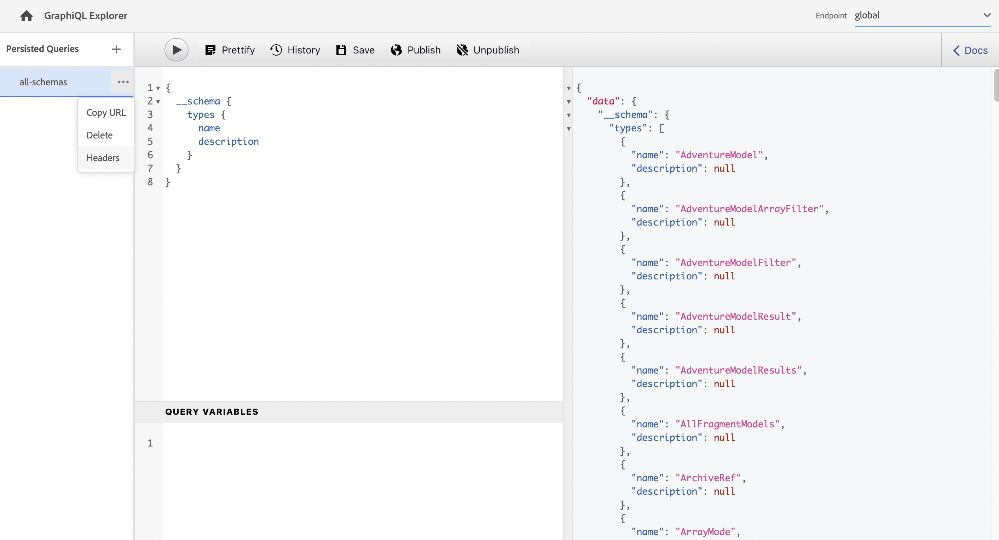

# GraphiQL IDE gebruiken {#graphiql-ide}

Tenuitvoerlegging van de norm [GraphiQL](https://graphql.org/learn/serving-over-http/#graphiql) IDE is beschikbaar voor gebruik met de GraphQL API van as a Cloud Service Adobe Experience Manager (AEM).

>[!NOTE]
>
>GraphiQL is inbegrepen in alle milieu&#39;s van AEM (maar zal slechts toegankelijk/zichtbaar zijn wanneer u uw eindpunten vormt).
>
>In vorige versies was een pakket nodig om GraphiQL IDE te installeren. Als u deze installatie hebt, kunt u deze nu verwijderen.

>[!NOTE]
>U moet [Uw eindpunten geconfigureerd](/help/headless/graphql-api/graphql-endpoint.md) in de [configuratievenster](/help/sites-cloud/administering/content-fragments/content-fragments-configuration-browser.md) voordat u GraphiQL IDE gebruikt.

De **GraphiQL** kunt u uw GraphQL-query&#39;s testen en er fouten in opsporen door het volgende in te stellen:
* Selecteer de **Endpoint** aangewezen aan de configuratie van Plaatsen die u voor uw vragen wilt gebruiken
* direct nieuwe query&#39;s invoeren
* creëren en openen, **[Blijvende query&#39;s](/help/headless/graphql-api/persisted-queries.md)**
* stel uw vragen in werking om de resultaten onmiddellijk te zien
* beheren **Query-variabelen**
* opslaan en beheren **Blijvende query&#39;s**
* publiceren of publiceren ongedaan maken, **Blijvende query&#39;s** (bijvoorbeeld van/naar `dev-publish`)
* zie **Historie** van uw vorige vragen
* gebruiken **Documentatieverkenner** toegang tot de documentatie; helpen u te leren en te begrijpen welke methoden beschikbaar zijn.

U kunt tot de vraagredacteur van één van beiden toegang hebben:

* **Gereedschappen** -> **Algemeen** -> **GraphQL Query Editor**
* rechtstreeks; bijvoorbeeld: `http://localhost:4502/aem/graphiql.html`

U kunt GraphiQL op uw systeem gebruiken zodat de vragen door uw cliënttoepassing kunnen worden gevraagd gebruikend verzoeken, en voor het publiceren van vragen. Voor productiegebruik kunt u vervolgens [verplaats uw vragen naar uw productieomgeving](/help/headless/graphql-api/persisted-queries.md#transfer-persisted-query-production). Aanvankelijk aan productieauteur voor het bevestigen van onlangs authored inhoud met de vragen, en productie publiceren voor levende consumptie.

## Het selecteren van uw eindpunt {#selecting-endpoint}

Als eerste stap moet u de **[Endpoint](/help/headless/graphql-api/graphql-endpoint.md)** die u voor de vragen wilt gebruiken. Het eindpunt is aangewezen aan de configuratie van Plaatsen die u voor uw vragen wilt gebruiken.

Dit is beschikbaar in de vervolgkeuzelijst rechtsboven.

## Een nieuwe query maken en doorgaan {#creating-new-query}

U kunt uw nieuwe vraag in de redacteur ingaan - die in het midden-linkerpaneel, direct onder het logo GraphiQL is.

>[!NOTE]
>
>Als u al een aanhoudende query hebt geselecteerd en in het deelvenster Editor wordt weergegeven, selecteert u `+` (naast **Blijvende query&#39;s**) om de editor leeg te maken voor de nieuwe query.

Begin gewoon te typen, de redacteur ook:

* gebruikt mouseOver om aanvullende informatie over elementen weer te geven
* biedt functies zoals syntaxismarkering, automatisch aanvullen en automatisch voorstellen

>[!NOTE]
>
>GraphQL-query&#39;s beginnen doorgaans met een `{` teken.
>
>Lijnen die beginnen met een `#` worden genegeerd.

Gebruiken **Opslaan als** om uw nieuwe vraag voort te zetten.

## Uw voortgezette query bijwerken {#updating-persisted-query}

Selecteer de query die u wilt bijwerken in de lijst in het dialoogvenster **Blijvende query&#39;s** (helemaal links).

De query wordt weergegeven in het deelvenster Editor. Breng de gewenste wijzigingen aan en gebruik vervolgens **Opslaan** om uw updates aan de persisted query vast te leggen.

## Bezig met uitvoeren van query&#39;s {#running-queries}

U kunt een nieuwe vraag in werking stellen onmiddellijk, of u kunt een voortgezette vraag laden en in werking stellen. Als u een blijvende query wilt laden, selecteert u deze in de lijst. De query wordt dan weergegeven in het editorpaneel.

In beide gevallen is de query die wordt weergegeven in het editorpaneel de query die wordt uitgevoerd wanneer u een van de volgende twee doet:

* klikken/tikken op de **Query uitvoeren** pictogram
* de toetsenbordcombinatie gebruiken `Control-Enter`

## Query-variabelen {#query-variables}

<!-- more details needed here? -->

Met GraphiQL IDE kunt u ook uw [Query-variabelen](/help/headless/graphql-api/content-fragments.md#graphql-variables).

Bijvoorbeeld:

## Het beheren van geheime voorgeheugen voor uw persistente vragen {#managing-cache}

[Blijvende query&#39;s](/help/headless/graphql-api/persisted-queries.md) worden aanbevolen, omdat deze in de verzender- en CDN-lagen in het cachegeheugen kunnen worden opgeslagen, waardoor de prestaties van de toepassing die de aanvraag indient, uiteindelijk worden verbeterd. Standaard maakt AEM de CDN-cache (Content Delivery Network) ongeldig op basis van een standaardtijd tot live (TTL).

>[!NOTE]
>
>Aangepaste herschrijfregels voor Dispatcher kunnen de standaardinstellingen van AEM publicatie overschrijven.
>
>Als u op TTL-Gebaseerde cache-control kopballen van de verzender verzendt, die op een patroon van de plaatsovereenkomst wordt gebaseerd, dan, indien nodig, zou u kunnen willen uitsluiten `/graphql/execute.json/*` van de wedstrijden.

Gebruikend GraphQL kunt u de Kopballen van het Geheime voorgeheugen van HTTP vormen om deze parameters voor uw individuele persisted vraag te controleren.

1. De **Kopteksten** Deze optie is toegankelijk via de drie verticale stippen rechts van de naam van de voortgezette query (het linkerdeelvenster):

   

1. Als u deze optie selecteert, wordt het dialoogvenster **Cacheconfiguratie** dialoogvenster:

   

1. Selecteer de gewenste parameter en pas vervolgens de gewenste waarde aan:

   * **cache-control** - **maximale leeftijd**
Deze inhoud kan gedurende een opgegeven aantal seconden in cache worden opgeslagen. Dit is doorgaans de TTL-indeling van de browser (tijd om te leven).
   * **surrogaatcontrole** - **s-maxage**
Hetzelfde als maximale leeftijd, maar is specifiek van toepassing op proxycaches.
   * **surrogaatcontrole** - **stale-while-revalidate**
De bussen kunnen een caching reactie blijven dienen nadat het, tot het gespecificeerde aantal seconden stale wordt.
   * **surrogaatcontrole** - **stale-if-error**
In geval van een fout of een fout van de oorsprong kan het optreden van een cache gedurende een opgegeven aantal seconden worden voortgezet.

1. Selecteren **Opslaan** om de wijzigingen voort te zetten.

## Het publiceren van voortgeduurde vragen {#publishing-persisted-queries}

Als u de doorlopende query in de lijst hebt geselecteerd (linkerdeelvenster), kunt u de opdracht **Publiceren** en **Publiceren ongedaan maken** handelingen. Hiermee worden ze geactiveerd in uw publicatieomgeving (bijvoorbeeld `dev-publish`) voor eenvoudige toegang door uw toepassingen tijdens het testen.

>[!NOTE]
>
>De definitie van het voorgeheugen van de persisted query `Time To Live` {&quot;cache-control&quot;:&quot;parameter&quot;:value} heeft een standaardwaarde van 2 uur (7200 seconden).

## URL kopiëren om rechtstreeks toegang te krijgen tot de query {#copy-url}

De **URL kopiëren** Met deze optie kunt u een query simuleren door de URL te kopiëren die wordt gebruikt voor directe toegang tot de voortgezette query en de resultaten te bekijken. Dit kan vervolgens voor tests worden gebruikt; bijvoorbeeld door toegang te krijgen tot een browser:

<!--
  >[!NOTE]
  >
  >The URL will need [encoding before using programmatically](/help/headless/graphql-api/persisted-queries.md#encoding-query-url).
  >
  >The target environment might need adjusting, depending on your requirements.
-->

Bijvoorbeeld:

`http://localhost:4502/graphql/execute.json/global/article-list-01`

Door deze URL in browser te gebruiken, kunt u de resultaten bevestigen:

De **URL kopiëren** Deze optie is toegankelijk via de drie verticale stippen rechts van de naam van de voortgezette query (het linkerdeelvenster):

## Doorlopende query&#39;s verwijderen {#deleting-persisted-queries}

De **Verwijderen** Deze optie is ook toegankelijk via de drie verticale stippen rechts van de naam van de blijvend query (het linkerdeelvenster).

<!-- what happens if you try to delete something that is still published? -->

## Uw blijvende query installeren op productie {#installing-persisted-query-production}

Na het ontwikkelen van en het testen van uw persistente vraag met GraphiQL, is het definitieve doel: [deze naar uw productieomgeving overbrengen](/help/headless/graphql-api/persisted-queries.md#transfer-persisted-query-production) voor gebruik door uw toepassingen.

## Sneltoetsen {#keyboard-shortcuts}

Er zijn een selectie van toetsenbordkortere weg die directe toegang tot actiepictogrammen in winde verlenen:

* Query uitvoeren:  `Shift-Control-P`
* Query samenvoegen:  `Shift-Control-M`
* Query uitvoeren:  `Control-Enter`
* Automatisch aanvullen:  `Control-Space`

>[!NOTE]
>
>Op sommige toetsenborden `Control` key is gelabeld als `Ctrl`.
