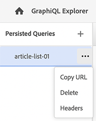

# GraphiQL IDE gebruiken {#graphiql-ide}

Een implementatie van standaard [ GraphiQL ](https://graphql.org/learn/serving-over-http/#graphiql) winde is beschikbaar voor gebruik met GraphQL API van as a Cloud Service Adobe Experience Manager (AEM).

>[!NOTE]
>
>GraphiQL is inbegrepen in alle milieu&#39;s van AEM (maar zal slechts toegankelijk/zichtbaar zijn wanneer u uw eindpunten vormt).
>
>In vorige versies was een pakket nodig om de GraphiQL IDE te installeren. Als u deze installatie hebt, kunt u deze nu verwijderen.

>[!NOTE]
>U moet [ gevormd hebben uw eindpunten ](/help/headless/graphql-api/graphql-endpoint.md) in [ configuratiebrowser ](/help/sites-cloud/administering/content-fragments/setup.md#enable-content-fragment-functionality-configuration-browser) alvorens IDE GraphiQL te gebruiken.

Het **GraphiQL** hulpmiddel laat u testen en zuivert uw vragen van GraphQL door u toe te laten:
* selecteer het **Eindpunt** aangewezen aan de configuratie van Plaatsen die u voor uw vragen wilt gebruiken
* direct nieuwe query&#39;s invoeren
* creeer, en toegang, **[Verlengde Vragen](/help/headless/graphql-api/persisted-queries.md)**
* stel uw vragen in werking om de resultaten onmiddellijk te zien
* beheer **Variabelen van de Vraag**
* sparen, en beheer **Verlengde Vragen**
* publiceer, of unpublish, **Persisted Vragen**, aan of uw **Publish** of **Voorproef** dienst; bijvoorbeeld, aan/van `dev-publish`
* zie de **Geschiedenis** van uw vorige vragen
* gebruik de **Ontdekkingsreiziger van de Documentatie** om tot de documentatie toegang te hebben; het helpen u leren en begrijpen welke methodes beschikbaar zijn.

U kunt tot de vraagredacteur van één van beiden toegang hebben:

* **Hulpmiddelen** > **Algemeen** > **de Redacteur van de Vraag van GraphQL**
* direct; bijvoorbeeld `http://localhost:4502/aem/graphiql.html`

U kunt GraphiQL op uw systeem gebruiken zodat de vragen door uw cliënttoepassing kunnen worden gevraagd gebruikend verzoeken, en voor het publiceren van vragen. Voor productiegebruik, kunt u uw vragen dan [ bewegen aan uw productiemilieu ](/help/headless/graphql-api/persisted-queries.md#transfer-persisted-query-production). Aanvankelijk aan productieauteur voor het bevestigen van onlangs authored inhoud met de vragen, en productie publiceren voor levende consumptie.

## Het selecteren van uw eindpunt {#selecting-endpoint}

Als eerste stap moet u het **[Eindpunt](/help/headless/graphql-api/graphql-endpoint.md)** selecteren dat u voor de vragen wilt gebruiken. Het eindpunt is aangewezen aan de configuratie van Plaatsen die u voor uw vragen wilt gebruiken.

Dit is beschikbaar in de vervolgkeuzelijst rechtsboven.

## Een nieuwe query maken en doorgaan {#creating-new-query}

U kunt uw nieuwe vraag in de redacteur ingaan - die in het midden-linkerpaneel, direct onder het logo GraphiQL is.

>[!NOTE]
>
>Als u reeds een voortgezette vraag hebt geselecteerd, en het tonen in het redacteurspaneel, dan uitgezocht `+` (naast **Gepersisteerde Vragen**) om de redacteur klaar voor uw nieuwe vraag leeg te maken.

Begin gewoon te typen, de redacteur ook:

* gebruikt mouseOver om aanvullende informatie over elementen weer te geven
* biedt functies zoals syntaxismarkering, automatisch aanvullen en automatisch voorstellen

>[!NOTE]
>
>GraphQL-query&#39;s beginnen doorgaans met een `{` -teken.
>
>Lijnen die beginnen met een `#` worden genegeerd.

Gebruik **sparen als** om uw nieuwe vraag voort te zetten.

## Uw voortgezette query bijwerken {#updating-persisted-query}

Selecteer de vraag u van de lijst in het **Blijven paneel van Vragen** (ver links) wilt bijwerken.

De vraag wordt getoond in het redacteurspaneel. Breng om het even welke veranderingen aan u nodig hebt, dan gebruik **sparen** om uw updates aan de persisted vraag vast te leggen.

## Query&#39;s uitvoeren {#running-queries}

U kunt een nieuwe vraag in werking stellen onmiddellijk, of u kunt een voortgezette vraag laden en in werking stellen. Als u een voortgezette query wilt laden, selecteert u deze in de lijst. De query wordt weergegeven in het deelvenster Editor.

In beide gevallen is de query die in het editorpaneel wordt weergegeven, de query die wordt uitgevoerd wanneer u een van de volgende twee doet:

* selecteren op het **Uitvoeren pictogram van de Vraag**
* de toetsenbordcombinatie gebruiken `Control-Enter`

## Query-variabelen {#query-variables}

GrahiQL winde laat u ook uw [ Variabelen van de Vraag ](/help/headless/graphql-api/content-fragments.md#graphql-variables) beheren.

Bijvoorbeeld:

## Het beheren van geheime voorgeheugen voor uw persistente vragen {#managing-cache}

[ Verblijfsde vragen ](/help/headless/graphql-api/persisted-queries.md) worden geadviseerd aangezien zij bij de verzender en CDN lagen kunnen worden in het voorgeheugen ondergebracht, uiteindelijk verbeterend de prestaties van de het vragen cliënttoepassing. Standaard maakt AEM de CDN-cache (Content Delivery Network) ongeldig op basis van een standaardtijd tot live (TTL).

>[!NOTE]
>
>Zie [ Caching van uw gepresteerde vragen ](/help/headless/graphql-api/persisted-queries.md#caching-persisted-queries).

>[!NOTE]
>
>Aangepaste herschrijfregels voor de Dispatcher kunnen de standaardinstellingen van AEM publicatie overschrijven.
>
>Als u op TTL gebaseerde op cache gebaseerde headers van de verzender verzendt, op basis van een patroon van locatieovereenkomst, wilt u `/graphql/execute.json/*` indien nodig uitsluiten van de overeenkomsten.

Gebruikend GraphQL kunt u de Kopballen van het Geheime voorgeheugen van HTTP vormen om deze parameters voor uw individuele persisted vraag te controleren.

1. De **Kopballen** optie is toegankelijk via de drie verticale punten rechts van de voortgeduurde vraagnaam (ver linkerpaneel):

   ](assets/cfm-graphqlapi-headers-02.png "

1. Selecteer de gewenste parameter en pas vervolgens de gewenste waarde aan:

   * **cache-controle** - **max-age**
Deze inhoud kan gedurende een opgegeven aantal seconden in cache worden opgeslagen. Dit is doorgaans de TTL-browser (Time To Live).
   * **surrogate-controle** - **s-maxage**
Hetzelfde als maximale leeftijd, maar is specifiek van toepassing op proxycaches.
   * **surrogate-controle** - **stale-while-revalidate**
De bussen kunnen een caching reactie blijven dienen nadat het, tot het gespecificeerde aantal seconden stale wordt.
   * **surrogate-controle** - **schaal-als-fout**
In geval van een fout of een fout van de oorsprong kan het optreden van een cache gedurende een opgegeven aantal seconden worden voortgezet.

1. Selecteer **sparen** om de veranderingen voort te zetten.

## Doorlopende query&#39;s publiceren en voorvertonen {#publishing-previewing-persisted-queries}

Zodra u uw voortgezette vraag van de lijst (linkerpaneel) hebt geselecteerd kunt u de **Publish** actie gebruiken.

Hierdoor wordt de query geactiveerd naar de omgeving die u selecteert. U kunt of uw **milieu van Publish** kiezen (bijvoorbeeld, `dev-publish`), of uw **milieu van de Voorproef** voor gemakkelijke toegang door uw toepassingen wanneer het testen.

>[!NOTE]
>
>De definitie van het cache `Time To Live` {&quot;cache-control&quot;:&quot;parameter&quot;:value} van de aanblijvende query heeft een standaardwaarde van 2 uur (7200 seconden).

## Publiceren van doorlopende query&#39;s ongedaan maken {#unpublishing-persisted-queries}

Zoals wanneer het publiceren, zodra u uw voortgezette vraag van de lijst (linkerpaneel) hebt geselecteerd kunt u **gebruiken unpublish** actie.

Dit zal de vraag van het milieu deactiveren u selecteert; of uw **milieu van Publish**, of uw **milieu van de Voorproef**.

>[!NOTE]
>
>Zorg er ook voor dat u de benodigde wijzigingen in uw clienttoepassing hebt aangebracht om mogelijke problemen te voorkomen.

## URL kopiëren om rechtstreeks toegang te krijgen tot de query {#copy-url}

De **optie van het Exemplaar URL** laat u een vraag simuleren, door URL te kopiëren die wordt gebruikt om tot de voortgeduurde vraag direct toegang te hebben en de resultaten te zien. Dit kan vervolgens voor testdoeleinden worden gebruikt, bijvoorbeeld door toegang te krijgen tot een browser:

<!--
  >[!NOTE]
  >
  >The URL needs [encoding before using programmatically](/help/headless/graphql-api/persisted-queries.md#encoding-query-url).
  >
  >The target environment might need adjusting, depending on your requirements.
-->

Bijvoorbeeld:

`http://localhost:4502/graphql/execute.json/global/article-list-01`

Door deze URL in browser te gebruiken, kunt u de resultaten bevestigen:

De **optie van het Exemplaar URL** is toegankelijk via de drie verticale punten rechts van de voortgeduurde vraagnaam (ver linkerpaneel):

## Doorlopende query&#39;s verwijderen {#deleting-persisted-queries}

De **schrapping** optie is ook toegankelijk via de drie verticale punten rechts van de voortgeduurde vraagnaam (ver linkerpaneel).

<!-- what happens if you try to delete something that is still published? -->

## Uw blijvende query installeren op productie {#installing-persisted-query-production}

Na het ontwikkelen van en het testen van uw persistente vraag met GraphiQL, is het definitieve doel het [ over te brengen naar uw productiemilieu ](/help/headless/graphql-api/persisted-queries.md#transfer-persisted-query-production) voor gebruik door uw toepassingen.

## Sneltoetsen {#keyboard-shortcuts}

Er zijn een selectie van toetsenbordkortere weg die directe toegang tot actiepictogrammen in winde verlenen:

* Query uitvoeren: `Shift-Control-P`
* Query samenvoegen: `Shift-Control-M`
* Query uitvoeren: `Control-Enter`
* Automatisch aanvullen: `Control-Space`

>[!NOTE]
>
>Op sommige toetsenborden wordt de `Control` -toets gelabeld als `Ctrl` .
