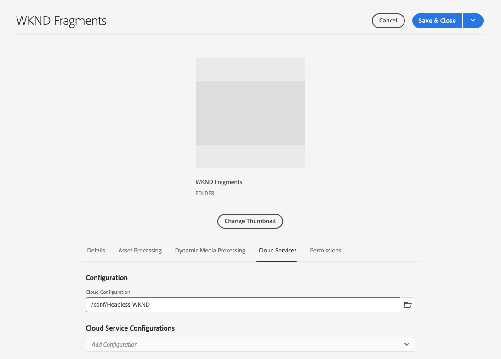

# Een middelenmap maken - Instellingen zonder kop {#creating-an-assets-folder}

Met Modellen AEM inhoudsfragmenten kunt u de structuur van inhoudsfragmenten definiëren als de basis voor inhoud zonder kop. Inhoudsfragmenten worden vervolgens in mappen met elementen opgeslagen.

## Wat is een middelenmap? {#what-is-an-assets-folder}

[Nu u modellen voor inhoudsfragmenten hebt gemaakt](create-content-model.md) waarmee u de gewenste structuur voor toekomstige inhoudsfragmenten definieert, kunt u waarschijnlijk bepaalde fragmenten maken.

U moet echter eerst een map met middelen maken waarin u deze wilt opslaan.

Elementenmappen worden gebruikt om [traditionele inhoudselementen ordenen](/help/assets/manage-digital-assets.md) zoals afbeeldingen en video&#39;s, samen met inhoudsfragmenten.

## Een middelenmap maken {#how-to-create-an-assets-folder}

Een beheerder hoeft alleen maar af en toe mappen te maken om de inhoud te ordenen terwijl deze wordt gemaakt. Voor deze gids Aan de slag hoeven we slechts één map te maken.

1. Log in AEM as a Cloud Service en selecteer in het hoofdmenu **Navigation > Middelen > Bestanden**.
1. Selecteren **Maken > Map**.
1. Geef een **Titel** en **Naam** voor uw map.
   * De **Titel** moeten beschrijvend zijn.
   * De **Naam** wordt de knooppuntnaam in de gegevensopslagruimte.
      * Deze wordt automatisch gegenereerd op basis van de titel en aangepast op basis van [AEM naamconventies](/help/implementing/developing/introduction/naming-conventions.md).
      * Deze kan zo nodig worden aangepast.

   
1. Selecteer de map die u hebt gemaakt door op het vinkje te tikken en erop te klikken. Selecteer vervolgens **Eigenschappen** van de werkbalk (of gebruik de `p` [sneltoets](/help/sites-cloud/authoring/sites-console/keyboard-shortcuts.md)).
1. In de **Eigenschappen** venster, selecteert u de **Cloud Servicen** tab.
1. Voor de **Cloud Configuration** Selecteer de [eerder gemaakte configuratie.](create-configuration.md)
   
1. Selecteren **Opslaan en sluiten**.
1. Selecteren **OK** in het bevestigingsvenster.

   

U kunt aanvullende submappen maken in de map die u hebt gemaakt. De submappen nemen de **Cloud Configuration** van de bovenliggende map. Dit kan worden met voeten getreden echter als u modellen van een andere configuratie wilt gebruiken.

U kunt een gelokaliseerde sitestructuur gebruiken [een hoofdmap voor een taal maken](/help/assets/translate-assets.md) onder uw nieuwe map.

## Volgende stappen {#next-steps}

Nu u een map voor de inhoudsfragmenten hebt gemaakt, kunt u verdergaan naar het vierde gedeelte van de gids Aan de slag en [maken, inhoudsfragmenten](create-content-fragment.md).

>[!TIP]
>
>Voor volledige details over het beheren van Inhoudsfragmenten raadpleegt u de [Documentatie over inhoudsfragmenten](/help/sites-cloud/administering/content-fragments/overview.md)
