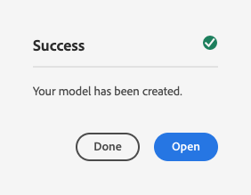
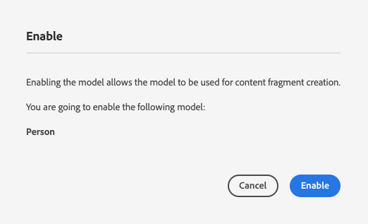

# Modellen voor inhoudsfragmenten maken - Instellingen zonder kop {#creating-content-fragment-models}

Definieer de structuur van de inhoud die u wilt maken en gebruiken met behulp van AEM mogelijkheden zonder kop door Modellen van inhoudsfragmenten te gebruiken.

## Wat zijn modellen van inhoudsfragmenten? {#what-are-content-fragment-models}

[Nu u een configuratie hebt gecreeerd,](create-configuration.md) U kunt het gebruiken om de Modellen van het Fragment van de Inhoud te creëren.

Met Content Fragment Models wordt de structuur gedefinieerd van de gegevens en inhoud die u in AEM maakt en beheert. Ze dienen als een soort basisstructuur voor je inhoud. Wanneer u ervoor kiest inhoud te maken, selecteren de auteurs een model voor inhoudsfragmenten dat u definieert en dat hen bij het maken van inhoud begeleidt.

## Een model voor een inhoudsfragment maken {#how-to-create-a-content-fragment-model}

Een informatiearchitect zou deze taken slechts sporadisch uitvoeren aangezien de nieuwe modellen worden vereist. Om aan de slag te kunnen gaan, hoeven we maar één model te maken.

1. Log in AEM as a Cloud Service en selecteer in het hoofdmenu **Gereedschappen**, **Algemeen**, **Modellen van inhoudsfragmenten**.
1. Selecteer de map die u hebt gemaakt door uw configuratie te maken.

   
1. Selecteren **Maken**.
1. Geef een **Modeltitel**, **Tags** en **Beschrijving**. U kunt ook selecteren/deselecteren **Model inschakelen** om te bepalen of het model onmiddellijk na verwezenlijking wordt toegelaten.

   
1. Selecteer in het bevestigingsvenster **Openen** om uw model te configureren.

   
1. Met de **Inhoudsfragmentmodeleditor** kunt u het inhoudsfragmentmodel samenstellen door velden te slepen en neer te zetten vanaf het tabblad **Gegevenstypen** kolom.

   

1. Nadat u een veld hebt geplaatst, moet u de eigenschappen ervan configureren. De redacteur zal automatisch aan **Eigenschappen** voor het toegevoegde veld waarin u de verplichte velden kunt opgeven.

   

1. Wanneer u klaar bent met het samenstellen van uw model, selecteert u **Opslaan**.

1. De modus van het gemaakte model is afhankelijk van of u **Model inschakelen** bij het maken van het model:
   * geselecteerd - het nieuwe model zal reeds worden geselecteerd **Ingeschakeld**
   * niet geselecteerd - het nieuwe model wordt gecreeerd in **Concept** mode

1. Als dit nog niet het geval is, moet het model **Ingeschakeld** om het te gebruiken.
   1. Selecteer het model dat u hebt gemaakt en selecteer **Inschakelen**.

      
   1. Bevestig het toelaten van het model door te tikken of te klikken **Inschakelen** in het bevestigingsdialoogvenster.

      
1. Het model is nu ingeschakeld en klaar voor gebruik.

   

De **Inhoudsfragmentmodeleditor** ondersteunt veel verschillende gegevenstypen, zoals eenvoudige tekstvelden, elementverwijzingen, verwijzingen naar andere modellen en JSON-gegevens.

U kunt meerdere modellen maken. Modellen kunnen verwijzen naar andere inhoudsfragmenten. Gebruiken [configuraties](create-configuration.md) om uw modellen te organiseren.

## Volgende stappen {#next-steps}

Nu u de structuren van uw Inhoudsfragmenten hebt gedefinieerd door modellen te maken, kunt u verdergaan naar het derde deel van de gids Aan de slag en [Maak mappen waarin u de fragmenten zelf opslaat.](create-assets-folder.md)

>[!TIP]
>
>Voor volledige informatie over modellen van inhoudsfragmenten raadpleegt u de [Documentatie bij Content Fragment Models](/help/sites-cloud/administering/content-fragments/content-fragment-models.md)
