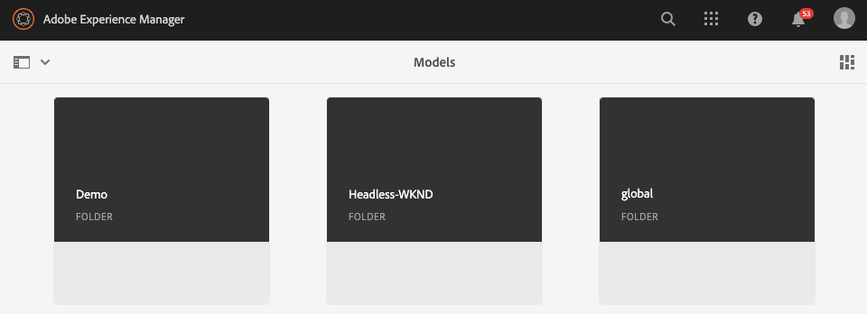
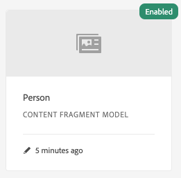

# Modellen voor inhoudsfragmenten maken - Instellingen zonder kop {#creating-content-fragment-models}

Definieer de structuur van de inhoud die u wilt maken en gebruiken met behulp van AEM-functies zonder kop door gebruik te maken van Modellen van inhoudsfragmenten.

## Wat zijn modellen van inhoudsfragmenten? {#what-are-content-fragment-models}

[ nu dat u een configuratie ](create-configuration.md) hebt gecreeerd, kunt u het gebruiken om de Modellen van het Fragment van de Inhoud tot stand te brengen.

Met Content Fragment Models wordt de structuur gedefinieerd van de gegevens en inhoud die u maakt en beheert in AEM. Ze dienen als een soort basisstructuur voor je inhoud. Wanneer u ervoor kiest inhoud te maken, selecteren de auteurs een model voor inhoudsfragmenten dat u definieert en dat hen bij het maken van inhoud begeleidt.

## Een model voor een inhoudsfragment maken {#how-to-create-a-content-fragment-model}

Een informatiearchitect zou deze taken slechts sporadisch uitvoeren aangezien de nieuwe modellen worden vereist. Om aan de slag te kunnen gaan, hoeven we maar één model te maken.

1. Logboek in AEM as a Cloud Service en van het belangrijkste menu selecteert **Hulpmiddelen**, **Algemeen**, **Modellen van het Fragment van de Inhoud**.
1. Selecteer de map die u hebt gemaakt door uw configuratie te maken.

   
1. Selecteer **creeer**.
1. Verstrek a **ModelTitel**, **Markeringen** en **Beschrijving**. U kunt ook selecteren/deselecteren **laat model** toe om te controleren of het model onmiddellijk op verwezenlijking wordt toegelaten.

   
1. In het bevestigingsvenster, uitgezochte **Open** om uw model te vormen.

   
1. Gebruikend de **ModelRedacteur van het Fragment van de Inhoud**, bouwt uw Model van het Fragment van de Inhoud door gebieden van de **3&rbrace; kolom van de Types van Gegevens te slepen en te laten vallen.**

   

1. Nadat u een veld hebt geplaatst, moet u de eigenschappen ervan configureren. De redacteur zal automatisch aan het **lusje van Eigenschappen** voor het toegevoegde gebied schakelen waar u de verplichte gebieden kunt verstrekken.

   

1. Wanneer u wordt gebeëindigd bouwend uw model, uitgezocht **sparen**.

1. De wijze van het gecreeerde model hangt van af of u **Model** selecteerde toen het creëren van het model:
   * geselecteerd - het nieuwe model zal reeds **Toegelaten** zijn
   * niet geselecteerd - het nieuwe model wordt gecreeerd op **1&rbrace; wijze van het Ontwerp &lbrace;**

1. Als niet reeds toegelaten, moet het model **&#x200B;**&#x200B;worden toegelaten om het te gebruiken.
   1. Selecteer het model u creeerde en selecteer dan **toelaten**.

      
   1. Bevestig toelatend het model door te tikken of **te klikken laat** in de bevestigingsdialoog toe.

      
1. Het model is nu ingeschakeld en klaar voor gebruik.

   

De **ModelRedacteur van het Fragment van de Inhoud** steunt vele verschillende gegevenstype zoals eenvoudige tekstgebieden, activaverwijzingen, verwijzingen naar andere modellen, en gegevens JSON.

U kunt meerdere modellen maken. Modellen kunnen verwijzen naar andere inhoudsfragmenten. Gebruik [ configuraties ](create-configuration.md) om uw modellen te organiseren.

## Volgende stappen {#next-steps}

Nu u de structuren van uw Fragmenten van de Inhoud door modellen te creëren hebt bepaald, kunt u zich op het derde deel van begonnen gids bewegen en [ creeert omslagen waar u de fragmenten zelf ](create-assets-folder.md) zult opslaan.

>[!TIP]
>
>Voor volledige details over de Modellen van het Fragment van de Inhoud, zie de [ documentatie van de Modellen van het Fragment van de Inhoud ](/help/sites-cloud/administering/content-fragments/managing-content-fragment-models.md).
