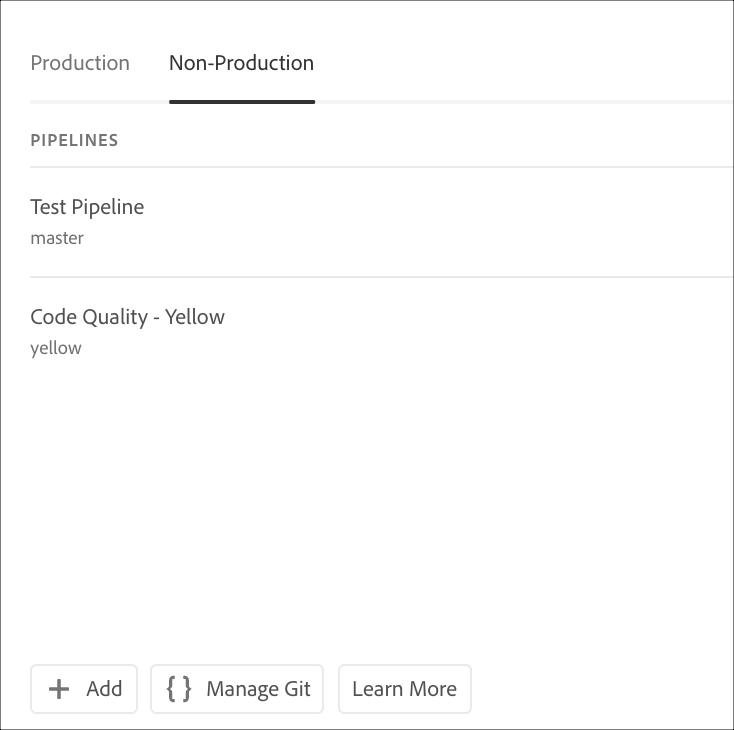
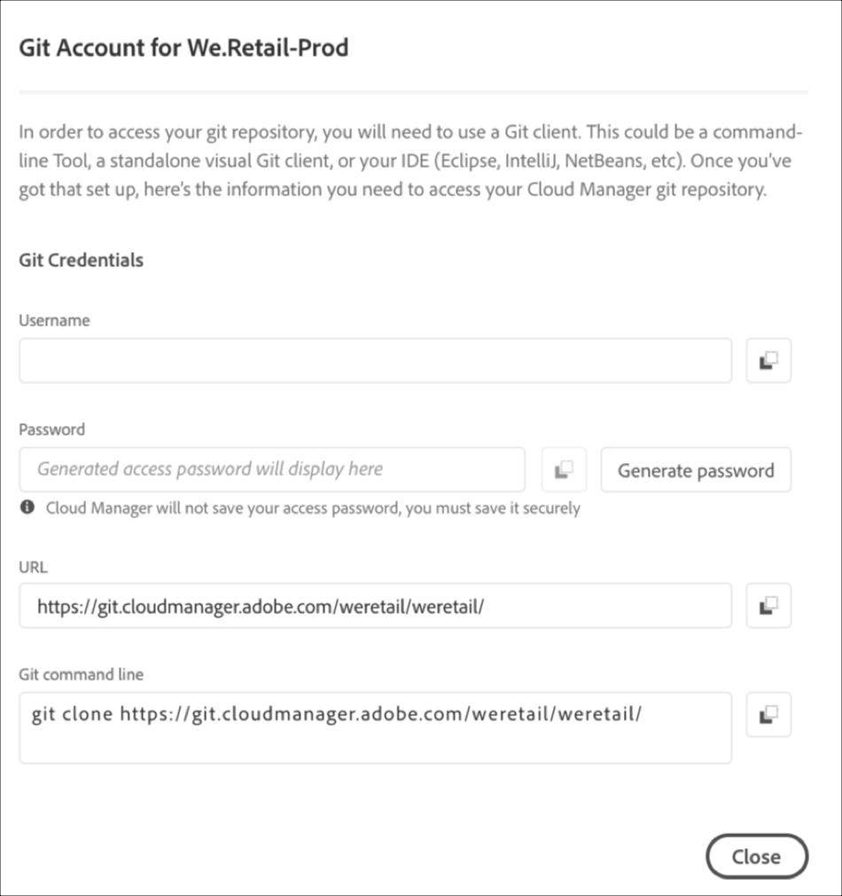

# Toegang tot Git {#accessing-git}

U kunt de Git Repository openen en beheren met Self-Service Git Account Management vanuit de interface van Cloud Manager.

## Het gebruik van Self-Service Git Account Management {#self-service-git}

Gebruik de knop **Git** beheren die beschikbaar is via de interface van Cloud Manager. Dit is het meest opvallend op de pijplijnkaart.

1. Navigeer naar de overzichtspagina *van uw* programma en naar de Pipelinekaart.

1. U ziet de optie **Git** beheren voor toegang tot en beheer van uw Git-opslagplaats.

   

   Bovendien, als u het **Non-Production** pijpleidingslusje selecteert, zult u de **Manage optie van de Git** ook daar bekijken.

   

>[!NOTE]
>De optie **Git** beheren is zichtbaar voor gebruikers met de rol van ontwikkelaar of implementatiebeheerder. Als u op deze knop klikt, wordt een dialoogvenster geopend waarin de gebruiker de URL naar zijn of haar gegevensopslagruimte voor de Intel Health Care Management Suite kan vinden, samen met de gebruikersnaam en het wachtwoord.

De belangrijkste aspecten voor het beheer van uw Git in Cloud Manager zijn:

* **URL**: De URL van de gegevensopslagruimte
* **Gebruikersnaam**: De gebruikersnaam
* **Wachtwoord**: De waarde die wordt weergegeven wanneer op de knop **Wachtwoord genereren** wordt geklikt.

>[!NOTE]
>
>Een gebruiker kan een kopie van de code uitchecken en wijzigingen aanbrengen in de lokale gegevensopslagruimte. Als de gebruiker klaar is, kan hij of zij de wijzigingen in de code doorvoeren naar de externe opslagplaats voor code in Cloud Manager.

