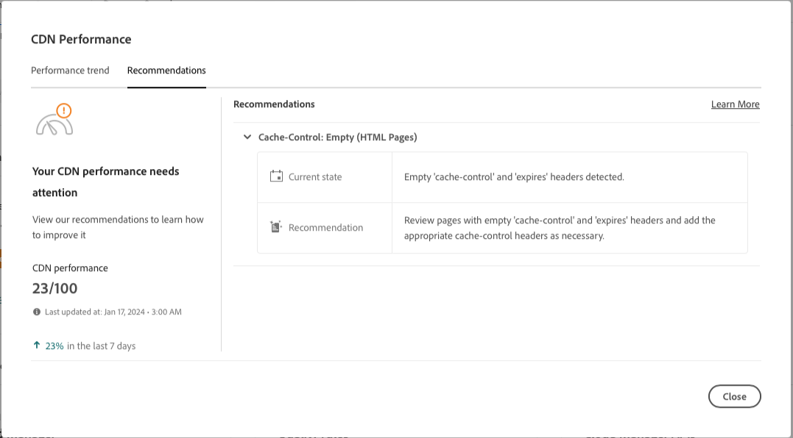

# Dashboard voor CDN-prestaties {#cdn-performance}

Begrijp hoe de Manager van de Wolk de prestaties van het netwerk van de inhoudslevering (CDN) evalueert en wat u van het dashboard kunt leren.

## Overzicht {#overview}

Elk programma van de Manager van de Wolk heeft een CDN prestatiesdashboard. Dit dashboard stelt een algemene score voor CDN prestaties samen met tendensen, alarm, en suggesties voor verbetering voor zonodig voor.


## Het dashboard openen {#accessing}

Het CDN-dashboard is beschikbaar op de overzichtspagina van elk programma.

1. Aanmelden bij Cloud Manager [my.cloudmanager.adobe.com](https://my.cloudmanager.adobe.com/) en selecteert u de gewenste organisatie.

1. Op de **[Mijn programma&#39;s](/help/implementing/cloud-manager/navigation.md#my-programs)** tikken of tikken op het programma waarvan u het CDN-dashboard wilt weergeven.

   

1. Op de **Programmaoverzicht** pagina in uw programma, omlaag schuiven onder de **Omgevingen** en **Pijpleidingen** kaarten om de **Prestaties** kaart.

   

## Het dashboard gebruiken {#using}

Het dashboard presenteert een algemene score voor CDN-prestaties samen met trends, waarschuwingen en suggesties voor verbetering.


Tik of klik voor meer informatie over de CDN-prestaties en voor suggesties voor het verbeteren van de prestaties **De trend weergeven**.


Tik of klik op **Weergave** onder de grafiek om de tijdspanwijdte van de grafiek te veranderen.

Voor suggesties voor het verbeteren van de CDN-prestaties selecteert u de optie **Recommendations** tab.



Tik of klik op het chevron naast een aanbeveling in de lijst om meer informatie te bekijken over de stappen die u moet ondernemen om de situatie te verbeteren en de oorzaak van het probleem.

## Definitie cachegeheugen {#cache-hit}

De cache-raakverhouding is een maat voor het aantal aanvragen dat een cache kan invullen in de cache, vergeleken met het aantal aanvragen dat de cache ontvangt. Hoe hoger een cache-hit-verhouding, hoe beter een CDN wordt uitgevoerd.

>[!TIP]
>
>Adobe raadt gebruikers aan te streven naar een cache-raakverhouding van 99%.

```text
Cache Hit Ratio = Cache Hits / (Hits + Misses + Passes + Other)
```

* **Actief** - Gegevens worden opgevraagd in het cachegeheugen en worden gevonden.
* **Mevrouw** - Gegevens worden opgevraagd in de cache en worden niet gevonden.
* **Voldoende** - Gegevens worden opgevraagd in het cachegeheugen en deze gegevens worden in geen geval in het cachegeheugen opgeslagen.
* **Overige** - Alle gegevensverzoeken van het geheime voorgeheugen die geen ander geval aanpassen.

De cijfers van het geheime voorgeheugen worden bijgewerkt om de 24 uur.

>[!TIP]
>
>Raadpleeg het document voor meer informatie over de interactie tussen Cloud Manager en de CDN en Dispatcher [Caching in AEM as a Cloud Service.](/help/implementing/dispatcher/caching.md)
