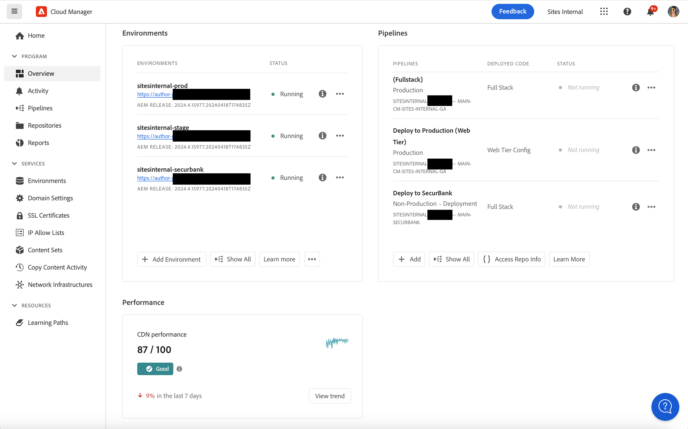

# CDN-prestatiedashboard {#cdn-performance}

Begrijp hoe Cloud Manager de prestaties van het inhoudsleveringsnetwerk (CDN) evalueert en wat u van het dashboard kunt leren.

## Overzicht {#overview}

Elk Cloud Manager-programma heeft een CDN-prestatiedashboard. Dit dashboard stelt een algemene score voor CDN prestaties samen met tendensen, alarm, en suggesties voor verbetering voor zonodig voor.


## Het dashboard openen {#accessing}

Het CDN-dashboard is beschikbaar op de overzichtspagina van elk programma.

1. Logboek in Cloud Manager bij [&#x200B; my.cloudmanager.adobe.com &#x200B;](https://my.cloudmanager.adobe.com/) en selecteer de aangewezen organisatie.

1. Op de **[Mijn console van Programma&#39;s](/help/implementing/cloud-manager/navigation.md#my-programs)**, klik het programma waarvan CDN dashboard u wilt bekijken.

   

1. Op de **pagina van het Overzicht van het 0&rbrace; Programma van uw programma, scrol neer onder de** Milieu **en** Pijpleidingen **kaarten om de** kaart van Prestaties **te zien.**

   

## Het dashboard gebruiken {#using}

Het dashboard presenteert een algemene score voor CDN-prestaties samen met trends, waarschuwingen en suggesties voor verbetering.


Voor details op uw prestaties CDN en voor suggesties op hoe te om het te verbeteren, klik **trend van de Mening**.


Klik **Mening** onder de grafiek om de tijdspanwijdte van de grafiek te veranderen.

Voor suggesties op hoe te om uw prestaties te verbeteren CDN, selecteer het **Recommendations** lusje.


Klik op het chevron naast een aanbeveling in de lijst om details te bekijken over de stappen die moeten worden ondernomen om de situatie te verbeteren en de oorzaak van het probleem.

## Cachehit-definitie {#cache-hit}

De cache-raakverhouding is een maat voor het aantal aanvragen dat een cache kan invullen in de cache, vergeleken met het aantal aanvragen dat de cache ontvangt. Hoe hoger een cache-hit-verhouding, hoe beter een CDN wordt uitgevoerd.

>[!TIP]
>
>Adobe raadt gebruikers aan te streven naar een cache-raakverhouding van 99%.

```text
Cache Hit Ratio = Cache Hits / (Hits + Misses + Passes + Other)
```

* **Actief** - het Gegevens wordt gevraagd van het geheime voorgeheugen, en het wordt gevonden.
* **Mis** - het Gegevens wordt gevraagd van het geheime voorgeheugen, en het wordt niet gevonden.
* **pas** over - het Gegevens wordt gevraagd van het geheime voorgeheugen, en het wordt geplaatst om deze gegevens in geen geval in het voorgeheugen onder te brengen.
* **Andere** - Alle gegevensverzoeken van het geheime voorgeheugen die geen ander geval aanpassen.

De cijfers van het geheime voorgeheugen worden bijgewerkt om de 24 uur.

>[!TIP]
>
>Voor meer details op hoe Cloud Manager en CDN met Dispatcher in wisselwerking staan, zie [&#x200B; Caching in AEM as a Cloud Service &#x200B;](/help/implementing/dispatcher/caching.md).
