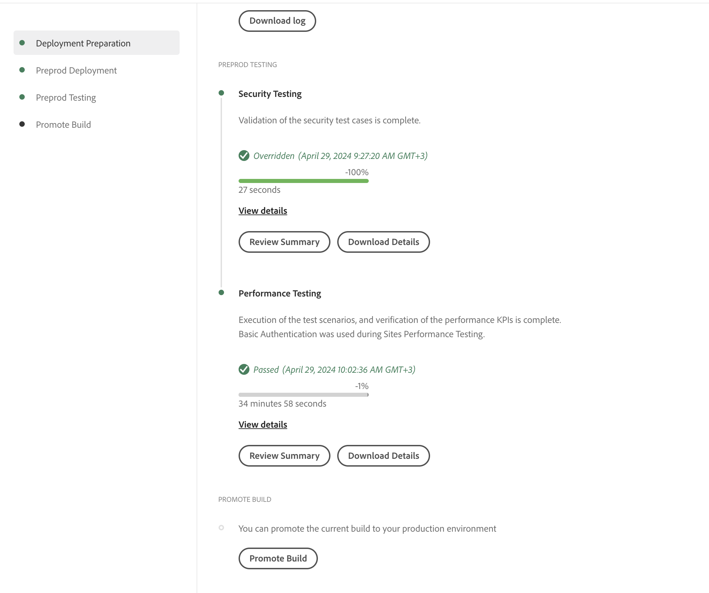
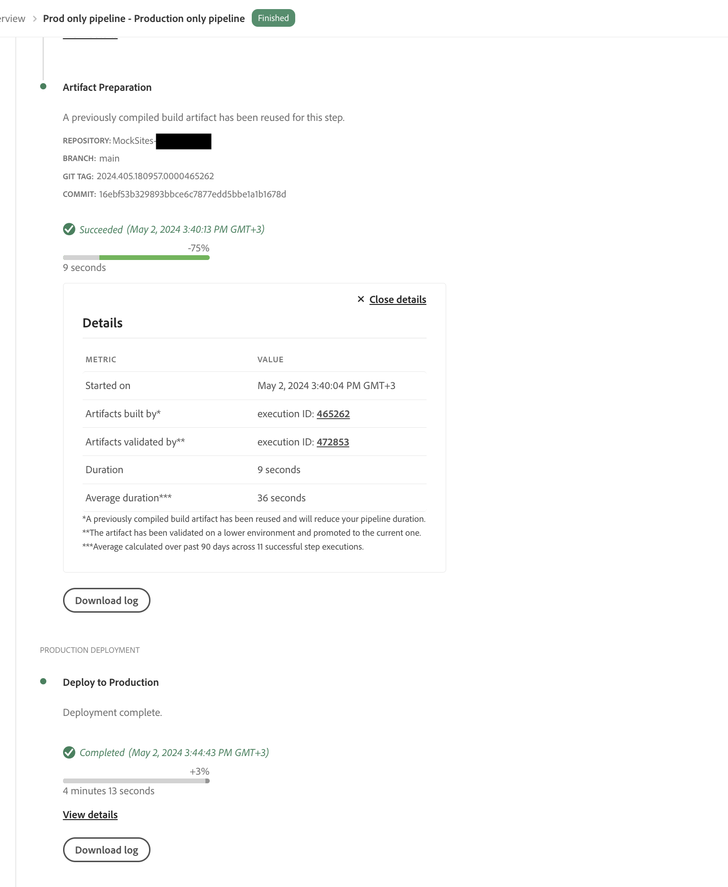

# Pijpleidingen, alleen voor de productie {#stage-prod-only}

Leer hoe u het opvoeren en productielokaties kunt verdelen gebruikend specifieke pijpleidingen.

>[!NOTE]
>
>Deze eigenschap is slechts beschikbaar aan [ het vroege adopterprogramma.](/help/implementing/cloud-manager/release-notes/current.md#early-adoption)

## Overzicht {#overview}

Staging- en productieomgevingen zijn nauw aan elkaar gekoppeld. Door gebrek, worden de plaatsingen aan hen verbonden aan één enkele pijpleiding. Dat is een plaatsingspijpleiding aan zowel de het opvoeren als productiemilieu&#39;s in dat programma opstelt. Hoewel deze koppeling normaal gesproken geschikt is, zijn er bepaalde gevallen waarin er nadelen zijn:

* Als u aan stadium-slechts wenst op te stellen, kunt u dit slechts doen door **te verwerpen bevordert aan Prod** stap in de pijpleiding. De uitvoering wordt echter gemarkeerd als geannuleerd.
* Als u wenst om de recentste code in een het opvoeren milieu aan productie op te stellen, moet u de volledige pijpleiding met inbegrip van de het opvoeren plaatsing opnieuw opstellen alhoewel geen code daar werd veranderd.
* Aangezien omgevingen niet tijdens implementaties kunnen worden bijgewerkt, als u de testomgeving meerdere dagen wilt pauzeren en testen voordat u de productieomgeving promoot, kan de productieomgeving niet worden bijgewerkt. Dit maakt niet-afhankelijke taken zoals het bijwerken van [ milieuvariabelen ](/help/implementing/cloud-manager/getting-access-to-aem-in-cloud/build-environment-details.md#environment-variables) onmogelijk.

De fase-slechts en prod-slechts pijpleidingen bieden oplossingen aan deze gebruiksgevallen door specifieke plaatsingsopties te verstrekken.

* **werkgebied-Enige Pijpleidingen van de Plaatsing** opstellen slechts aan een het opvoeren milieu met de uitvoering die zodra de plaatsing en de tests worden gedaan eindigt.
   * Een alleen-fase pijpleiding gedraagt zich identiek aan de standaard gekoppelde volledige pijpleiding van de stapelprod maar zonder de stappen van de productieleiding (goedkeuring, programma, opstelling).
* **Prod-Enige de Pijpleidingen van de Plaatsing** opstellen slechts aan een productiemilieu met de optie om een met succes gebeëindigde en bevestigde uitvoering op stadium te selecteren en zijn artefacten op prod op te stellen.
   * Prod-enige pijpleidingen zullen de artefacten van de plaatsingen van het stadium hergebruiken, die de bouwfase overslaan.

Noch worden de stadium-enige noch de prod-enige pijpleidingen uitgevoerd terwijl een volledig-stapelproductiepijpleiding loopt en vice versa. Als zowel het stadium-slechts als de full-stack productiepijplijn de **gevormde trekker van de Veranderingen van het Git** hebben en aan de zelfde tak en de bewaarplaats richten, slechts wordt de stadium-enige pijpleiding automatisch begonnen. Prod-slechts pijpleidingen zijn niet begonnen **op de Veranderingen van het Git** aangezien zij niet direct met een bewaarplaats verbonden zijn.

Deze speciale pijpleidingen bieden meer flexibiliteit, maar noteer de volgende details van de werking en aanbevelingen.

## Beperkingen {#limitations}

Pijpleidingen met alleen maar profielen gebruiken altijd de artefacten van de uitsluitend in het stadium gelegen pijpleiding, ongeacht wat er intussen via de standaard gekoppelde productiepijpleiding in het stadium is uitgezet.

* Dit kan leiden tot ongewenste terugdraaiversies van code.
* De Adobe beveelt aan om de standaard gekoppelde productiepijpleiding niet meer te gebruiken zodra u begint met het gebruik van de pijpleidingen met alleen maar een fase en alleen een fase.
* Als u nog steeds besluit om zowel de standaard gekoppelde pijpleidingen als de pijpleidingen met alleen fase/fase uit te voeren, dient u rekening te houden met het hergebruik van artefacten om terugdraaiversies van code te voorkomen.

## Bekende problemen {#known-issues}

Houd ook rekening met de volgende bekende problemen voordat u deze functie gaat testen.

* Als u eenmaal productiepijpleidingen gebruikt, kunt u niet profiteren van de nieuwste AEM updates
   * In sommige gevallen, kan het AEM updateproces uw code terug naar de code terugkeren die het laatst via de volledige stapelpijpleiding werd opgesteld.
* U zult niet om een [ milieu kunnen verzoeken herstelt ](/help/operations/restore.md#offsite-backup) als u productie-slechts of staging-enige pijpleidingen gebruikt.

## Pipetontwerp {#pipeline-creation}

Prod-slechts en stadium-enige pijpleidingen worden gecreeerd op een gelijkaardige manier aan de standaard gekoppelde [ productiepijpleidingen ](/help/implementing/cloud-manager/configuring-pipelines/configuring-production-pipelines.md) en [ niet productiepijpleidingen.](/help/implementing/cloud-manager/configuring-pipelines/configuring-non-production-pipelines.md) Zie deze documenten voor meer informatie.

1. In het **venster van de Pijpleiding**, tik of klik **toevoegen Pijpleiding**.

   * Selecteer **toevoegen niet-ProductiePijpleiding** om een stadium-slechts pijpleiding tot stand te brengen.
   * Selecteer **Voeg de Uitrusting van de Productie slechts Pijpleiding** toe om een pro-enige pijpleiding tot stand te brengen.

   

>[!NOTE]
>
>Bepaalde opties kunnen grijs worden weergegeven als de desbetreffende pijpleidingen al bestaan.
>
>* **voeg slechts de Pijpleiding van de Productie** toe zal niet beschikbaar zijn als een stadium-enige pijpleiding nog niet bestaat.
>* **voeg de Pijpleiding van de Productie toe** zal niet beschikbaar zijn als een standaard gekoppelde pijpleiding reeds bestaat.
>* Per programma zijn slechts één pijpleiding met alleen maar een fase en één pijpleiding toegestaan.

### Alleen met werkgebied uitgeruste pijpleidingen {#stage-only}

1. Zodra u **selecteert voeg niet-Productiepijpleiding** optie toe, **voegt niet-Productie pijplijn** dialoog toe opent.
1. Om een stadium-enige pijpleiding tot stand te brengen, selecteer het werkgebiedmilieu in het **In aanmerking komende gebied van de Milieu van de Plaatsing** voor uw pijpleiding. Voltooi de resterende gebieden en tik of klik **ga** verder.

   

1. Op het **Testen van het Stadium** lusje, kunt u het testen dan bepalen die op het het opvoeren milieu zou moeten worden uitgevoerd. Tik of klik **sparen** om uw nieuwe pijpleiding te bewaren.

### Pijpleidingen, alleen met behulp van propaan {#prod-only}

1. Zodra u **selecteert voeg slechts de optie van de Pijpleiding van de Productie** toe, **voeg slechts de dialoog van de Pijpleiding van de Productie toe** opent.
1. Verstrek de Naam van de a **Pijpleiding**. De resterende opties en functionaliteit van het dialoogvenster werken hetzelfde als die in het standaarddialoogvenster voor het maken van gekoppelde pijplijnen. Tik of klik **sparen** om de pijpleiding te bewaren.

## Uitvoeren van alleen-Prod en alleen-werkgebiedpijplijnen {#running}

Prod-slechts en stadium-enige pijpleidingen worden in werking gesteld op de zelfde manier als [ alle andere pijpleidingen worden in werking gesteld.](/help/implementing/cloud-manager/configuring-pipelines/managing-pipelines.md#running-pipelines) Zie die documentatie voor meer informatie.

Daarnaast kan een pijpleiding met alleen de mogelijkheid van een fase rechtstreeks worden geactiveerd vanaf de uitvoeringsdetails van een pijpleiding met alleen het werkgebied.

### Alleen met werkgebied uitgeruste pijpleidingen {#stage-only-run}

Een pijpleiding met alleen trapsgewijze uitloop loopt vrijwel op dezelfde manier als standaard gekoppelde pijpleidingen. Nochtans aan het eind van de looppas, na de het testen stappen, bevordert a **bouw** knoop u om een pro-enige pijpleiding uitvoering te beginnen die de artefacten gebruikt die op stadium door deze uitvoering worden opgesteld en hen op productie opstelt.

**bevordert bouw** knoop slechts verschijnt als u op de recentste succesvolle stadium-enige pijpleidingsuitvoering bent. Nadat u op de pijplijn hebt getikt of erop hebt geklikt, wordt u gevraagd om de uitvoering van de alleen-lezen pijplijn te bevestigen of om een alleen-lezen pijplijn te maken als deze nog niet bestaat.

### Pijpleidingen, alleen met behulp van propaan {#prod-only-run}

Voor pijpleidingen die alleen voor de productie bestemd zijn, is het van belang de bronartefacten te identificeren die voor de productie zullen worden gebruikt. Deze details kunnen in de **stap van de Voorbereiding van 0} Artefact worden gevonden.** U kunt naar die uitvoeringen navigeren voor meer details en logboeken.

