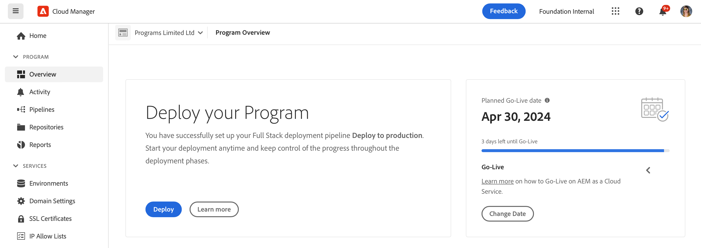
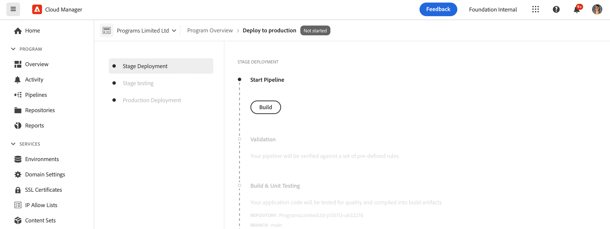

# Uw code implementeren {#deploy-your-code}

## Code implementeren met Cloud Manager {#deploying-code-with-cloud-manager}

Once you have configured your Production **Pipeline** (repository, environment, and testing environment), you are ready to deploy your code.

1. Klik op **Implementeren** in Cloud Manager om het implementatieproces te starten.

   

1. Het **scherm van de Uitvoering** van de Pijpleiding toont.

   Klik op **Genereren** om het proces te starten.

   

1. Het volledige bouwstijlproces stelt uw code op.

   De volgende fasen zijn betrokken bij het bouwproces:

   1. Werkgebiedimplementatie
   1. Werkgebiedtests
   1. Implementatie van productie

   >[!NOTE]
   >
   >Bovendien, kunt u de stappen van diverse plaatsingsprocessen herzien door logboeken, of het herzien van resultaten, voor de testende criteria te bekijken.

   De **Fase-implementatie** omvat de volgende stappen:

   * Validatie: Deze stap zorgt ervoor dat de pijpleiding wordt gevormd om de momenteel beschikbare middelen te gebruiken, bijvoorbeeld, dat de gevormde tak bestaat, zijn de milieu&#39;s beschikbaar.
   * Testen van build en eenheid: Deze stap stelt een containerized bouwstijlproces in werking. Zie [Build Environment Details](/help/onboarding/getting-access-to-aem-in-cloud/creating-aem-application-project.md#build-environment-details) voor meer informatie over de ontwikkelomgeving.
   * Codescannen: Deze stap evalueert de kwaliteit van uw toepassingscode. Zie [Codekwaliteit testen](/help/implementing/cloud-manager/code-quality-testing.md) voor meer informatie over het testproces.
   * Afbeeldingen samenstellen: Deze stap bevat een logbestand van het proces dat wordt gebruikt om afbeeldingen samen te stellen. Dit proces is de oorzaak van het omzetten van de inhoud en de dispatcherpakketten die door de bouwstijlstap in de beelden van de Dokker en configuratie Kubernetes worden geproduceerd.
   * Distribueren naar werkgebied

      
   Voor het **testen van de fase** worden de volgende stappen uitgevoerd:

   * Functioneel testen van product: De pijpleiding van de Manager van de wolk zal de uitvoering van tests steunen die tegen het werkgebiedmilieu lopen.
Raadpleeg Functionele tests voor [producten](/help/implementing/cloud-manager/functional-testing.md#product-functional-testing) voor meer informatie.

   * Aangepaste functionele tests: Deze stap in de pijpleiding is altijd aanwezig en kan niet worden overgeslagen. Als er echter geen test-JAR wordt geproduceerd door de constructie, slaagt de test standaard.\
      Raadpleeg [Aangepaste functionele tests](/help/implementing/cloud-manager/functional-testing.md#custom-functional-testing) voor meer informatie.

   * Controle van inhoud: Deze stap in de pijpleiding is altijd aanwezig en kan niet worden overgeslagen. Aangezien een productiepijplijn wordt uitgevoerd, is een stap van de inhoudcontrole inbegrepen na douane functionele het testen die de controles zal in werking stellen. De pagina&#39;s die worden gevormd zullen aan de dienst worden voorgelegd en geëvalueerd. De resultaten zijn informatief en stellen de gebruiker in staat de scores en de wijziging tussen de huidige en vorige scores te bekijken. Dit inzicht is waardevol om te bepalen als er een regressie is die met de huidige plaatsing zal worden geïntroduceerd.
Raadpleeg de resultaten [van](/help/implementing/cloud-manager/content-audit-testing.md) Content Audit voor meer informatie.

      

## Implementatieproces {#deployment-process}

In de volgende sectie wordt beschreven hoe AEM- en verzendingspakketten in de fase van het werkgebied en in de productiefase worden geïmplementeerd.

Cloud Manager uploadt alle doel-/*.zip-bestanden die tijdens het productieproces zijn gemaakt naar een opslaglocatie.  Deze artefacten worden teruggewonnen van deze plaats tijdens opstellen fasen van de pijpleiding.

Wanneer de Manager van de Wolk aan niet productietopologieën opstelt, is het doel de plaatsing zo snel mogelijk te voltooien en daarom worden de artefacten gelijktijdig opgesteld aan alle knopen als volgt:

1. Cloud Manager bepaalt of elk artefact een AEM- of verzendingspakket is.
1. Cloud Manager verwijdert alle verzenders van de taakverdeler om de omgeving tijdens de implementatie te isoleren.

   Tenzij anders gevormd kunt u de Veranderingen van de Balancer van de Lading in Dev en de Plaatsing van het Stadium overslaan, namelijk losmaken en stappen in zowel niet productiepijpleidingen, voor ontwikkelmilieu&#39;s, als de productiepijplijn, voor werkgebiedmilieu&#39;s vastmaken.

   >[!NOTE]
   >
   >Deze functie wordt naar verwachting vooral gebruikt door 1-1-1 klanten.

1. Elk AEM artefact wordt opgesteld aan elke AEM instantie via de Manager APIs van het Pakket, met pakketgebiedsdelen die de plaatsingsorde bepalen.

   Voor meer informatie over hoe u pakketten kunt gebruiken om nieuwe functionaliteit te installeren, inhoud over te brengen tussen instanties, en file bewaarplaats inhoud, gelieve te verwijzen naar hoe te met Pakketten werken.

   >[!NOTE]
   >
   >Alle AEM artefacten worden opgesteld aan zowel de auteur als de uitgevers. Runmodi moeten worden gebruikt wanneer knoopspecifieke configuraties vereist zijn. Voor meer informatie over hoe de runmodes u toestaan om uw AEM instantie voor een specifiek doel te stemmen, gelieve te verwijzen naar de Wijzen van de Looppas.

1. Het artefact van de verzender wordt als volgt op elke verzender geïmplementeerd:

   1. Er wordt een back-up gemaakt van de huidige configuraties en deze worden naar een tijdelijke locatie gekopieerd
   1. Alle configuraties worden verwijderd, behalve de onveranderlijke bestanden. Raadpleeg Uw Dispatcher Configurations beheren voor meer informatie. Hierdoor worden de mappen gewist zodat er geen zwevende bestanden achterblijven.
   1. Het artefact wordt geëxtraheerd naar de `httpd` map.  Onveranderbare bestanden worden niet overschreven. Wijzigingen die u aanbrengt in onveranderlijke bestanden in uw it-opslagplaats, worden genegeerd op het moment van implementatie.  Deze bestanden vormen de kern van het AMS-verzenderframework en kunnen niet worden gewijzigd.
   1. Apache voert een configuratietest uit. Als er geen fouten worden gevonden, wordt de service opnieuw geladen. Als er een fout optreedt, worden de configuraties hersteld vanaf de back-up, wordt de service opnieuw geladen en wordt de fout gemeld aan Cloud Manager.
   1. Elk pad dat in de pijplijnconfiguratie is opgegeven, wordt ongeldig gemaakt of verwijderd uit het cachegeheugen van de verzender.

   >[!NOTE]
   >
   >Cloud Manager verwacht dat het artefact van de verzender de volledige bestandsset bevat.  Alle Dispatcher-configuratiebestanden moeten aanwezig zijn in de it-opslagplaats. Ontbrekende bestanden of mappen leiden tot een implementatiefout.

1. Nadat alle AEM- en verzendingspakketten naar alle knooppunten zijn geïmplementeerd, worden de verzenders weer toegevoegd aan het taakverdelingsmechanisme en is de implementatie voltooid.

   >[!NOTE]
   >
   >U kunt de veranderingen van het taakverdelingsmechanisme in ontwikkeling en werkgebiedplaatsingen overslaan, namelijk losmaken en stappen in zowel niet productiepijpleidingen, voor ontwikkelaarmilieu&#39;s, als de productiepijplijn, voor werkgebiedmilieu&#39;s vastmaken.

### Implementatie naar productiefase {#deployment-production-phase}

Het proces voor het opstellen aan productietopologieën verschilt lichtjes om effect aan AEM bezoekers van de Plaats te minimaliseren.

Productieimplementaties volgen doorgaans dezelfde stappen als hierboven, maar op een voortschrijdende manier:

1. Implementeer AEM pakketten naar de auteur.
1. Dispatcher1 loskoppelen van het taakverdelingsmechanisme.
1. Implementeer AEM pakketten om te publiceren1 en het verzenderpakket om de verzendingscache van Dispatcher1 leeg te maken.
1. Plaats dispatcher1 terug in het taakverdelingsmechanisme.
1. Als dispatcher1 weer in bedrijf is, koppelt u dispatcher2 af van het taakverdelingsmechanisme.
1. Implementeer AEM pakketten om te publiceren2 en het verzenderpakket om de verzendingscache van Dispatcher2 leeg te maken.
1. Plaats dispatcher2 terug in het taakverdelingsmechanisme.
Dit proces gaat verder tot de plaatsing alle uitgevers en verzenders in de topologie heeft bereikt.

