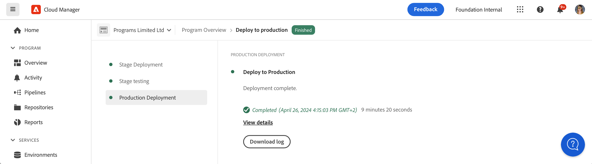

# Uw code implementeren {#deploy-your-code}

Leer hoe u uw code implementeert met gebruik van Cloud Manager-pijpleidingen in AEM as a Cloud Service.

## Uw code implementeren met Cloud Manager in AEM as a Cloud Service {#deploying-code-with-cloud-manager}

Zodra u [Uw productiepijpleiding geconfigureerd](/help/implementing/cloud-manager/configuring-pipelines/configuring-production-pipelines.md) Met inbegrip van bewaarplaats, milieu, en het testen milieu, bent u bereid om uw code op te stellen.

1. Aanmelden bij Cloud Manager [my.cloudmanager.adobe.com](https://my.cloudmanager.adobe.com/) en selecteert u de gewenste organisatie.

1. Klik op het programma waarvoor u code wilt opstellen.

1. Klikken **Implementeren** van de oproep tot actie op de **Overzicht** scherm om het implementatieproces te starten.

   

1. De **Uitvoering pijpleiding** weergegeven. Klikken **Opbouwen** om het proces te starten.

   

Het bouwstijlproces stelt uw code door drie fasen op.

1. [Werkgebiedimplementatie](#stage-deployment)
1. [Werkgebiedtests](#stage-testing)
1. [Implementatie van productie](#production-deployment)

>[!TIP]
>
>U kunt de stappen van diverse plaatsingsprocessen herzien door logboeken, of het herzien van resultaten, voor de testende criteria te bekijken.

## Implementatiefase werkgebied {#stage-deployment}

De **Werkgebiedimplementatie** fase. Deze stappen worden uitgevoerd.

* **Validatie**  - Deze stap zorgt ervoor dat de pijpleiding wordt gevormd om de momenteel beschikbare middelen te gebruiken. Bijvoorbeeld het testen of de geconfigureerde vertakking bestaat en of de omgevingen beschikbaar zijn.
* **Testen van build en eenheid** - Met deze stap wordt een inperkt ontwikkelproces uitgevoerd.
   * Zie het document [Omgevingsdetails samenstellen](/help/implementing/cloud-manager/getting-access-to-aem-in-cloud/build-environment-details.md) voor meer informatie over de ontwikkelomgeving.
* **Codescannen** - Deze stap evalueert de kwaliteit van uw toepassingscode.
   * Zie het document [Testen van de codekwaliteit](/help/implementing/cloud-manager/code-quality-testing.md) voor meer informatie over het testproces.
* **Afbeeldingen samenstellen** - Dit proces is verantwoordelijk voor het transformeren van de inhoud en de verzendingspakketten die door de bouwstijlstap worden geproduceerd in de beelden van Docker en configuraties Kubernetes.
* **Distribueren naar werkgebied** - Het image wordt geïmplementeerd in de testomgeving ter voorbereiding op de [Testfase werkgebied.](#stage-testing)

## Testfase werkgebied {#stage-testing}

De **Werkgebied testen** Deze stappen worden in de fase beschreven.

* **Functioneel testen van producten** - De pijplijn van de Manager van de Wolk voert tests uit die tegen het werkgebiedmilieu lopen.
   * Raadpleeg het document [Functioneel testen van producten](/help/implementing/cloud-manager/functional-testing.md#product-functional-testing) voor meer informatie .

* **Aangepaste functionele tests** - Deze stap in de pijplijn wordt altijd uitgevoerd en kan niet worden overgeslagen. Als er geen test-JAR wordt geproduceerd door de constructie, slaagt de test standaard.
   * Raadpleeg het document [Aangepaste functionele tests](/help/implementing/cloud-manager/functional-testing.md#custom-functional-testing) voor meer informatie .

* **Aangepaste UI-tests** - Deze stap is een optionele functie waarmee automatisch UI-tests worden uitgevoerd die voor aangepaste toepassingen zijn gemaakt.
   * De tests UI zijn op selenium-Gebaseerde tests die in een beeld van de Docker worden verpakt om een brede keus in taal en kaders (zoals Java en Maven, Node en WebDriver.io, of om het even welk ander kader en technologie toe te staan die op Selenium worden voortgebouwd).
   * Raadpleeg het document [Aangepaste UI-tests](/help/implementing/cloud-manager/functional-testing.md#custom-ui-testing) voor meer informatie .

* **Experience Audit** - Deze stap in de pijplijn wordt altijd uitgevoerd en kan niet worden overgeslagen. Aangezien een productiepijplijn wordt uitgevoerd, is een stap van de ervaringscontrole inbegrepen na douane functionele het testen die de controles zal in werking stellen.
   * De pagina&#39;s die worden gevormd worden voorgelegd aan de dienst en geëvalueerd.
   * De resultaten zijn informatief en tonen de scores en de verandering tussen de huidige en vorige scores.
   * Dit inzicht is waardevol om te bepalen als er een regressie is die met de huidige plaatsing zal worden geïntroduceerd.
   * Raadpleeg het document [De resultaten van Experience Audit begrijpen](/help/implementing/cloud-manager/experience-audit-testing.md) voor meer informatie .

## Implementatiefase productie {#deployment-production}

Het proces voor het opstellen aan productietopologieën verschilt lichtjes om impactbezoekers aan een AEM plaats te minimaliseren.

Productieimplementaties volgen doorgaans dezelfde stappen als eerder beschreven, maar op een voortschrijdende manier.

1. Implementeer AEM pakketten naar de auteur.
1. Dispatcher1 loskoppelen van het taakverdelingsmechanisme.
1. Implementeer AEM pakketten om te publiceren1 en het verzenderpakket om de verzendingscache van Dispatcher1 leeg te maken.
1. Plaats dispatcher1 terug in het taakverdelingsmechanisme.
1. Als dispatcher1 weer in bedrijf is, koppelt u dispatcher2 af van het taakverdelingsmechanisme.
1. Implementeer AEM pakketten om te publiceren2 en het verzenderpakket om de verzendingscache van Dispatcher2 leeg te maken.
1. Plaats dispatcher2 terug in het taakverdelingsmechanisme.

Dit proces gaat verder tot de plaatsing alle uitgevers en verzenders in de topologie heeft bereikt.

## Implementatieproces {#deployment-process}

Alle plaatsingen van de Cloud Service volgen een het rollen proces om nul onderbreking te verzekeren. Raadpleeg het document [Hoe de Rolling Inzet werkt](/help/implementing/deploying/overview.md#how-rolling-deployments-work) voor meer informatie.