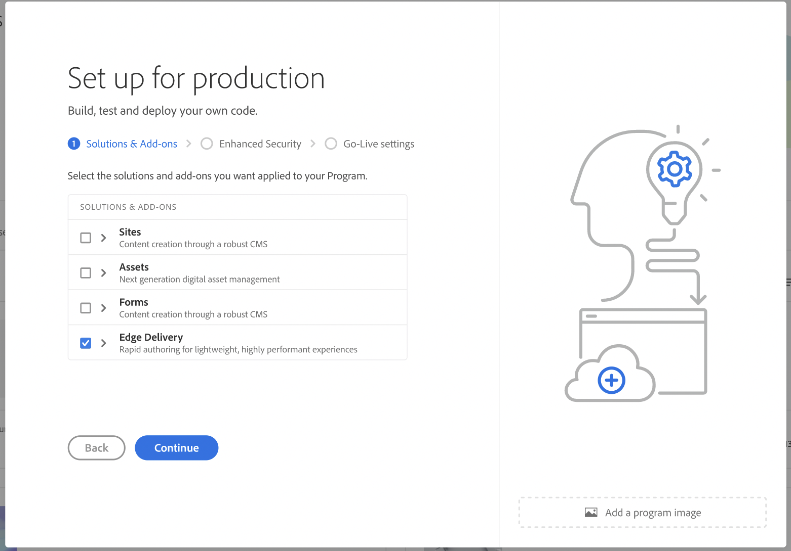

# Ondersteuning voor Edge Delivery Services in Cloud Manager {#edge-delivery-services}

Leer hoe u uw Cloud Manager-projecten kunt leveren met Edge Delivery Services.

>[!NOTE]
>
>Deze functie is alleen beschikbaar voor [het programma voor vroegtijdige adoptie .](/help/implementing/cloud-manager/release-notes/current.md#early-adoption)

## Edge Delivery Services in het kort {#edge-overview}

Edge Delivery Services is een samenstellbare set services die u in staat stelt om op zeer flexibele wijze inhoud op uw website te schrijven. Zo kunt u:

* Maak snelle sites met een perfecte Lighthouse Score en controleer de prestaties voortdurend via de bewaking van het werkelijke gebruik (RUM).
* Verhoog de efficiëntie bij het ontwerpen door inhoudsbronnen te ontkoppelen.

U kunt zowel AEM inhoudsbeheer als op AEM gebaseerd schrijven gebruiken gebruikend de Universele Redacteur evenals op document-gebaseerd schrijven.

Met Cloud Manager in AEM as a Cloud Service kunt u Edge Delivery Service inschakelen voor uw project.

>[!TIP]
>
>Raadpleeg het document voor meer informatie over Edge Delivery Services en hoe u deze kunt gebruiken met AEM [Overzicht van Edge Delivery Services.](/help/edge/overview.md)

## Edge Delivery Services in Cloud Manager {#edge-in-cloud-manager}

Als u Edge Delivery Services met een licentie als onderdeel van Adobe Experience Manager Sites hebt, kunt u zich rechtstreeks in Cloud Manager aan boord van uw site stellen met Edge Delivery Services en live gaan [met behulp van een begeleide, zelfbedieningservaring.](/help/implementing/cloud-manager/managing-code/private-repositories.md)

Dit maakt een verenigde ervaring voor al uw AEM eigenschappen mogelijk, die consistentie met alle kritieke werkschema&#39;s met inbegrip van het beheer van domeinnamen, SSL certificaatbeheer, en afbeeldingen CDN verzekeren.

Edge Delivery Services zijn beschikbaar voor beide [productie- en sandboxprogramma&#39;s.](/help/implementing/cloud-manager/getting-access-to-aem-in-cloud/program-types.md)

## Edge Delivery Services inschakelen {#enabling}

Edge Delivery Services kunnen worden ingeschakeld wanneer u een nieuw programma toevoegt.

Raadpleeg de volgende documenten voor meer informatie over het toevoegen van programma&#39;s.

* [Productieprogramma&#39;s maken](/help/implementing/cloud-manager/getting-access-to-aem-in-cloud/creating-production-programs.md)
* [Sandbox-programma&#39;s maken](/help/implementing/cloud-manager/getting-access-to-aem-in-cloud/creating-sandbox-programs.md)
