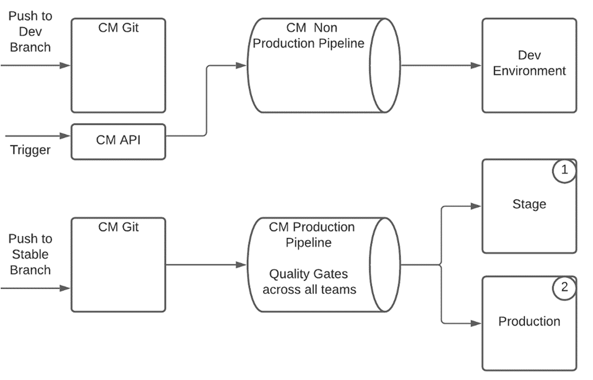

# Enterprise Team Development Setup voor AEM als Cloud Service {#enterprise-setup}

## Inleiding {#introduction}

AEM als Cloud Service is een cloudeigen aanbod dat AEM als service biedt ontworpen om te profiteren van meer dan 10 jaar durende levering van bedrijfssoftware aan bedrijfsteams met hun specifieke vereisten. Terwijl het in de inheemse wereld van de wolk, met nieuwe waarden zoals altijd op, altijd huidig, altijd veilig, en altijd op schaal terugvalt, behoudt het het belangrijkste waardevoorstel dat AEM als aanpasbaar platform aan onze klanten verstrekt en teams van ondernemingsniveau toestaat om in hun ontwikkeling en leveringsprocedures te integreren.

Om onze klanten te ondersteunen met instellingen voor bedrijfsontwikkeling, AEM als Cloud Service volledig geïntegreerd met Cloud Manager en zijn doelgerichte, geadviseerde CI/CD-pijpleidingen, die zijn uitgerust met best practices en lessen uit de ervaring van meerdere jaren met de ontwikkeling en implementatie op bedrijfsniveau - zorgen voor grondig testen en de hoogste codekwaliteit voor uitzonderlijke ervaringen.

## Ondersteuning van Cloud Manager in Enterprise Team Development Setup {#cloud-manager}

Om ervoor te zorgen dat klanten snel aan boord kunnen gaan, biedt Cloud Manager alles wat nodig is om meteen aan de slag te gaan met het ontwikkelen van ervaringen, waaronder een git-opslagplaats voor aanpassingen die vervolgens worden gebouwd, geverifieerd en geïmplementeerd door Cloud Manager.
Met behulp van Cloud Manager kunnen ontwikkelingsteams regelmatig wijzigingen doorvoeren zonder afhankelijk te zijn van Adobe-personeel.

Er zijn drie omgevingstypen beschikbaar in Cloud Manager:

* Ontwikkeling
* Werkgebied
* Productie

De code kan aan ontwikkelmilieu&#39;s worden opgesteld gebruikend een niet productiepijplijn. Voor Stadium en Productie, die altijd samen gaan en zo bevestiging vóór productieleiding als beste praktijken verzekeren, gebruikt een productiepijpleiding kwaliteitskates om de toepassingscode en de configuratieveranderingen te bevestigen.

De pijpleiding van de Productie stelt de code en de configuratie aan het opvoeren milieu eerst op, test de toepassing, en stelt definitief aan productie op.
Een Cloud Service-SDK die altijd wordt bijgewerkt met de nieuwste verbeteringen op het gebied van Cloud Servicen, maakt het mogelijk om de lokale ontwikkeling rechtstreeks te laten uitvoeren met behulp van de lokale hardware van de ontwikkelaar. Dit maakt een snelle ontwikkeling mogelijk met zeer lage omlooptijden. Op die manier kunnen ontwikkelaars in hun vertrouwde lokale omgeving blijven en kiezen uit een groot aantal verschillende ontwikkelingsprogramma&#39;s, en overstappen op ontwikkelomgevingen of productie wanneer ze dat nodig achten.

Cloud Manager ondersteunt flexibele instellingen voor meerdere teams die kunnen worden aangepast aan de behoeften van een onderneming. Dit geldt zowel voor Cloud Service als voor AMS. Om stabiele plaatsingen met veelvoudige teams te verzekeren en één team te vermijden die productie voor alle teams beïnvloeden, bevestigen de geadviseerde pijpleiding van de Managers van de Wolk altijd de code van alle teams samen en test.

## Real World-voorbeeld {#real-world-example}

Elke onderneming heeft verschillende vereisten met inbegrip van verschillende teamopstelling, processen, en ontwikkelingswerkschema&#39;s. De hieronder beschreven opstelling wordt gebruikt door Adobe voor verscheidene projecten die ervaring bovenop AEM als Cloud Service leveren.

De Adobe Creative Cloud-toepassingen, zoals Adobe Photoshop of Adobe Illustrator, bevatten bijvoorbeeld inhoudsbronnen, zoals zelfstudies, voorbeelden en hulplijnen die beschikbaar zijn voor eindgebruikers. Deze inhoud wordt door de cliënttoepassingen verbruikt die AEM als Cloud Service op een *headless* manier gebruiken, door API vraag aan de AEM Cloud te maken publiceren rij om de gestructureerde inhoud als stromen JSON terug te winnen, en door AEM Cloud Service CDN te gebruiken om zowel gestructureerde als ongestructureerde inhoud met optimale prestaties te dienen.

De teams die aan dit project bijdragen volgen het hieronder beschreven proces.

>[!NOTE]
>Raadpleeg [Werken met Meerdere bronopslagplaatsen voor Git](https://experienceleague.adobe.com/docs/experience-manager-cloud-manager/using/managing-code/working-with-multiple-source-git-repos.html#managing-code) voor meer informatie over de installatie.

Elk team gebruikt zijn eigen ontwikkelingswerkstroom en heeft een afzonderlijke git bewaarplaats. Een extra gedeelde git-opslagplaats wordt gebruikt voor het aan boord nemen van projecten. Deze git-opslagplaats bevat de basisstructuur van de git-opslagplaats van Cloud Manager, inclusief de configuratie van de gedeelde verzender. Als u een nieuw project aan boord wilt nemen, moet u dit in het projectbestand Maven van de reactor opnemen in de hoofdmap van de gedeelde git-opslagplaats. Voor de configuratie van de verzender wordt een nieuw configuratiedossier gecreeerd binnen het verzender project. Dit bestand wordt vervolgens opgenomen door de configuratie van de hoofddispatcher. Elk team is verantwoordelijk voor zijn eigen de configuratiedossier van de verzender. Wijzigingen in de gedeelde git-opslagplaats zijn zeldzaam en zijn gewoonlijk alleen vereist wanneer een nieuw project wordt gestart. Het belangrijkste werk wordt gedaan door elk projectteam binnen hun eigen git bewaarplaats.

De git bewaarplaats voor elk team is opstelling gebruikend AEM Maven archetype en zo volgt de beste praktijken voor vestiging AEM projecten. De enige uitzondering is de afhandeling van de configuratie van de verzender die wordt uitgevoerd in de gedeelde opslagruimte, zoals hierboven beschreven.
Elk team gebruikt een vereenvoudigde git werkstroom met twee + N takken, die het de stroommodel van de Git volgen:

* Een stabiele releasetak bevat de productiecode

* Een ontwikkelingsonderdeel bevat de meest recente ontwikkeling

* Voor elke functie wordt een nieuwe vertakking gemaakt

De ontwikkeling wordt gedaan in een eigenschaptak, wanneer de eigenschaprijping het in de ontwikkelingstak wordt samengevoegd. Voltooide en gevalideerde functies worden gekozen uit de ontwikkelingstak en samengevoegd in de stabiele vertakking. Alle wijzigingen worden doorgevoerd via Pull Requests (PR). Elke PR wordt automatisch gevalideerd door kwaliteitspoorten. Sonar wordt gebruikt voor kwaliteitscontrole van de code en er wordt een reeks testreeksen uitgevoerd om ervoor te zorgen dat de nieuwe code geen regressie introduceert.

De installatie in de git-opslagplaats van Cloud Manager heeft twee vertakkingen:

* A *stabiele releasetak*, met de productiecode van alle teams
* A *ontwikkelingsvertakking* die de ontwikkelingscode van alle teams bevat

Elke druk aan de gokbewaarplaats van een team in of de ontwikkeling of de stabiele tak veroorzaakt een [github actie](https://experienceleague.adobe.com/docs/experience-manager-cloud-manager/using/managing-code/working-with-multiple-source-git-repos.html?lang=en#managing-code). Alle projecten volgen de zelfde opstelling voor de stabiele tak. Een duwtje op de stabiele tak van een project wordt automatisch geduwd aan de stabiele tak in de git bewaarplaats van de Managers van de Wolk. De productiepijplijn in de Manager van de Wolk wordt gevormd om door een duw aan de stabiele tak worden teweeggebracht. De productiepijpleiding wordt daarom uitgevoerd door elke duw van om het even welk team in een stabiele tak en de productieleiding wordt bijgewerkt als alle kwaliteitstoegangspoorten overgaan.

Penselen naar de ontwikkelingsvertakking worden anders verwerkt. Terwijl een duw aan een ontwikkelaarstak in de git bewaarplaats van een team een git actie eveneens teweegbrengt en de code automatisch in de ontwikkelingstak in de git bewaarplaats van de Manager van de Wolk wordt geduwd, wordt de niet productiepijpleiding niet automatisch teweeggebracht door de code duw. Dit wordt geactiveerd door een aanroep van de API van Cloud Manager.
Het runnen van de productiepijpleiding omvat het controleren van de code van alle teams via de verstrekte kwaliteitsspoortaten. Zodra de code aan stadium wordt opgesteld, worden de tests en de controles uitgevoerd om ervoor te zorgen alles zoals verwacht werkt. Wanneer alle poorten zijn doorgegeven, worden de wijzigingen zonder onderbreking of downtime omgezet in productie.
Voor lokale ontwikkeling, wordt SDK voor Cloud Service gebruikt. Met de SDK kunnen een lokale auteur, publicateur en verzender worden ingesteld. Dit maakt offline ontwikkeling en snelle doorlooptijden mogelijk. Soms wordt alleen de auteur gebruikt voor ontwikkeling, maar als u de dispatcher snel instelt en publiceert, kunt u alles lokaal testen voordat u naar de opslagplaats voor kompas gaat. De leden van elk team controleren gewoonlijk de code van de gedeelde git voor evenals hun eigen projectcode. Andere projecten hoeven niet te worden gecontroleerd omdat de projecten onafhankelijk zijn.

Deze real-world opstelling kan als blauwdruk worden gebruikt en dan aan de behoeften van een onderneming worden aangepast. Het flexibele vertakkings en het samenvoegen concept van it staat voor variaties van de bovengenoemde werkschema&#39;s toe, die aan de behoeften van elk team worden aangepast. AEM als Cloud Service ondersteunt al deze variaties zonder dat dit ten koste gaat van de kernwaarde van de geadviseerde Cloud Manager-pijplijn.

### Overwegingen voor een Opstelling van het Multi Team {#considerations}

>[!NOTE]
>Voor elke opstelling van meerdere teams is het van cruciaal belang om een bestuursmodel en een reeks normen te definiëren die alle teams moeten volgen. In de bovenstaande blauwdruk voor een setup met meerdere teams kunt u schalen in een groter aantal teams en kunt u deze blauwdruk als uitgangspunt gebruiken.

Met de git-opslagplaats van Cloud Manager en de productiepijplijn wordt altijd de volledige productiecode door alle kwaliteitskates geleid, die het als één plaatsingseenheid behandelt. Op deze manier wordt het productiesysteem *altijd op* zonder onderbreking of onderbreking gehouden.
Zonder een dergelijk systeem is er daarentegen een risico dat een update van één team tot problemen met productiestabiliteit kan leiden, omdat elk team afzonderlijk kan implementeren. Daarnaast is coördinatie en geplande uitvaltijd nodig om updates uit te voeren. Met een toenemend aantal teams zal de coördinatie-inspanning veel complexer en sneller onbeheersbaar worden.

Als er een probleem wordt vastgesteld in de kwaliteitskates, heeft dit geen invloed op de productie en kan het probleem worden opgespoord en opgelost zonder dat Adobe personeel nodig is om in te stappen. Zonder Cloud Service en zonder altijd de volledige plaatsing te testen, kunnen de gedeeltelijke plaatsingen stroomonderbrekingen veroorzaken die een verzoek om terugschroeven van prijzen of zelfs een volledig herstel van een steun vereisen. De gedeeltelijke tests kunnen ook leiden tot andere problemen die vervolgens moeten worden opgelost nadat opnieuw coördinatie en steun van het personeel van de Adobe vereist is.