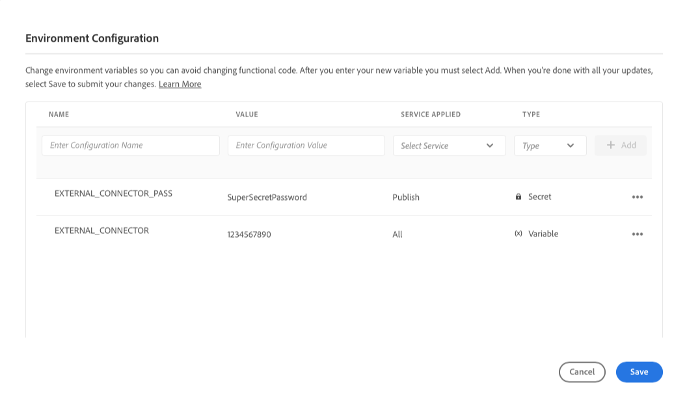

# Omgevingsvariabelen van Cloud Manager {#environment-variables}

Standaardomgevingsvariabelen kunnen worden geconfigureerd en beheerd via Cloud Manager. Zij worden verstrekt aan het runtime milieu en kunnen in configuraties worden gebruikt OSGi. Omgevingsvariabelen kunnen milieuspecifieke waarden of omgevingsgeheimen zijn, op basis van wat wordt gewijzigd.

## Overzicht {#overview}

De variabelen van het milieu bieden een verscheidenheid van voordelen aan gebruikers van AEM as a Cloud Service:

* Ze stellen het gedrag van uw code en toepassing in staat te variëren op basis van context en omgeving. Ze kunnen bijvoorbeeld worden gebruikt om verschillende configuraties in de ontwikkelomgeving mogelijk te maken in vergelijking met de productie- of werkgebiedomgevingen om kostbare fouten te voorkomen.
* Ze hoeven slechts eenmaal te worden geconfigureerd en ingesteld en kunnen indien nodig worden bijgewerkt en verwijderd.
* Hun waarden kunnen op om het even welk punt in tijd worden bijgewerkt en onmiddellijk zonder de behoefte aan om het even welke codeveranderingen of plaatsingen van kracht worden.
* Zij kunnen code van configuratie scheiden en de behoefte verwijderen om gevoelige informatie in versiecontrole te omvatten.
* Zij verbeteren de veiligheid van de AEM as a Cloud Service toepassing aangezien zij buiten de code leven.

De meest gangbare gebruiksgevallen voor het gebruik van omgevingsvariabelen zijn:

* De AEM-toepassing verbinden met verschillende externe eindpunten
* Een verwijzing gebruiken bij het opslaan van wachtwoorden in plaats van rechtstreeks in de codebasis
* Wanneer er meerdere ontwikkelomgevingen in een programma voorkomen en sommige configuraties van de ene omgeving tot de andere verschillen

## Omgevingsvariabelen toevoegen {#add-variables}

>[!NOTE]
>
>U moet lid zijn van de [**Implementatiebeheer** rol](/help/onboarding/cloud-manager-introduction.md#role-based-premissions) om omgevingsvariabelen toe te voegen of te wijzigen.

1. Aanmelden bij Adobe Cloud Manager op [my.cloudmanager.adobe.com](https://my.cloudmanager.adobe.com/).
1. Op de **[Mijn programma&#39;s](/help/implementing/cloud-manager/navigation.md#my-programs)** -console, selecteert u de sjabloon die u wilt beheren.
1. Selecteer op de zijnavigatiebalk de optie **Omgevingen** Selecteer vervolgens de omgeving waarvoor u een omgevingsvariabele wilt maken.
1. Selecteer binnen de details van de omgeving de optie **Configuratie** dan selecteert u **Toevoegen** om de **Omgevingsconfiguratie** in.
   * Als u voor het eerst een omgevingsvariabele toevoegt, kunt u een **Configuratie toevoegen** midden op de pagina. U kunt deze knop of **Toevoegen** om de **Omgevingsconfiguratie** in.

   

1. Voer de details van de variabele in.
   * **Naam**
   * **Waarde**
   * **Toegepaste service** - Definieert waarvoor de dienst (Auteur/Publicatie/Voorproef) de variabele van toepassing is of als het op alle diensten van toepassing is
   * **Type** - Hiermee wordt gedefinieerd of de variabele een normale variabele of een geheim is

   

1. Nadat u de nieuwe variabele hebt ingevoerd, moet u **Toevoegen** in de laatste kolom van de rij die de nieuwe variabele bevat.
   * U kunt meerdere variabelen tegelijk invoeren door een nieuwe regel in te voeren en **Toevoegen**.

   

1. Selecteren **Opslaan** om de variabelen te behouden.

Een indicator met de status **Bijwerken** wordt getoond bij de bovenkant van de lijst en naast de onlangs toegevoegde variabele om erop te wijzen dat het milieu met de configuratie wordt bijgewerkt. Na voltooiing, is de nieuwe milieuvariabele zichtbaar in de lijst.

>[!TIP]
>
>Als u meerdere variabelen wilt toevoegen, wordt u aangeraden de eerste variabele toe te voegen en vervolgens de **Toevoegen** in de **Omgevingsconfiguratie** om extra variabelen toe te voegen. Op deze manier kunt u ze met één update toevoegen aan de omgeving.

## Omgevingsvariabelen bijwerken {#update-variables}

Nadat u omgevingsvariabelen hebt gemaakt, kunt u deze bijwerken met de opdracht **Toevoegen/bijwerken** knop om het dialoogvenster **Omgevingsconfiguratie** in.

1. Aanmelden bij Adobe Cloud Manager op [my.cloudmanager.adobe.com](https://my.cloudmanager.adobe.com/).
1. Cloud Manager geeft de verschillende beschikbare programma&#39;s weer. Selecteer de map die u wilt beheren.
1. Selecteer in het navigatievenster de optie **Omgevingen** Selecteer vervolgens de omgeving waarvoor u een omgevingsvariabele wilt wijzigen.
1. Selecteer binnen de details van de omgeving de optie **Configuratie** dan selecteert u **Toevoegen/bijwerken** in de rechterbovenhoek **Omgevingsconfiguratie** in.
1. Selecteer met de knop Ovaal in de laatste kolom van de rij van de variabele die u wilt wijzigen **Bewerken** of **Verwijderen**.

   

1. Bewerk indien nodig de omgevingsvariabele.
   * Tijdens het bewerken verandert de knop voor ovaal in opties om terug te keren naar de oorspronkelijke waarde of om uw wijziging te bevestigen.
   * Als u geheimen bewerkt, kunnen de waarden alleen worden bijgewerkt en niet worden weergegeven.

   

1. Nadat u de vereiste configuratiewijzigingen hebt aangebracht, selecteert u **Opslaan**.

[Zoals bij het toevoegen van variabelen](#add-variables) een indicator met de status **Bijwerken** boven aan de tabel en naast de nieuw bijgewerkte variabele(n) om aan te geven dat de omgeving met de configuratie wordt bijgewerkt. Na voltooiing, zijn de bijgewerkte milieuvariabelen zichtbaar in de lijst.

>[!TIP]
>
>Als u meerdere variabelen wilt bijwerken, kunt u het beste de opdracht **Omgevingsconfiguratie** dialoogvenster om alle benodigde variabelen tegelijk bij te werken voordat u tikt of klikt op **Opslaan**. Op deze manier kunt u ze met één update toevoegen aan de omgeving.

## Omgevingsvariabelen gebruiken {#using}

Omgevingsvariabelen kunnen uw `pom.xml` configuraties veiliger en flexibeler. Bijvoorbeeld, moeten de wachtwoorden niet hard worden gecodeerd en uw configuratie kan aanpassen gebaseerd op de waarden in omgevingsvariabelen.

U hebt als volgt toegang tot omgevingsvariabelen en geheimen via XML.

* `${env.VARIABLE_NAME}`

Zie het document [Project instellen](/help/implementing/cloud-manager/getting-access-to-aem-in-cloud/setting-up-project.md#password-protected-maven-repository-support-password-protected-maven-repositories) voor een voorbeeld van het gebruik van beide typen variabelen in een `pom.xml` bestand.

Zie de [officiële documentatie van Maven](https://maven.apache.org/settings.html#quick-overview) voor meer informatie .

## Beschikbaarheid van omgevingsvariabele {#availability}

Omgevingsvariabelen kunnen op verschillende plaatsen worden gebruikt.

### Auteur, Voorvertoning en Publiceren {#author-preview-publish}

Zowel normale omgevingsvariabelen als geheimen kunnen worden gebruikt in de ontwerpomgeving, voorvertoningsomgeving en in de publicatieomgeving.

### Dispatcher {#dispatcher}

Alleen normale omgevingsvariabelen kunnen worden gebruikt [de verzender.](https://experienceleague.adobe.com/docs/experience-manager-dispatcher/using/dispatcher.html) Geheimen kunnen niet worden gebruikt.

Omgevingsvariabelen kunnen echter niet worden gebruikt in `IfDefine` richtlijnen.

>[!TIP]
>
>U moet het gebruik van omgevingsvariabelen valideren met de [lokale verzender](https://experienceleague.adobe.com/docs/experience-manager-learn/cloud-service/local-development-environment-set-up/dispatcher-tools.html) vóór implementatie.

### OSGi-configuraties {#osgi}

Zowel normale omgevingsvariabelen als geheimen kunnen worden gebruikt in [OSGi-configuraties](/help/implementing/deploying/configuring-osgi.md).

### Pipetvariabelen {#pipeline}

Naast milieuvariabelen, zijn er ook pijpleidingsvariabelen, die tijdens de bouwstijlfase worden blootgesteld. [Meer informatie over pijpleidingvariabelen hier](/help/implementing/cloud-manager/getting-access-to-aem-in-cloud/build-environment-details.md#pipeline-variables).
