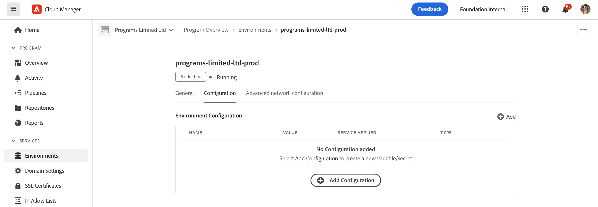
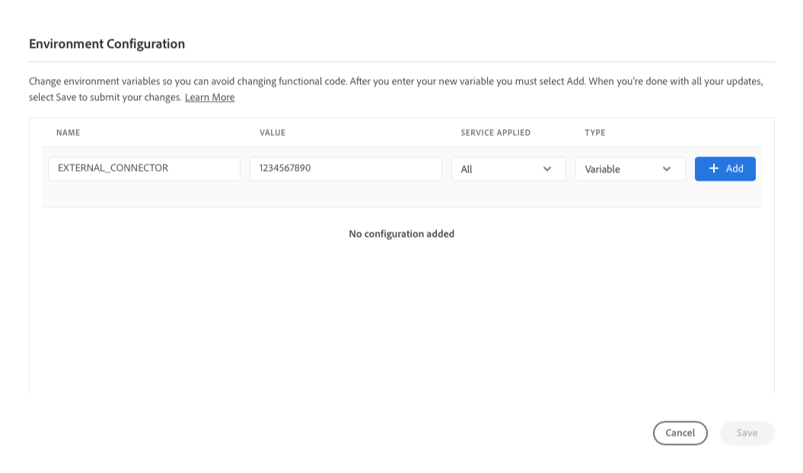
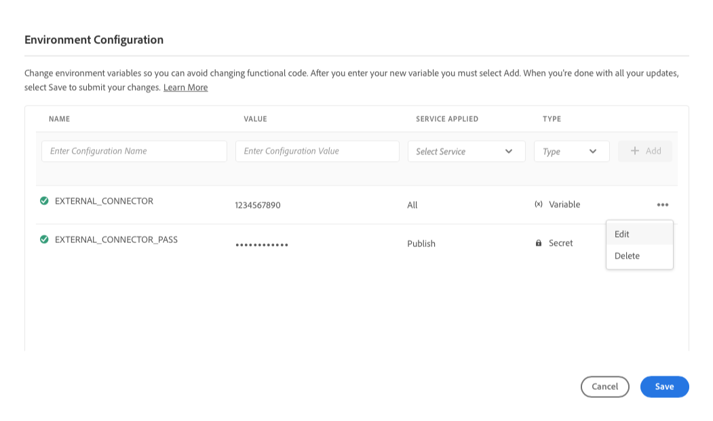
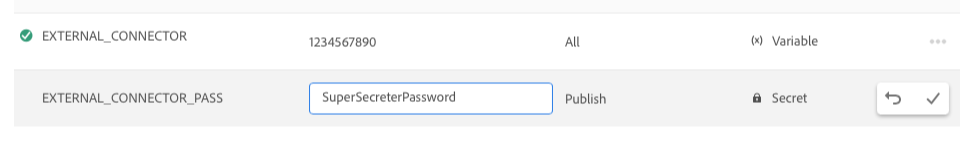

# Omgevingsvariabelen in Cloud Manager {#environment-variables}

Standaardomgevingsvariabelen kunnen worden geconfigureerd en beheerd via Cloud Manager. Zij worden verstrekt aan het runtime milieu en kunnen in configuraties worden gebruikt OSGi.

Omgevingsvariabelen kunnen milieuspecifieke waarden of omgevingsgeheimen zijn, op basis van wat wordt gewijzigd.

## Omgevingsvariabelen {#overview}

Omgevingsvariabelen bieden een groot aantal voordelen voor gebruikers van AEM as a Cloud Service, zoals:

* Ze stellen het gedrag van uw code en toepassing in staat te variëren op basis van context en omgeving. Ze kunnen bijvoorbeeld worden gebruikt om verschillende configuraties in de ontwikkelomgeving mogelijk te maken in vergelijking met de productie- of werkgebiedomgevingen om kostbare fouten te voorkomen.
* Ze hoeven slechts eenmaal te worden geconfigureerd en ingesteld en kunnen indien nodig worden bijgewerkt en verwijderd.
* Hun waarden kunnen op om het even welk punt in tijd worden bijgewerkt en onmiddellijk zonder de behoefte aan om het even welke codeveranderingen of plaatsingen van kracht worden.
* Zij kunnen code van configuratie scheiden en de behoefte verwijderen om gevoelige informatie in versiecontrole te omvatten.
* Ze verbeteren de beveiliging van de AEM as a Cloud Service-toepassing omdat ze buiten de code leven.

De meest gangbare gebruiksgevallen voor het gebruik van omgevingsvariabelen zijn:

* Een AEM-toepassing verbinden met verschillende externe eindpunten
* Een verwijzing gebruiken bij het opslaan van wachtwoorden in plaats van rechtstreeks in de codebasis
* Wanneer er meerdere ontwikkelomgevingen in een programma voorkomen en sommige configuraties van de ene omgeving tot de andere verschillen

## Een omgevingsvariabele toevoegen {#add-variables}

Als u veelvoudige variabelen wilt toevoegen, adviseert Adobe dat u de eerste variabele toevoegt, dan gebruik  **toevoegen** in de **Configuratie van het Milieu** dialoog om de extra variabelen toe te voegen. Deze methode betekent dat u ze met één update aan de omgeving kunt toevoegen.

Om milieu variabelen toe te voegen, bij te werken of te schrappen, moet u een lid van de [**rol** zijn van de Manager van de Plaatsing 0}.](/help/onboarding/cloud-manager-introduction.md#role-based-premissions)

**om een omgevingsvariabele toe te voegen:**

1. Logboek in Cloud Manager bij [ my.cloudmanager.adobe.com ](https://my.cloudmanager.adobe.com/) en selecteer de aangewezen organisatie.
1. Op de **[Mijn console van Programma&#39;s](/help/implementing/cloud-manager/navigation.md#my-programs)**, selecteer één u wilt leiden.
1. Van het zijmenu, klik **Milieu&#39;s**.
1. Voor de **pagina van Milieu&#39;s**, selecteer een rij in de lijst die het milieu heeft waarvoor u een milieuvariabele wilt toevoegen.
1. Voor de detailpagina van het milieu, klik de **Configuratie** tabel.
1. Klik  toe **toevoegen/bijwerken**.
Als u een milieuvariabele voor het eerst toevoegt, klik **voeg Configuratie** in het centrum van de pagina toe.

   

1. In het **de dialoogvakje van de Configuratie van het Milieu**, ga de details in de eerste rij van de lijst in.

   | Veld | Beschrijving |
   | --- | --- |
   | Naam | A unique name of the configuration variable. Het identificeert de specifieke variabele die in het milieu wordt gebruikt. De toepassing moet de volgende naamconventies in acht nemen:<ul><li>Variabelen mogen alleen alfanumerieke tekens en het onderstrepingsteken (`_`) bevatten.</li><li>Er is een limiet van 200 variabelen per omgeving.</li><li>Elke naam moet 100 tekens of minder zijn.</li></ul> |
   | Waarde | De waarde die de variabele aanhoudt. |
   | Toegepaste stap | Selecteer op welke service de variabele van toepassing is. Selecteer **allen** om de variabele te hebben die op alle diensten wordt toegepast.<ul><li>**allen**</li><li>**Auteur**</li><li>**publiceer**</li><li>**Voorproef**</li></ul> |
   | Type | Selecteer deze optie als de variabele normaal of geheim is. |

   

1. Klik  **** toevoegen.

   Voeg zo nodig extra variabelen toe.

1. Klik **sparen**.

   Een spinner met de status **die** bijwerkt wordt getoond in de hoger-juiste hoek van de lijst. Links van nieuwe variabelen wordt ook een spinner weergegeven. Deze statussen wijzen erop dat het milieu met de configuratie wordt bijgewerkt. Na voltooiing, is de nieuwe milieuvariabele zichtbaar in de lijst.

## Een omgevingsvariabele bijwerken {#update-variables}

Nadat u milieuvariabelen hebt gecreeerd, kunt u hen bijwerken gebruikend  toe **** bijwerken om het **de dialoogvakje van de Configuratie van het Milieu** te openen.

Als u veelvoudige variabelen wilt bijwerken, adviseert Adobe dat u het **dialoogvakje van de Configuratie van het Milieu** gebruikt om alle noodzakelijke variabelen onmiddellijk bij te werken alvorens **te klikken sparen**. Op deze manier kunt u ze met één update toevoegen aan de omgeving.

**om een omgevingsvariabele bij te werken:**

1. Logboek in Cloud Manager bij [ my.cloudmanager.adobe.com ](https://my.cloudmanager.adobe.com/) en selecteer de aangewezen organisatie.
1. Op de **[Mijn console van Programma&#39;s](/help/implementing/cloud-manager/navigation.md#my-programs)**, selecteer één u wilt leiden.
1. Van het zijmenu, klik **Milieu&#39;s**.
1. Voor de **pagina van Milieu&#39;s**, selecteer een rij in de lijst die het milieu heeft waarvoor u een variabele wilt bijwerken.
1. Voor de detailpagina van het milieu, klik de **Configuratie** tabel.
1. Klik  toe **toevoegen/bijwerken**.
1. In het **de dialoogvakje van de Configuratie van het Milieu 1}, klik** Ellipse - Meer pictogram 
1. In het drop-down menu, geeft de klik **** uit.

    uit

1. Werk indien nodig de waarde van de omgevingsvariabele bij.
Als u een geheim bewerkt, kan de waarde alleen worden bijgewerkt en niet worden weergegeven.

    uit

1. Voer een van de volgende handelingen uit:

   * Klik  om de verandering toe te passen.
   * Klik  om de verandering ongedaan te maken.

1. Klik **sparen**.

   Een spinner met de status **die** bijwerkt wordt getoond in de hoger-juiste hoek van de lijst. Links van bijgewerkte variabelen wordt ook een spinner weergegeven. Deze statussen wijzen erop dat het milieu met de configuratie wordt bijgewerkt. Na voltooiing, is de bijgewerkte milieuvariabele zichtbaar in de lijst.

## Een omgevingsvariabele verwijderen {#delete-env-variable}

1. Logboek in Cloud Manager bij [ my.cloudmanager.adobe.com ](https://my.cloudmanager.adobe.com/) en selecteer de aangewezen organisatie.
1. Op de **[Mijn console van Programma&#39;s](/help/implementing/cloud-manager/navigation.md#my-programs)**, selecteer één u wilt leiden.
1. Van het zijmenu, klik **Milieu&#39;s**.
1. Voor de **pagina van Milieu&#39;s**, selecteer een rij in de lijst die het milieu heeft waarvoor u een variabele wilt bijwerken.
1. Voor de detailpagina van het milieu, klik de **Configuratie** tabel.
1. Klik  toe **toevoegen/bijwerken**.
1. In het **de dialoogvakje van de Configuratie van het Milieu 1}, klik** Ellipse - Meer pictogram 
1. In het drop-down menu, klik **Schrapping** om de variabele onmiddellijk te verwijderen.
1. Klik **sparen**.

## Gebruik van omgevingsvariabelen {#using}

Omgevingsvariabelen kunnen uw `pom.xml` -configuraties veiliger en flexibeler maken. Bijvoorbeeld, moeten de wachtwoorden niet hard worden gecodeerd en uw configuratie kan aanpassen gebaseerd op de waarden in omgevingsvariabelen.

U hebt als volgt toegang tot omgevingsvariabelen en geheimen via XML:

`${env.VARIABLE_NAME}`

Zie [ VestigingsProject ](/help/implementing/cloud-manager/getting-access-to-aem-in-cloud/setting-up-project.md#password-protected-maven-repository-support-password-protected-maven-repositories) voor een voorbeeld van hoe te om beide soorten variabelen in a `pom.xml` dossier te gebruiken.

Zie ook de [ officiële Gemaakte documentatie ](https://maven.apache.org/settings.html#quick-overview) voor meer details.

## Beschikbaarheid van omgevingsvariabelen {#availability}

Omgevingsvariabelen kunnen als volgt op verschillende plaatsen worden gebruikt:

| Waar omgevingsvariabelen kunnen worden gebruikt | Beschrijving |
| --- | --- |
| Auteur, Voorvertoning en Publiceren | Zowel normale omgevingsvariabelen als geheimen kunnen worden gebruikt in de ontwerpomgeving, voorvertoningsomgeving en in de publicatieomgeving. |
| Dispatcher | Slechts kunnen de regelmatige milieuvariabelen met [ Dispatcher ](https://experienceleague.adobe.com/en/docs/experience-manager-dispatcher/using/dispatcher) worden gebruikt.<ul><li>Geheimen kunnen niet worden gebruikt.</li><li>Omgevingsvariabelen kunnen niet worden gebruikt in `IfDefine` -instructies.</li><li>Valideer uw gebruik van milieuvariabelen met [ Dispatcher plaatselijk ](https://experienceleague.adobe.com/en/docs/experience-manager-learn/cloud-service/local-development-environment-set-up/dispatcher-tools) alvorens op te stellen.</li></ul> |
| OSGi-configuraties | Zowel kunnen de regelmatige omgevingsvariabelen als de geheimen in [ worden gebruikt OSGi Configurations ](/help/implementing/deploying/configuring-osgi.md). |
| Pipetvariabelen | Naast milieuvariabelen, zijn er ook pijpleidingsvariabelen, die tijdens de bouwstijlfase worden blootgesteld. Leer meer over pijpleidingsvariabelen in [ Bouwstijl Milieu ](/help/implementing/cloud-manager/getting-access-to-aem-in-cloud/build-environment-details.md#pipeline-variables). |

