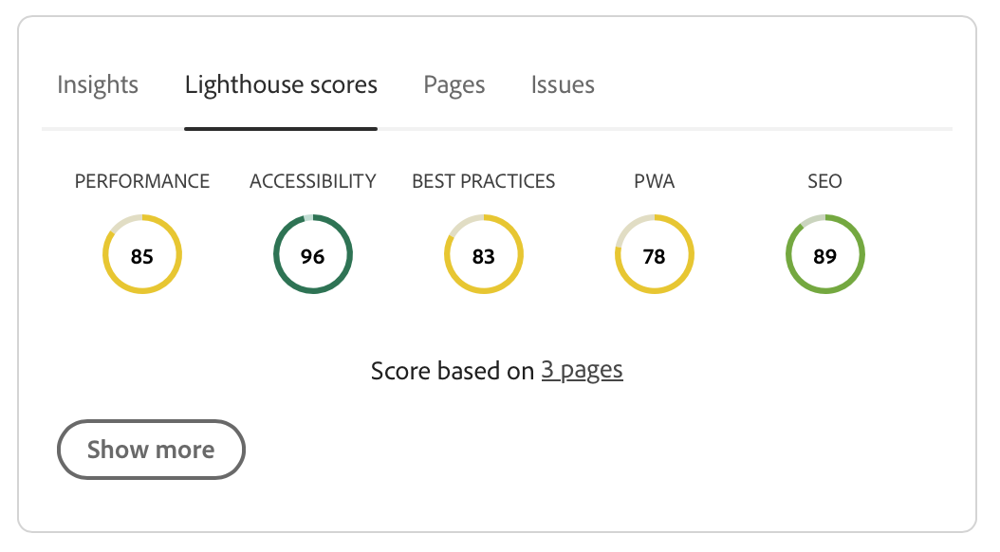

# Experience Audit Dashboard {#experience-audit-dashboard}

Leer hoe de Controle van de Ervaring uw plaatsingsproces valideert en helpt ervoor te zorgen dat de ingevoerde veranderingen aan basislijnnormen voor prestaties, toegankelijkheid, beste praktijken, en SEO door een duidelijke, informatieve dashboardinterface voldoen.

>[!NOTE]
>
>Deze functie is alleen beschikbaar voor [het programma voor vroegtijdige adoptie .](/help/implementing/cloud-manager/release-notes/current.md#early-adoption)
>
>Raadpleeg het document voor meer informatie over de bestaande functie Experience Audit voor AEM as a Cloud Service [Ervaar controle testen.](/help/implementing/cloud-manager/experience-audit-testing.md)

## Overzicht {#overview}

De Audit van de ervaring is een eigenschap beschikbaar in de pijpleidingen van de Productie van de Plaatsen van de Manager van de Wolk die het plaatsingsproces bevestigt en helpt ervoor zorgen dat de ingevoerde veranderingen:

1. Voldoe aan basislijnnormen voor prestaties, toegankelijkheid, beste praktijken, SEO (de Optimalisering van de Motor van het Onderzoek), en PWA (de Progressieve App van het Web).

1. Breng geen regressies aan.

De controle van de ervaring in de Manager van de Wolk zorgt ervoor dat de ervaring van de eindgebruiker op de plaats van de hoogste normen is.

De controleresultaten zijn informatief en staan de plaatsingsmanager toe om de scores en de verandering tussen de huidige en vorige scores te zien. Dit inzicht is waardevol om te bepalen als er een regressie is die met de huidige plaatsing werd geïntroduceerd.

De controle van de ervaring wordt aangedreven door [Google Lighthouse](https://developer.chrome.com/docs/lighthouse/overview/) een opensource-programma uit Google en is ingeschakeld in alle productiepijpleidingen van Cloud Manager.

>[!TIP]
>
>U vormt welke pagina&#39;s inbegrepen in de Controle van de Ervaring wanneer u [zet uw pijpleiding op.](/help/implementing/cloud-manager/configuring-pipelines/configuring-production-pipelines.md#full-stack-code)

## Het Experience Audit Dashboard {#dashboard}

De resultaten van de Experience Audit worden weergegeven in de **Werkgebied testen** fase van de productiepijpleiding via de [pagina voor de uitvoering van de productiepijplijn.](/help/implementing/cloud-manager/deploy-code.md)

De Audit van de ervaring verstrekt geaggregeerde en gedetailleerde op paginaniveau testresultaten samengevat op vier lusjes:

* **[Inzichten](#insights)** Geef een korte beschrijving van de aanbevelingen die u kunt doen om de prestaties van uw site te verbeteren.
* **[Lighthoudesscores](#lighthouse)** Dit is een overzicht van de Lighthouse-scores voor de code die wordt geïmplementeerd in deze pijplijnuitvoering.
* **[Pagina&#39;s](#pages)** Dit is een overzicht van de prestaties van pagina&#39;s die specifiek zijn geconfigureerd voor analyse.
* **[Problemen](#issues)** vat om het even welke prestatiesproblemen samen die in de code van deze pijpleidingsuitvoering worden ontdekt.

### Inzichten {#insights}

De **Inzichten** bevat een korte beschrijving van de aanbevelingen die u kunt doen om de prestaties van uw site te verbeteren.

Tik of klik op de knop **Meer weergeven** om het volledige dashboard te openen.

In de **Inzichten en aanbevelingen** in deze sectie vindt u een gedetailleerd overzicht van aanbevelingen die u kunt uitvoeren, met een duidelijke waardeaanduiding die gekoppeld is aan de prestatiewinst, samen met het beïnvloede percentage pagina&#39;s. Dit laat u gemakkelijk aan deze aanbevelingen voor uw teams voorrang geven.

Om terug naar de de uitvoeringspagina van de productiepijplijn te navigeren, selecteer eenvoudig de achterpijl op uw browser.

### Scores vuurtoren {#lighthouse}

De **Lighthoudesscores** tab is een overzicht van de Lighthouse-scores voor de code die wordt geïmplementeerd in deze pijplijnuitvoering.

Tik of klik op de knop **Meer weergeven** om het volledige dashboard te openen.

In de **Lighthoudesscores** , vindt u een trendweergave van de verschillende scores. Selecteren **Prestaties**, **Toegankelijkheid**, **PWA**, of **SEO** om de maandelijkse trendweergave voor deze waarden te bekijken.

Merk op dat elk punt op de grafiek het gemiddelde over alle plaatsingen in de maand van belang is.

Om terug naar de de uitvoeringspagina van de productiepijplijn te navigeren, selecteer eenvoudig de achterpijl op uw browser.

### Pagina&#39;s {#pages}

De **Pagina&#39;s** tab is een overzicht van de prestaties van pagina&#39;s die specifiek zijn geconfigureerd om te worden geanalyseerd.

Tik of klik op de knop **Meer weergeven** om het volledige dashboard te openen.

De **Pagina&#39;s** Deze sectie bevat een lijst met pagina&#39;s die zijn getest en de meest recente prestatiesscores van Lighthouse en de indeling.

U vormt welke pagina&#39;s inbegrepen in de Controle van de Ervaring wanneer u [zet uw pijpleiding op.](/help/implementing/cloud-manager/configuring-pipelines/configuring-production-pipelines.md#full-stack-code)

Om terug naar de de uitvoeringspagina van de productiepijplijn te navigeren, selecteer eenvoudig de achterpijl op uw browser.

### Problemen {#issues}

De **Problemen** het lusje vat om het even welke prestatiesproblemen samen die in de code van deze pijpleidingsuitvoering worden ontdekt.

Tik of klik op de knop **Meer weergeven** om het volledige dashboard te openen.

In de **Inzichten en aanbevelingen** in de sectie vindt u een gedetailleerdere lijst met aanbevelingen die kunnen worden uitgevoerd, met een duidelijke waarde-indicator die gekoppeld is aan prestatiewinsten en aan het beïnvloede percentage pagina&#39;s. Dit laat u gemakkelijk aan deze aanbevelingen voor uw teams voorrang geven.

Om terug naar de de uitvoeringspagina van de productiepijplijn te navigeren, selecteer eenvoudig de achterpijl op uw browser.

### Paginagegevens {#page-detail}

Als u op de koppeling van een pagina tikt of op een van de tabbladen van het dialoogvenster **Experience Audit** gedeelte van het tabblad van de pagina voor de uitvoering van de pijpleiding of in het dialoogvenster **Pagina&#39;s** in het volledige venster Experience Audit dashboard, kunt u de details van een bepaalde pagina bekijken.

U kunt zien hoe de individuele pagina&#39;s voor de specifieke test samen met de verandering van de vorige testlooppas werden gescoord.

Als u op de details van een afzonderlijke pagina klikt, krijgt u informatie over de elementen van de pagina die zijn geëvalueerd en kunt u aangeven wat de problemen zijn als er mogelijkheden voor verbetering zijn gevonden.

Om terug naar de de uitvoeringspagina van de productiepijplijn te navigeren, selecteer eenvoudig de achterpijl op uw browser.
