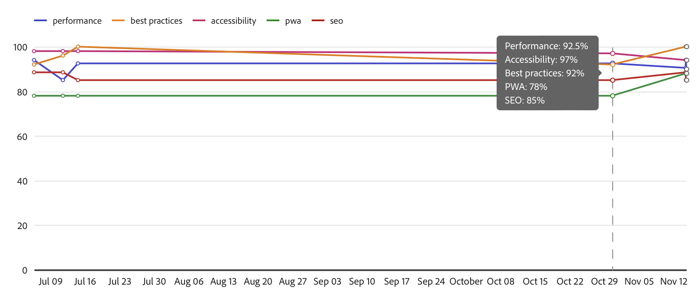
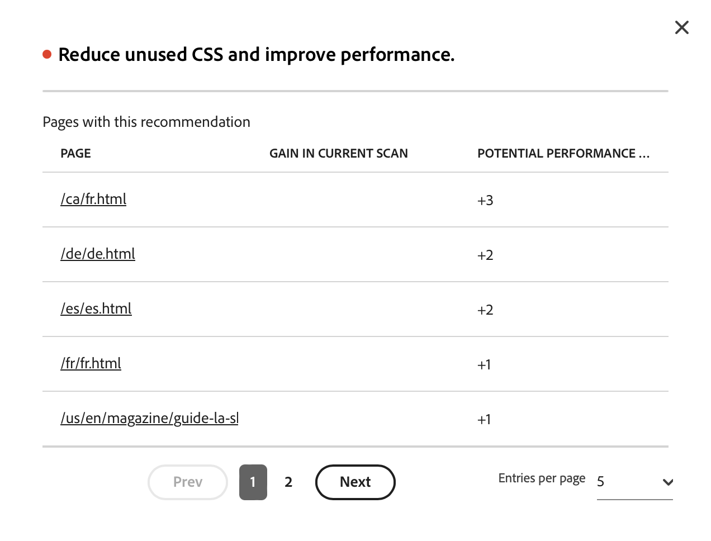
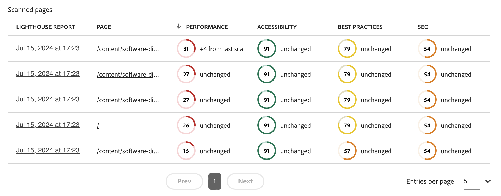
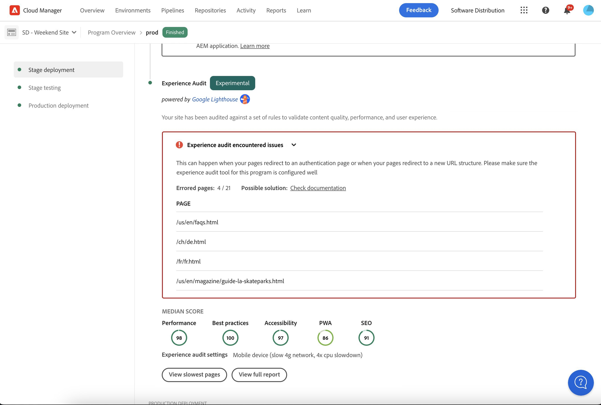

# Experience Audit Dashboard {#experience-audit-dashboard}

Leer hoe de Controle van de Ervaring uw plaatsingsproces valideert en helpt ervoor te zorgen dat de ingevoerde veranderingen aan basislijnnormen voor prestaties, toegankelijkheid, beste praktijken, en SEO door een duidelijke, informatieve dashboardinterface voldoen.

>[!NOTE]
>
>Deze eigenschap is slechts beschikbaar aan [ het vroege adopterprogramma.](/help/implementing/cloud-manager/release-notes/current.md#early-adoption)
>
>Voor details over de bestaande eigenschap van de Controle van de Ervaring voor AEM as a Cloud Service, gelieve het document [ Testen van de Controle van de Ervaring te zien ](/help/implementing/cloud-manager/experience-audit-testing.md)

## Overzicht {#overview}

De Controle van de ervaring bevestigt het plaatsingsproces en de hulp zorgt ervoor dat de ingevoerde veranderingen:

1. Voldoe aan basislijnnormen voor prestaties, toegankelijkheid, beste praktijken, SEO (de Optimalisering van de Motor van het Onderzoek), en PWA (de Progressieve App van het Web).

1. Breng geen regressies aan.

De controle van de ervaring in Cloud Manager zorgt ervoor dat de ervaring van de gebruiker op de plaats van de hoogste normen is.

De controleresultaten zijn informatief en staan de plaatsingsmanager toe om de scores en de verandering tussen de huidige en vorige scores te zien. Dit inzicht is waardevol om te bepalen als er een regressie is die met de huidige plaatsing werd geïntroduceerd.

De Controle van de ervaring wordt aangedreven door [ Lighthouse van Google ](https://developer.chrome.com/docs/lighthouse/overview/), een open bronhulpmiddel van Google, en in alle de productiepijpleidingen van Cloud Manager toegelaten.

## Beschikbaarheid {#availability}

Er is een Experience Audit beschikbaar voor Cloud Manager:

* Sites, productiepijpleidingen, standaard
* De volledige pijpleidingen van de ontwikkeling, facultatief
* Ontwikkeling front-end pijpleidingen, optioneel

Zie de [ sectie van de Configuratie ](#configuration) voor meer informatie over hoe te om de controle voor de facultatieve milieu&#39;s te vormen.

Audits worden uitgevoerd als onderdeel van de pijpleiding. De controles kunnen ook [ in werking worden gesteld op bestelling ](#on-demand) buiten pijpleidingen.

## Configuratie {#configuration}

De Experience Audit is standaard beschikbaar voor productiepijpleidingen. Het kan naar keuze voor ontwikkeling volledig-stapel en front-end pijpleidingen worden toegelaten. In alle gevallen, moet u bepalen welke inhoudswegen tijdens pijpleidingsuitvoering worden geëvalueerd.

1. Afhankelijk van het type van pijpleiding u wenst te vormen, volg de richtingen aan:

   * Voeg een nieuwe [ productiepijpleiding toe, ](/help/implementing/cloud-manager/configuring-pipelines/configuring-production-pipelines.md) als u wenst om de wegen te bepalen die door de controle moeten worden geëvalueerd.
   * Voeg een nieuwe [ niet-productiepijplijn toe, ](/help/implementing/cloud-manager/configuring-pipelines/configuring-non-production-pipelines.md) als u wenst om de controle op een front-end of ontwikkelings volledig-stapelpijpleiding toe te laten.
   * Of u kunt [ een bestaande pijpleiding uitgeven, ](/help/implementing/cloud-manager/configuring-pipelines/managing-pipelines.md) en de bestaande opties bijwerken.

1. Als u toevoegt of een niet-productiepijplijn uitgeeft waarvoor u de Controle van de Ervaring wilt gebruiken, moet u **checkbox van de Controle van de Ervaring {op het** Source Code **tabel selecteren.**

   

   * Dit is alleen nodig voor niet-productiepijpleidingen.
   * Het **lusje van de Controle van de Ervaring** verschijnt wanneer checkbox wordt geselecteerd.

1. Voor zowel productie als niet productiepijpleidingen, bepaalt u de wegen die in de Controle van de Ervaring op de **Controle van de Ervaring** tabel moeten worden omvat.

   * Pagina-paden moeten beginnen met `/` en zijn relatief ten opzichte van uw site.
   * Als uw site bijvoorbeeld `wknd.site` is en u `https://wknd.site/us/en/about-us.html` wilt opnemen in de Experience Audit, voert u het pad in `/us/en/about-us.html` .

   

1. Tik of klik **toevoegen de Pagina** en de weg wordt auto-voltooid met het adres van uw milieu en toegevoegd aan de lijst van wegen.

   

1. U kunt paden naar wens toevoegen door de vorige twee stappen te herhalen.

   * U kunt maximaal 25 paden toevoegen.
   * Als u geen paden definieert, wordt de homepage van de site standaard opgenomen in de Experience Audit.

1. Klik **sparen** om uw pijpleiding te bewaren.

## Resultaten controle ervaring {#results}

De resultaten van de Controle van de Ervaring worden voorgesteld in de **testende fase van het Stadium** van de productiepijpleiding via de [ pagina van de de uitvoeringspijplijn van de productiepijplijn.](/help/implementing/cloud-manager/deploy-code.md)

De Controle van de ervaring verstrekt de mediane Emissiescore van Google voor de [ gevormde pagina&#39;s ](#configuration) en het verschil in score aan het vorige aftasten.

Van deze summiere mening in de **het Testen van het Stadium** fase van de pijpleiding, hebt u twee opties:

* **[de langzaamste pagina&#39;s van de Mening](#view-slowest-pages)**
* **[Volledige het rapport van de Mening](#view-full-report)**

Naast de samenvatting die in de details van een pijpleidingslooppas wordt voorgesteld, kunt u tot de volledige resultaten van de controle ook direct toegang hebben door het **lusje van Rapporten** van het dashboard van Cloud Manager te gebruiken [ het volledige rapport ](#view-full-report) direct toegang te hebben.

>[!TIP]
>
>In de volgende secties wordt beschreven hoe u de resultaten van de Experience Audit kunt bekijken.
>
>* Als u details op zou willen hoe de controlewerken, gelieve de details van de Evaluatie van de sectie [ van de Controle van de Ervaring te zien.](#details)
>* Als u zou willen weten hoe te om een ervaringscontrole op bestelling in werking te stellen, gelieve de sectie [ Rapporten van de Controle op bestelling te zien.](#on-demand)
>* Als u kwesties met de controle ervaart, te zien gelieve de sectie [ Problemen van de Controles van de Ervaring.](#issues)
>* Voor algemene prestatiesuiteinden, te zien gelieve de sectie [ Algemene Tips van Prestaties.](#performance-tips)

### Langzame pagina&#39;s weergeven {#view-slowest-pages}

Tapping of het klikken van **Mening langzaamste pagina&#39;s** opent de **langzaamste 5 pagina&#39;s** dialoog, die de vijf laagste-presterende pagina&#39;s tonen die u [ aan controle vormde.](#configuration)

De scores worden onderverdeeld door **Prestaties**, **Toegankelijkheid**, **Beste praktijken**, en **SEO** samen met de afwijking van elke metrisch van de laatste controle.

Standaard wordt het dialoogvenster geopend met de scores voor mobiele apparaten. U kunt dit in Desktopscores veranderen gebruikend **Apparaten** knevel bij de bovenkant van de dialoog.

Het dialoogvenster is bedoeld voor een snel overzicht. Voor volledige details, tik of klik **Volledige het rapport van de Mening**.

### Volledig rapport weergeven {#view-full-report}

U kunt het volledige rapport van de Controle van de Ervaring bekijken door:

* Tapping of het klikken van **Volledige rapport van de Mening** in de **[Geleidelijke 5 pagina&#39;s](#view-slowest-pages)** dialoog.
* Tapping of het klikken van **Mening volledig rapport** wanneer het bekijken van de [ uitvoering van een pijpleiding.](#results)
* Tapping of het klikken van het **lusje van Rapporten** in Cloud Manager.

Het **lusje van Rapporten** van Cloud Manager wordt geopend, tonend de **controle van de Ervaring**.

Het verslag is opgesplitst in twee gebieden:

* **[de scores van de Pagina - trend](#trend)**
* **[de resultaten van het de controleonderzoek van de Ervaring](#results)**

#### Paginascore - trend {#trend}

Door gebrek, is de geselecteerde mening voor **scores van de Pagina - trend** **mediaanscores** voor **Laatste 6 maanden**.

Gebruik **Uitgezochte** en **drop-down van de Mening** bij de bovenkant en de bodem van de grafiekknop om pagina-specifieke details en verschillende tijdkaders, respectievelijk te selecteren. Tik of klik de en **update trend** knoop bij de bovenkant van de grafiek om de selecties toe te passen en de grafiek te verfrissen.

Wanneer u de muis over het diagram beweegt, wordt knopinfo weergegeven met de waarden voor de categorieën van Google Lighthouse op bepaalde tijdpunten.

Als u op een bepaald moment op het diagram tikt of op het diagram klikt, wordt een pop-up geopend met details van de scan. Tik of klik het **open aftasten van de ervaringscontrole** om te laden dat aftasten resultaten in de **[controle van de Ervaring aftasten resultaten](#scan-results)** sectie.

#### Resultaten van controle door ervaring {#scan-results}

De **de controleresultaten van het de controleonderzoek van de Ervaring** sectie geeft aanbevelingen op hoe te om uw score en details van alle gescande pagina&#39;s te verbeteren. Het bestaat uit twee delen:

* **[Recommendations](#recommendations)**
* **[Gescande pagina&#39;s](#scanned-pages)**

##### Recommendations {#recommendations}

De **Recommendations** sectie toont een gezamenlijke reeks inzichten. Door gebrek, worden de aanbevelingen voor **prestaties** getoond. Gebruik drop-down naast de **Recommendations** rubriek om in een andere categorie te veranderen.

Tik op het chevron of klik op een aanbeveling om details ervan weer te geven.

Indien beschikbaar, bevatten de uitgebreide aanbevelingen details ook het percentage van het effect van de aanbevelingen, helpen nadruk op de meest impactful veranderingen.

Tik of klik de **verbinding van meningspagina&#39;s** in de detailsmening om de pagina&#39;s te zien waarop de aanbeveling van toepassing is.

##### Gescande pagina&#39;s {#scanned-pages}

De **Gescande pagina&#39;s** sectie geeft detailscores op alle gescande pagina&#39;s. U kunt **gebruiken prev** en **daarna** knopen aan pagina door de resultaten en kiezen op hoeveel de vertoning zou moeten pagineren.

Tapping of het klikken van de verbinding van een bepaalde pagina werkt **Uitgezochte** filter van de [**scores van de Pagina - trendmatige** sectie ](#trend) bij en toont het **Scores &amp; aanbevelingen** lusje voor de geselecteerde pagina.

Het **Ruwe rapporten** lusje geeft u scores voor elke controle van de pagina. Tik of klik het **pictogram van de Download** om een JSON- dossier van de ruwe gegevens terug te winnen.

Hiermee wordt een nieuw tabblad in uw browser geopend, waarin naar `https://googlechrome.github.io/lighthouse/viewer/` wordt verwezen met een ondertekende URL van het rapport Lighthouse raw JavaScript Object Notation (JSON) voor de geselecteerde pagina. Dit rapport wordt automatisch geopend voor uw gedetailleerde inspectie

## Controleverslagen op aanvraag {#on-demand}

Naast het worden in werking gesteld tijdens pijpleidingsuitvoering, kunnen de rapporten van de Controle van de Ervaring ook op bestelling worden geproduceerd. Dit is een goede oplossing om uw pagina&#39;s snel af te tasten, zonder het moeten een pijpleiding in werking stellen.

Om een aftasten op bestelling in werking te stellen, navigeer aan het **lusje van Rapporten** om het volledige controlerapport te zien en dan de **aftasten van de Looppas** knoop te ontlopen of te klikken.

De aftasten op bestelling brengen een Controle van de Ervaring voor de recentste 25 [ gevormde pagina&#39;s ](#configuration) teweeg en beëindigen typisch in een paar notulen.

Na voltooiing wordt het scorediagram automatisch bijgewerkt en kunt u de resultaten precies zo controleren als bij een scan van de uitvoering van een pijpleiding.

U kunt het scoregrafiek filtreren dat op het trekkertype door de **selecteur te gebruiken 0} Trigger {wordt gebaseerd.**

>[!NOTE]
>
>Een scan op aanvraag kan alleen worden gestart als de omgeving niet wordt verwijderd en er geen andere scans in behandeling zijn op dezelfde omgeving.

## Problemen met de controle van de ervaring {#issues}

Als [ pagina&#39;s u ](#configuration) vormde te controleren niet beschikbaar waren, weerspiegelt de Controle van de Ervaring dit.

De pijpleiding toont een uitbreidbare foutensectie om de relatieve wegen URL te bekijken het niet kon toegang hebben.

Als het bekijken van het volledige rapport, worden de details getoond in de **[controle van de Ervaring aftasten resultaten](#results)** sectie.

De pagina&#39;s zijn mogelijk niet beschikbaar omdat:

* De configuratie blokkeert toegang.
* De pagina bestaat niet.
* De pagina wordt omgeleid waarvoor een andere verificatie dan basis vereist is.
* Er is een interne fout opgetreden.
* enz.

>[!TIP]
>
>[ die tot de ruwe rapporten ](#scanned-pages) voor een pagina toegang hebben kan details op verstrekken waarom de pagina niet kon worden gecontroleerd.

## Algemene prestatietips {#performance-tips}

Twee van de meest voorkomende problemen die eenvoudig te verhelpen zijn, hebben betrekking op Cumulatieve layoutverschuivingen (CLS) en de grootste inhoudelijke verf (LCP).

Deze kunnen worden verbeterd door:

* Laad de afbeeldingen niet lui boven de vouw (de inhoud is zichtbaar in de browser zonder dat u omlaag hoeft te schuiven).
* Correcte prioritering van de manier waarop bronnen worden geladen (bijvoorbeeld door de afbeeldingen onder de voud asynchroon te laden nadat het document is geladen).
* JavaScript- en CSS-bestanden die worden gebruikt om inhoud boven de vouw weer te geven (indien nodig).
* De verticale ruimte behouden door een hoogte-breedteverhouding toe te wijzen aan containers die langzaam worden geladen of later worden gerenderd.
* Afbeeldingen converteren naar WebP-indeling om de grootte ervan te beperken.
* Het gebruik van `<picture>` en de afbeelding `srcset` met verschillende afbeeldingsgrootten voor verschillende viewportgrootten (en om ervoor te zorgen dat het formaat werkt).

## Evaluatiegegevens controle van ervaring {#details}

De volgende details bieden aanvullende informatie over hoe de Experience Audit uw site evalueert. Ze zijn niet nodig voor algemeen gebruik van de functie en worden hier gegeven voor de volledigheid.

* Hoewel de [ gevormde de de paginawegen van de Controle van de Ervaring ](#configuration) het `.com` domein van de uitgever tonen, scant de controle het oorsprongdomein (`.net`), om kwesties te verzekeren die tijdens ontwikkeling worden geïntroduceerd worden ontdekt.
   * Het domein `.com` gebruikt een CDN en kan betere scores opleveren of cacheresultaten bevatten.
* Bij de productie van volledige-stapelpijpleidingen wordt de testomgeving gescand.
   * Om ervoor te zorgen dat de audit relevante details verschaft tijdens de controle, moet de inhoud van de testomgeving zo dicht mogelijk bij de productieomgeving liggen.
* De pagina&#39;s die in **worden getoond Uitgezochte** dropdown in de [**scores van de Pagina - trendmatige** sectie ](#trend) zijn alle bekende pagina&#39;s die in het verleden door de Controle van de Ervaring werden gescand.
* [ de aanbeveling van A ](#recommendations) kan een potentiële winst en een verschil van het vorige aftasten hebben.
   * De Controle van de ervaring schat de potentiële winst door het ruwe rapport voor elke pagina te verwerken en correlerend de verspilde bytes of milliseconden met een inzicht dat een gewogen effect op de prestatiesscore heeft.
   * De controle verschaft deze informatie (en de betrokken pagina&#39;s) om te helpen beslissen welke aanbeveling moet worden gevolgd.
   * Voor meer details, gelieve te zien de [ Algemene sectie van Tips van Prestaties ](#performance-tips)
* Aangezien een frontend pijpleiding aan een bestaand milieu (of er veelvoudige frontend pijpleidingen die zich richten op het zelfde milieu) zou kunnen opstellen, en de aftastenresultaten worden samengevoegd op een milieuniveau, worden de scores, de tendensen, en de aanbevelingen getoond in het zelfde geselecteerde milieu, ongeacht de pijpleidingsuitvoering die de aftasten teweegbracht.
