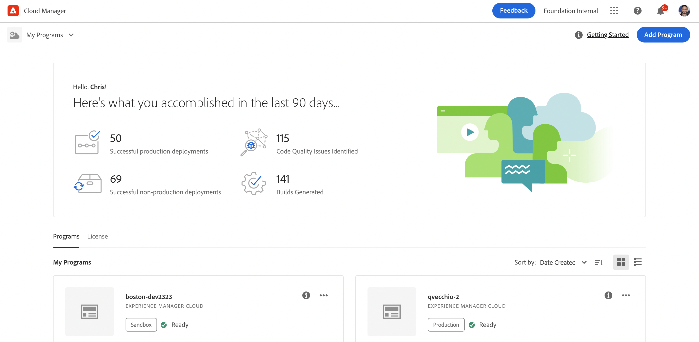
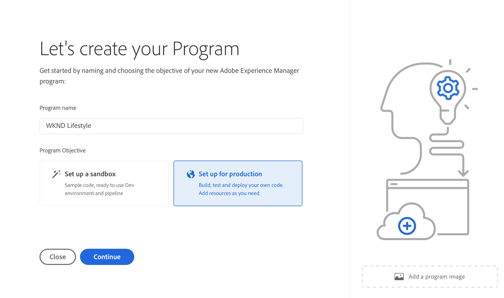
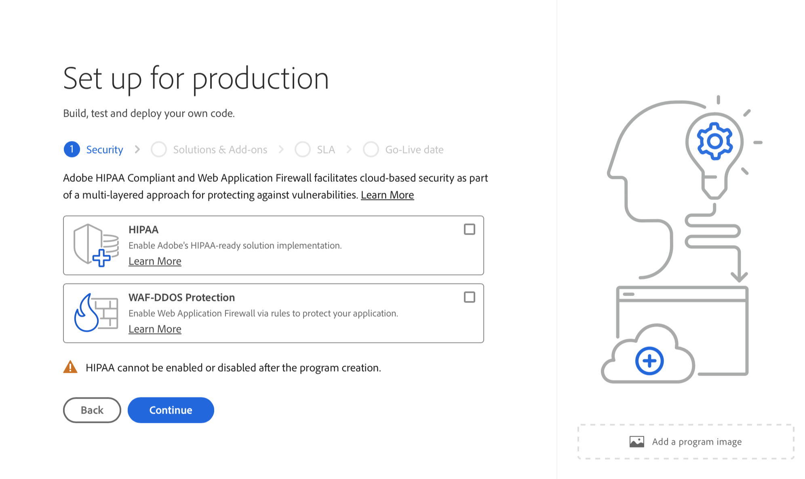
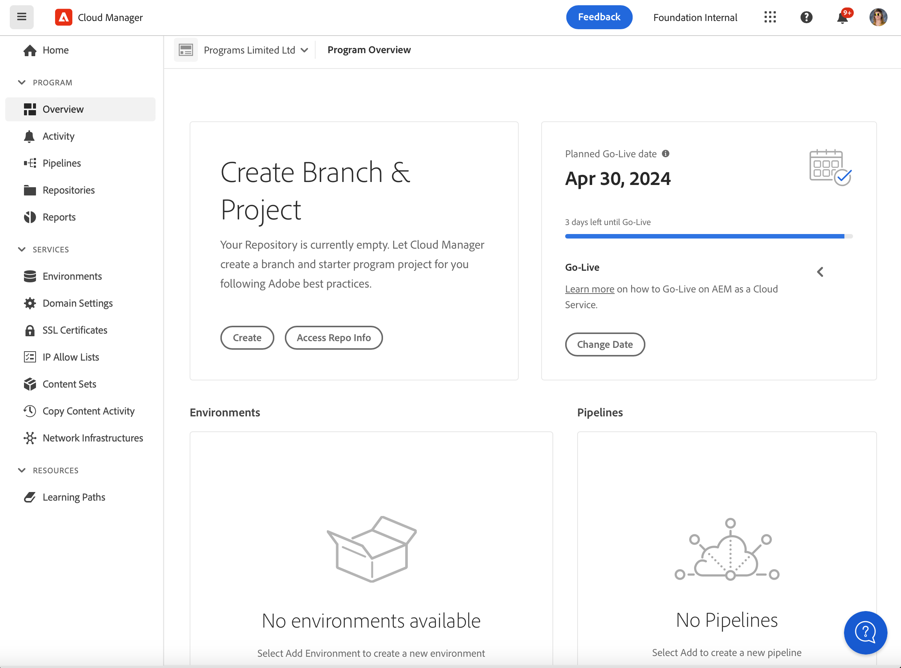

# Productieprogramma&#39;s maken {#create-production-program}

Een productieprogramma is bedoeld voor een gebruiker die vertrouwd is met AEM en Cloud Manager en klaar is om te beginnen met het schrijven, bouwen en testen van code met als doel het op te stellen om levend verkeer te ontvangen.

Meer informatie over programmatypen in het document [Het begrip van Programma en Programma Types.](program-types.md)

## Een productieprogramma maken {#create}

Ga als volgt te werk om een productieprogramma te maken. Let erop dat u, afhankelijk van de rechten van uw organisatie, [extra opties](#options) wanneer u uw programma toevoegt.

1. Aanmelden bij Cloud Manager [my.cloudmanager.adobe.com](https://my.cloudmanager.adobe.com/) en selecteert u de gewenste organisatie.

1. Op de **[Mijn programma&#39;s](/help/implementing/cloud-manager/navigation.md#my-programs)** console, tikken of klikken **Programma toevoegen** rechtsboven in het scherm.

   

1. Selecteren **Instellen voor productie** in de wizard Programma maken om een productieprogramma te maken en een programmanaam op te geven.

   

1. U kunt desgewenst een afbeelding aan het programma toevoegen door een afbeeldingsbestand naar het **Een programmaafbeelding toevoegen** Selecteer een afbeelding in een bestandenbrowser of klik erop. Selecteren **Doorgaan**.

1. Op de **Oplossingen en invoegtoepassingen** selecteert u de oplossingen die u in het programma wilt opnemen.

   * Als u niet zeker weet of u een of meerdere programma&#39;s nodig hebt voor de verschillende beschikbare oplossingen, selecteert u de meest interessante oplossing. U kunt aanvullende oplossingen activeren door [bewerken van het programma](/help/implementing/cloud-manager/getting-access-to-aem-in-cloud/editing-programs.md) later. Zie de [Inleiding tot het document Productieprogramma&#39;s](/help/implementing/cloud-manager/getting-access-to-aem-in-cloud/introduction-production-programs.md) voor meer aanbevelingen voor programmaopstelling.
   * Er is minstens één oplossing vereist voor het maken van programma&#39;s.
   * Als u **[Uitgebreide beveiliging inschakelen](#security)** kunt u alleen meerdere oplossingen selecteren waarvoor HIPAA-rechten beschikbaar zijn.

   

1. Klik op het chevron voor de namen van de oplossingen om optionele invoegtoepassingen te tonen, zoals het selecteren van de **Handel** invoegoptie onder **Sites**.

   

1. Selecteer uw oplossingen en invoegtoepassingen en klik op **Doorgaan**.

1. Op de **Go-Live-datum** voert u de datum in waarop u uw productieprogramma live wilt laten gaan.

   

   * Deze datum kan op elk moment worden bewerkt.
   * Deze datum is alleen ter informatie en activeert de widget Go Live op het tabblad [**Programmaoverzicht** page](/help/implementing/cloud-manager/getting-access-to-aem-in-cloud/editing-programs.md#program-overview) om op tijd koppelingen naar AEM documentatie over best practices voor as a Cloud Service toepassingen aan te bieden die zijn afgestemd op uw reis en die uitmonden in een geslaagde en vloeiende Go Live-ervaring.

1. Klikken **Maken**.

Uw programma wordt gemaakt door Cloud Manager en wordt weergegeven en geselecteerd op de bestemmingspagina.

## Aanvullende opties voor productieprogramma {#options}

Afhankelijk van de rechten waarover uw organisatie beschikt, hebt u mogelijk extra mogelijkheden wanneer u een productieprogramma maakt.

### Beveiliging {#security}

Als u over de nodige rechten beschikt, **Beveiliging** wordt weergegeven als de eerste tab in het dialoogvenster **Instellen voor productie** in.

De **Beveiliging** bevat de opties voor het activeren **HIPAA** en/of **WAF-DDOS-beveiliging** voor uw productieprogramma.

Adobe HIPAA-compatibel en Web Application Firewall (WAF) vereenvoudigt beveiliging op basis van cloud als onderdeel van een meerlagige aanpak ter bescherming tegen kwetsbaarheden.

* **HIPAA** - Met deze optie kan de Adobe de implementatie van een oplossing die geschikt is voor het gebruik van het HIPPA-bestand uitvoeren.
   * [Meer informatie](https://www.adobe.com/go/hipaa-ready) over de HIPAA-gereed implementatie van de oplossing van Adobe.
   * HIPAA kan na het maken van het programma niet worden in- of uitgeschakeld.
* **WAF-DDOS-beveiliging** - Met deze optie wordt de firewall van de webtoepassing via regels ingeschakeld om uw toepassing te beschermen.
   * Zodra geactiveerd, kan de bescherming WAF-DDOS dan door opstelling worden gevormd [niet-productiepijpleiding.](/help/implementing/cloud-manager/configuring-pipelines/configuring-non-production-pipelines.md)
   * Zie het document [Verkeersfilterregels inclusief WAF-regels](/help/security/traffic-filter-rules-including-waf.md) om te leren hoe te om de regels van de verkeersfilter in uw bewaarplaats te beheren zodat zij behoorlijk worden opgesteld.

### SLA {#sla}

Als u over de nodige rechten beschikt, **SLA** wordt weergegeven als tweede of derde tab in het dialoogvenster **Instellen voor productie** in.

AEM Sites biedt een standaardovereenkomst voor 99,9% serviceniveau (SLA). De **99,99% Service Level Agreement** biedt een minimale uptime van 99,99% voor uw productieomgevingen.

99,99% SLA biedt voordelen zoals hogere beschikbaarheid en lagere latentie, en vereist een [extra publicatiegebied](/help/implementing/cloud-manager/manage-environments.md#multiple-regions) in het programma op de productieomgeving toe te passen.

Wanneer de [vereisten](#sla-requirements) voor het toelaten van 99.99% SLA wordt voldaan, moet u in werking stellen [volledige stapelpijplijn](/help/implementing/cloud-manager/configuring-pipelines/configuring-production-pipelines.md) om het te activeren.

#### Eisen voor 99,99% SLA {#sla-requirements}

Naast de vereiste rechten heeft 99,99% SLA extra gebruiksvereisten.

* Zowel 99,99% SLA als extra rechten voor publicatiegebieden moeten beschikbaar zijn voor de organisatie op het moment dat zij 99,99% SLA toepast op het programma.
* Als u 99,99% SLA wilt toepassen op het programma, controleert Cloud Manager of een niet-verbruikte [extra publicatiegebied](/help/implementing/cloud-manager/manage-environments.md#multiple-regions) er is ook een machtiging beschikbaar die op het programma kan worden toegepast .
* Als tijdens het bewerken van een programma al een productieomgeving met minstens één extra publicatiegebied is opgenomen, controleert Cloud Manager alleen of er een SLA-machtiging van 99,99% beschikbaar is.
* Om de SLA van 99,99% en de rapportering in werking te stellen, [productie-/werkomgeving](/help/implementing/cloud-manager/manage-environments.md#adding-environments) moet zijn gecreëerd en moet ten minste één extra publicatiegebied zijn toegepast op de productie/het stadium-omgeving.
   * Als u [geavanceerde netwerken,](/help/security/configuring-advanced-networking.md) controleert u of de [Meerdere publicatiegebieden toevoegen aan een nieuwe omgeving](/help/implementing/cloud-manager/manage-environments.md#adding-regions) document voor aanbevelingen, zodat de connectiviteit in geval van regionale mislukking wordt gehandhaafd.
* Er moet minstens één extra publicatiegebied in uw SLA-programma van 99,99% overblijven. Gebruikers mogen het laatste aanvullende publicatiegebied niet verwijderen uit uw SLA-programma van 99,99%.
* 99.99% SLA wordt gesteund voor productieprogramma&#39;s die de toegelaten oplossing van Plaatsen hebben.
* U moet een [volledige stapelpijplijn](/help/implementing/cloud-manager/configuring-pipelines/configuring-production-pipelines.md) om de 99,99% SLA te activeren (of tijdens het bewerken van een programma deactief te maken).

## Toegang tot uw programma {#accessing}

1. Wanneer u uw programmacokaart op de landingspagina ziet, selecteer de elliptische knoop om de menuopties te bekijken beschikbaar aan u.

   

1. Selecteren **Programmaoverzicht** om naar Cloud Manager te navigeren **Overzicht** pagina.

1. De belangrijkste vraag-aan-actie kaart op de overzichtspagina zal u door het creëren van een milieu, een niet productiepijplijn, en tenslotte een productiepijplijn begeleiden.

   

>[!TIP]
>
>Zie het document [Navigeren door de interface van Cloud Manager](/help/implementing/cloud-manager/navigation.md) voor meer informatie over het navigeren door Cloud Manager en het begrijpen van de **Mijn programma&#39;s** console.

>[!NOTE]
>
>In tegenstelling tot een [sandboxprogramma,](introduction-sandbox-programs.md#auto-creation) een productieprogramma zal de gebruiker in de aangewezen rol van de Manager van de Wolk vereisen om het project tot stand te brengen en een milieu door de zelf-dienst UI toe te voegen.
