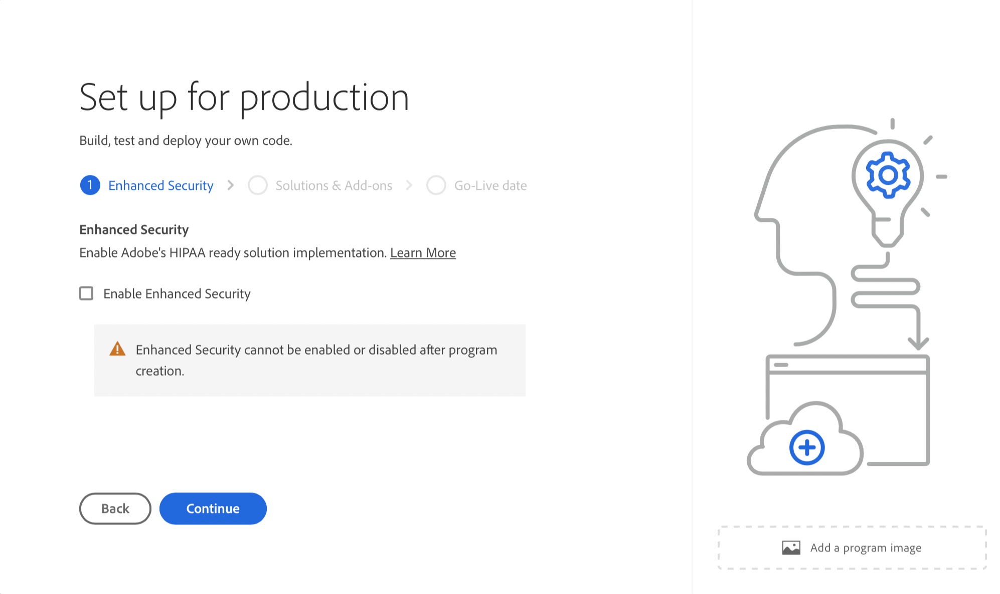

# Productieprogramma&#39;s maken {#create-production-program}

Een productieprogramma is bedoeld voor een gebruiker die vertrouwd is met AEM en Cloud Manager en klaar is om te beginnen met het schrijven, bouwen en testen van code met als doel het op te stellen om levend verkeer te ontvangen.

Meer informatie over programmatypen in het document [Het begrip van Programma en de Types van Programma.](program-types.md)

## Een productieprogramma maken {#create}

Ga als volgt te werk om een productieprogramma te maken.

1. Aanmelden bij Cloud Manager [my.cloudmanager.adobe.com](https://my.cloudmanager.adobe.com/) en selecteert u de gewenste organisatie.

1. Klikken op **Programma toevoegen** in de rechterbovenhoek van het scherm.

   

1. Selecteren **Instellen voor productie** in de wizard Programma maken om een productieprogramma te maken en een programmanaam op te geven.

   

1. U kunt desgewenst een afbeelding aan het programma toevoegen door een afbeeldingsbestand naar het **Een programmaafbeelding toevoegen** Selecteer een afbeelding in een bestandenbrowser of klik erop. Tik of klik op **Doorgaan**.

1. Als u verbeterde beveiligingsrechten hebt, kunt u **Uitgebreide beveiliging** biedt de optie om **Uitgebreide beveiliging inschakelen** voor uw productieprogramma. Controleer indien nodig de optie om de uitgebreide beveiliging in te schakelen en tik of klik op **Doorgaan**.

   * Uitgebreide beveiliging kan niet worden in- of uitgeschakeld nadat het programma is gemaakt.
   * [Meer informatie](https://www.adobe.com/go/hipaa-ready) over implementatie van Adobe

   

1. Op de **Oplossingen en invoegtoepassingen** selecteert u de oplossingen die u in het programma wilt opnemen.

   * Als u niet zeker weet of u een of meerdere programma&#39;s nodig hebt voor de verschillende beschikbare oplossingen, selecteert u de meest interessante oplossing. U kunt aanvullende oplossingen activeren door [bewerken van het programma](/help/implementing/cloud-manager/getting-access-to-aem-in-cloud/editing-programs.md) later. Zie de [Inleiding tot het document Productieprogramma&#39;s](/help/implementing/cloud-manager/getting-access-to-aem-in-cloud/introduction-production-programs.md) voor meer aanbevelingen voor programmaopstelling.
   * Als u **Uitgebreide beveiliging inschakelen** eerder, zult u worden toegestaan om slechts zo vele oplossingen te selecteren waarvoor de aanspraken van HIPAA beschikbaar zijn.

   

1. Klik op het chevron vóór de namen van de oplossingen om optionele invoegtoepassingen te tonen, zoals het selecteren van de **Handel** invoegoptie onder **Sites**.

   

1. Selecteer uw oplossingen en invoegtoepassingen en klik op **Doorgaan**.

1. Op de **Go-Live-datum** voert u de datum in waarop u uw productieprogramma live wilt gaan.

   

   * Deze datum kan op elk moment worden bewerkt.
   * Deze datum is alleen bedoeld voor informatief gebruik en activeert de widget Go Live op de overzichtspagina van het programma om op tijd koppelingen naar AEM as a Cloud Service documentatie over best practices te bieden, zodat deze op de juiste manier kunnen worden afgestemd op uw reis en een geslaagde en vloeiende Go Live-ervaring tot resultaat hebben.

1. Klikken **Maken**.

Uw programma wordt gemaakt door Cloud Manager en wordt weergegeven en geselecteerd op de bestemmingspagina.

## Toegang tot uw programma {#acessing}

1. Zodra u uw programmakaart op de landingspagina ziet, selecteer de ellipsknoop om de menuopties te bekijken beschikbaar aan u.

   

1. Selecteren **Programmaoverzicht** om naar Cloud Manager te navigeren **Overzicht** pagina.

1. De belangrijkste vraag-aan-actie kaart op de overzichtspagina zal u door het creëren van een milieu, een niet productiepijplijn, en tenslotte een productiepijplijn begeleiden.

   

Als u op een bepaald moment naar een ander programma moet schakelen of naar de overzichtspagina moet terugkeren om een ander programma te maken, klikt u op de naam van het programma linksboven in het scherm om het **Navigeren naar** optie.

>[!NOTE]
>
>In tegenstelling tot een [sandboxprogramma,](introduction-sandbox-programs.md#auto-creation) een productieprogramma zal de gebruiker in de aangewezen rol van de Manager van de Wolk vereisen om het project tot stand te brengen en een milieu door de zelf-dienst UI toe te voegen.
