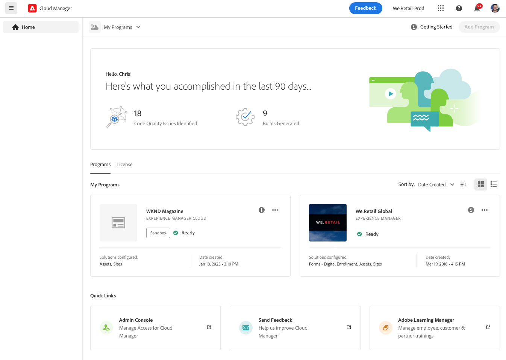
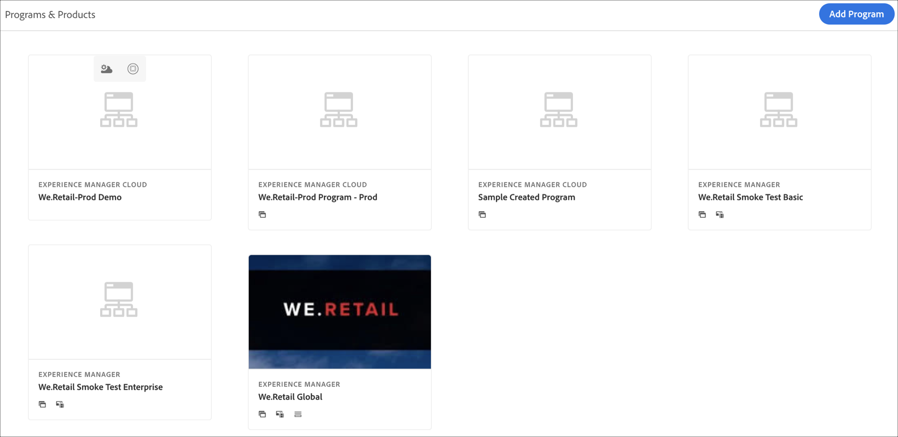

# Sandbox-programma&#39;s maken {#create-sandbox-program}

Een zandbakprogramma wordt typisch gecreeerd om ten behoeve van opleiding, lopende demo&#39;s, enablement, POCs, of documentatie te dienen en is niet bedoeld om levend verkeer te vervoeren.

Meer informatie over programmatypen in het document [Het begrip van Programma en de Types van Programma.](program-types.md)

## Een Sandbox-programma maken {#create}

Ga als volgt te werk om een sandboxprogramma te maken.

1. Aanmelden bij Cloud Manager [my.cloudmanager.adobe.com](https://my.cloudmanager.adobe.com/) en selecteert u de gewenste organisatie.

1. Klik op de landingspagina van Cloud Manager op **Programma toevoegen** in de rechterbovenhoek van het scherm.

   

1. Selecteer in de wizard Programma maken de optie **Een sandbox instellen**, geef een naam voor het programma op en klik op **Maken**.

   

Naarmate het installatieproces vordert, wordt op de bestemmingspagina een nieuwe sandbox-programmakaart met een statusindicator weergegeven.

## Toegang tot uw sandbox {#access}

U kunt de details van de configuratie van uw sandbox bekijken en de omgeving openen (zodra deze beschikbaar is) door de overzichtspagina van het programma te bekijken.

1. Klik op de landingspagina van Cloud Manager op de knop voor weglatingen in het zojuist gemaakte programma.

   

1. Nadat de stap voor het maken van het project is voltooid, hebt u toegang tot de **Repo-info openen** om uw git-repo te kunnen gebruiken.

   

   >[!TIP]
   >
   >Raadpleeg het document voor meer informatie over het openen en beheren van de git-opslagplaats [Toegang tot Git.](/help/implementing/cloud-manager/managing-code/accessing-repos.md)

1. Als de ontwikkelomgeving eenmaal is gemaakt, kunt u de **AEM** koppeling om u aan te melden bij AEM.

   

1. Zodra de niet-productiepijplijn die aan ontwikkeling opstelt volledig is, leidt de tovenaar u om of tot de AEM ontwikkelomgeving toegang te hebben of code aan ontwikkelomgeving op te stellen.

   

Als u op een bepaald moment naar een ander programma moet schakelen of naar de overzichtspagina moet terugkeren om een ander programma te maken, klikt u op de naam van het programma linksboven in het scherm om het **Navigeren naar** optie.

