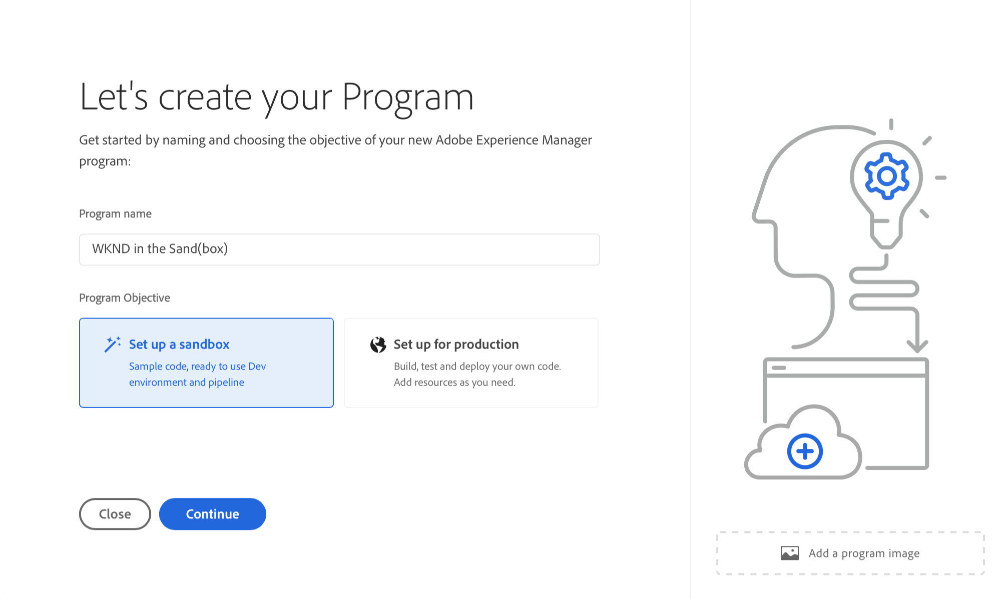
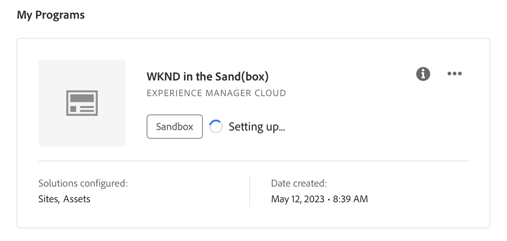
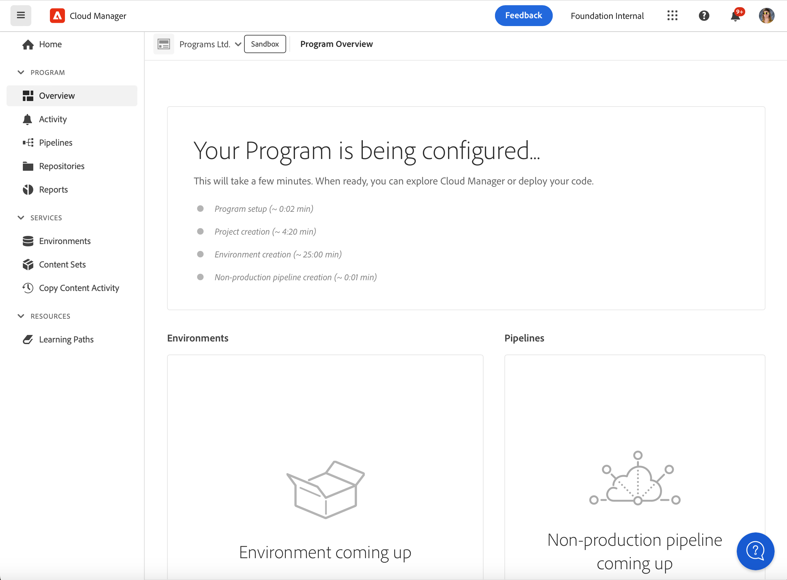
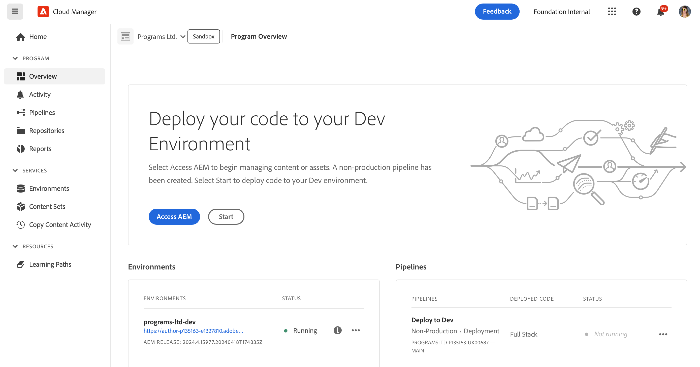

# Sandbox-programma&#39;s maken {#create-sandbox-program}

Een zandbakprogramma wordt typisch gecreeerd om ten behoeve van opleiding, lopende demo&#39;s, enablement, POCs, of documentatie te dienen en is niet bedoeld om levend verkeer te vervoeren.

Meer informatie over programmatypen in het document [Het begrip van Programma en Programma Types.](program-types.md)

## Een Sandbox-programma maken {#create}

1. Aanmelden bij Cloud Manager [my.cloudmanager.adobe.com](https://my.cloudmanager.adobe.com/) en selecteert u de gewenste organisatie.

1. Op de **[Mijn programma&#39;s](/help/implementing/cloud-manager/navigation.md#my-programs)** console, tikken of klikken **Programma toevoegen** in de rechterbovenhoek van het scherm.

   

1. Selecteer in de wizard Programma maken de optie **Een sandbox instellen** en geef een programmanaam op.

   

1. U kunt desgewenst een afbeelding aan het programma toevoegen door een afbeeldingsbestand naar het **Een programmaafbeelding toevoegen** Selecteer een afbeelding in een bestandenbrowser of klik erop. Selecteren **Doorgaan**.

   * De afbeelding fungeert alleen als de tegel in het venster met het programmaoverzicht en helpt het programma te identificeren.

1. In de **Sandbox instellen** kiest u welke oplossingen u wilt inschakelen in uw sandboxprogramma door de opties in het dialoogvenster **Oplossingen en invoegtoepassingen** tabel.

   * Gebruik de chevrons naast de oplossingsnamen zodat kunt u extra, facultatieve toe:voegen-ons voor de oplossingen zien.

   * De **Sites** en **Activa** -oplossingen worden altijd opgenomen in sandboxprogramma&#39;s en kunnen niet worden uitgeschakeld.

   

1. Als u de oplossingen en invoegtoepassingen voor uw sandboxprogramma hebt geselecteerd, klikt u op **Maken**.

U ziet een nieuwe zandbakprogrammakaart op de landingspagina met een statusindicator aangezien het opstellingsproces vordert.

## Toegang tot sandbox {#access}

U kunt de details van uw zandbakopstelling bekijken en tot het milieu (zodra beschikbaar) toegang hebben door de pagina van het programmaoverzicht te bekijken.

1. Klik op de landingspagina van Cloud Manager op de knop voor weglatingen in het gemaakte programma.

   

1. Nadat de stap voor het maken van het project is voltooid, hebt u toegang tot de **Repo-info openen** om uw git-repo te kunnen gebruiken.

   

   >[!TIP]
   >
   >Ga voor meer informatie over toegang tot en beheer van uw it-opslagplaats naar [Toegang tot it](/help/implementing/cloud-manager/managing-code/accessing-repos.md).

1. Als de ontwikkelomgeving eenmaal is gemaakt, kunt u de **AEM** koppeling om u aan te melden AEM.

   

1. Zodra de niet productiepijplijn die aan ontwikkeling opstelt volledig is, leidt de tovenaar in vraag-aan-actie u om of tot de AEM ontwikkelomgeving toegang te hebben of code aan ontwikkelomgeving op te stellen.

   

>[!TIP]
>
>Zie het document [Navigeren door de interface van Cloud Manager](/help/implementing/cloud-manager/navigation.md) voor meer informatie over het navigeren door Cloud Manager en het begrijpen van de **Mijn programma&#39;s** console.
