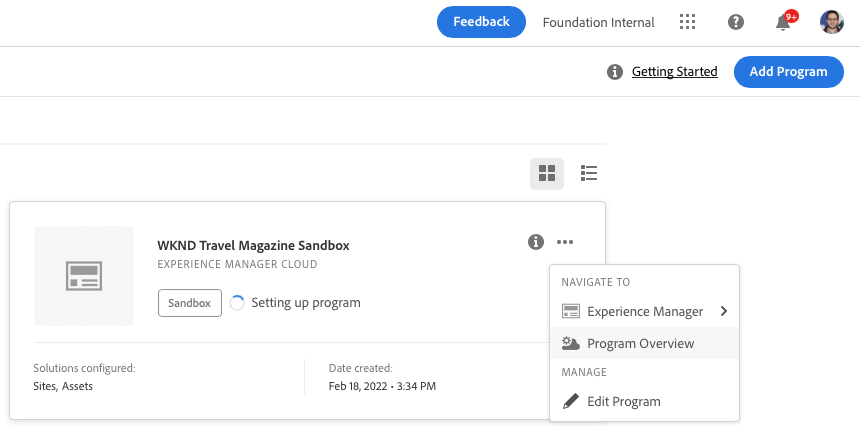

# Sandbox-programma&#39;s maken {#create-sandbox-program}

Een zandbakprogramma wordt typisch gecreeerd om ten behoeve van opleiding, lopende demo&#39;s, enablement, POCs, of documentatie te dienen en is niet bedoeld om levend verkeer te vervoeren.

Leer meer over programmatypes in het document [ Begrijpend Programma en de Types van Programma.](program-types.md)

## Een Sandbox-programma maken {#create}

1. Logon aan Cloud Manager bij [ my.cloudmanager.adobe.com ](https://my.cloudmanager.adobe.com/) en selecteer de aangewezen organisatie.

1. Op de **[Mijn console van Programma&#39;s](/help/implementing/cloud-manager/navigation.md#my-programs)**, tikt of klikt **Programma** dichtbij de hoger-juiste hoek van het scherm toevoegen.

   

1. Van creeer programmatovenaar, selecteer **Opstelling een zandbak**, en verstrek een programmanaam.

   

1. Naar keuze, kunt u een beeld aan het programma toevoegen door een beelddossier aan **te slepen en te laten vallen voeg een doel van het programmabeeld** toe of klikkend het om een beeld van een dossierbrowser te selecteren. Selecteer **verdergaan**.

   * De afbeelding fungeert alleen als de tegel in het venster met het programmaoverzicht en helpt het programma te identificeren.

1. In de **Opstelling uw zandbak** dialoogdoos, kies welke oplossingen u in uw zandbakprogramma wilt toelaten door de opties in de **Oplossingen &amp; toe:voegen-ons** lijst te controleren.

   * Gebruik de chevrons naast de oplossingsnamen zodat kunt u extra, facultatieve toe:voegen-ons voor de oplossingen zien.

   * De **Plaatsen** en **Assets** oplossingen zijn altijd inbegrepen in zandbakprogramma&#39;s en kunnen niet worden gedeselecteerd.

   

1. Zodra u de oplossingen en toe:voegen-ons voor uw zandbakprogramma hebt geselecteerd, creeert de klik ****.

U ziet een nieuwe zandbakprogrammakaart op de landingspagina met een statusindicator aangezien het opstellingsproces vordert.

## Toegang tot sandbox {#access}

U kunt de details van uw zandbakopstelling bekijken en tot het milieu (zodra beschikbaar) toegang hebben door de pagina van het programmaoverzicht te bekijken.

1. Klik op de openingspagina van Cloud Manager op de knop voor ovaal in het gemaakte programma.

   

1. Nadat de stap van de projectverwezenlijking voltooit, kunt u tot de **verbinding van Info van de Reparatie van de Toegang** toegang hebben om uw git repo te kunnen gebruiken.

   

   >[!TIP]
   >
   >Meer leren over de toegang tot van en het beheren van uw git bewaarplaats, zie [ Toegang hebbend tot Git ](/help/implementing/cloud-manager/managing-code/accessing-repos.md).

1. Zodra het ontwikkelmilieu wordt gecreeerd, kunt u de **AEM van de Toegang** verbinding gebruiken om in AEM te ondertekenen.

   

1. Zodra de niet productiepijplijn die aan ontwikkeling opstelt volledig is, leidt de tovenaar in vraag-aan-actie u om of tot de AEM ontwikkelomgeving toegang te hebben of code aan ontwikkelomgeving op te stellen.

    opstelt

>[!TIP]
>
>Gelieve te zien het document [ Navigerend Cloud Manager UI ](/help/implementing/cloud-manager/navigation.md) voor details op hoe te Cloud Manager navigeren en het begrijpen van de **Mijn console van Programma&#39;s**.
