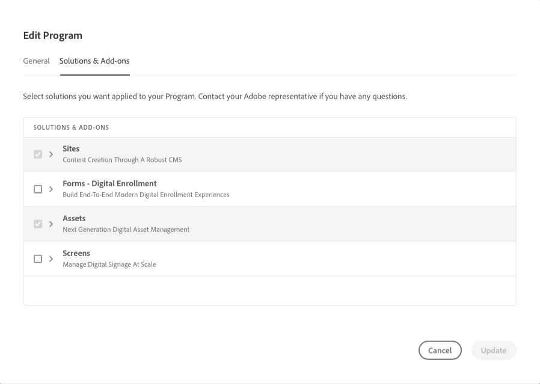
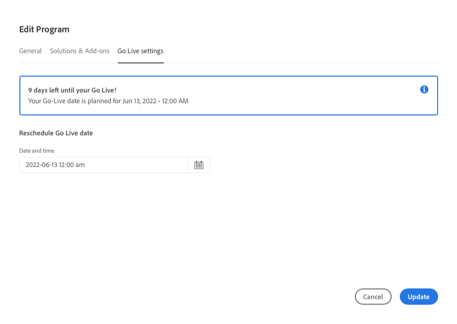
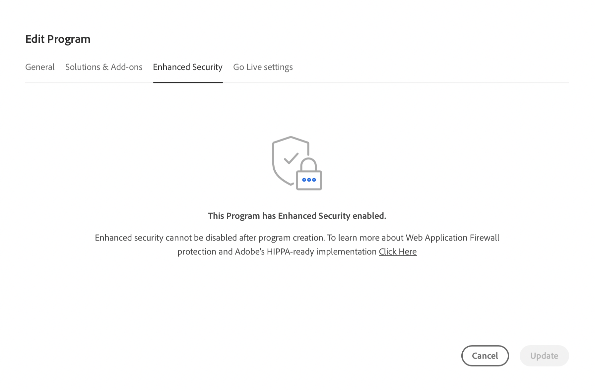

# Programma&#39;s bewerken {#editing-programs}

Gebruikers met de vereiste machtigingen kunnen bewerkingen uitvoeren [productieprogramma&#39;s die in uw organisatie zijn gemaakt](creating-production-programs.md) en [sandboxprogramma&#39;s die in uw organisatie zijn gemaakt.](creating-sandbox-programs.md) Door een programma te bewerken kunt u:

* Voeg de oplossing van Plaatsen aan een bestaand programma met Activa toe en omgekeerd.
* Sites of middelen verwijderen uit een bestaand programma met zowel sites als middelen.
* Voeg een tweede, ongebruikte oplossingsrecht, aan of een bestaand programma of als nieuw Programma toe.
* Sandboxprogramma&#39;s verwijderen.

## Machtigingen {#permissions}

U moet lid zijn van de **Zakelijke eigenaar** rol om programma&#39;s te bewerken of sandboxprogramma&#39;s te verwijderen.

## Een programma bewerken {#editing}

1. Aanmelden bij Cloud Manager [my.cloudmanager.adobe.com](https://my.cloudmanager.adobe.com/) en selecteert u de gewenste organisatie.

1. Klik op het programma dat u wilt bewerken om de details weer te geven.

1. Klik op de naam van het programma linksboven op de pagina en selecteer **Programma bewerken**.

   

1. De **Programma bewerken** pagina wordt geopend. Op de **Algemeen** de naam en beschrijving van het programma bewerken.

   * Voor een programma moet ten minste één oplossing worden gekozen.

   

1. Op de **Oplossingen en invoegtoepassingen** wijzigt u de oplossingen voor het programma.

   

1. Klik op het chevron voor de naam van de oplossing om optionele invoegtoepassingen weer te geven, zoals het selecteren van de **Handel** invoegoptie onder **Sites**.

   

1. Op de **Live-instellingen** wijzigen, wijzigt u de geplande datum voor de introductie van het programma.

   

   * Deze datum is uitsluitend ter informatie. De widget Go Live wordt geactiveerd op de pagina met het programmaoverzicht. Het biedt op zijn beurt in-product koppelingen naar de as a Cloud Service documentatie over beste praktijken van Adobe Experience Manager (AEM), die op uw reis is afgestemd. Dit culmineert in een geslaagde Go Live-ervaring.
   * Dit tabblad is niet beschikbaar voor sandboxprogramma&#39;s.

1. Klikken **Bijwerken** om uw wijzigingen in het programma op te slaan.

Telkens wanneer een programma wordt uitgegeven, met inbegrip van het toevoegen van of het verwijderen van een oplossing of toe:voegen-op, worden die veranderingen van kracht na de volgende plaatsing.

Als de uitgebreide beveiliging van uw productieprogramma is ingeschakeld, kunt u een extra **Uitgebreide beveiliging** tabblad is beschikbaar in het dialoogvenster **Programma bewerken** venster om te bevestigen dat de functie actief is voor het programma.

U kunt deze instelling niet bewerken nadat het programma is gemaakt. Zie voor meer informatie over de verbeterde beveiligingsoptie [Productieprogramma&#39;s maken](creating-production-programs.md).

## Sandbox-programma&#39;s verwijderen {#delete-sandbox-program}

Als u een sandboxprogramma verwijdert, worden alle bijbehorende omgevingen en pijpleidingen verwijderd.

>[!TIP]
>
>Gebruikers met de **Zakelijke eigenaar** of **Implementatiebeheer** rollen kunnen hun productie en werkgebiedmilieu&#39;s in plaats van het volledige zandbakprogramma Alternatief schrappen.

Ga als volgt te werk om een sandboxprogramma te verwijderen.

1. Aanmelden bij Cloud Manager [my.cloudmanager.adobe.com](https://my.cloudmanager.adobe.com/) en selecteert u de gewenste organisatie.

1. Klik op het programma dat u wilt bewerken om de details weer te geven.

1. Klik op de naam van het programma linksboven op de pagina en selecteer **Programma verwijderen**.

   

U kunt ook op de knop Ovaal op de kaart van uw programma klikken op de overzichtspagina van Cloud Manager en **Programma verwijderen**.

>[!NOTE]
>
>Alleen sandboxprogramma&#39;s kunnen worden verwijderd. Productieprogramma&#39;s kunnen niet worden verwijderd.
