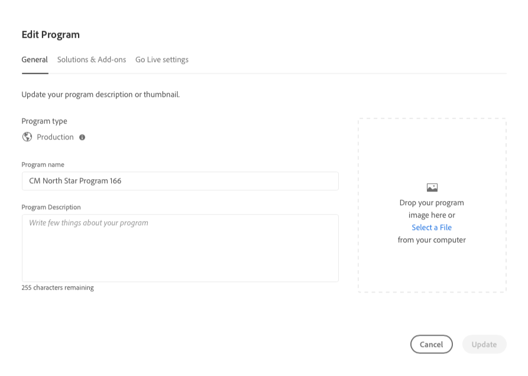

# Programma&#39;s bewerken {#editing-programs}

Start bij het [**Mijn programma&#39;s** console.](/help/implementing/cloud-manager/navigation.md) De **Mijn programma&#39;s** biedt een overzicht van alle programma&#39;s waartoe u toegang hebt. Wanneer u een afzonderlijk programma selecteert, wordt **Programmaoverzicht** Deze pagina bevat in één oogopslag details over het programma.

Van de **Programmaoverzicht**, kunnen gebruikers met de vereiste machtigingen [productieprogramma&#39;s die in uw organisatie zijn gemaakt](creating-production-programs.md) en [sandboxprogramma&#39;s die in uw organisatie zijn gemaakt.](creating-sandbox-programs.md) Door een programma te bewerken kunt u:

* Voeg de oplossing van Plaatsen aan een bestaand programma met Activa toe en omgekeerd.
* Sites of middelen verwijderen uit een bestaand programma met zowel sites als middelen.
* Voeg een tweede, ongebruikte oplossingsrecht, aan of een bestaand programma of als nieuw Programma toe.
* Sandboxprogramma&#39;s verwijderen.

## Machtigingen {#permissions}

U moet lid zijn van de **Zakelijke eigenaar** rol voor het bewerken van programma&#39;s of het verwijderen van sandboxprogramma&#39;s en voor toegang tot het licentiedashboard.

## Een programma bewerken {#editing}

1. Aanmelden bij Cloud Manager [my.cloudmanager.adobe.com](https://my.cloudmanager.adobe.com/) en selecteert u de gewenste organisatie.

1. Op de **[Mijn programma&#39;s](#my-programs)** klikt u op het programma dat u wilt bewerken om de details weer te geven.

1. Klik op de naam van het programma linksboven op de pagina en selecteer **Programma bewerken**.

   

1. De **Programma bewerken** pagina wordt geopend voor de **Algemeen** tab.

   

1. De beschikbare opties voor het bewerken van het programma zijn dezelfde als die voor het maken van het programma.
   * Zie de documenten [Productieprogramma&#39;s maken](/help/implementing/cloud-manager/getting-access-to-aem-in-cloud/creating-production-programs.md) en [Sandbox-programma&#39;s maken](/help/implementing/cloud-manager/getting-access-to-aem-in-cloud/creating-sandbox-programs.md) voor meer informatie over de afzonderlijke opties.
   * [Aanvullende opties](/help/implementing/cloud-manager/getting-access-to-aem-in-cloud/creating-production-programs.md#options) kan voor uw productieprogramma afhankelijk van de aanspraken van uw organisatie beschikbaar zijn.

1. Klikken **Bijwerken** om uw wijzigingen in het programma op te slaan.

De wijzigingen in het programma worden opgeslagen.

>[!NOTE]
>
>Telkens wanneer een programma wordt uitgegeven, met inbegrip van het toevoegen van of het verwijderen van een oplossing of toe:voegen-op, worden die veranderingen van kracht na de volgende plaatsing.

## Sandbox-programma&#39;s verwijderen {#delete-sandbox-program}

Als u een sandboxprogramma verwijdert, worden alle bijbehorende omgevingen en pijpleidingen verwijderd.

>[!TIP]
>
>Gebruikers met de **Zakelijke eigenaar** of **Implementatiebeheer** rollen kunnen hun productie en werkgebiedmilieu&#39;s in plaats van het volledige zandbakprogramma Alternatief schrappen.

Ga als volgt te werk om een sandboxprogramma te verwijderen.

1. Aanmelden bij Cloud Manager [my.cloudmanager.adobe.com](https://my.cloudmanager.adobe.com/) en selecteert u de gewenste organisatie.

1. Op de **[Mijn programma&#39;s](#my-programs)** klikt u op het programma dat u wilt bewerken om de details weer te geven.

1. Klik op de naam van het programma linksboven op de pagina en selecteer **Programma verwijderen**.

   

U kunt ook op de knop Ovaal op de kaart van uw programma klikken op de overzichtspagina van Cloud Manager en **Programma verwijderen**.

>[!NOTE]
>
>Alleen sandboxprogramma&#39;s kunnen worden verwijderd. Productieprogramma&#39;s kunnen niet worden verwijderd.
