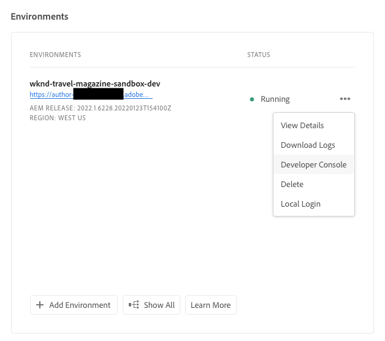

# Sluimerende en Sluimerende zandbakomgevingen {#hibernating-introduction}

De omgevingen van een sandboxprogramma gaan in op een slaapstand als er gedurende acht uur geen activiteit wordt gedetecteerd. De slaapstand is uniek in sandboxprogrammaomgevingen. In productieprogrammaomgevingen vindt geen hiberatie plaats.

## Sluimerstand {#hibernation-introduction}

Sluimerstand kan automatisch of handmatig plaatsvinden.

* **Automatisch** - Sandbox-programmaomgevingen worden automatisch gehiberd na acht uur inactiviteit. Inactiviteit wordt gedefinieerd als het ontvangen van aanvragen door de auteurservice of door voorvertonings- of publicatieservices.
* **Handmatig** - Als gebruiker kunt u de omgeving van een sandboxprogramma handmatig moderniseren. Dit is niet verplicht, aangezien de herberging automatisch plaatsvindt, zoals eerder beschreven.

Het kan een paar minuten duren voordat de slaapstand wordt geactiveerd in sandboxprogrammaomgevingen. De gegevens blijven behouden tijdens de winterslaap.

### Handmatige slaapstand gebruiken {#using-manual-hibernation}

U kunt uw sandboxprogramma handmatig via de ontwikkelaarsconsole herbergen. Alle gebruikers van Cloud Manager hebben toegang tot de Developer Console voor een sandboxprogramma.

Voer de volgende stappen uit om de omgevingen van uw sandboxprogramma handmatig te hiberneren.

1. Aanmelden bij Cloud Manager [my.cloudmanager.adobe.com](https://my.cloudmanager.adobe.com/) en selecteert u de gewenste organisatie.

1. Op de **[Mijn programma&#39;s](/help/implementing/cloud-manager/navigation.md#my-programs)** tikken of op het programma klikken dat u wilt herbergen om de details weer te geven.

1. Op de **Omgevingen** kaart, klikt u op de knop voor ovaal en selecteert u **Ontwerpconsole**.

   * Zie [Developer Console openen](/help/implementing/cloud-manager/manage-environments.md#accessing-developer-console) voor meer informatie over de Developer Console.

   

1. Klik in de Developer Console op **Sluimerstand**.

   

1. Klikken **Sluimerstand** om de stap te bevestigen.

   

Wanneer de winterslaap succesvol is, ziet u het hibernatieproces volledige melding voor uw milieu in **Ontwerpconsole** scherm.

In de Developer Console kunt u ook op de knop **Omgevingen** link in de breadcrumbs boven de **Pod** vervolgkeuzelijst voor een lijst met omgevingen die u wilt hiberneren.

## De-Hibernatie {#de-hibernation-introduction}

U kunt uw Sandbox-programma handmatig via de ontwikkelaarsconsole herbergen.

>[!IMPORTANT]
>
>Een gebruiker met een **Ontwikkelaar** Deze rol kan een sandboxprogrammaomgeving dehiberneren.

1. Aanmelden bij Cloud Manager [my.cloudmanager.adobe.com](https://my.cloudmanager.adobe.com/) en selecteert u de gewenste organisatie.

1. Op de **[Mijn programma&#39;s](/help/implementing/cloud-manager/navigation.md#my-programs)** tikken of op het programma klikken dat u wilt dehiberneren om de details weer te geven.

1. Op de **Omgevingen** kaart, klikt u op de knop voor ovaal en selecteert u **Ontwerpconsole**.

   * Zie [Developer Console openen](/help/implementing/cloud-manager/manage-environments.md#accessing-developer-console) voor meer informatie over de Developer Console.

1. Klikken **De-hibernate**.

   

1. Klikken **De-Hibernate** om de stap te bevestigen.

   

1. U ontvangt een melding dat het dehibernatieproces is gestart en met de voortgang is bijgewerkt.

   

1. Zodra het proces is voltooid, is de sandboxprogrammaomgeving weer actief.

   

In de Developer Console kunt u ook op de knop **Omgevingen** link in de breadcrumbs boven de **Pod** vervolgkeuzelijst voor een lijst met omgevingen die moeten worden gedehiberneerd.

### Machtigingen om de-Slaapstand te verwijderen {#permissions-de-hibernate}

Elke gebruiker met een productprofiel die hem toegang geeft tot AEM as a Cloud Service moet toegang hebben tot de **Ontwerpconsole**, waardoor zij het milieu kunnen ontberen.

## Een gedownloade omgeving openen {#accessing-hibernated-environment}

Wanneer het doen van om het even welke browser verzoeken tegen de auteur, de voorproef, of de publicatieservice van een hibernated milieu, zal de gebruiker een landende pagina ontmoeten die de geminimaliseerde status van het milieu samen met een verbinding aan de Console van de Ontwikkelaar beschrijft waar de dienst kan worden ontruimd-hibernated.

## Implementaties en AEM updates {#deployments-updates}

In gesluimerde omgevingen zijn implementaties en handmatige AEM nog steeds mogelijk.

* Een gebruiker kan een pijpleiding gebruiken om douanecode aan gehiberneerde milieu&#39;s op te stellen. Het milieu zal gehiberneerd blijven en de nieuwe code zal in het milieu verschijnen zodra ontruimd-hibernated.

* AEM upgrades kunnen worden toegepast op gehiberde omgevingen en kunnen handmatig worden geactiveerd via Cloud Manager. Het milieu zal gehiberneerd blijven en de nieuwe introductie zal in het milieu verschijnen zodra het wordt gedehiberneerd.

## Sluimerstand en verwijdering {#hibernation-deletion}

* De omgevingen in een sandboxprogramma worden na acht uur inactiviteit automatisch genummerd.
   * Inactiviteit wordt gedefinieerd als het ontvangen van aanvragen door de auteurservice of door voorvertonings- of publicatieservices.
   * Als ze eenmaal zijn gehiberd, kunnen ze [handmatig ontbonden.](#de-hibernation-introduction)
* Sandboxprogramma&#39;s worden verwijderd na zes maanden van continuhibernatiemodus, waarna ze opnieuw kunnen worden gemaakt.

>[!NOTE]
>
>Alleen sandboxomgevingen worden automatisch verwijderd na zes maanden doorlopende hibernatie. Het sandboxprogramma met de bijbehorende opslagplaats en code blijft behouden.
