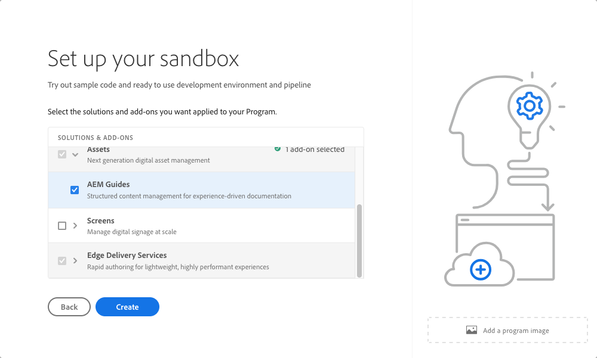

# Inleiding tot sandboxprogramma&#39;s {#sandbox-programs}

Leer welke sandboxprogramma&#39;s zijn en hoe ze verschillen van productieprogramma&#39;s.

## Inleiding {#introduction}

Een zandbakprogramma wordt typisch gecreeerd om ten behoeve van opleiding, lopende demo&#39;s, enablement, of het bewijs van concepten (POCs) te dienen en daarom niet bedoeld om levend verkeer te vervoeren.

Een zandbakprogramma is één van de twee soorten programma&#39;s beschikbaar in de Dienst van de Wolk AEM, andere die a [ productieprogramma ](introduction-production-programs.md) zijn. Zie [ Begrijpend Programma&#39;s en de Types van Programma ](/help/implementing/cloud-manager/getting-access-to-aem-in-cloud/program-types.md) om meer over programmatypes te leren.

## Automatisch maken {#auto-creation}

Sandboxprogramma&#39;s maken automatisch ontwerp mogelijk. Wanneer u [ een zandbakprogramma ](/help/implementing/cloud-manager/getting-access-to-aem-in-cloud/creating-sandbox-programs.md) creeert, automatisch Cloud Manager:

* Hiermee voegt u AEM Sites, Assets en Edge Delivery Services toe als standaardoplossingen voor uw programma.

  

* Plaatst omhoog een opslagplaats van de projectgit met een steekproefproject dat op [ wordt gebaseerd Archetype van het Project van AEM ](https://experienceleague.adobe.com/nl/docs/experience-manager-core-components/using/developing/archetype/overview).
* Maakt een ontwikkelomgeving.
* Creeert een niet-productiepijpleiding die aan de ontwikkelomgeving opstelt.

Een sandboxprogramma heeft slechts één ontwikkelomgeving.

## Gebruiksnotities en -voorwaarden {#usage-notes-conditions}

Omdat ze niet voor levend verkeer bedoeld zijn, hebben sandboxprogramma&#39;s bepaalde beperkingen en voorwaarden voor hun gebruik, waardoor ze zich onderscheiden van productieprogramma&#39;s.

| Beperking/voorwaarde | Beschrijving |
| --- | --- |
| Geen live verkeer | De programma&#39;s van zandbak zijn niet bedoeld om levend verkeer te dragen en zijn daarom niet onderworpen aan [ verbintenissen van AEM as a Cloud Service ](https://www.adobe.com/legal/service-commitments.html). |
| Geen automatische schaling | De milieu&#39;s die in een zandbakprogramma worden gecreeerd worden niet gevormd voor auto-schrapen. Daarom zijn deze omgevingen niet geschikt voor het testen van prestaties of belasting. |
| Geen aangepaste domeinen of IP-Lijsten van gewenste personen | [ de domeinen van de Douane ](/help/implementing/cloud-manager/custom-domain-names/introduction.md) en [ IP Lijsten van gewenste personen ](/help/implementing/cloud-manager/ip-allow-lists/introduction.md) zijn niet beschikbaar in zandbakprogramma&#39;s. |
| Geen publicatiegebieden meer | [ extra publiceer gebieden ](/help/operations/additional-publish-regions.md) zijn niet beschikbaar in zandbakprogramma&#39;s. |
| Nr. 99,99% SLA | [ 99.99% SLA ](/help/implementing/cloud-manager/getting-access-to-aem-in-cloud/creating-production-programs.md#sla) is niet op zandbakprogramma&#39;s van toepassing. |
| Geen geavanceerde netwerken | [ Geavanceerde voorzien van een netwerkeigenschappen ](/help/security/configuring-advanced-networking.md) (bijvoorbeeld, self-serve levering van VPN, niet-standaardhavens, specifieke IP adressen van de uitgang, etc.) zijn niet beschikbaar in zandbakprogramma&#39;s. |
| Geen automatische AEM-updates | AEM-updates worden niet automatisch doorgegeven aan sandboxprogramma&#39;s, maar kunnen handmatig worden toegepast op de omgevingen in uw sandboxprogramma. ・ Een handmatige update kan alleen worden uitgevoerd wanneer de beoogde omgeving een correct geconfigureerde pijplijn heeft. ・ Een handmatige update van een productie- of testomgeving werkt automatisch de andere bij. De Production+Stage-omgeving moet zich op dezelfde AEM-release bevinden.  zie [ de versiupdates van AEM ](/help/implementing/deploying/aem-version-updates.md) voor meer details.  zie [ Bijwerkend Milieu ](/help/implementing/cloud-manager/manage-environments.md#updating-dev-environment) leren hoe te om een milieu bij te werken. |
| Geen technische ondersteuning | Aangezien een sandboxprogramma doorgaans wordt gemaakt voor trainingsdoeleinden, het uitvoeren van demo&#39;s, activering of concepttest, is technische ondersteuning niet beschikbaar voor problemen die worden ervaren in een sandboxprogramma.  als u problemen ervaart die tot uw zandbakprogramma&#39;s leiden, zijn deze kwesties binnen het werkingsgebied van technische steun. |
| Sluimerstand en verwijdering | De omgevingen in een sandboxprogramma worden na acht uur inactiviteit automatisch genummerd. Sandbox-omgevingen worden verwijderd na zes opeenvolgende maanden van hibernatie.  zie [ Sluipende en Sneeuwende Milieu&#39;s van Sandbox ](/help/implementing/cloud-manager/getting-access-to-aem-in-cloud/hibernating-environments.md) voor meer details over hoe te om milieu&#39;s en automatische zandbakschrapping te ontruimen. |
