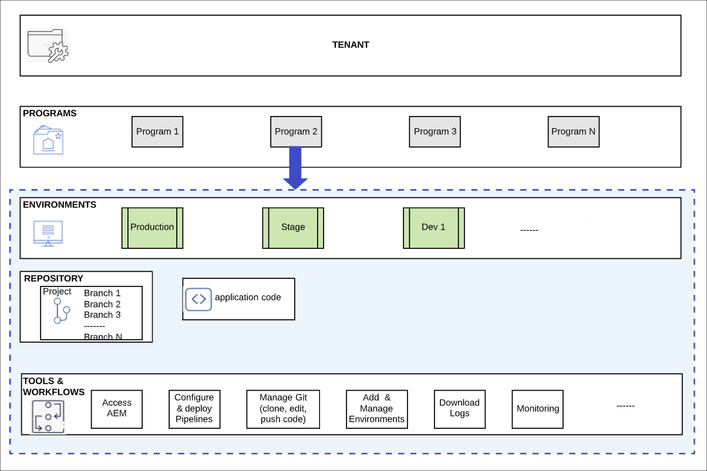

# Programma&#39;s en programmatypen {#understanding-programs}

Cloud Manager is opgebouwd rond een hiërarchie van entiteiten. De details zijn niet van essentieel belang voor uw dagelijkse werk in Cloud Manager, maar een overzicht ervan kan u helpen als u programma&#39;s begrijpt en uw eigen programma opstelt.



* **GEWENST** - de bovenkant van de hiërarchie. Elke klant is provisioned met een huurder.
* **PROGRAMMA&#39;S** - Elke huurder heeft één of meerdere programma&#39;s, [&#x200B; die vaak op de gelicentieerde oplossingen van de klant &#x200B;](introduction-production-programs.md) wijzen.
* **OMGEVINGEN** - Elk programma heeft veelvoudige milieu&#39;s zoals productie voor levende inhoud, voor het opvoeren, en voor ontwikkelingsdoeleinden.
   * Elk programma kan slechts één productiemilieu, maar veelvoudige non-production milieu&#39;s hebben.
* **REPOSITORY** - De programma&#39;s hebben de bewaarplaatsen van het Git waar toepassing en front-end code voor de milieu&#39;s wordt gehandhaafd.
* **TOOLS &amp; WORKFLOWS** - de Pijpleidingen beheren de plaatsing van code van de bewaarplaatsen aan de milieu&#39;s terwijl andere hulpmiddelen voor toegang tot logboeken, controle, en milieubeheer toestaan.

Een voorbeeld is vaak handig bij het contextualiseren van deze hiërarchie.

* De Onderneming van het Reizen van WKND en van het Avontuur zou a **huurder** kunnen zijn die zich op op reis betrekking hebbende media concentreert.
* De huurder van de Onderneming van het WKND Reizen en van het Avontuur zou twee **programma&#39;s** kunnen hebben: één programma van Plaatsen voor het Tijdschrift van WKND en één programma van Assets voor Media WKND.
* De programma&#39;s van het Tijdschrift WKND en van Media WKND zouden zowel dev, stadium, als productie **milieu&#39;s** hebben.

## Source-codeopslagplaats {#source-code-repository}

Een Cloud Manager-programma wordt automatisch voorzien van een eigen Git-opslagruimte.

Gebruikers kunnen toegang krijgen tot de Cloud Manager Git-opslagplaats via een Git-client met een opdrachtregelprogramma of een zelfstandige visuele Git-client. Alternatief, kunnen zij hun aangewezen Geïntegreerde Ontwikkelomgeving (winde), zoals Eclipse, IntelliJ, of NetBeans gebruiken.

Zodra een Git-client is ingesteld, kunt u de Git-opslagplaats beheren vanuit de Cloud Manager-gebruikersinterface. Om over te leren hoe te om Git te beheren gebruikend het gebruikersinterface van Cloud Manager, zie [&#x200B; Git van de Toegang &#x200B;](/help/implementing/cloud-manager/managing-code/accessing-repos.md).

Als u de AEM Cloud-toepassing wilt ontwikkelen, checkt u de toepassingscode uit van de Cloud Manager-opslagplaats naar uw lokale computer.

```java
$ git clone {URL}
```

De werkstroom volgt een standaard Git-proces:

1. Een gebruiker klonen de externe Git-opslagplaats lokaal.
1. De gebruiker brengt wijzigingen aan in de lokale opslagruimte.
1. Als de gebruiker klaar is, zet de gebruiker de wijzigingen terug in de externe Git-opslagplaats.

Het enige verschil is dat de externe Git-opslagplaats deel uitmaakt van Cloud Manager, wat transparant is voor de ontwikkelaar.

## Programmotypes {#program-types}

Een gebruiker kan a **productie** programma of a **zandbak** programma tot stand brengen.

* A **productieprogramma** wordt gecreeerd om levend verkeer voor uw plaats toe te laten.
   * Zie [&#x200B; Inleiding aan de Programma&#39;s van de Productie &#x200B;](/help/implementing/cloud-manager/getting-access-to-aem-in-cloud/introduction-production-programs.md) voor meer details.
* A **zandbakprogramma** wordt typisch gecreeerd om de doeleinden van opleiding, lopende demo&#39;s, enablement, POCs, of documentatie te dienen.
   * Een zandbakomgeving is niet bedoeld voor het vervoer van levend verkeer en heeft beperkingen die een productieprogramma niet kent.
   * Het omvat Plaatsen, Assets, en Edge Delivery Services, en komt vooraf bevolkt met een tak van de Plaats die steekproefcode, een ontwikkelomgeving, en een niet productiepijplijn bevat.
   * Zie [&#x200B; Inleiding aan Programma&#39;s Sandbox &#x200B;](/help/implementing/cloud-manager/getting-access-to-aem-in-cloud/introduction-sandbox-programs.md) voor meer details.
