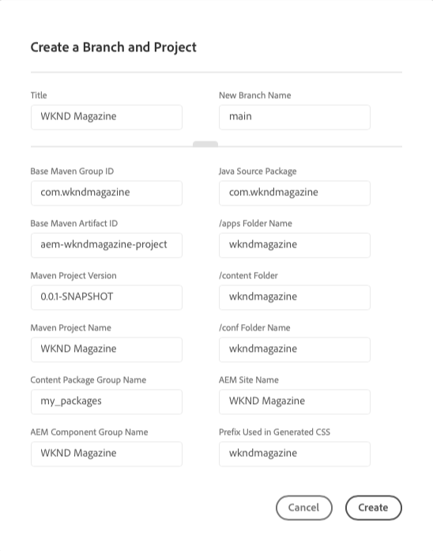

# Wizard Project maken {#project-creation-wizard}

Nadat u uw productieprogramma creeert, biedt de Manager van de Wolk een tovenaar aan om een minimaal AEM project tot stand te brengen dat op [ wordt gebaseerd AEM Archetype van het Project ](https://experienceleague.adobe.com/docs/experience-manager-core-components/using/developing/archetype/overview.html) om uw begonnen snel te krijgen.

Voer de volgende stappen uit om een AEM toepassingsproject te maken in Cloud Manager met de wizard.

1. Creeer een productieprogramma door de stappen in het document te volgen [ Creërend de Programma&#39;s van de Productie ](creating-production-programs.md)

1. Zodra de programmaopstelling volledig is, heb toegang tot het **Overzicht** scherm van uw programma en zie **Tak &amp; van het Project** vraag-aan-actie kaart bij de bovenkant creëren.

   

1. Klik **creëren** om de tovenaar te beginnen en de Titel van uw project **&#x200B;**&#x200B;en **Nieuwe Naam van de Tak** in **te bevestigen creeer een Tak en het venster van het Project**.

   

1. Klik optioneel op de scheidingslijn om de aanvullende parameters van uw project weer te geven. De standaardwaarden worden verstrekt door het AEM Project Archetype en over het algemeen te hoeven niet worden veranderd.

   

1. Klik **creëren** om het proces van de projectverwezenlijking te beginnen.

A **kaart van de Verwezenlijking van het 0&rbrace; Project vervangt nu de** Tak &amp; van het Project **vraag-aan-actie kaart als bovenkant van het** Overzicht van het Programma **scherm.**

Zodra de programmaverwezenlijking volledig is, voegt a **milieu** kaart toe vervangt het **Lopende Creatie van het Project** kaart bij de bovenkant van het **Overzicht van het Programma** scherm.

 toe

U hebt nu een AEM project gebaseerd op het AEM archetype dat aan uw git bewaarplaats wordt toegevoegd als basis voor ontwikkeling voor uw eigen project. Daarna kunt u uw milieu&#39;s tot stand brengen waar u de projectcode kunt opstellen.

Zie [ Leiden uw Milieu ](/help/implementing/cloud-manager/manage-environments.md) om te leren hoe te om milieu&#39;s toe te voegen of te beheren.

>[!NOTE]
>
>De wizard is alleen beschikbaar voor productieprogramma&#39;s. Omdat [ zandbakprogramma&#39;s ](introduction-sandbox-programs.md#auto-creation) automatische projectverwezenlijking omvatten, is de tovenaar niet noodzakelijk.