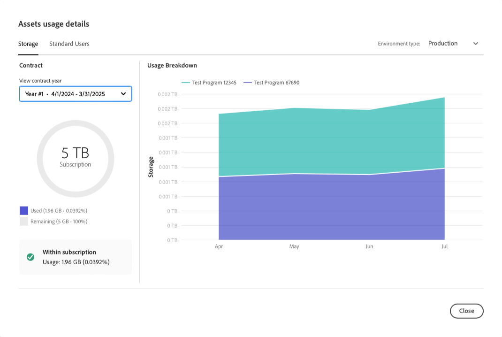

# Licentiedashboard {#license-dashboard}

Cloud Manager biedt een dashboard waarmee u eenvoudig de productrechten van Adobe Experience Manager as a Cloud Service (AEMaaCS) kunt bekijken die beschikbaar zijn voor uw organisatie of huurder.

>[!IMPORTANT]
>
>Het licentiedashboard is alleen van toepassing op de AEM as a Cloud Service-programma&#39;s. [ de programma&#39;s van AMS ](https://experienceleague.adobe.com/en/docs/experience-manager-cloud-manager/content/introduction) zijn niet inbegrepen in het dashboard van de Vergunning.
>
>Om het type van de dienst te bepalen heeft uw programma (AMS of AEMaaCS), zie [ Navigerend Cloud Manager UI ](/help/implementing/cloud-manager/navigation.md#program-cards).

## Overzicht {#overview}

Het Cloud Manager-licentiedashboard biedt eenvoudig toegang tot de oplossingsrechten die beschikbaar zijn in al uw programma&#39;s, inclusief wat er wordt gebruikt en wat er beschikbaar is. En, de metriek van de het verbruiksvraag van de inhoud die door maand voor de oplossing van Plaatsen wordt trended.

## Het licentiedashboard openen {#using-dashboard}

>[!NOTE]
>
>Een gebruiker in de **rol van de BedrijfsEigenaar** moet worden het programma geopend om het dashboard van de Vergunning te bekijken.

1. Logboek in Cloud Manager bij [ my.cloudmanager.adobe.com ](https://my.cloudmanager.adobe.com/) en selecteer de aangewezen organisatie.
1. Op de **[Mijn console van Programma&#39;s](/help/implementing/cloud-manager/navigation.md#my-programs)**, klik  op de [ Kopbal van Cloud Manager ](/help/implementing/cloud-manager/navigation.md#cloud-manager-header). Deze actie onthult de lusjes.
1. Klik de **optie van de Vergunning** in het lusje.

Het dashboard bestaat uit drie gedeelten die u laten zien:

* **Oplossingen** - welke oplossingen die u vergunning hebt gegeven. Bijvoorbeeld Sites, Edge Delivery Services en Assets.

  

* **toe:voegen-ons** - welke toe:voegen-ons aan uw vergunning gegeven oplossingen die u beschikbaar hebt.
* **Andere Entitlements** - welke zandbak en dev milieu en andere rechten die binnen uw huurder kunnen worden verbruikt.

Elke sectie vat samen wat beschikbaar is en hoe het, als bij allen wordt gebruikt. Momenteel, slechts worden de plaatsen en de oplossingen van Assets getoond zelfs als andere oplossingen in de huurder bestaan.

* De **kolom van de Status** toont het aantal ongebruikte rechten tegenover het totaal beschikbaar voor de huurder.
* **die op** wordt gevormd wijst op de programma&#39;s waarop de oplossingsbevoegdheid is toegepast.
   * Een machtiging wordt alleen als gebruikt beschouwd wanneer een productieomgeving wordt gecreëerd. Of, als één bestaat, als een updatepijpleiding op het is in werking gesteld.
   * Slechts een beperkt aantal programma&#39;s wordt afzonderlijk vermeld in de kolom, de rest wordt vertegenwoordigd door een `+x` -item.
   * Houd de muisaanwijzer boven de `+x` -vermelding om een pop-up met gegevens over alle programma&#39;s weer te geven.
* De **kolom van het Gebruik** &lbrace;toont a **[het gebruiksdetails van de Mening](#view-usage-details)** knoop om gebruiksstatistieken voor de oplossing te tonen.

>[!TIP]
>
>Leren hoe te om uw rechten van Adobe over uw volledige organisatie van Admin Console te beheren, zie het [ overzicht van Admin Console ](https://helpx.adobe.com/nl/enterprise/using/admin-console.html).

## Gebruiksdetails weergeven {#view-usage-details}

<!--
The **View usage details** button gives access to the chosen solution's **Usage Details** window. This window gives a detailed breakdown including charts to show your solution's usage. How that usage is measured depends on the chosen solution. -->

De **knoop van de het gebruikdetails van de Mening** in het gebied van de Vergunning van Cloud Manager verstrekt een gedetailleerde uitsplitsing van uw huidige middelgebruik. Wanneer geklikt, opent het een rapport of dashboard dat belangrijke metriek met betrekking tot uw vergunning toont. <!-- ADD THIS SENTENCE IF ASSETS USAGE DETAILS GETS REINSTATED ", such as the number of users, storage consumption, or bandwidth usage, depending on the type of services you're using." --> Deze functionaliteit helpt u te controleren en ervoor te zorgen dat u binnen de grenzen van uw contract blijft terwijl u inzichten voor betere middelplanning en optimalisering aanbiedt.

### Gebruiksgegevens voor sites {#sites-usage-details}

Het **het gebruikdetails van Plaatsen** venster stelt grafieken voor die een overzicht van het gebruik van uw vergunningen geven van Plaatsen die op [ worden gebaseerd inhoudsverzoeken ](#what-is-a-content-request).

De linkerkant van het venster stelt een cirkeldiagram voor dat de contractverdeling voor het contractjaar toont dat in het **het contractjaar van de Mening** dropdown wordt geselecteerd.

De rechterzijde van het venster geeft een vlakgrafiek weer waarin het gebruik per programma in de loop van de tijd voor het geselecteerde contractjaar wordt uitgesplitst. Een muisaanwijzer toont een pop-up met details per programma voor het geselecteerde punt in de tijd.

<!-- REMOVED AS PER CQDOC-21983
### Assets usage details {#assets-usage-details}

The **Assets usage details** window, presents graphs giving an overview of the usage of your Assets licenses based on [storage](#storage) and [standard users](#standard-users). Select the appropriate tab to toggle between the views.

For both storage and standard users views, you can use the **Environment Type** dropdown to toggle the view between production, stage, and development environments.

#### Storage {#storage}

The left side of the window presents a pie chart showing the contract breakdown for the contract year selected in the **View contract year** dropdown.

The right side of the window presents an area chart showing the usage broken down by program over time for the selected contract year. A hover reveals a popup with details per program for the selected point in time.

#### Standard Users {#standard-users}

The left side of the window presents a pie chart showing the contract breakdown for the contract year selected in the **View contract year** dropdown.

The right side of the window presents an area chart showing the usage broken down by program over time for the selected contract year. A hover reveals a popup with details per program for the selected point in time. -->

## Veelgestelde vragen {#faq}

### Wat is een inhoudsverzoek?{#what-is-a-content-request}

Een inhoudsverzoek is elke aanvraag die is gericht aan AEM Sites of een door de klant beschikbaar cachesysteem, zoals een netwerk voor de levering van inhoud. Inhoud of gegevens worden opgehaald in HTML-indeling voor paginaweergaven. Of in JSON-indeling voor API-aanroepen.

Één inhoudsverzoek wordt geteld voor elke paginamening of voor elke vijf API vraag, die bij de ingang van het eerste caching systeem wordt gemeten om een inhoudsverzoek te ontvangen. Inhoudsaanvragen worden alleen in mindering gebracht op productieomgevingen.

Inhoudsverzoeken sluiten verzoeken of activiteiten uit die door of namens Adobe worden geïnitieerd met als enig doel het aanbieden van producten en diensten. Ook het door Adobe geïdentificeerde verkeer van gebruikersagenten van bots, krawlers, en spinnen met betrekking tot gemeenschappelijke onderzoeksmotoren en sociale media wordt uitgesloten.

Zie ook [ de inhoudsverzoeken van Cloud Service ](/help/implementing/cloud-manager/content-requests.md) begrijpen.

### Hoe meet Adobe Experience Manager verzoeken om inhoud?{#how-are-content-requests-measured}

Aanvragen voor inhoud worden bijgehouden op AEM as a Cloud Service Edge-servers. Het verkeer van de oorsprong telt niet op inhoudverzoeken. De CDN die in AEM as a Cloud Service is ingebouwd, houdt geldige HTML- en JSON-aanvragen bij.

AEM beschikt ook over regels om bekende bots uit te sluiten, waaronder bekende diensten die regelmatig de site bezoeken om hun zoekindex of service te vernieuwen.

Zie ook [ Begrip van de Verzoeken van de Inhoud van Cloud Service ](/help/implementing/cloud-manager/content-requests.md).

### Waarom geeft mijn Analytics-rapport andere resultaten dan de AEM-inhoudaanvragen?{#why-are-reports-different}

Aanvragen voor inhoud kunnen variaties hebben met de rapportagehulpprogramma&#39;s Analytics van een organisatie. Voor meer informatie, zie [ Begrijpend de Verzoeken van de Inhoud van Cloud Service ](/help/implementing/cloud-manager/content-requests.md).

### Wat als ik meer over mijn volume van de inhoudshulp zou willen leren?{#current-request-volumes}

Als u meer inzichten in het volume van de inhoudsaanvraag wilt hebben dat wordt weergegeven in het licentiedashboard, kan uw Adobe-team een rapport weergeven met de stuurprogramma&#39;s voor het hoogste volume van de inhoudsaanvragen. Neem contact op met uw Adobe-team of met de klantenondersteuning van Adobe om een rapport met het hoogste verbruik aan te vragen.

### Wat als ik mijn eigen CDN gebruik?{#using-own-cdn}

Het licentiedashboard bevat alleen gegevens die worden bijgehouden door de Cloud Service CDN. Als u ervoor kiest om uw eigen CDN (BYOCDN) op te halen, rapporteert u het volume van de inhoudsaanvraag jaarlijks terug naar Adobe, zoals in uw contract wordt vermeld.

