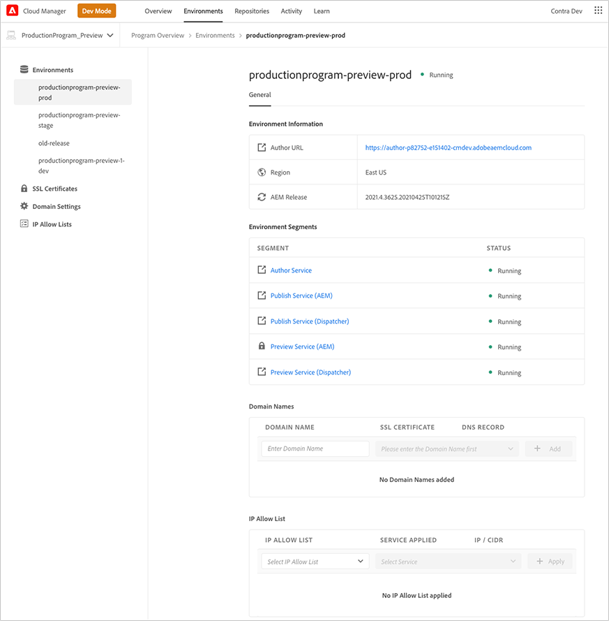

# Omgevingen beheren {#manage-environments}

In de volgende sectie worden de typen omgeving beschreven die een gebruiker kan maken en hoe de gebruiker een omgeving kan maken.

## Omgevingstypen {#environment-types}

Een gebruiker met de vereiste toestemmingen kan de volgende milieutypes (binnen de grenzen van wat aan de specifieke huurder beschikbaar is) tot stand brengen.

* **Productie- en Stage-omgeving**: De productie en het werkgebied zijn beschikbaar als duo en worden gebruikt voor test- en productiedoeleinden.

* **Ontwikkeling**: Een ontwikkelomgeving kan worden gecreëerd voor ontwikkelings- en testdoeleinden en zal alleen worden geassocieerd met niet-productiepijpleidingen.

   >[!NOTE]
   >Een ontwikkelomgeving die automatisch in een Sandbox-programma wordt gemaakt, wordt geconfigureerd om de oplossingen Sites en Assets te bevatten.

   De volgende tabel geeft een overzicht van de typen omgeving en hun kenmerken:

   | Naam | Auteurlaag | Lijst publiceren | Gebruiker kan maken | Gebruiker kan | Pijpleiding die in verband kan worden gebracht met het milieu |
   |--- |--- |--- |--- |---|---|
   | Productie | Ja | Ja als sites zijn opgenomen | Ja | Nee | Productiepijpleiding |
   | Werkgebied | Ja | Ja als sites zijn opgenomen | Ja | Nee | Productiepijpleiding |
   | Ontwikkeling | Ja | Ja als sites zijn opgenomen | Ja | Ja | Niet-productiepijpleiding |

   >[!NOTE]
   >De productie en het werkgebied zijn beschikbaar als duo en worden gebruikt voor test- en productiedoeleinden.  De gebruiker kan niet alleen een werkgebied of alleen een productieomgeving maken.

## Omgeving {#adding-environments} toevoegen

1. Klik op **Omgeving toevoegen** om een omgeving toe te voegen. Deze knop is toegankelijk vanuit het scherm **Omgevingen**.
   

   De optie **Omgeving toevoegen** is ook beschikbaar op de **Omgevingen**-kaart wanneer het programma geen omgevingen bevat.

   

   >[!NOTE]
   >De optie **Omgeving toevoegen** wordt uitgeschakeld op basis van een gebrek aan machtigingen of wat u kunt contracteren.

1. Het dialoogvenster **Omgeving toevoegen** wordt weergegeven. De gebruiker moet details verzenden zoals het **Omgevingstype**, de **Naam van de omgeving** en de **Beschrijving van de omgeving** (afhankelijk van de doelstelling van de gebruiker bij het creëren van de omgeving binnen de grenzen van wat beschikbaar is voor de specifieke tenant).

   

   >[!NOTE]
   >Bij het creëren van een milieu, worden één of meerdere *integrations* gecreeerd in Adobe I/O. Deze zijn zichtbaar aan klantengebruikers die toegang tot de Console van de Adobe I/O hebben en niet moeten worden geschrapt. Dit wordt in de beschrijving in de console van de Adobe I/O ontkend.

   

1. Klik **Opslaan** om een omgeving met de gevulde criteria toe te voegen.  Nu toont het *Overzicht* scherm de kaart van waar u opstelling uw pijpleiding kunt.

   >[!NOTE]
   >Als, u nog niet opstelling uw niet productiepijplijn hebt, *Overzicht* toont het scherm de kaart van waar u uw niet productiepijplijn kunt tot stand brengen.

## Omgevingsdetails {#viewing-environment}

De **Omgevingen** kaart op de overzichtspagina maakt een lijst van maximaal drie milieu&#39;s.

1. Selecteer de **knop Alles tonen** om naar de overzichtspagina **Environment** te navigeren om een tabel met een volledige lijst met omgevingen weer te geven.

   

1. Op de pagina **Omgevingen** wordt de lijst met alle bestaande omgevingen weergegeven.

   

1. Selecteer een van de omgevingen in de lijst om de omgevingsdetails weer te geven.

   >[!NOTE]
   >De Voorproefdienst zal op rolbasis aan alle Programma&#39;s worden opgesteld. Klanten worden in-product op de hoogte gesteld wanneer hun programma is ingeschakeld voor de Voorvertoningsservice. Zie de sectie [Toegang tot voorvertoningsservice](#access-preview-service) voor meer informatie.

   

### Toegang tot voorvertoningsservice {#access-preview-service}

De functie Voorvertoningsservice levert via Cloud Manager een extra Preview (publicatieservice) aan elke AEM als een Cloud Service-omgeving.

Geef een voorvertoning weer van de uiteindelijke ervaring van een website voordat deze de publicatieomgeving bereikt en openbaar is. Een paar aanwijzers voordat u de Voorvertoningsservice kunt zien en gebruiken:

1. **AEM versie**: Uw omgeving moet AEM versie  `2021.5.5343.20210542T070738Z` of hoger zijn. Zorg ervoor dat er een updatepijpleiding op uw omgeving is uitgevoerd om dit te bereiken.

1. **Standaard IP-Lijst van gewenste personen vergrendelen**: Op eerste verwezenlijking, moet u de standaardIP Lijst van gewenste personen van de Dienst van de Voorproef in uw milieu actief ongedaan maken om toegang toe te laten.

1. **Inhoud publiceren voor voorvertoning**: U kunt inhoud naar de Voorvertoningsservice publiceren met behulp van de interface Publicatie beheren in AEM. Raadpleeg [Inhoud voorvertonen](https://experienceleague.adobe.com/docs/experience-manager-cloud-service/sites/authoring/fundamentals/previewing-content.html?lang=en) voor meer informatie.

Een gebruiker met de vereiste toestemmingen moet één van het volgende doen *ontgrendelen* toegang tot de voorproefdienst en de gewenste toegang verlenen:

1. Creeer een aangewezen IP Lijst van gewenste personen en pas het op de voorproefdienst toe. Volg dit onmiddellijk door `Preview Default [Env ID] IP Allow List` van de Dienst van de Voorproef uit te voeren.

   OF,

1. Gebruik de workflow IP-Lijst van gewenste personen bijwerken om de standaard-IP te verwijderen en IP&#39;s toe te voegen. Raadpleeg [Een IP-Lijst van gewenste personen weergeven en bijwerken](/help/implementing/cloud-manager/ip-allow-lists/view-update-ip-allow-list.md)voor meer informatie.

   >[!NOTE]
   >De bovenstaande stappen moeten worden uitgevoerd voordat u de URL van de voorbeeldservice deelt met een van uw teams om ervoor te zorgen dat de juiste leden van uw team toegang hebben tot de URL van de voorvertoning.

   Wanneer de toegang tot de voorvertoningsservice is ontgrendeld, wordt het vergrendelingspictogram niet meer weergegeven.

## Omgeving {#updating-dev-environment} bijwerken

Updates van werkgebied- en productieomgevingen worden automatisch door Adobe beheerd.

Updates voor ontwikkelomgevingen worden beheerd door gebruikers van het programma. Als een omgeving niet de meest recente openbaar beschikbare AEM-versie uitvoert, wordt **UPDATE AVAILABLE** weergegeven als de status op de milieuvriendenkaart op het startscherm.

De optie **Update** is beschikbaar bij **Omgevingen** Kaart.
Deze optie is ook beschikbaar als u op **Details** van **Milieu** kaart klikt. De **pagina Omgevingen** wordt geopend en wanneer u de ontwikkelomgeving hebt geselecteerd, klikt u op **..** en selecteer **Bijwerken**, zoals in de onderstaande afbeelding wordt getoond:

Het selecteren van deze optie zal een Manager van de Plaatsing toestaan om de pijpleiding verbonden aan dit milieu aan de recentste versie bij te werken en dan de pijpleiding uit te voeren.

Als de pijpleiding reeds is bijgewerkt, wordt de gebruiker ertoe aangezet om de pijpleiding uit te voeren.

## Omgeving {#deleting-environment} verwijderen

De gebruiker met de vereiste toestemmingen zal een milieu van de Ontwikkeling kunnen schrappen.

De optie **Delete** is beschikbaar in het vervolgkeuzemenu in de **Environment**-kaart. Klik op **..** voor een ontwikkelomgeving die u wilt verwijderen.

De verwijderingsoptie is ook beschikbaar als u op **Details** van de **Favorieten** kaart klikt. De **pagina Omgevingen** wordt geopend en wanneer u de ontwikkelomgeving hebt geselecteerd, klikt u op **..** en selecteer **Delete**, zoals weergegeven in de onderstaande afbeelding:

>[!NOTE]
>Deze functie is niet beschikbaar voor de omgeving Productie/Werkgebied die is ingesteld in een productieprogramma dat is opgezet voor productiedoeleinden. De functie is echter beschikbaar voor Productie-/Stage-omgevingen in een Sandbox-programma.

## Toegang beheren {#managing-access}

Selecteer **Toegang beheren** in het vervolgkeuzemenu in de **Kaart** Omgevingen. U kunt rechtstreeks naar de instantie van de auteur navigeren en de toegang voor uw omgeving beheren.

Raadpleeg [Toegang tot instantie Auteur beheren](/help/onboarding/what-is-required/accessing-aem-instance.md) voor meer informatie.

## Toegang tot ontwikkelaarsconsole {#accessing-developer-console}

Selecteer **Developer Console** in het vervolgkeuzemenu in de **Environment**-kaart. Hiermee wordt een nieuw tabblad in uw browser geopend met de aanmeldingspagina naar **Developer Console**.

Alleen een gebruiker met de rol Developer heeft toegang tot **Developer Console**. De uitzondering die voor de Programma&#39;s van de Sandbox is, waar om het even welke gebruiker met toegang tot het Programma van de Sandbox van de Manager van de Wolk toegang tot **de Console van de Ontwikkelaar** zal hebben.

Raadpleeg [Sluimerende en Shibernating Sandbox-omgevingen](https://experienceleague.adobe.com/docs/experience-manager-cloud-service/onboarding/getting-access/cloud-service-programs/sandbox-programs.html#hibernating-introduction) voor meer informatie.

Deze optie is ook beschikbaar als u op **Details** van **Milieu** kaart klikt. De pagina **Omgevingen** wordt geopend en wanneer u een omgeving selecteert, klikt u op **..** en selecteer **Developer Console**.

## Lokaal aanmelden {#login-locally}

Selecteer **Lokale aanmelding** in het vervolgkeuzemenu in de **Kaart voor omgevingen** om u lokaal aan te melden bij Adobe Experience Manager.

Daarnaast kunt u zich lokaal aanmelden via de overzichtspagina **Environment**.

## Aangepaste domeinnamen beheren {#manage-cdn}

Navigeer naar de detailpagina **Omgevingen** van de overzichtspagina van Milieu&#39;s.

>[!NOTE]
>Aangepaste domeinnamen worden nu ondersteund in Cloud Manager for Sites-programma&#39;s voor zowel Services voor publiceren als voorvertonen. Elke Cloud Manager-omgeving kan maximaal 250 aangepaste domeinen per omgeving hosten.

De volgende acties kunnen worden uitgevoerd op de service Publiceren voor uw omgeving, zoals hieronder wordt beschreven:

1. [Een aangepaste domeinnaam toevoegen](/help/implementing/cloud-manager/custom-domain-names/add-custom-domain-name.md)

1. [Een aangepaste domeinnaam weergeven en bijwerken](/help/implementing/cloud-manager/custom-domain-names/view-update-replace-custom-domain-name.md)

1. [Een aangepaste domeinnaam verwijderen](/help/implementing/cloud-manager/custom-domain-names/delete-custom-domain-name.md)

1. [Status controleren van aangepaste domeinnaam ](/help/implementing/cloud-manager/custom-domain-names/check-domain-name-status.md#pre-existing-cdn) of een  [SSL-certificaat](/help/implementing/cloud-manager/managing-ssl-certifications/check-status-ssl-certificate.md#pre-existing-cdn).

1. [De Status van een IP Lijsten van gewenste personen controleren](/help/implementing/cloud-manager/ip-allow-lists/check-ip-allow-list-status.md#pre-existing-cdn)

## IP-Lijsten van gewenste personen beheren {#manage-ip-allow-lists}

Navigeer naar de pagina met milieudetails op de pagina Overzicht van omgevingen. U kunt de volgende handelingen uitvoeren op de service Publiceren en/of Auteur voor uw omgeving.

>[!NOTE]
>De functie IP-Lijst van gewenste personen wordt nu ondersteund in Cloud Manager voor auteur-, publicatie- en voorvertoningsservices (beschikbaar in Sites-programma&#39;s).

### Een IP-Lijst van gewenste personen {#apply-ip-allow-list} toepassen

Het toepassen van een IP Lijst van gewenste personen is het proces waardoor alle IP waaiers inbegrepen in de definitie van toestaan-Lijst met een Auteur of de Publish dienst in een milieu worden geassocieerd. Een gebruiker in de rol BedrijfsEigenaar of van de Manager van de Plaatsing moet worden het programma geopend om een IP Lijst van gewenste personen kunnen toepassen.

>[!NOTE]
>De IP Lijst van gewenste personen moet in de Manager van de Wolk bestaan om het op een milieu-dienst toe te passen. Voor meer informatie over IP-Lijsten van gewenste personen in Cloud Manager navigeert u naar [Inleiding tot IP-Lijsten van gewenste personen in Cloud Manager](/help/implementing/cloud-manager/ip-allow-lists/introduction.md).

Voer de onderstaande stappen uit om een IP-Lijst van gewenste personen toe te passen:

1. Navigeer naar de specifieke omgeving van de detailpagina **Environment** en navigeer naar de tabel **IP Lijsten van gewenste personen**.
1. Gebruik de inputgebieden bij de bovenkant van de IP lijst van de Lijst van gewenste personen om de IP Lijst van gewenste personen en de Auteur of de Publish dienst te selecteren u wenst om het op toe te passen.
1. Klik op **Apply** en bevestig uw voorlegging.

### Het toepassen van een IP Lijst van gewenste personen {#unapply-ip-allow-list} ongedaan maken

Het ongedaan maken van een IP Lijst van gewenste personen is het proces waardoor alle IP waaiers inbegrepen in de definitie van de Lijst van gewenste personen van een Auteur of de dienst van de Uitgever in een milieu worden losgemaakt. Een gebruiker in de rol BedrijfsEigenaar of van de Manager van de Plaatsing moet worden het programma geopend om een IP Lijst van gewenste personen kunnen ongedaan maken.

Voer de onderstaande stappen uit om het toepassen van een IP-Lijst van gewenste personen ongedaan te maken:

1. Navigeer naar de specifieke **pagina met details** van het scherm van Milieu&#39;s en navigeer naar de **IP Lijsten van gewenste personen** lijst.
1. Identificeer de rij waar de IP regel van de Lijst van gewenste personen u wenst om ongedaan te maken vermeld is.
1. **selecteren..** menu van het uiterst juiste eind van de rij.
1. Selecteer de optie **Niet toepassen** en bevestig uw verzending.
