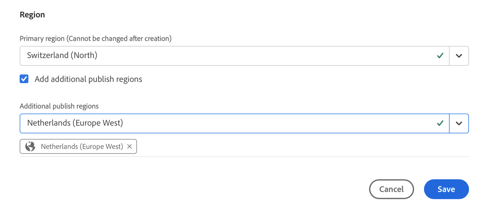
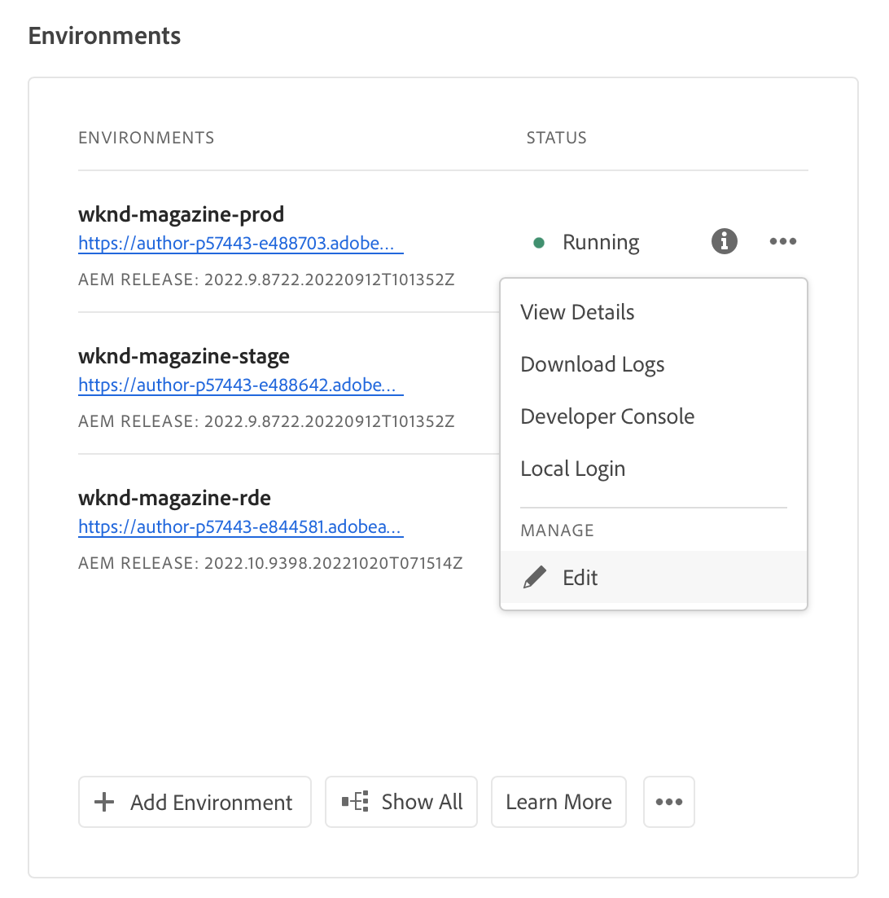
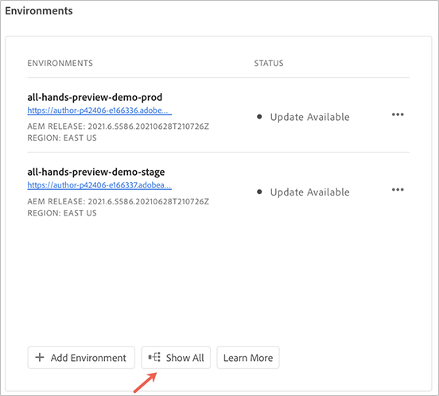
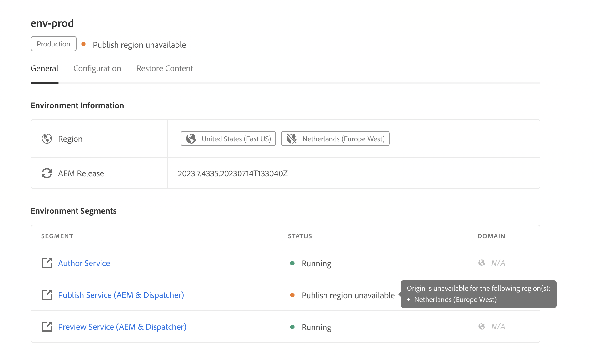

# Omgevingen beheren {#managing-environments}

Leer meer over de typen omgevingen die u kunt maken en hoe u deze kunt maken voor uw Cloud Manager-project.

## Omgevingstypen {#environment-types}

Een gebruiker met de vereiste toestemmingen kan de volgende milieutypes (binnen de grenzen van wat aan de specifieke huurder beschikbaar is) tot stand brengen.

| Type omgeving | Beschrijving |
| --- | --- |
| **Productie + Stadium** | De productie- en testomgevingen zijn als een paar beschikbaar en worden respectievelijk voor productie- en testdoeleinden gebruikt. Prestatie- en beveiligingstests uitvoeren op de werkgebiedomgeving. Het is even groot als de productie. |
| **Ontwikkeling** | Een ontwikkelomgeving kan worden gecreëerd voor ontwikkelings- en testdoeleinden en kan alleen worden geassocieerd met niet-productiepijpleidingen. Ontwikkelomgevingen hebben niet dezelfde grootte als stadium en productie en mogen niet worden gebruikt om prestatie- en veiligheidstests uit te voeren. |
| **Snelle Ontwikkeling** | Met een RDE (Rapid Development Environment) kunnen ontwikkelaars snel wijzigingen implementeren en evalueren. Hierdoor wordt de tijd die nodig is om functies te testen die al zijn gevalideerd in een lokale ontwikkelomgeving, verkort. Zie [ de snelle documentatie van het ontwikkelomgeving ](/help/implementing/developing/introduction/rapid-development-environments.md) voor details over hoe te om RDE te gebruiken. |

De mogelijkheden van individuele milieu&#39;s hangen van de oplossingen af die in het [ programma ](/help/implementing/cloud-manager/getting-access-to-aem-in-cloud/program-types.md) van het milieu werden toegelaten.

* [Sites](/help/overview/introduction.md)
* [Assets](/help/assets/overview.md)
* [Forms](/help/forms/home.md)
* [Screens](/help/screens-cloud/introduction/introduction.md)

>[!NOTE]
>
>De productie en het opvoeren milieu&#39;s worden slechts gecreeerd als paar. U kunt geen productie-enige of staging-enige milieu tot stand brengen.

## Een omgeving toevoegen {#adding-environments}

Om een milieu toe te voegen of uit te geven, moet een gebruiker een lid van de **rol van de BedrijfsEigenaar** zijn.

**om een milieu toe te voegen:**

1. Logboek in Cloud Manager bij [ my.cloudmanager.adobe.com ](https://my.cloudmanager.adobe.com/) en selecteer de aangewezen organisatie.

1. Op de **[Mijn console van Programma&#39;s](/help/implementing/cloud-manager/navigation.md#my-programs)**, klik het programma waarvoor u een milieu wilt toevoegen.

1. Voer een van de volgende handelingen uit:

   Als **toevoegt milieu** optie (gehandicapt) wordt gedimd, kan het aan een gebrek aan toestemmingen of afhankelijk van de vergunning gegeven middelen zijn.

   * Op de **[Mijn console van Programma&#39;s](/help/implementing/cloud-manager/navigation.md#my-programs)**, op de **&#x200B;**&#x200B;kaart van Milieu&#39;s, klik **voegt Milieu** toe.

   

   * Op het linkerzijpaneel, klik  **Milieu&#39;s** van Gegevens 0&rbrace; &lbrace;, dan op de pagina van Milieu&#39;s, dichtbij de hoger-juiste hoek, klik **toevoegt Milieu**.

     

1. In **voeg milieu** dialoogdoos toe, doe het volgende:

   * Selecteer een [**milieutype**](#environment-types). Het aantal beschikbare/gebruikte omgevingen wordt tussen haakjes achter de naam van het omgevingstype weergegeven.
   * Verstrek een milieu **Naam**. De naam van de omgeving kan niet worden gewijzigd nadat de omgeving is gemaakt.
   * Verstrek een facultatieve **Beschrijving** voor het milieu.
   * Als u a **Productie + het milieu van het Stadium** toevoegt, moet u een milieunaam en een beschrijving voor zowel uw productie als het opvoeren milieu&#39;s verstrekken.
   * Selecteer a **Primair gebied** van drop-down. Het primaire gebied kan na het maken niet meer worden gewijzigd. Ook, afhankelijk van uw beschikbare aanspraken, kunt u [ veelvoudige gebieden ](#multiple-regions) kunnen vormen.

    toe

1. Klik **sparen**.

De **pagina van het Overzicht** toont nu uw nieuw milieu in de **&#x200B;**&#x200B;kaart van Milieu&#39;s. U kunt nu pijpleidingen instellen voor uw nieuwe omgeving.

## Meerdere publicatiegebieden {#multiple-regions}

Een gebruiker met de **rol van de BedrijfsEigenaar** kan productie en het opvoeren milieu&#39;s vormen om tot drie extra te omvatten publiceren gebieden naast het primaire gebied. Aanvullende publicatiegebieden kunnen de beschikbaarheid verbeteren. Zie de [ Extra documentatie van de Gebieden van Publish ](/help/operations/additional-publish-regions.md) voor meer details.

>[!TIP]
>
>U kunt [ Cloud Manager API ](https://developer.adobe.com/experience-cloud/cloud-manager/guides/api-usage/creating-programs-and-environments/#creating-aem-cloud-service-environments) gebruiken om een huidige lijst van beschikbare gebieden te vragen.

### Meerdere publicatiegebieden toevoegen aan een nieuwe omgeving {#add-regions}

Wanneer u een omgeving toevoegt, kunt u ervoor kiezen om naast het primaire gebied ook andere gebieden te configureren.

1. Selecteer het **Primaire gebied**.
   * Het primaire gebied kan na het creëren van het milieu niet worden veranderd.
1. Selecteer de optie **toevoegt extra publiceer gebieden** en een nieuwe **Extra publiceer gebieden** optie drop-down verschijnt.
1. In **extra publiceer gebieden** drop-down, selecteer een extra gebied.
1. Het geselecteerde gebied wordt onder de vervolgkeuzelijst toegevoegd om de selectie ervan aan te geven.
   * Selecteer de `X` naast het geselecteerde gebied zodat u de selectie ongedaan kunt maken.
1. Selecteer een ander gebied van **extra publiceer gebieden** drop-down om een ander gebied toe te voegen.
1. Selecteer **sparen** wanneer u bereid bent om uw milieu tot stand te brengen.

De geselecteerde gebieden zijn van toepassing op zowel productie als het opvoeren milieu&#39;s.

Als u geen extra gebieden specificeert, [ kunt u dit later doen nadat de milieu&#39;s ](#edit-regions) worden gecreeerd.

Als u [ geavanceerd voorzien van een netwerk ](/help/security/configuring-advanced-networking.md) voor het programma wilt voorzien, adviseert men dat deze levering wordt gedaan alvorens extra toe te voegen publiceer gebieden aan de milieu&#39;s door Cloud Manager API te gebruiken. Anders, gaat het extra publiceer gebiedsverkeer door de volmacht van het primaire gebied.

### Meerdere publicatiegebieden bewerken {#edit-regions}

Als u in eerste instantie geen extra gebieden hebt opgegeven, kunt u dat doen nadat de omgevingen zijn gemaakt als u over de benodigde rechten beschikt.

U kunt ook extra publicatiegebieden verwijderen. U kunt echter slechts gebieden in één transactie toevoegen of verwijderen. Als u één gebied moet toevoegen en één gebied wilt verwijderen, voegt u eerst de wijziging toe, slaat u de wijziging op en verwijdert u vervolgens (of omgekeerd).

1. Van de console van het Overzicht van het Programma van uw programma, klik  voor uw productiemilieu en selecteer **uitgeven** van het menu.

    uit

1. In **geef de dialoog van het Milieu van de Productie uit**, breng de noodzakelijke veranderingen in extra uit publiceer gebieden.
   * Gebruik **extra publiceer gebieden** drop-down om extra gebieden te selecteren.
   * Klik op de X naast de geselecteerde aanvullende publicatiegebieden om deze te desselecteren.

    uit

1. Selecteer **sparen** om de veranderingen te bewaren.

Wijzigingen in de productieomgeving zijn van toepassing op zowel de productie- als de testomgeving. Wijzigingen in meerdere publicatiegebieden kunnen alleen worden bewerkt in de productieomgeving.

Als u [ geavanceerd voorzien van een netwerk ](/help/security/configuring-advanced-networking.md) voor het programma wilt voorzien, adviseert men dat deze levering wordt gedaan alvorens extra toe te voegen publiceert gebieden aan de milieu&#39;s. Anders, gaat het extra publiceer gebiedsverkeer door de volmacht van het primaire gebied.

## Details van toegangsomgeving {#viewing-environment}

1. Voer een van de volgende handelingen uit om toegang te krijgen tot de omgevingsdetails:

   * Van de **pagina van het Overzicht**, in het linkerzijmenu, klik  **Milieu&#39;s**.

   

   * Van de **kaart van Milieu&#39;s**, klik  **tonen allen**.

     

   De **pagina van Milieu&#39;s** opent en maakt een lijst van alle milieu&#39;s voor het programma.

   

1. Voer op de pagina Omgevingen een van de volgende handelingen uit:

   * Klik op een omgeving in de lijst om de details weer te geven.

   

   * Klik  van het milieu dat u wilt, dan klik **Details van de Mening**.

   

>[!NOTE]
>
>De **kaart van Milieu** maakt een lijst van slechts drie milieu&#39;s. Klik **tonen allen** in de kaart om alle milieu&#39;s van het programma te zien.

### De voorbeeldservice openen {#access-preview-service}

Cloud Manager biedt een voorbeeldservice (geleverd als een extra publicatieservice) aan elke AEM as a Cloud Service-omgeving.

Met de service kunt u de uiteindelijke ervaring van een website voorvertonen voordat deze de daadwerkelijke publicatieomgeving bereikt en openbaar is.

Bij het maken van de voorvertoningsservice wordt er een standaard IP-lijst van gewenste personen op toegepast, met het label `Preview Default [<envId>]` , die al het verkeer naar de voorvertoningsservice blokkeert. Hef de standaardIP lijst van gewenste personen van de voorproefdienst op zodat kunt u toegang toelaten.

Een gebruiker met de vereiste machtigingen moet de volgende stappen uitvoeren voordat de URL van de voorbeeldservice wordt gedeeld om ervoor te zorgen dat deze toegankelijk is.

1. Creeer een aangewezen IP Lijst van gewenste personen, pas het op de voorproefdienst toe, en pas onmiddellijk de `Preview Default [<envId>]` lijst van gewenste personen ongedaan.

   Zie [ IP Lijsten van gewenste personen ](/help/implementing/cloud-manager/ip-allow-lists/apply-allow-list.md) voor meer details toepassen en ongedaan maken.

1. Gebruik het **IP de updatewerkschema van de Lijst van gewenste personen** om standaardIP te verwijderen en noodzakelijke IPs toe te voegen. Zie [ IP Lijsten van gewenste personen ](/help/implementing/cloud-manager/ip-allow-lists/managing-ip-allow-lists.md) beheren om meer te leren.

Nadat de toegang tot de voorvertoningsservice is ontgrendeld, wordt het vergrendelingspictogram vóór de naam van de voorvertoningsservice niet meer weergegeven.

Nadat de voorvertoningsservice is geactiveerd, kunt u inhoud publiceren via de gebruikersinterface van **`Manage Publication`** in AEM. Zie [ inhoud van de Voorproef ](/help/sites-cloud/authoring/sites-console/previewing-content.md) voor meer details.

>[!NOTE]
>
>Uw omgeving moet AEM versie `2021.05.5368.20210529T101701Z` of hoger zijn om de voorvertoningsservice te kunnen gebruiken. Zorg ervoor dat een updatepijpleiding op uw milieu met succes heeft gelopen zodat kunt u de voorproefdienst gebruiken.

### Status van aanvullende publicatiegebieden {#additional-region-status}

Als u extra hebt geactiveerd publiceer gebieden, kunt u het statuut van deze gebieden van de **kaart van Milieu** controleren.

1. Voor de **pagina van het Overzicht**, bepaal de plaats van de **&#x200B;**&#x200B;kaart van Milieu&#39;s.

1. Op de **kaart van Milieu&#39;s**, wijst de **3&rbrace; kolom van de Status &lbrace;op als er om het even welke kwesties met gevormd extra zijn publiceer gebieden.** Klik het **pictogram van Info** voor details van de gebieden.

   

Alternatief kunt u tot de zelfde informatie van de **Milieu&#39;s** toegang hebben tabel.

1. Voor de **pagina van het Overzicht**, klik  **Milieu&#39;s**.

1. Voor de **pagina van Milieu&#39;s**, selecteer het milieu u in het linkerzijmenu wilt vragen.

1. Nadat een omgeving is geselecteerd:

   * De **lijst van de Informatie van het Milieu** toont welke gebieden voor het geselecteerde milieu worden gevormd.
   * De **kolom van de Status** van de **Segmenten van het Milieu** lijst wijst op als er om het even welke kwesties met gevormd extra zijn publiceer gebieden. Houd de status boven voor details over een kwestie.

   

Als er problemen zijn gemeld met extra publicatieregio&#39;s, moet u de patiënt zijn. Cloud Manager probeert het gebied voortdurend te herstellen en kan op elk moment beschikbaar komen. Als het probleem zich na enkele uren blijft voordoen, kunt u het aanvullende publicatiegebied verwijderen en het opnieuw toevoegen (hetzelfde gebied of een ander gebied) om een volledige implementatie te activeren.

Hoe lang u wacht tot het systeem op zich terugkrijgt alvorens extra actie te ondernemen hangt van de invloed af het mislukken van dat gebied op uw systemen heeft.

Ongeacht, [ verkeer wordt altijd verpletterd aan het dichtste gebied dat online ](/help/operations/additional-publish-regions.md) is. Neem contact op met de klantenservice van de Adobe als de problemen zich blijven voordoen.

## Omgevingen bijwerken {#updating-dev-environment}

Als cloudservice beheert Adobe automatisch updates voor uw ontwikkelings-, staging- en productieomgeving in productieprogramma&#39;s.

Updates voor omgevingen in sandboxprogramma&#39;s worden echter binnen de programma&#39;s beheerd. Wanneer zulk een milieu niet de recentste openbaar beschikbare AEM versie in werking stelt, toont de status op de **1&rbrace; kaart van Milieu&#39;s {op het** 3} scherm van het Overzicht **Beschikbare Update**.**&#x200B;**

### Updates en pijpleidingen {#updates-pipelines}

De pijpleidingen zijn de enige manier om [ code aan de milieu&#39;s van AEM as a Cloud Service ](deploy-code.md) op te stellen. Daarom wordt elke pijpleiding geassocieerd met een bepaalde AEM versie.

Wanneer Cloud Manager een nieuwere versie van AEM ontdekt dan laatste opgesteld met de pijpleiding, toont het de **Beschikbare** status van de Update voor het milieu.

Het proces van actualisering bestaat daarom uit twee stappen:

1. De pijpleiding bijwerken met de recentste AEM versie
1. De pijpleiding in werking stellen om de nieuwe versie van AEM aan een milieu op te stellen

### Werk uw omgevingen bij {#updating-your-environments}

>[!NOTE]
> Vanaf 2024 worden ontwikkelingsinstanties en sommige sandboxprogramma&#39;s al automatisch bijgewerkt, zodat er geen noodzaak is om updates voor deze instanties handmatig te beheren. Als resultaat van deze overgang, zou de optie om milieu voor ontwikkelingsinstanties manueel bij te werken niet aan _kunnen beschikbaar zijn wat_ van uw programma&#39;s.

De **optie van de Update** is beschikbaar op de **milieu&#39;s** kaart voor specifieke ontwikkeling en zandbakmilieu&#39;s. Klik  naast het milieu om tot **Update** toegang te hebben.

Deze optie is ook beschikbaar door het **lusje van Milieu&#39;s** van het programma te klikken en dan  van het milieu te klikken.

Een gebruiker met de **Manager van de Plaatsing** of **BedrijfsEigenaar** rol kan deze optie gebruiken om de pijpleiding bij te werken verbonden aan dit milieu aan de recentste AEM versie.

Zodra de pijpleidingsversie aan de recentste openbaar beschikbare AEM versie wordt bijgewerkt, wordt de gebruiker ertoe aangezet om de bijbehorende pijpleiding in werking te stellen om de recentste versie aan het milieu op te stellen.

 bij te werken

Het **gedrag van de Update** optie varieert afhankelijk van de configuratie en de huidige staat van het programma.

| Staat | De optie Bijwerken... |
| --- | --- |
| De pijpleiding is reeds bijgewerkt | zet de gebruiker ertoe aan om de pijpleiding uit te voeren. |
| De pijpleiding wordt reeds bijgewerkt | informeert de gebruiker dat er al een update wordt uitgevoerd. |
| De pijpleiding bestaat niet | vraagt de gebruiker om er een te maken. |

## Ontwikkelomgevingen verwijderen {#deleting-environment}

Een gebruiker met de **Manager van de Plaatsing** of **BedrijfsEigenaar** rol kan een ontwikkelomgeving schrappen.

Van het **scherm van het Overzicht** van het programma op de **3&rbrace; kaart van Milieu&#39;s &lbrace;, klik  van het ontwikkelmilieu u wilt schrappen.**

De **schrapping** optie is ook beschikbaar bij het **milieu&#39;s** lusje van het **Overzicht** venster van het programma. Klik  van het milieu en selecteer **Schrapping**.

>[!NOTE]
>
>* Productie- en staging-omgevingen die in een productieprogramma zijn gemaakt, kunnen niet worden verwijderd.
>* Productie- en staging-omgevingen in een sandboxprogramma kunnen worden verwijderd.

## Toegang beheren {#managing-access}

Selecteer **beheert Toegang** van het ellipsmenu van het milieu op de **kaart van Milieu&#39;s**. U kunt rechtstreeks naar de instantie van de auteur navigeren en de toegang voor uw omgeving beheren.

>[!TIP]
>
>Zie [ het Team van AEM as a Cloud Service en de Profielen van het Product ](/help/onboarding/aem-cs-team-product-profiles.md) om te leren hoe het team en de productprofielen van AEM as a Cloud Service toegang tot uw vergunning gegeven oplossingen van de Adobe kunnen verlenen en beperken.

## Toegang tot de console van de Ontwikkelaar {#accessing-developer-console}

1. Van de **kaart van het Milieu**, klik , dan klik **Developer Console**.

Een nieuw lusje wordt geopend in uw browser met de openings van een sessiepagina aan **Developer Console**.

Slechts heeft een gebruiker met de **rol van de Ontwikkelaar** toegang tot **Developer Console**. Nochtans, voor zandbakprogramma&#39;s, heeft om het even welke gebruiker met toegang tot het zandbakprogramma toegang tot **Developer Console**.

Zie [ Sluimerende en Sluiting van Sandbox Milieu&#39;s ](https://experienceleague.adobe.com/en/docs/experience-manager-cloud-service/content/implementing/using-cloud-manager/programs/introduction-sandbox-programs#hibernation) voor meer details.

Deze optie is ook beschikbaar bij het **Milieu** lusje van het **venster van het Overzicht** wanneer het klikken van  van een individueel milieu.

## Lokaal aanmelden {#login-locally}

1. Voer een van de volgende handelingen uit:

   * Van de **kaart van het Milieu**, klik , dan klik **Lokale Login**.

     

   * Van het linkerzijpaneel, klik  **Milieu&#39;s**. Op de **pagina van Milieu&#39;s**, klik , dan klik **Lokale Login**.

     

## Aangepaste domeinnamen beheren {#manage-cdn}

In Cloud Manager for Sites worden aangepaste domeinnamen ondersteund voor zowel publicatie- als voorvertoningsservices.

>[!TIP]
>
>Voor meer informatie, zie [ Inleiding aan de namen van het douanedomein ](/help/implementing/cloud-manager/custom-domain-names/introduction.md).

## IP-Lijsten van gewenste personen beheren {#manage-ip-allow-lists}

Een IP-Lijst van gewenste personen wordt in Cloud Manager ondersteund voor auteur-, publicatie- en voorvertoningsservices voor Sites-programma&#39;s.

Om IP Lijsten van gewenste personen te beheren, navigeer aan het  **Milieu** pagina van het **Overzicht** pagina van uw programma. Klik op een afzonderlijke omgeving zodat u de details ervan kunt beheren.

### Een IP-Lijst van gewenste personen toepassen {#apply-ip-allow-list}

Het toepassen van een IP Lijst van gewenste personen verbindt alle bepaalde IP waaiers aan een auteur of publiceer de dienst in het milieu.

>[!TIP]
>
>Voor meer informatie, zie [ Inleiding aan IP Lijsten van gewenste personen ](/help/implementing/cloud-manager/ip-allow-lists/introduction.md).
