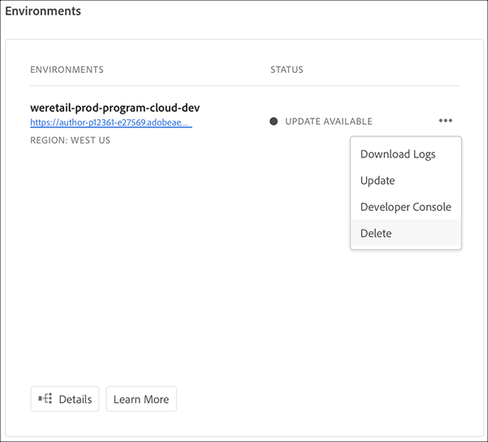

# Omgevingen beheren {#manage-environments}

In de volgende sectie worden de typen omgeving beschreven die een gebruiker kan maken en hoe de gebruiker een omgeving kan maken.

## Omgevingstypen {#environment-types}

Een gebruiker met de vereiste toestemmingen kan de volgende milieutypes (binnen de grenzen van wat aan de specifieke huurder beschikbaar is) tot stand brengen.

* **Productie- en Stage-omgeving**:
De productie en het werkgebied zijn beschikbaar als duo en worden gebruikt voor test- en productiedoeleinden.

* **Ontwikkeling**: Een ontwikkelomgeving kan worden gecreëerd voor ontwikkelings- en testdoeleinden en zal alleen worden geassocieerd met niet-productiepijpleidingen.

   >[!NOTE]
   >Een ontwikkelomgeving die automatisch in een Sandbox-programma wordt gemaakt, wordt geconfigureerd om de oplossingen Sites en Assets te bevatten.

   De volgende tabel geeft een overzicht van de typen omgeving en hun kenmerken:

   | Naam | Auteurslijst | Lijst publiceren | Gebruiker kan maken | Gebruiker kan | Pijpleiding die in verband kan worden gebracht met het milieu |
   |--- |--- |--- |--- |---|---|
   | Productie | Ja | Ja als sites zijn opgenomen | Ja | Nee | Productiepijpleiding |
   | Werkgebied | Ja | Ja als sites zijn opgenomen | Ja | Nee | Productiepijpleiding |
   | Ontwikkeling | Ja | Ja als sites zijn opgenomen | Ja | Ja | Niet-productiepijpleiding |

   >[!NOTE]
   >De productie en het werkgebied zijn beschikbaar als duo en worden gebruikt voor test- en productiedoeleinden.  De gebruiker kan niet alleen een werkgebied of alleen een productieomgeving maken.

## Een omgeving toevoegen {#adding-environments}

1. Klik op **Omgeving** toevoegen om een omgeving toe te voegen. Deze knop is toegankelijk via het scherm **Omgevingen** .
   

   De optie **Omgeving** toevoegen is ook beschikbaar op de **milieukeuren** wanneer het programma geen omgevingen bevat.

   

   >[!NOTE]
   >De optie Omgeving **** toevoegen wordt uitgeschakeld bij gebrek aan machtigingen of bij een eventuele overeenkomst.

1. Het dialoogvenster **Omgeving toevoegen** wordt weergegeven. De gebruiker moet details verzenden zoals het **Omgevingstype**, de **Naam van de omgeving** en de **Beschrijving van de omgeving** (afhankelijk van de doelstelling van de gebruiker bij het creëren van de omgeving binnen de grenzen van wat beschikbaar is voor de specifieke tenant).

   

   >[!NOTE]
   >Wanneer u een omgeving maakt, worden een of meer *integraties* gemaakt in Adobe I/O. Deze zijn zichtbaar voor gebruikers van de klant die toegang hebben tot de Adobe I/O-console en mogen niet worden verwijderd. Dit wordt beschreven in de beschrijving in de Adobe I/O-console.

   

1. Klik op **Opslaan** om een omgeving met de ingevulde criteria toe te voegen.  Nu toont het *scherm van het Overzicht* de kaart van waar u opstelling uw pijpleiding kunt.

   >[!NOTE]
   >Als, u nog niet opstelling uw niet productiepijplijn hebt, toont het *scherm van het Overzicht* de kaart van waar u uw niet productiepijplijn kunt tot stand brengen.

## Omgeving bijwerken {#updating-dev-environment}

Updates van werkgebied- en productieomgevingen worden automatisch beheerd door Adobe.

Updates voor ontwikkelomgevingen worden beheerd door gebruikers van het programma. Als een omgeving niet de nieuwste openbaar beschikbare AEM-versie uitvoert, wordt in de status op de milieuvriendenkaart op het startscherm de **UPDATE-BESCHIKBAAR** weergegeven.

De optie **Bijwerken** is beschikbaar in het vervolgkeuzemenu in de **milieucaart** .
Deze optie is ook beschikbaar via de knop **Beheren** als u op **Details** van de **kaart voor omgevingen** klikt.

Het selecteren van dit van dropdown menu zal een Manager van de Plaatsing toestaan om de pijpleiding verbonden aan dit milieu aan de recentste versie bij te werken en dan de pijpleiding uit te voeren.

Als de pijpleiding reeds is bijgewerkt, wordt de gebruiker ertoe aangezet om de pijpleiding uit te voeren.

## Omgeving verwijderen {#deleting-environment}

De gebruiker met de vereiste toestemmingen zal een milieu van de Ontwikkeling kunnen schrappen.

De optie **Verwijderen** is beschikbaar in het vervolgkeuzemenu van de **milieucaart** .
Deze optie is ook beschikbaar via de knop **Beheren** als u op **Details** van de **kaart voor omgevingen** klikt.

>[!NOTE]
Deze functie is niet beschikbaar voor de omgeving Productie/Werkgebied die is ingesteld in een regulier programma dat is ingesteld voor productiedoeleinden. De functie is echter beschikbaar voor Productie-/Stage-omgevingen in een Sandbox-programma.

## Developer Console openen {#accessing-developer-console}

Selecteer **Developer Console** in het vervolgkeuzemenu in de **Environment** Card. Hiermee wordt een nieuw tabblad in uw browser geopend met de aanmeldingspagina naar de **Developer Console**.

Alleen gebruikers met de rol Developer hebben toegang tot de **Developer Console**. De uitzondering voor Sandbox-programma&#39;s, waar gebruikers met toegang tot het Sandbox-programma van Cloud Manager toegang hebben tot de **Developer Console**.

Raadpleeg de [Sluimerende en Shibernating Sandbox-omgevingen](https://docs.adobe.com/content/help/en/experience-manager-cloud-service/onboarding/getting-access/cloud-service-programs/sandbox-programs.html#hibernating-introduction) voor meer informatie.

U kunt deze optie ook selecteren via de knop **Beheren** als u op **Details** van de kaart **Omgevingen** klikt.

