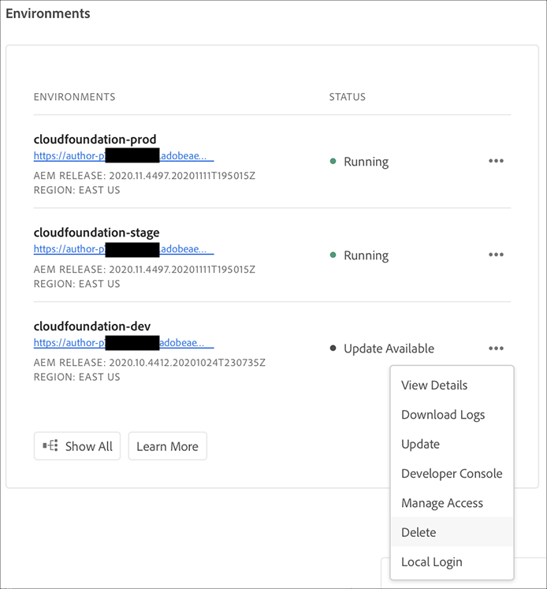

# Omgevingen beheren {#manage-environments}

In de volgende sectie worden de typen omgeving beschreven die een gebruiker kan maken en hoe de gebruiker een omgeving kan maken.

## Omgevingstypen {#environment-types}

Een gebruiker met de vereiste toestemmingen kan de volgende milieutypes (binnen de grenzen van wat aan de specifieke huurder beschikbaar is) tot stand brengen.

* **Productie- en Stage-omgeving**: De productie en het werkgebied zijn beschikbaar als duo en worden gebruikt voor test- en productiedoeleinden.

* **Ontwikkeling**: Een ontwikkelomgeving kan worden gecreëerd voor ontwikkelings- en testdoeleinden en zal alleen worden geassocieerd met niet-productiepijpleidingen.

   >[!NOTE]
   >Een ontwikkelomgeving die automatisch in een Sandbox-programma wordt gemaakt, wordt geconfigureerd om de oplossingen Sites en Assets te bevatten.

   De volgende tabel geeft een overzicht van de typen omgeving en hun kenmerken:

   | Naam | Auteurlaag | Lijst publiceren | Gebruiker kan maken | Gebruiker kan | Pijpleiding die in verband kan worden gebracht met het milieu |
   |--- |--- |--- |--- |---|---|
   | Productie | Ja | Ja als sites zijn opgenomen | Ja | Nee | Productiepijpleiding |
   | Werkgebied | Ja | Ja als sites zijn opgenomen | Ja | Nee | Productiepijpleiding |
   | Ontwikkeling | Ja | Ja als sites zijn opgenomen | Ja | Ja | Niet-productiepijpleiding |

   >[!NOTE]
   >De productie en het werkgebied zijn beschikbaar als duo en worden gebruikt voor test- en productiedoeleinden.  De gebruiker kan niet alleen een werkgebied of alleen een productieomgeving maken.

## Omgeving {#adding-environments} toevoegen

1. Klik op **Omgeving toevoegen** om een omgeving toe te voegen. Deze knop is toegankelijk vanuit het scherm **Omgevingen**.
   

   De optie **Omgeving toevoegen** is ook beschikbaar op de **Omgevingen**-kaart wanneer het programma geen omgevingen bevat.

   

   >[!NOTE]
   >De optie **Omgeving toevoegen** wordt uitgeschakeld op basis van een gebrek aan machtigingen of wat u kunt contracteren.

1. Het dialoogvenster **Omgeving toevoegen** wordt weergegeven. De gebruiker moet details verzenden zoals het **Omgevingstype**, de **Naam van de omgeving** en de **Beschrijving van de omgeving** (afhankelijk van de doelstelling van de gebruiker bij het creëren van de omgeving binnen de grenzen van wat beschikbaar is voor de specifieke tenant).

   

   >[!NOTE]
   >Bij het maken van een omgeving worden een of meer *integrations* gemaakt in Adobe I/O. Deze zijn zichtbaar voor gebruikers van de klant die toegang hebben tot de Adobe I/O-console en mogen niet worden verwijderd. Dit wordt in de beschrijving in de Adobe I/O-console afgewezen.

   

1. Klik **Opslaan** om een omgeving met de gevulde criteria toe te voegen.  Nu toont het *Overzicht* scherm de kaart van waar u opstelling uw pijpleiding kunt.

   >[!NOTE]
   >Als, u nog niet opstelling uw niet productiepijplijn hebt, *Overzicht* toont het scherm de kaart van waar u uw niet productiepijplijn kunt tot stand brengen.

## Omgeving {#viewing-environment} weergeven

De **Omgevingen** kaart op de overzichtspagina maakt een lijst van maximaal drie milieu&#39;s.

1. Selecteer de **knop Alles tonen** om naar de overzichtspagina **Environment** te navigeren om een tabel met een volledige lijst met omgevingen weer te geven.

   

1. Op de pagina **Omgevingen** wordt de lijst met alle bestaande omgevingen weergegeven.

   

1. Selecteer een van de omgevingen in de lijst om de omgevingsdetails weer te geven.

   

## Omgeving {#updating-dev-environment} bijwerken

Updates van werkgebied- en productieomgevingen worden automatisch door Adobe beheerd.

Updates voor ontwikkelomgevingen worden beheerd door gebruikers van het programma. Als een omgeving niet de meest recente openbaar beschikbare AEM-versie uitvoert, wordt **UPDATE AVAILABLE** weergegeven als de status op de milieuvriendenkaart op het startscherm.

De optie **Update** is beschikbaar bij **Omgevingen** Kaart.
Deze optie is ook beschikbaar als u op **Details** van **Milieu** kaart klikt. De **pagina Omgevingen** wordt geopend en wanneer u de ontwikkelomgeving hebt geselecteerd, klikt u op **..** en selecteer **Bijwerken**, zoals in de onderstaande afbeelding wordt getoond:

Het selecteren van deze optie zal een Manager van de Plaatsing toestaan om de pijpleiding verbonden aan dit milieu aan de recentste versie bij te werken en dan de pijpleiding uit te voeren.

Als de pijpleiding reeds is bijgewerkt, wordt de gebruiker ertoe aangezet om de pijpleiding uit te voeren.

## Omgeving {#deleting-environment} verwijderen

De gebruiker met de vereiste toestemmingen zal een milieu van de Ontwikkeling kunnen schrappen.

De optie **Delete** is beschikbaar in het vervolgkeuzemenu in de **Environment**-kaart. Klik op **..** voor een ontwikkelomgeving die u wilt verwijderen.

De verwijderingsoptie is ook beschikbaar als u op **Details** van de **Favorieten** kaart klikt. De **pagina Omgevingen** wordt geopend en wanneer u de ontwikkelomgeving hebt geselecteerd, klikt u op **..** en selecteer **Delete**, zoals weergegeven in de onderstaande afbeelding:

>[!NOTE]
>
>Deze functie is niet beschikbaar voor de omgeving Productie/Werkgebied die is ingesteld in een regulier programma dat is ingesteld voor productiedoeleinden. De functie is echter beschikbaar voor Productie-/Stage-omgevingen in een Sandbox-programma.

## Toegang beheren {#managing-access}

Selecteer **Toegang beheren** in het vervolgkeuzemenu in de **Kaart** Omgevingen. U kunt rechtstreeks naar de instantie van de auteur navigeren en de toegang voor uw omgeving beheren.

Raadpleeg [Toegang tot instantie Auteur beheren](/help/onboarding/getting-access-to-aem-in-cloud/navigation.md#manage-access-aem) voor meer informatie.

## Toegang tot ontwikkelaarsconsole {#accessing-developer-console}

Selecteer **Developer Console** in het vervolgkeuzemenu in de **Environment**-kaart. Hiermee wordt een nieuw tabblad in uw browser geopend met de aanmeldingspagina naar **Developer Console**.

Alleen een gebruiker met de rol Developer heeft toegang tot **Developer Console**. De uitzondering die voor de Programma&#39;s van de Sandbox is, waar om het even welke gebruiker met toegang tot het Programma van de Sandbox van de Manager van de Wolk toegang tot **de Console van de Ontwikkelaar** zal hebben.

Raadpleeg [Sluimerende en Shibernating Sandbox-omgevingen](https://docs.adobe.com/content/help/en/experience-manager-cloud-service/onboarding/getting-access/cloud-service-programs/sandbox-programs.html#hibernating-introduction) voor meer informatie.

Deze optie is ook beschikbaar als u op **Details** van **Milieu** kaart klikt. De pagina **Omgevingen** wordt geopend en wanneer u een omgeving selecteert, klikt u op **..** en selecteer **Developer Console**.

## Lokaal aanmelden {#login-locally}

Selecteer **Lokale aanmelding** in het vervolgkeuzemenu in de **Kaart voor omgevingen** om u lokaal aan te melden bij Adobe Experience Manager.

Daarnaast kunt u zich lokaal aanmelden via de overzichtspagina **Environment**.

