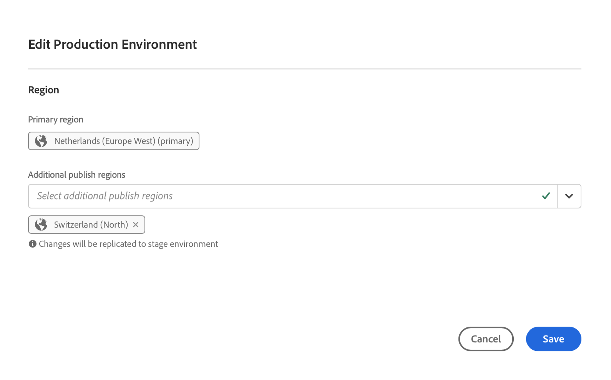
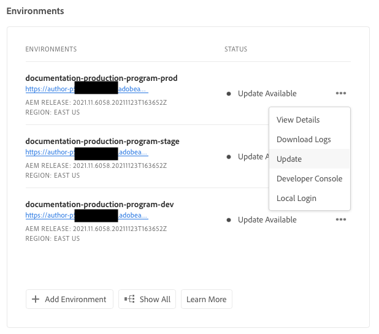
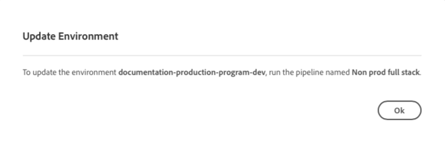

# Omgevingen beheren {#managing-environments}

Leer meer over de typen omgevingen die u kunt maken en hoe u deze kunt maken voor uw Cloud Manager-project.

## Omgevingstypen {#environment-types}

Een gebruiker met de vereiste toestemmingen kan de volgende milieutypes (binnen de grenzen van wat aan de specifieke huurder beschikbaar is) tot stand brengen.

* **Productie + werkgebied** - De productie- en testomgevingen zijn als twee beschikbaar en worden respectievelijk voor productie- en testdoeleinden gebruikt. Prestatie- en beveiligingstests uitvoeren op de werkgebiedomgeving. Het is even groot als de productie.

* **Ontwikkeling** - Een ontwikkelomgeving kan worden gecreëerd voor ontwikkelings- en testdoeleinden en kan alleen worden geassocieerd met niet-productiepijpleidingen.  Ontwikkelomgevingen hebben niet dezelfde grootte als stadium en productie en mogen niet worden gebruikt om prestatie- en veiligheidstests uit te voeren.

* **Snelle ontwikkeling** - Met een snelle ontwikkelomgeving (RDE) kan een ontwikkelaar snel wijzigingen implementeren en evalueren, waardoor de tijd die nodig is om functies te testen waarvan is aangetoond dat ze werken in een lokale ontwikkelomgeving, tot een minimum wordt beperkt. Zie [documentatie over de snelle ontwikkelomgeving](/help/implementing/developing/introduction/rapid-development-environments.md) voor details over hoe te om RDE te gebruiken.

De mogelijkheden van individuele omgevingen zijn afhankelijk van de oplossingen die in de [programma](/help/implementing/cloud-manager/getting-access-to-aem-in-cloud/program-types.md) van het milieu

* [Sites](/help/overview/introduction.md)
* [Assets](/help/assets/overview.md)
* [Forms](/help/forms/home.md)
* [Schermen](/help/screens-cloud/introduction/introduction.md)

>[!NOTE]
>
>De productie en het opvoeren milieu&#39;s worden slechts gecreeerd als paar. U kunt niet alleen een testomgeving of alleen een productieomgeving maken.

## Een omgeving toevoegen {#adding-environments}

Een gebruiker moet lid zijn van de **Zakelijke eigenaar** rol.

1. Aanmelden bij Cloud Manager [my.cloudmanager.adobe.com](https://my.cloudmanager.adobe.com/) en selecteert u de gewenste organisatie.

1. Op de **[Mijn programma&#39;s](/help/implementing/cloud-manager/getting-access-to-aem-in-cloud/editing-programs.md#my-programs)** tikken of tikken op het programma waaraan u een omgeving wilt toevoegen.

1. Van de **[Programmaoverzicht](/help/implementing/cloud-manager/getting-access-to-aem-in-cloud/editing-programs.md#program-overview)** pagina, klikt u **Omgeving toevoegen** op de **Omgevingen** -kaart om een omgeving toe te voegen.

   

   * De **Omgeving toevoegen** deze optie is ook beschikbaar op de **Omgevingen** tab.

     

   * De **Omgeving toevoegen** Deze optie kan worden uitgeschakeld bij gebrek aan machtigingen of afhankelijk van de gelicentieerde bronnen.

1. In de **Omgeving toevoegen** dialoogvenster dat wordt weergegeven:

   * Selecteer een [**omgevingstype**.](#environment-types)
      * Het aantal beschikbare/gebruikte omgevingen wordt tussen haakjes achter de naam van het omgevingstype weergegeven.
   * Een omgeving bieden **Naam**.
   * Een omgeving bieden **Beschrijving**.
   * Als u een **Productie + werkgebied** -omgeving, moet u een omgevingsnaam en -beschrijving opgeven voor zowel uw productie- als staging-omgeving.
   * Selecteer een **Primair gebied** in de vervolgkeuzelijst.
      * Het primaire gebied kan na het maken niet meer worden gewijzigd.
      * Afhankelijk van uw beschikbare rechten kunt u [meerdere gebieden](#multiple-regions).

   

1. Klikken **Opslaan** om de opgegeven omgeving toe te voegen.

De **Overzicht** het scherm toont nu uw nieuwe milieu in **Omgevingen** kaart. U kunt nu pijpleidingen instellen voor uw nieuwe omgeving.

## Meerdere publicatieregio&#39;s {#multiple-regions}

Een gebruiker met de **Zakelijke eigenaar** Met rol kunt u productie- en staging-omgevingen zodanig configureren dat er naast het primaire gebied maximaal drie extra publicatiegebieden worden opgenomen. Aanvullende publicatiegebieden kunnen de beschikbaarheid verbeteren. Zie de [Aanvullende documentatie voor publicatiegebieden](/help/operations/additional-publish-regions.md) voor meer informatie .

>[!TIP]
>
>U kunt de [Cloud Manager-API](https://developer.adobe.com/experience-cloud/cloud-manager/guides/api-usage/creating-programs-and-environments/#creating-aem-cloud-service-environments) om een huidige lijst van beschikbare gebieden te vragen.

### Meerdere publicatiegebieden toevoegen aan een nieuwe omgeving {#add-regions}

Wanneer u een omgeving toevoegt, kunt u ervoor kiezen om naast het primaire gebied ook andere gebieden te configureren.

1. Selecteer de **Primair gebied**.
   * Het primaire gebied kan na het creëren van het milieu niet worden veranderd.
1. Selecteer de optie **Extra publicatiegebieden toevoegen** en een nieuwe **Aanvullende publicatiegebieden** verschijnt een keuzelijst met opties.
1. In de **Aanvullende publicatiegebieden** selecteert u een extra gebied.
1. Het geselecteerde gebied wordt onder de vervolgkeuzelijst toegevoegd om de selectie ervan aan te geven.
   * Selecteer de `X` naast het geselecteerde gebied, zodat u het kunt desselecteren.
1. Selecteer een ander gebied in het menu **Aanvullende publicatiegebieden** vervolgkeuzelijst om een ander gebied toe te voegen.
1. Selecteren **Opslaan** als u klaar bent om uw omgeving te maken.

De geselecteerde gebieden zijn van toepassing op zowel productie als het opvoeren milieu&#39;s.

Als u geen extra gebieden opgeeft, [dat kunt u later doen nadat de omgevingen zijn gemaakt.](#edit-regions)

Als u een voorziening wilt [geavanceerd netwerken](/help/security/configuring-advanced-networking.md) voor het programma wordt aangeraden deze voorziening uit te voeren voordat u aanvullende publicatiegebieden aan de omgevingen toevoegt met de API voor Cloud Manager. Anders, gaat het extra publiceer gebiedsverkeer door de volmacht van het primaire gebied.

### Meerdere publicatiegebieden bewerken {#edit-regions}

Als u in eerste instantie geen extra gebieden hebt opgegeven, kunt u dat doen nadat de omgevingen zijn gemaakt als u over de benodigde rechten beschikt.

U kunt ook extra publicatiegebieden verwijderen. U kunt echter slechts gebieden in één transactie toevoegen of verwijderen. Als u één gebied moet toevoegen en één gebied wilt verwijderen, voegt u eerst de wijziging toe, slaat u de wijziging op en verwijdert u vervolgens (of omgekeerd).

1. Van de console van het Overzicht van het Programma van uw programma, klik de ellipsknoop voor uw productiemilieu en selecteer **Bewerken** in het menu.

   

1. In de **Productieomgeving bewerken** de benodigde wijzigingen aanbrengen in de aanvullende publicatiegebieden.
   * Gebruik de **Aanvullende publicatiegebieden** om extra gebieden te selecteren.
   * Klik op de X naast de geselecteerde aanvullende publicatiegebieden om deze te desselecteren.

   

1. Selecteren **Opslaan** om de wijzigingen op te slaan

Wijzigingen in de productieomgeving zijn van toepassing op zowel de productie- als de testomgeving. Wijzigingen in meerdere publicatiegebieden kunnen alleen worden bewerkt in de productieomgeving.

Als u een voorziening wilt [geavanceerd netwerken](/help/security/configuring-advanced-networking.md) voor het programma wordt aanbevolen deze provisioning uit te voeren voordat aanvullende publicatiegebieden aan de omgevingen worden toegevoegd. Anders gaat het extra publicatiegebiedsverkeer door de volmacht van het primaire gebied.

## Omgevingsdetails {#viewing-environment}

U kunt de **Omgevingen** kaart op de overzichtspagina voor toegang tot de details van een milieu op twee manieren.

1. Van de **Overzicht** pagina, klikt u op de **Omgevingen** aan de bovenkant van het scherm.

   

   * U kunt ook op de knop **Alles tonen** op de knop **Omgevingen** kaart om rechtstreeks naar de **Omgevingen** tab.

     

1. De **Omgevingen** wordt geopend en worden alle omgevingen voor het programma weergegeven.

   

1. Klik op een omgeving in de lijst zodat u de details ervan kunt weergeven.

   

U kunt ook op de knop voor weglatingsteken van de gewenste omgeving klikken en vervolgens **Details weergeven**.

>[!NOTE]
>
>De **Omgevingen** kaart bevat slechts drie omgevingen. Klikken **Alles tonen** zoals hierboven beschreven om alle milieu&#39;s van het programma te zien.

### Toegang tot de voorvertoningsservice {#access-preview-service}

Cloud Manager biedt een voorbeeldservice (geleverd als een extra publicatieservice) voor elke AEM as a Cloud Service omgeving.

Met de service kunt u de uiteindelijke ervaring van een website voorvertonen voordat deze de daadwerkelijke publicatieomgeving bereikt en openbaar is.

Bij verwezenlijking, heeft de voorproefdienst een standaardIP lijst van gewenste personen op het wordt toegepast, geëtiketteerd `Preview Default [<envId>]`, die al verkeer aan de voorproefdienst blokkeert. Hef de standaardIP lijst van gewenste personen van de voorproefdienst op zodat kunt u toegang toelaten.

Een gebruiker met de vereiste machtigingen moet de volgende stappen uitvoeren voordat de URL van de voorvertoningsservice wordt gedeeld om ervoor te zorgen dat deze toegankelijk is.

1. Creeer een aangewezen IP lijst van gewenste personen, pas het op de voorproefdienst toe en pas onmiddellijk unapply `Preview Default [<envId>]` lijst van gewenste personen.

   * Zie [IP-Lijsten van gewenste personen toepassen en ongedaan maken](/help/implementing/cloud-manager/ip-allow-lists/apply-allow-list.md) voor meer informatie .

1. De update gebruiken **IP-Lijst van gewenste personen** werkschema om standaardIP te verwijderen en IPs toe te voegen zoals aangewezen. Zie [IP-Lijsten van gewenste personen beheren](/help/implementing/cloud-manager/ip-allow-lists/managing-ip-allow-lists.md) voor meer informatie.

Nadat de toegang tot de voorvertoningsservice is ontgrendeld, wordt het vergrendelingspictogram vóór de naam van de voorvertoningsservice niet meer weergegeven.

Nadat de functie is geactiveerd, kunt u inhoud publiceren naar de voorbeeldservice met behulp van de interface Publicatie beheren in AEM. Zie [Inhoud voorvertonen](/help/sites-cloud/authoring/sites-console/previewing-content.md) voor meer informatie .

>[!NOTE]
>
>Uw omgeving moet zijn AEM versie `2021.05.5368.20210529T101701Z` of hoger om de voorvertoningsservice te gebruiken. Zorg ervoor dat een updatepijpleiding op uw milieu met succes heeft gelopen zodat kunt u de voorproefdienst gebruiken.

### Status van aanvullende publicatiegebieden {#additional-region-status}

Als u aanvullende publicatiegebieden hebt geactiveerd, kunt u de status van deze gebieden controleren via het tabblad **Omgevingen** kaart.

1. Op de **Overzicht** pagina, zoek de **Omgevingen** kaart.

1. Op de **Omgevingen** kaart **Status** de kolom zal wijzen op als er om het even welke kwesties met gevormde extra publiceer gebieden zijn. Klik op de knop **Info** pictogram voor details van de gebieden.

   

U kunt dezelfde informatie ook openen via het dialoogvenster **Omgevingen** tab.

1. Op de **Overzicht** pagina, selecteert u de **Omgevingen** tab.

1. Op de **Omgevingen** selecteert u in het navigatievenster aan de linkerkant de omgeving waarop u een query wilt uitvoeren.

1. Nadat een omgeving is geselecteerd:

   * De **Omgevingsinformatie** de lijst zal tonen welke gebieden voor het geselecteerde milieu worden gevormd.
   * De **Status** kolom van de **Omgevingssegmenten** de lijst zal nadenken als er om het even welke kwesties met de gevormde extra publiceer gebieden zijn. Houd de status boven voor details over een kwestie.

   

Als er problemen zijn gemeld met extra publicatiegebieden:

1. Wees geduldig. Cloud Manager probeert het gebied voortdurend te herstellen en kan op elk gewenst moment beschikbaar komen.
1. Als het probleem zich na enkele uren blijft voordoen, kunt u het aanvullende publicatiegebied verwijderen en het opnieuw toevoegen (hetzelfde gebied of een ander gebied) om een volledige implementatie te activeren.

Hoe lang u wacht tot het systeem op zich terugkrijgt alvorens extra actie te ondernemen hangt van de invloed af het mislukken van dat gebied op uw systemen heeft.

In ieder geval [verkeer wordt altijd verpletterd aan het andere dichtstbijzijnde gebied dat online is.](/help/operations/additional-publish-regions.md) Neem contact op met de klantenservice van de Adobe als de problemen zich blijven voordoen.

## Bijwerken van omgevingen {#updating-dev-environment}

Als cloudservice worden updates van uw ontwikkelings-, staging- en productieomgevingen binnen productieprogramma&#39;s automatisch door Adobe beheerd.

Updates voor omgevingen in sandboxprogramma&#39;s worden echter binnen de programma&#39;s beheerd. Wanneer een dergelijke omgeving niet de meest recente openbaar beschikbare AEM versie uitvoert, wordt de status op de **Omgevingen** kaart op **Overzicht** scherm van de programma-shows **Update beschikbaar**.

### Updates en pijpleidingen {#updates-pipelines}

Pijpleidingen zijn de enige manier om [code in te voeren aan de milieu&#39;s van AEM as a Cloud Service.](deploy-code.md) Daarom wordt elke pijpleiding geassocieerd met een bepaalde AEM versie.

Als de Manager van de Wolk ontdekt dat er een nieuwere versie van AEM beschikbaar is dan wat het laatst met de pijpleiding werd opgesteld, toont het **Update beschikbaar** milieutoestand.

Het proces van actualisering bestaat daarom uit twee stappen:

1. De pijpleiding bijwerken met de recentste AEM versie
1. De pijpleiding in werking stellen om de nieuwe versie van AEM aan een milieu op te stellen

### Uw omgevingen bijwerken {#updating-your-environments}

>[!NOTE]
> Vanaf 2024 worden ontwikkelingsinstanties en sommige sandboxprogramma&#39;s al automatisch bijgewerkt, zodat er geen noodzaak is om updates voor deze instanties handmatig te beheren. Als gevolg van deze overgang is de optie om de omgeving handmatig bij te werken voor ontwikkelingsinstanties mogelijk niet beschikbaar voor _sommige_ van uw programma&#39;s.

De **Bijwerken** Deze optie is beschikbaar via de **Omgevingen** -kaart voor bepaalde ontwikkelomgevingen en -omgevingen in sandboxprogramma&#39;s door op de knop voor ovaal van de omgeving te klikken.

Deze optie is ook beschikbaar als u op **Omgevingen** van het programma en selecteert u vervolgens de ovaalknop van de omgeving.

Een gebruiker met de **Implementatiebeheer** of **Zakelijke eigenaar** rol kan deze optie gebruiken om de pijpleiding verbonden aan dit milieu aan de recentste AEM versie bij te werken.

Zodra de pijpleidingsversie aan de recentste openbaar beschikbare AEM versie wordt bijgewerkt, wordt de gebruiker ertoe aangezet om de bijbehorende pijpleiding in werking te stellen om de recentste versie aan het milieu op te stellen.

De **Bijwerken** het gedrag van de optie is afhankelijk van de configuratie en de huidige status van het programma.

* Als de pijpleiding reeds is bijgewerkt, **Bijwerken** de optie zet de gebruiker ertoe aan om de pijpleiding uit te voeren.
* Als de pijpleiding reeds wordt bijgewerkt, **Bijwerken** wordt de gebruiker geïnformeerd dat een update al wordt uitgevoerd.
* Als er geen geschikte pijpleiding bestaat, wordt de **Bijwerken** vraagt de gebruiker om er een te maken.

## Ontwikkelomgevingen verwijderen {#deleting-environment}

Een gebruiker met de **Implementatiebeheer** of **Zakelijke eigenaar** de rol kan een ontwikkelomgeving schrappen.

Van de **Overzicht** scherm van het programma op het **Omgevingen** Klik op de knop voor weglatingsteken van de ontwikkelomgeving die u wilt verwijderen.

De optie Verwijderen is ook beschikbaar via het dialoogvenster **Omgevingen** tabblad van het **Overzicht** programmavenster. Klik op de knop voor weglatingsteken van de omgeving en selecteer **Verwijderen**.

>[!NOTE]
>
>* Productie- en staging-omgevingen die in een productieprogramma zijn gemaakt, kunnen niet worden verwijderd.
>* Productie- en staging-omgevingen in een sandboxprogramma kunnen worden verwijderd.

## Toegang beheren {#managing-access}

Selecteren **Toegang beheren** in het ovaalmenu van de omgeving op het **Omgevingen** kaart. U kunt rechtstreeks naar de instantie van de auteur navigeren en de toegang voor uw omgeving beheren.

>[!TIP]
>
>Zie [as a Cloud Service teams en productprofielen AEM](/help/onboarding/aem-cs-team-product-profiles.md) als u wilt leren hoe AEM as a Cloud Service team en productprofielen toegang tot uw vergunning gegeven oplossingen van de Adobe kunnen verlenen en beperken.

## Toegang tot de ontwikkelaarsconsole {#accessing-developer-console}

Selecteren **Ontwerpconsole** in het ovaalmenu van de omgeving op het **Omgevingen** kaart. Er wordt een nieuw tabblad geopend in uw browser met de aanmeldingspagina op de **Ontwerpconsole**.

Alleen een gebruiker met de **Ontwikkelaar** de rol heeft toegang tot **Ontwerpconsole**. Voor sandboxprogramma&#39;s heeft elke gebruiker die toegang heeft tot het sandboxprogramma echter toegang tot **Ontwerpconsole**.

Zie [Sluiende en ontsmette zandbakomgevingen](https://experienceleague.adobe.com/docs/experience-manager-cloud-service/content/implementing/using-cloud-manager/programs/introduction-sandbox-programs.html#hibernation) voor meer informatie .

Deze optie is ook beschikbaar via de **Omgeving** tabblad van het **Overzicht** venster wanneer u op het ellipsmenu van een afzonderlijke omgeving klikt.

## Lokaal aanmelden {#login-locally}

Selecteren **Lokale aanmelding** in het ovaalmenu van de omgeving in het deelvenster **Omgevingen** kaart om u lokaal aan te melden bij Adobe Experience Manager.

U kunt zich ook lokaal aanmelden via het dialoogvenster **Omgevingen** tabblad van het **Overzicht** pagina.

## Aangepaste domeinnamen beheren {#manage-cdn}

Aangepaste domeinnamen worden ondersteund in de programma&#39;s Cloud Manager for Sites voor zowel publicatie- als voorvertoningsservices. Elke Cloud Manager-omgeving kan maximaal 250 aangepaste domeinen hosten.

Als u aangepaste domeinnamen wilt configureren, navigeert u naar de **Omgevingen** en klik op een omgeving om de omgevingsdetails weer te geven.

Een gebruiker moet beschikken over **Zakelijke eigenaar** of **Implementatiebeheer** rol om een aangepaste domeinnaam toe te voegen in Cloud Manager

De volgende acties kunnen op de publicatieservice voor uw milieu worden uitgevoerd.

* [Een aangepaste domeinnaam toevoegen](/help/implementing/cloud-manager/custom-domain-names/add-custom-domain-name.md)

* [Aangepaste domeinnamen beheren](/help/implementing/cloud-manager/custom-domain-names/managing-custom-domain-names.md)

* [Status van aangepaste domeinnaam controleren](/help/implementing/cloud-manager/custom-domain-names/check-domain-name-status.md#pre-existing-cdn) of een [SSL-certificaat](/help/implementing/cloud-manager/managing-ssl-certifications/managing-certificates.md#pre-existing-cdn).

* [IP-Lijsten van gewenste personen beheren](/help/implementing/cloud-manager/ip-allow-lists/managing-ip-allow-lists.md#pre-existing-cdn)

## IP-Lijsten van gewenste personen beheren {#manage-ip-allow-lists}

IP-lijsten van gewenste personen worden ondersteund in Cloud Manager voor auteur-, publicatie- en voorvertoningsservices voor Sites-programma&#39;s.

Om IP lijsten van gewenste personen te beheren, navigeer aan **Omgevingen** tabblad van het **Overzicht** pagina van uw programma. Klik op een afzonderlijke omgeving zodat u de details ervan kunt beheren.

### Een IP-Lijst van gewenste personen toepassen {#apply-ip-allow-list}

Het toepassen van een IP lijst van gewenste personen associeert alle IP waaiers inbegrepen in de definitie van de lijst van gewenste personen met een auteur of publiceer de dienst in een milieu. Een gebruiker in het dialoogvenster **Zakelijke eigenaar** of **Implementatiebeheer** de rol moet het programma worden geopend om een IP lijst van gewenste personen kunnen toepassen.

De IP lijst van gewenste personen moet in de Manager van de Wolk bestaan om het op een milieu toe te passen. Voor meer informatie over IP-lijsten van gewenste personen in Cloud Manager raadpleegt u [Inleiding tot IP-Lijsten van gewenste personen in Cloud Manager](/help/implementing/cloud-manager/ip-allow-lists/introduction.md).

**Om een IP lijst van gewenste personen toe te passen:**

1. Navigeer vanuit de **Omgevingen** tabblad van het programma **Overzicht** en navigeer naar het **IP-Lijsten van gewenste personen** tabel.
1. Gebruik de inputgebieden bij de bovenkant van de IP lijst van de lijst van gewenste personen zodat kunt u de IP lijst van gewenste personen en de auteur selecteren of de publicatiedienst u het op wilt toepassen.
1. Klikken **Toepassen** en bevestig uw inzending.

### Het toepassen van een IP lijst van gewenste personen ongedaan maken {#unapply-ip-allow-list}

Als u een IP-lijst van gewenste personen niet toepast, worden alle IP-bereiken die zijn opgenomen in de definitie van de lijst van gewenste personen, losgekoppeld van een auteur- of uitgeversservice in een omgeving. Een gebruiker in het dialoogvenster **Zakelijke eigenaar** of **Implementatiebeheer** de rol moet het programma worden geopend om een IP lijst van gewenste personen kunnen ongedaan maken.

**Om een IP lijst van gewenste personen ongedaan te maken:**

1. Navigeer vanuit de **Omgevingen** tabblad van het programma **Overzicht** en navigeer naar het **IP-Lijsten van gewenste personen** tabel.
1. Identificeer de rij waar de IP regel van de lijst van gewenste personen die u wilt ongedaan maken vermeld is.
1. Selecteer de ellipsknop vanaf het einde van de rij.
1. Selecteren **Toepassen ongedaan maken** en bevestig uw inzending.
