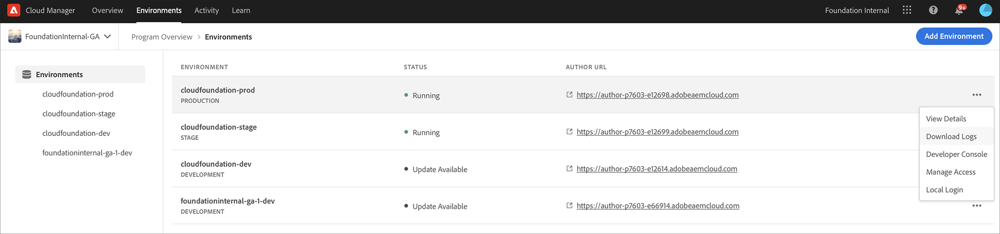
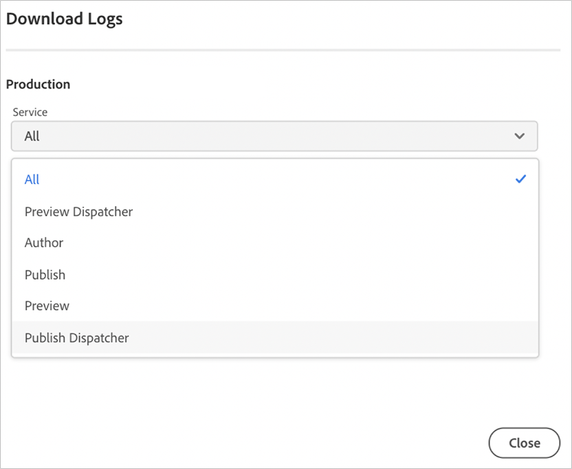

# Logbestanden openen en beheren {#manage-logs}

Gebruikers kunnen een lijst met beschikbare logbestanden voor de geselecteerde omgeving openen met de milieucaart.

## Logbestanden {#download-logs} downloaden

Voer de onderstaande stappen uit om logbestanden te downloaden:

1. U kunt logboeken door UI, of van **de kaart** van **Overzicht** van de pagina downloaden:


Of, van de pagina van de Details van het Milieu:



>[!NOTE]
>Ongeacht waar het wordt geopend, verschijnt hetzelfde dialoogvenster en kan een afzonderlijk logbestand worden gedownload.

1.Selecteer **Logbestanden downloaden** in **..**-menu.

1. Selecteer in het vervolgkeuzemenu **Service** opties zoals **Voorvertoning** of **Voorvertoning Dispatcher**, gevolgd door te klikken op het downloadpictogram. Deze actie kan ook van de de detailpagina van het Milieu worden verwezenlijkt.




## Hiermee wordt de API {#logs-through-api} doorlopen

Naast het downloaden van logboeken door UI, zullen de logboeken door API en de Interface van de Lijn van het Bevel beschikbaar zijn.

Als u bijvoorbeeld de logbestanden voor een specifieke omgeving wilt downloaden, is de opdracht iets apart van de regels van

```java
$ aio cloudmanager:download-logs --programId 5 1884 author aemerror
```

Met de volgende opdracht kunt u logboeken trappen:

```java
$ aio cloudmanager:tail-log --programId 5 1884 author aemerror
```

Voor het verkrijgen van de milieu-id (in dit geval 1884) en de beschikbare service- of lognaamoties kunt u het volgende gebruiken:

```java
$ aio cloudmanager:list-environments
Environment Id Name                     Type  Description                          
1884           FoundationInternal_dev   dev   Foundation Internal Dev environment  
1884           FoundationInternal_stage stage Foundation Internal STAGE environment
1884           FoundationInternal_prod  prod  Foundation Internal Prod environment
 
 
$ aio cloudmanager:list-available-log-options 1884
Environment Id Service    Name         
1884           author     aemerror     
1884           author     aemrequest   
1884           author     aemaccess    
1884           publish    aemerror     
1884           publish    aemrequest   
1884           publish    aemaccess    
1884           dispatcher httpderror   
1884           dispatcher aemdispatcher
1884           dispatcher httpdaccess
```

>[!NOTE]
>Hoewel **Logboekdownloads** beschikbaar blijven via zowel de gebruikersinterface als de API, is **Logboektailing** alleen beschikbaar via API/CLI.

### Aanvullende bronnen {#resources}

Raadpleeg de volgende aanvullende bronnen voor meer informatie over de API en Adobe I/O CLI van Cloud Manager:

* [Documentatie voor API voor cloud Manager](https://www.adobe.io/apis/experiencecloud/cloud-manager/docs.html)
* [Adobe I/O CLI](https://github.com/adobe/aio-cli-plugin-cloudmanager)
