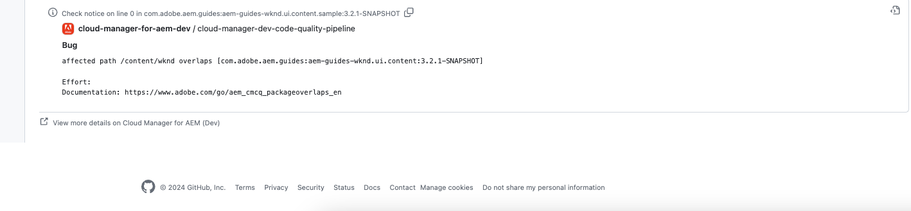

# GitHub-controleannotaties {#github-annotations}

Leer hoe de controles GitHub PRs voor uw privé bewaarplaatsen annoteert om u te verstrekken zult nuttig terugkoppelen.

## Overzicht {#overview}

Als u [ privé bewaarplaatsen ](private-repositories.md) voor uw programma van Cloud Manager gebruikt, worden de controles in GitHub automatisch in werking gesteld voor elk trekkingsverzoek. Deze worden voorzien van nuttige informatie om u te helpen om het even welke kwesties met uw code zo snel mogelijk begrijpen.

{de kwaliteit van de 0} Code [ kwesties die door ](/help/implementing/cloud-manager/code-quality-testing.md) worden ontdekt SonarQube [ zijn duidelijk vermeld.](/help/implementing/cloud-manager/custom-code-quality-rules.md)

De exacte coderegel met de uitgave is opgegeven en u kunt erop klikken om de relevante code weer te geven. Deze annotaties worden gegeven voor alle code kwesties, niet alleen die veranderd in het trekkingsverzoek.

Alle geannoteerde lijnen worden samengevoegd op het **Gewijzigde Dossiers** lusje op het trekkingsverzoek GitHub. Annotaties voor bestanden die niet zijn gewijzigd in de pull-aanvraag, worden in hun eigen sectie weergegeven.

## Codekwaliteitspijplijnen {#code-quality-pipelines}

De [ resultaten van de codekwaliteit ](/help/implementing/cloud-manager/code-quality-testing.md) zijn ook zichtbaar in de pijpleiding die automatisch door Cloud Manager bij de bodem van de **Controles** tabel wordt teweeggebracht. Het is ook toegankelijk van de **Details** van de controle van het trekkingsverzoek.

U kunt de problemen ook visualiseren in de vorm van een CSV. Dit kan door [ worden teruggewonnen het bekijken van de details van de pijpleidingsuitvoering in Cloud Manager ](/help/implementing/cloud-manager/configuring-pipelines/managing-pipelines.md#view-details).
