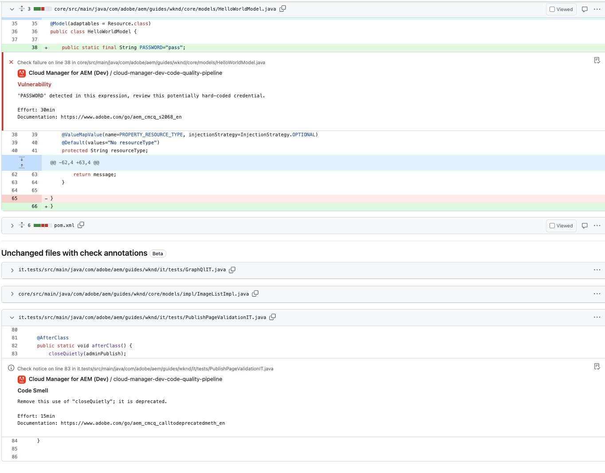

# GitHub-controleannotaties {#github-annotations}

Leer hoe de controles GitHub PRs voor uw privé bewaarplaatsen annoteert om u te verstrekken zult nuttig terugkoppelen.

## Overzicht {#overview}

Als u [privéopslagplaatsen](private-repositories.md) voor uw programma van de Manager van de Wolk, worden de controles in GitHub automatisch in werking gesteld voor elk trekkingsverzoek. Deze worden voorzien van nuttige informatie om u te helpen om het even welke kwesties met uw code zo snel mogelijk begrijpen.

[Codekwaliteit](/help/implementing/cloud-manager/code-quality-testing.md) problemen ontdekt door [SonarQube](/help/implementing/cloud-manager/custom-code-quality-rules.md) duidelijk zijn vermeld.

De exacte coderegel met de uitgave is opgegeven en u kunt erop klikken om de relevante code weer te geven. Deze annotaties worden gegeven voor alle code kwesties, niet alleen die veranderd in het trekkingsverzoek.

Alle geannoteerde regels worden samengevoegd op de **Gewijzigde bestanden** op het trekkingsverzoek van GitHub. Annotaties voor bestanden die niet zijn gewijzigd in de pull-aanvraag, worden in hun eigen sectie weergegeven.

## Codekwaliteitspijplijnen {#code-quality-pipelines}

De [codekwaliteit](/help/implementing/cloud-manager/code-quality-testing.md) de resultaten zijn ook zichtbaar in de pijplijn die automatisch wordt geactiveerd door Cloud Manager onder aan het dialoogvenster **Controles** tab. Het is ook toegankelijk vanuit de **Details** van de controle van het trekkingsverzoek.

U kunt de problemen ook visualiseren in de vorm van een CSV. Dit kan worden opgehaald door [de details van de uitvoering van de pijplijn weergeven in Cloud Manager.](/help/implementing/cloud-manager/configuring-pipelines/managing-pipelines.md#view-details)
